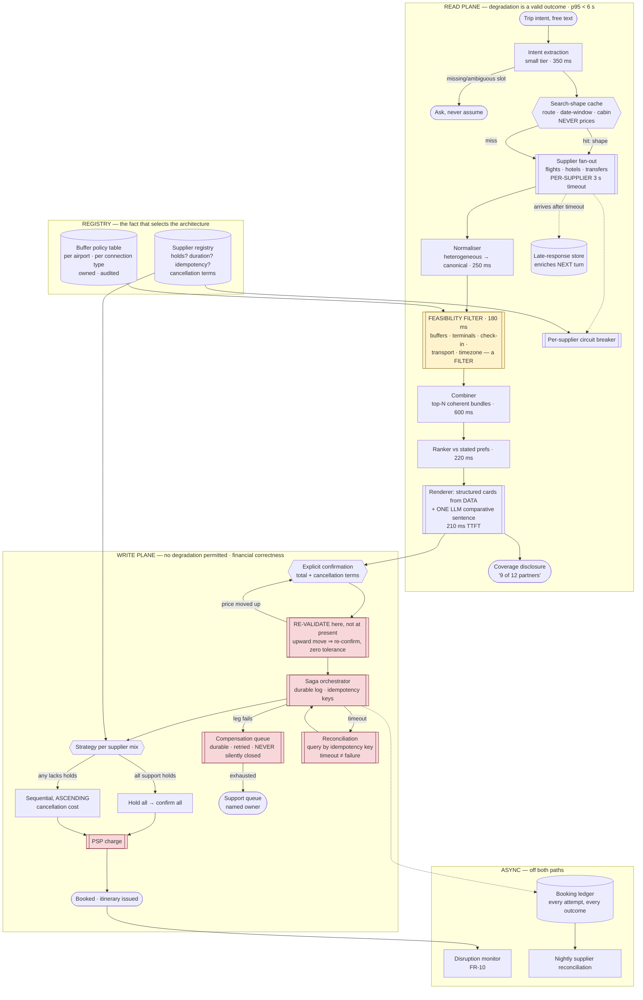

# 10 · HLD — Travel: Planning & Booking Assistant

> ← [`01_requirements.md`](01_requirements.md) · **Next:** [`03_lld.md`](03_lld.md) →
>
> **Three-sentence compression:** booking is a **distributed transaction with no 2PC available** across suppliers who cannot see each other, so a saga with idempotency keys, per-leg compensation and a reconciliation loop *is* the design · I rejected LLM narration of three itineraries because the arithmetic fails at **$0.935/booking against a $0.25 ceiling** and an itinerary is a table anyway · the failure mode I'd volunteer is that **the slow supplier is the common case** — ~46% of searches have at least one — so the combiner must answer from whichever suppliers replied.

---

## 2.1 Architecture

Four planes, separated by what they are allowed to fail at. The **read plane** may degrade (partial results are a valid answer). The **write plane** may not (a partial booking is a financial defect). That distinction drives every choice below.

Red is the write plane — where correctness is absolute. Amber is the feasibility filter, called out because **putting it in the ranker instead is the single most common way this design fails**.

---

## 2.2 Component choices

| Concern | Choice | Why | Rejected alternative (and why not) | Revisit when |
|---|---|---|---|---|
| **Booking transaction** | **Saga with per-leg compensation, durable log, idempotency keys** | No supplier will accept prepare-then-wait on behalf of a competitor, so 2PC is unavailable — not merely inconvenient. A saga is the only shape that fits | **2PC** — no supplier implements it; this is not a build decision. **Best-effort sequential calls with no log** — a crash mid-sequence leaves orphaned paid legs and no record of what to unwind. **A single "book trip" call to an aggregator** — moves the problem to a vendor and takes the failure semantics with it, which is fine until you owe the user an explanation you cannot give | An aggregator offers *contractual* atomicity with indemnity — then buy it, and this whole plane becomes a client |
| **Strategy selection** | **Per-itinerary, from a supplier registry** (holds vs sequential) | Shared open question 1 selects the architecture, and the answer **differs per supplier** — so both strategies must coexist, chosen per itinerary from the actual supplier mix | **Assume holds** — the design breaks on the first supplier without them, in production, during a booking. **Assume no holds** — forfeits real atomicity where it was available, and the worse UX for no reason | Never — heterogeneity is permanent in this market |
| **Leg ordering without holds** | **Ascending cancellation cost** — cheapest-to-unwind first | If the punitive leg is last, a failure before it costs only cheap cancellations. If it is first, every later failure cancels the expensive thing | **Most-likely-to-succeed first** — the instinct, and wrong: it front-loads the irreversible commitment. **Cheapest-first by price** — price and cancellation cost are different axes; a cheap non-refundable flight is the worst thing to book early | Suppliers converge on universal free cancellation windows |
| **Timeout handling** | **Reconciliation by idempotency key** — a timeout is an *unknown*, never a failure | Treating a timeout as failure can cancel a booking that succeeded, or orphan one that did. This is the highest-frequency correctness trap in the write plane | **Retry blindly** — double-books without idempotency. **Compensate immediately** — cancels successful bookings. **Give up and page support** — correct but unscalable, and the answer is knowable | Never |
| **Feasibility** | **Hard filter before ranking** | An infeasible itinerary is not a worse itinerary — it is not an itinerary. A cheap infeasible option would outrank a feasible one and the user notices instantly | **Penalty term in the ranker** — the standard mistake; a large enough price advantage always defeats a finite penalty. **Post-hoc validation of the top result** — the second-best may also be infeasible, and you have nothing to show | Never. This is the same filters-vs-scores rule as [`../09_realestate_search_valuation/`](../09_realestate_search_valuation/) |
| **Connection buffers** | **Owned, audited policy table** — per airport, per connection type, per alliance | A 45-minute buffer is right for a small domestic hop and reckless for an international transfer with immigration. Tightening it buys options and buys missed connections | **A global constant** — either loses good itineraries everywhere or ships missed connections at big hubs. **Learned from data** — attractive, but the training signal (missed connections) is rare, delayed and confounded by weather | Enough disruption data accumulates to *validate* the table — learn to check the policy, not to replace it |
| **Supplier fan-out** | **Parallel, per-supplier timeout, partial assembly** | With ~12 suppliers at ~5% chance each of exceeding 3 s, **~46% of searches have at least one slow supplier**. Waiting for completeness fails the SLO on nearly half of requests | **Global timeout** — one slow supplier consumes the whole budget and you get nothing. **Sequential calls** — 12 × latency, hopeless. **Wait for all** — fails ~46% of the time | Supplier SLAs become genuinely tight, which is not a thing to plan for |
| **Missing data semantics** | **Category-level gap ≠ option-level gap** | An itinerary needs ≥ 1 option per required leg. Two of five hotel suppliers missing is *partial*; zero flights is a **failed** search and must say so | **Treat all partiality identically** — presents "no trips available" when the truth is "we could not reach the airlines", which sends the user away instead of retrying | — |
| **Presentation** | **Structured cards rendered from data + one LLM comparative sentence** | Naive narration is **$0.935/booking vs a $0.25 ceiling**. And it is the wrong tool regardless: an itinerary is a table, and prose about a table is longer, less scannable, and occasionally wrong about its own numbers | **Narrate top 3 with a frontier model** — 3.7× over budget. **No LLM at all** — loses the genuinely valuable comparative judgement, which is what makes the product feel intelligent. **Narrate with a small model** — cheaper, and small models are *worse* at exactly the one thing we keep them for | Frontier inference costs fall ~5×, or the commission per booking rises materially |
| **Caching** | **Search *shape* by (route, date-window, cabin) — never prices** | Popular routes repeat heavily; caching the shape cuts supplier calls and intent parsing ~25%. Caching prices would violate FR-4 and produce exactly the quote failure that NFR forbids | **Cache priced results** — fast, and directly causes the most damaging failure in the system. **No cache** — leaves ~25% of the cost lever on the table, and the design lands *at* the ceiling | Suppliers offer a price-with-guarantee API — then the cached thing is a *guarantee*, not a price |
| **Re-validation point** | **Between confirmation and payment** | Users read, think and discuss for 2–8 minutes. Re-validating at presentation only means the quote is already minutes stale when they confirm | **Validate at presentation only** — the common bug; the quote is stale precisely when it matters. **Validate continuously** — burns supplier quota on sessions that never convert | — |
| **Upward price movement** | **Zero tolerance — always re-confirm** | Charging more than the confirmed number is a chargeback and potentially a regulatory matter, not a tuning parameter | **Small tolerance band** ("under ₹200, just proceed") — attractive, and it is still charging an amount the user did not agree to | Never. Enforced in the booking service, not the UI |
| **Compensation durability** | **Durable queue, bounded retries, then a named support owner** | A failed release is a real hotel room held in the user's name and a real charge. FR-15 forbids silent closure | **Fire-and-forget cancellation** — orphans accumulate invisibly until a support ticket or an invoice reveals them. **Infinite retry** — a permanently failing compensation retries forever and nobody looks | — |
| **Payment** | **Existing PSP, called after the saga's point of no return** | Out of scope by design; never handle card data | **Charge first, then book** — a booking failure becomes a refund on every failed attempt, which is worse for the user and worse for chargeback ratios | — |

---

## 2.3 Data flow, narrated

**The read path** (~5,300 ms of a 6,000 ms SLO):

1. **Intent extraction** on the small tier: dates, origin, destination, travellers, budget, preferences. **Ambiguity is asked about, not assumed** (FR-1) — "next month" and "somewhere warm" are not resolvable, and guessing produces a confident search for a trip nobody wanted. The clarification check is part of this stage's 350 ms.
2. **Search-shape cache lookup** on `(route, date-window, cabin)`. A hit supplies the *shape* — which suppliers to call, which fare families exist, normalisation hints — and never a price.
3. **Parallel fan-out** to flight, hotel and transfer suppliers with a **per-supplier** 3 s timeout. Circuit breakers skip suppliers that have been failing, so a dead supplier costs zero rather than 3 s.
4. **Normalisation** of wildly heterogeneous responses into one canonical option model. This is unglamorous and it is where a large share of real bugs live: two suppliers' "economy" are not the same cabin, and their baggage terms are encoded differently.
5. **Feasibility filtering** — a filter, before ranking, and 100% required (FR-3, FR-17). Buffers from the owned policy table; terminal changes; check-in/check-out windows; ground-transport availability at the actual arrival time; time zones and date-line crossings.
6. **Combination** into top-N coherent bundles. Note the combinatorics: this is the stage that must not be allowed to explore an exponential space, which is why it is bounded by N and by a beam rather than by exhaustive search.
7. **Ranking** against the user's stated preferences — only over itineraries that are already feasible.
8. **Rendering:** structured cards **from the itinerary record**, plus exactly **one** LLM comparative sentence (FR-21, FR-22). No LLM call ever produces a time, a price or a term.
9. **Coverage disclosure** (FR-26): "showing results from 9 of 12 partners", so a thin result set is explicable and the user can retry rather than concluding the trip is impossible.
10. **Late supplier responses** are captured against the session (FR-27). A response arriving at 3.2 s is useless for this turn and valuable for the next, whose budget is 2.5 s and whose data is already warm.

**The write path** (correctness absolute, latency secondary):

11. **Explicit confirmation** with the full itinerary, total price and cancellation terms (FR-5). If any leg's supplier lacks holds, the screen says what "booking" means for *this* itinerary (FR-16) — because promising atomicity you cannot deliver is the actual failure, not the partial booking.
12. **Re-validation between confirmation and payment** (FR-29). Unchanged → proceed. Moved down within tolerance → proceed and inform. **Moved up by any amount → stop and re-confirm** (FR-30). Unavailable → offer the nearest alternative with a fresh quote.
13. **Strategy selection** from the supplier registry: all-hold suppliers → hold all, then confirm all. Any non-hold supplier → sequential in **ascending cancellation cost** (FR-12).
14. **Every supplier mutation carries a caller-generated idempotency key** derived from `(booking_id, leg_id, attempt_semantics)` (FR-13). A retry after a timeout is the normal case.
15. **On timeout: reconcile, do not compensate** (FR-14). Query the supplier for that idempotency key's outcome and converge on the truth. Compensating an unknown can cancel a success.
16. **On a genuine leg failure: compensate** every booked leg through a durable queue, retried with backoff, escalated to a named support owner after a bounded number of attempts. **No orphan is ever closed silently** (FR-15).
17. **The booking ledger** records every attempt and every outcome, and a nightly job reconciles it against supplier statements — because the ledger's claim and the supplier's records diverging is the failure that only money reveals.

---

## 2.4 NFR mapping

| NFR (from shared block) | Delivered by |
|---|---|
| **First itinerary p95 < 6 s** | Budget §2.5 (~5,300 ms) · per-supplier timeouts · partial assembly · templated rendering (210 ms TTFT vs 700 ms narration) |
| Follow-up turn p95 < 2.5 s | Warm session data · late-response store · small-tier refinements · no re-fan-out for filter-only changes |
| Availability 99.9% | Read plane degrades to partial results, then to single-supplier, then to a hand-off to the web flow · write plane's durable saga survives orchestrator restarts |
| **Quote accuracy ≥ 99%** | Re-validation **between confirmation and payment** (FR-29) · **never** caching prices (FR-23) · freshness stamp visible (FR-31) |
| **Booking atomicity 100%, no orphans** | Saga + durable compensation queue + bounded retries + named support escalation (FR-15) · booking ledger + nightly supplier reconciliation |
| Idempotency 100% | Caller-generated keys on every mutation (FR-13) · reconciliation on timeout (FR-14) · replay test in CI |
| **Feasibility 100%** | Hard filter before ranking (FR-17) · owned buffer policy table (FR-18) · explicit timezone/date-line test suite (FR-19) · ground-transport check (FR-20) |
| Throughput 400 searches/s | Stateless read plane, horizontally scaled · search-shape cache absorbs ~25% · write plane is 4% of read volume |
| **Cost ≤ $0.25/booking** | Templated rendering (−70%) · narrate top 1 (−60%) · small-tier refinements (−15%) · shape cache (−25%) ⇒ ~$0.010/session. **Lands *at* the ceiling** — monitored per FR-24 |
| Supplier timeout 3 s, degrade | Per-supplier deadline · circuit breakers · category-gap vs option-gap distinction (FR-25) · coverage disclosure (FR-26) |

---

## 2.5 Latency budget (first itinerary, p95)

The shared block's budget, with the narration line replaced by what §2.2 actually chose:

| Stage | Budget | Note |
|---|---|---|
| Intent extraction + clarification check | 350 ms | Small tier |
| Search-shape cache lookup | 10 ms | ~25% hit rate |
| **Supplier fan-out (parallel)** | **3,000 ms** | **Hard per-supplier timeout · 57% of budget · not under our control** |
| Normalisation | 250 ms | Heterogeneous → canonical |
| **Feasibility filtering** | 180 ms | A filter, before ranking |
| Itinerary combination | 600 ms | Bounded top-N, beam-limited |
| Ranking | 220 ms | Over feasible options only |
| **Rendering: cards + 1 comparative sentence** | **210 ms** TTFT | **Was 700 ms for 3 narrations** — the cost fix is also a latency win |
| Coverage disclosure | 5 ms | Rendered from which suppliers replied |
| **Total** | **~4,825 ms** | SLO 6,000 ms ✅ **~1,175 ms headroom** |

> **The presentation decision improved two budgets at once.** Templating the narration was made for cost (3.7× over), and it happens to return ~490 ms of latency — because rendering a table from data is free while generating three prose descriptions is not. **When a decision improves cost and latency together, it is usually because the original design was using the wrong tool, not because it was tuned badly.**
>
> The headroom is not slack. It absorbs a supplier that responds at 2.9 s rather than 1.5 s, which by §2.2's arithmetic happens on nearly half of searches.

---

## 2.6 Failure modes and blast radius

| Failure | Detection | Blast radius | Mitigation / degraded mode |
|---|---|---|---|
| **One supplier slow** | Per-supplier deadline | Some options missing from one category | Partial assembly (FR-25); coverage disclosed (FR-26); late response enriches the next turn (FR-27). **The common case — ~46% of searches** |
| **A whole category unreachable** (all flight suppliers) | Zero options in a required leg | Search cannot produce an itinerary | Report the **category gap** explicitly — "we couldn't reach the airlines, retry" — never "no trips available" (FR-25) |
| **Supplier persistently failing** | Circuit breaker | That supplier's inventory absent | Skip rather than repeatedly time out; absence disclosed (FR-28). Saves 3 s per search |
| **Price moved up between confirm and pay** | Re-validation (FR-29) | One booking, delayed | Stop; show the change; require fresh confirmation. **Zero tolerance** (FR-30) |
| **Supplier returns 504 after actually booking** | Reconciliation by idempotency key | One leg's true state unknown | Query outcome by key (FR-14). **Never compensate on a timeout** — that cancels successes |
| **Leg 3 fails after legs 1–2 booked** | Saga step failure | One itinerary, real money | Compensate 1–2 through the durable queue; inform the user in the language of FR-16. With holds: nothing to unwind. Without: ascending-cost ordering (FR-12) minimised the damage in advance |
| **Compensation itself fails** | Retry exhaustion | An orphaned booking and a charge | Bounded retries → **named support owner** (FR-15, open question 2). **Never closed silently.** This is the failure that becomes a regulatory complaint |
| **Orchestrator crashes mid-saga** | Durable log replay on restart | Bounded — the log knows what was attempted | Resume from the log; idempotency keys make re-issued calls safe (FR-13) |
| **Infeasible itinerary presented** | Should be impossible by construction | Trust, instantly and disproportionately | Feasibility is a filter (FR-17). If one escapes, it is a **buffer-table or timezone bug**, not a ranking bug — and the FR-19 test suite exists for exactly that |
| **Buffer table tightened too far** | Missed-connection reports, weeks later | Systematic across an airport | Audited changes with an owner (FR-18); **the feedback signal is slow, which is why the table is policy and not a tuned parameter** |
| **LLM invents a price or a time** | Should be impossible by construction | Trust and possibly a chargeback | FR-21/22: no LLM call produces numbers. Response schema constrains generation to commentary; numbers are injected from the itinerary record |
| **Cache serves a stale price** | Should be impossible by construction | Direct quote-accuracy failure | Cache keys **exclude price** (FR-23); a hit still triggers live pricing |
| **Book rate lower than assumed** | Cost per booking (FR-24) | Unit economics, silently | Alert on cost/booking including via a **book-rate decline** rather than a cost rise. The design lands *at* $0.25 — a 2% book rate doubles it (open question 5) |
| **Disruption after booking** (cancelled flight) | Disruption monitor (FR-10) | One traveller, mid-trip | Propose rebooking. Off both critical paths — a monitoring failure must never affect search or booking |
| **Ledger diverges from supplier records** | Nightly reconciliation | Financial, and invisible until money surfaces | Reconcile every night; discrepancies to finance, not to a log line |

---

## 2.7 Scale plan

| | What breaks first | Why | What I'd change |
|---|---|---|---|
| **10×** (4,000 searches/s, 80M sessions/mo) | **Supplier rate limits and commercial terms** | The read plane is stateless and scales horizontally; suppliers do not scale for us. At 10× we are a large fraction of some suppliers' query volume, and if terms are **per-search** (open question 3) the cache stops being a cost lever and becomes the business model | Aggressive shape caching with longer windows; request coalescing across concurrent identical searches; negotiate per-booking terms; **push search upstream to a cached availability mirror** for high-volume routes, accepting that FR-4 re-validation is then doing more work |
| **10×** (secondary) | Compensation queue tail | 4% book rate × 80M = 3.2M bookings/mo. Even a 0.5% compensation rate is 16k/month, and each exhausted retry needs a human | Automate the common compensation paths against suppliers with clean cancellation APIs; **tier the support queue by financial exposure**; make ascending-cost ordering mandatory rather than best-effort so the expensive compensations become rare |
| **100×** (40,000 searches/s) | **The combiner, and then the buffer policy** | Combination is the only superlinear stage — multi-leg bundling over a large option set. And a global buffer table maintained by one owner does not survive hundreds of airports × connection types × alliances | Bound the combiner harder (beam width by route popularity, precomputed bundles for the top routes); **regionalise buffer-policy ownership** with a global schema, the same hierarchical-governance move as manufacturing's defect taxonomy in [`../06_manufacturing_cv_inspection/`](../06_manufacturing_cv_inspection/) |
| **100×** (secondary) | Quote accuracy under cache pressure | The temptation at this scale is to cache prices. It is the one thing that must not happen | Hold the line: cache shape, never price. If unit economics genuinely require it, the honest move is a **price-guarantee product** where we absorb the delta — a commercial decision, not an engineering shortcut |

**What does not break:** the write plane's correctness properties. Idempotency, reconciliation-on-timeout, ascending-cost ordering and durable compensation are all per-booking and independent of volume — they get *more* important at scale but not harder. **The scaling story here is commercial (supplier terms) and organisational (buffer governance, compensation staffing), not computational** — and the one genuinely computational limit, the combiner, is solved by bounding it rather than by more machines.

---

> ← [`01_requirements.md`](01_requirements.md) · **Next:** [`03_lld.md`](03_lld.md) →
