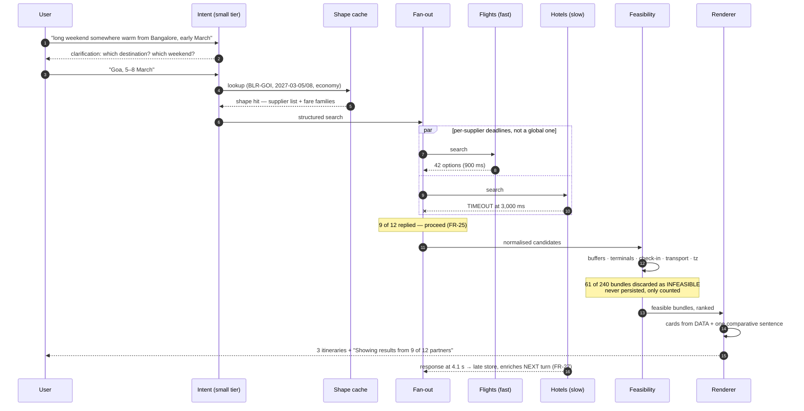
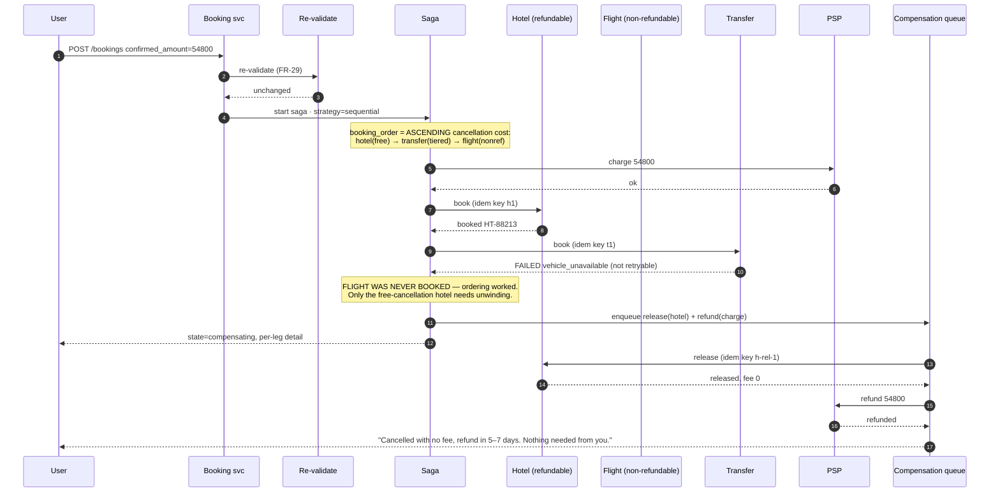
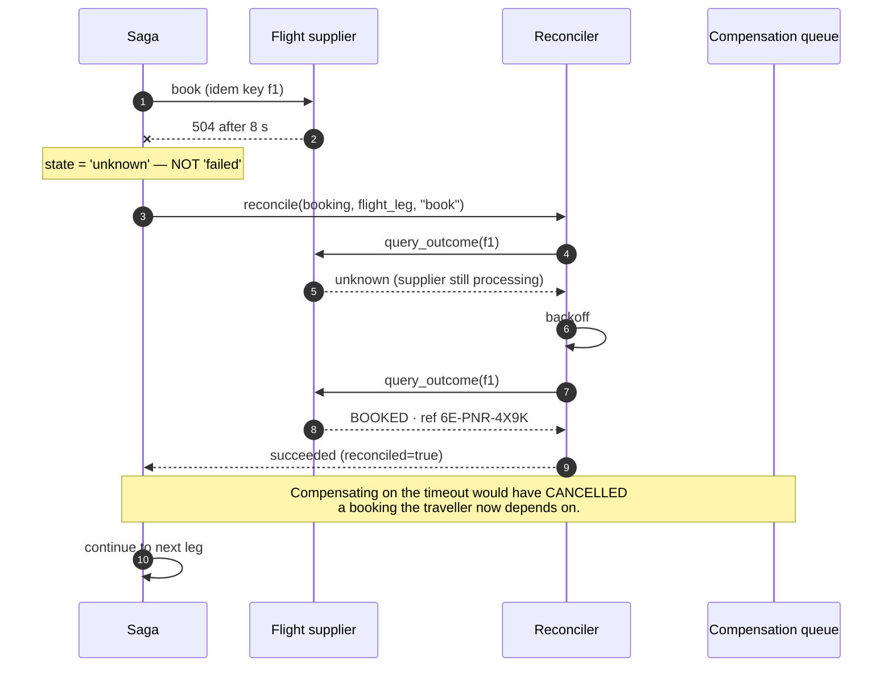

# 10 · LLD — Travel: Planning & Booking Assistant

> ← [`02_hld.md`](02_hld.md) · **Next:** [`04_production_and_interview.md`](04_production_and_interview.md) →
>
> The organising principle: **the read plane may lose data, the write plane may not lose money.** Every schema, contract and state machine below is shaped by which plane it lives in.

---

## 3.1 Data models

### Supplier registry — the table that selects the architecture

FR-11 makes hold capability a modelled fact rather than an assumption. This is the smallest table in the system and the most consequential.

```sql
CREATE TABLE supplier (
    supplier_id          TEXT PRIMARY KEY,
    category             TEXT    NOT NULL,        -- flight | hotel | transfer | activity

    -- capability: this is what STRATEGY SELECTION reads
    supports_holds       BOOLEAN NOT NULL,
    hold_duration_s      INTEGER,                 -- NOT NULL when supports_holds
    supports_idempotency BOOLEAN NOT NULL,
    idempotency_ttl_s    INTEGER,                 -- how long the supplier honours a key
    supports_outcome_query BOOLEAN NOT NULL,      -- can we RECONCILE a timeout? (FR-14)

    -- cancellation economics: this is what LEG ORDERING reads (FR-12)
    cancel_model         TEXT    NOT NULL,        -- free_until | tiered | nonrefundable
    cancel_free_until_h  INTEGER,
    cancel_fee_pct       NUMERIC(5,2),

    -- operational
    p95_latency_ms       INTEGER NOT NULL,        -- measured, refreshed daily
    timeout_ms           INTEGER NOT NULL DEFAULT 3000,
    breaker_state        TEXT    NOT NULL DEFAULT 'closed',

    CHECK (NOT supports_holds OR hold_duration_s IS NOT NULL),
    CHECK (NOT supports_idempotency OR idempotency_ttl_s IS NOT NULL)
);
```

> **`supports_outcome_query` is the field people forget, and it is the one that decides whether FR-14 is achievable.** Reconciliation-on-timeout requires asking the supplier "what happened to key X?". A supplier with idempotency but *no* outcome query gives you safe retries and no way to learn the truth without retrying — which is usually fine (the retry returns the existing booking) but breaks down when the retry also times out. For those suppliers the fallback is a bounded retry ladder and then a support escalation, and the itinerary must be flagged as such **before** the user confirms (FR-16).
>
> The `CHECK` constraints make an incoherent registry row unrepresentable. A supplier marked `supports_holds` with a NULL duration would make the hold strategy compute an expiry of `NULL` — and a saga whose deadline is NULL never expires, which is how a held-inventory leak becomes permanent.

### Itinerary and legs — the record the renderer reads from

FR-21 forbids the LLM from producing times, prices or terms. That requirement is only enforceable if there is a canonical record to render *from*.

```sql
CREATE TABLE itinerary (
    itinerary_id      UUID PRIMARY KEY,
    session_id        UUID        NOT NULL,
    created_at        TIMESTAMPTZ NOT NULL,

    -- freshness: FR-31 makes this user-visible
    priced_at         TIMESTAMPTZ NOT NULL,
    price_expires_at  TIMESTAMPTZ NOT NULL,       -- priced_at + 60 s (FR-4)

    total_amount      NUMERIC(12,2) NOT NULL,
    currency          CHAR(3)      NOT NULL,

    -- feasibility is a PROPERTY OF THE RECORD, computed before it exists
    feasible          BOOLEAN      NOT NULL,
    feasibility_proof JSONB        NOT NULL,       -- every check, with its margin

    -- coverage: FR-26
    suppliers_queried SMALLINT     NOT NULL,
    suppliers_replied SMALLINT     NOT NULL,
    categories_complete BOOLEAN    NOT NULL,

    -- strategy, decided at assembly time from the supplier mix
    booking_strategy  TEXT         NOT NULL,       -- all_holds | sequential
    atomicity_promise TEXT         NOT NULL,       -- atomic | compensated  (FR-16)

    CHECK (feasible),                              -- see note below
    CHECK (suppliers_replied <= suppliers_queried)
);

CREATE TABLE itinerary_leg (
    itinerary_id    UUID     NOT NULL REFERENCES itinerary,
    leg_seq         SMALLINT NOT NULL,             -- travel order
    leg_id          UUID     NOT NULL,

    category        TEXT     NOT NULL,
    supplier_id     TEXT     NOT NULL REFERENCES supplier,

    -- times are stored WITH the zone, never as naive local time (FR-19)
    depart_at       TIMESTAMPTZ,
    depart_tz       TEXT,                          -- IANA, e.g. 'Asia/Kolkata'
    arrive_at       TIMESTAMPTZ,
    arrive_tz       TEXT,
    depart_point    TEXT,                          -- IATA / property code
    arrive_point    TEXT,
    depart_terminal TEXT,
    arrive_terminal TEXT,

    amount          NUMERIC(12,2) NOT NULL,
    -- cancellation cost, MATERIALISED at assembly: this is the sort key (FR-12)
    cancel_cost_est NUMERIC(12,2) NOT NULL,
    cancel_terms    JSONB         NOT NULL,

    fare_basis      TEXT,
    supplier_ref    TEXT,                          -- supplier's own option token

    PRIMARY KEY (itinerary_id, leg_seq)
);
```

Four choices worth defending:

**`CHECK (feasible)` — infeasible itineraries do not exist as rows.** FR-17 says feasibility is a filter, not a score. The strongest way to enforce that is to make an infeasible itinerary **unrepresentable in the store the renderer reads from**. A ranker cannot promote what does not exist. Infeasible candidates are discarded during assembly and counted in a metric; they are never persisted.

**`feasibility_proof` records every check with its margin, not a boolean.** When a user disputes a connection ("35 minutes at Heathrow, really?") support needs the argument, not the verdict. And when a missed connection is reported, the proof shows which buffer applied and by what margin — which is the evidence for changing the buffer table (FR-18) rather than guessing.

**`cancel_cost_est` is materialised at assembly time.** It is the sort key for FR-12's ordering, and computing it during the saga would mean calling supplier terms APIs on the write path — adding latency and a failure mode to the plane that can least afford either.

**Times are `TIMESTAMPTZ` plus an explicit IANA zone.** Storing the instant alone loses the local wall-clock the user reasons about; storing local time alone makes date-line arithmetic guesswork. FR-19's test suite needs both. This is the single most common source of the "arrives before it departs" bug.

### The booking saga — a durable log, not an object

```sql
CREATE TABLE booking (
    booking_id        UUID PRIMARY KEY,
    itinerary_id      UUID        NOT NULL REFERENCES itinerary,
    user_id           TEXT        NOT NULL,

    state             TEXT        NOT NULL,   -- see §3.5
    strategy          TEXT        NOT NULL,   -- all_holds | sequential
    confirmed_amount  NUMERIC(12,2) NOT NULL, -- what the user AGREED to (FR-30)
    confirmed_at      TIMESTAMPTZ NOT NULL,

    hold_expires_at   TIMESTAMPTZ,            -- all_holds only: a HARD deadline
    psp_charge_id     TEXT,

    created_at        TIMESTAMPTZ NOT NULL,
    terminal_at       TIMESTAMPTZ,
    support_ticket    TEXT                    -- set when compensation escalates (FR-15)
);

CREATE TABLE booking_step (
    booking_id        UUID     NOT NULL REFERENCES booking,
    leg_id            UUID     NOT NULL,
    attempt           SMALLINT NOT NULL,

    -- FR-13: caller-generated, DERIVED, never random
    idempotency_key   TEXT     NOT NULL,

    action            TEXT     NOT NULL,      -- hold | confirm | book | release | refund
    state             TEXT     NOT NULL,      -- pending|succeeded|failed|unknown|reconciled
    supplier_id       TEXT     NOT NULL,

    request_at        TIMESTAMPTZ NOT NULL,
    response_at       TIMESTAMPTZ,
    supplier_ref      TEXT,                    -- supplier's booking reference on success
    error_code        TEXT,
    error_retryable   BOOLEAN,

    PRIMARY KEY (booking_id, leg_id, action, attempt)
);

-- the key must be stable across attempts of the SAME semantic operation
CREATE UNIQUE INDEX idempotency_key_unique ON booking_step (idempotency_key);
```

> **`state = 'unknown'` is the most important value in this schema, and most implementations lack it.**
>
> The naive state set is `pending | succeeded | failed`. A timeout then has to be filed as `failed`, and the compensation logic dutifully cancels a booking that may well have succeeded — or leaves one orphaned because it "failed" and therefore needs no compensation. Both outcomes are financial defects produced by a schema that could not express uncertainty.
>
> `unknown` says: *we do not know, and we must find out.* It is the only state that routes to reconciliation (FR-14) rather than to compensation, and it is why a timeout can be handled correctly at all.

**Idempotency keys are derived, not random:**

```
idempotency_key = sha256(booking_id || leg_id || action || attempt_semantics)
```

`attempt_semantics` is the crucial term and the subtle one. A **retry of the same intent** reuses the key — that is the whole point. A **genuinely new intent** on the same leg (the user changed the fare after a price move) increments it. A random UUID per HTTP attempt gives you no idempotency at all while appearing to; a key derived from `booking_id || leg_id` alone makes a legitimate second booking of the same leg impossible.

### Buffer policy — owned configuration (FR-18)

```sql
CREATE TABLE connection_buffer (
    airport_code      CHAR(3)  NOT NULL,
    connection_type   TEXT     NOT NULL,   -- dom_dom | dom_intl | intl_dom | intl_intl
    same_terminal     BOOLEAN  NOT NULL,
    same_alliance     BOOLEAN  NOT NULL,   -- baggage transfer
    min_buffer_min    SMALLINT NOT NULL,

    source            TEXT     NOT NULL,   -- airport_published | our_policy | supplier
    owner             TEXT     NOT NULL,
    effective_from    TIMESTAMPTZ NOT NULL,
    effective_to      TIMESTAMPTZ,
    rationale         TEXT     NOT NULL,

    PRIMARY KEY (airport_code, connection_type, same_terminal,
                 same_alliance, effective_from)
);
```

**`source` distinguishes airport-published minimums from our own policy**, and the distinction is not academic: a published minimum connection time is often operationally or legally mandated, and going below it does not merely risk a missed connection — it can produce an itinerary the airline will refuse to ticket. Our own policy may only be *more* conservative than the published figure, never less, and that is a validation rule on writes to this table.

**Versioned with `effective_from`/`effective_to`** because the feedback signal — missed connections — arrives weeks after a change. Reconstructing which buffer applied to a trip booked five weeks ago is otherwise impossible, and that reconstruction is the entire basis for evaluating a buffer change.

---

## 3.2 API contracts

### Search

```http
POST /v1/search
{
  "session_id": "9c3f…",
  "intent_text": "long weekend somewhere warm from Bangalore in early March, two of us, under 60k",
  "traveller_count": 2
}
```

Ambiguous intent returns a question, not a guess (FR-1):

```json
200 OK
{ "status": "clarification_required",
  "resolved":  { "origin": "BLR", "travellers": 2, "budget_inr": 60000 },
  "ambiguous": [
    { "slot": "destination",
      "question": "Somewhere warm — beach or city? Goa, Kochi and Phuket all fit your budget.",
      "candidates": ["GOI", "COK", "HKT"] },
    { "slot": "dates",
      "question": "Which weekend in early March?",
      "candidates": ["2027-03-05/08", "2027-03-12/15"] }
  ]
}
```

A resolved search returns itineraries with **coverage and freshness as first-class fields**:

```json
200 OK
{
  "status": "ok",
  "coverage": {
    "suppliers_queried": 12, "suppliers_replied": 9,
    "categories_complete": true,
    "missing": [ {"category":"hotel","supplier_group":"chain_direct","reason":"timeout"} ],
    "disclosure": "Showing results from 9 of 12 partners."
  },
  "itineraries": [
    {
      "itinerary_id": "it_7f21…",
      "total_amount": 54800, "currency": "INR",
      "priced_at": "2027-01-14T10:22:31Z",
      "price_expires_at": "2027-01-14T10:23:31Z",
      "atomicity_promise": "compensated",
      "legs": [ /* structured — the renderer's ONLY source of numbers */ ],
      "feasibility": {
        "feasible": true,
        "checks": [
          {"check":"connection_buffer","at":"BOM","required_min":75,
           "actual_min":140,"margin_min":65,"source":"airport_published"},
          {"check":"hotel_checkin","arrive_local":"2027-03-05T14:10+05:30",
           "checkin_from":"14:00","margin_min":10},
          {"check":"ground_transport","arrive_local":"2027-03-05T14:10+05:30",
           "last_public_transport":"23:30","ok":true}
        ]
      },
      "commentary": "The 07:40 gets you a full extra afternoon for ₹1,800 more."
    }
  ]
}
```

> **`commentary` is the only LLM-generated string in this response**, and it is a single field (FR-22). Every number the user sees comes from `legs`, `total_amount` and `feasibility`. The API shape is what makes FR-21 enforceable: there is nowhere for a generated price to live.
>
> `atomicity_promise: "compensated"` is FR-16 made concrete — it flows to the confirmation screen, where the user is told what "booking" means for this specific itinerary rather than being left to assume atomicity.

### Confirm — where re-validation happens

```http
POST /v1/bookings
Idempotency-Key: 4a9e…
{
  "itinerary_id": "it_7f21…",
  "confirmed_amount": 54800,
  "confirmed_currency": "INR",
  "payment_method_token": "pm_…",
  "accepted_terms_hash": "sha256:be31…"
}
```

Three outcomes, and the middle one is the important one:

```json
/* 1. price held — proceed */
202 Accepted
{ "booking_id": "bk_31c…", "state": "booking_in_progress",
  "strategy": "sequential", "poll_after_ms": 1500 }
```

```json
/* 2. price moved UP — stop. Zero tolerance (FR-30) */
409 Conflict
{ "error": "price_changed",
  "confirmed_amount": 54800,
  "current_amount":   57200,
  "changed_legs": [ {"leg_seq":1,"was":18400,"now":20800,"reason":"fare_class_sold_out"} ],
  "requires": "fresh_confirmation",
  "fresh_itinerary_id": "it_7f22…",
  "note": "No charge has been made."
}
```

```json
/* 3. price moved DOWN within tolerance — proceed, inform */
202 Accepted
{ "booking_id": "bk_31c…", "state": "booking_in_progress",
  "amount_adjustment": {"confirmed": 54800, "charging": 53900,
                        "direction": "down", "informed": true} }
```

> **`confirmed_amount` is a required request field, not a convenience.** It makes the user's agreement an explicit parameter, so the booking service — not the UI — enforces FR-30. A client that omits it or sends a stale value gets a 409. The enforcement point matters: a tolerance implemented in the UI is a tolerance one buggy client removes.
>
> `accepted_terms_hash` pins **which** cancellation terms the user agreed to. Terms that changed between presentation and confirmation are a materially different agreement, and "the user accepted the terms" is only defensible if you can say which ones.

### Booking status — what the user actually watches

```json
200 OK
{
  "booking_id": "bk_31c…",
  "state": "compensating",
  "legs": [
    {"leg_seq":1,"category":"hotel",  "state":"released",
     "supplier_ref":"HT-88213","note":"free cancellation window — no fee"},
    {"leg_seq":2,"category":"flight", "state":"booked",
     "supplier_ref":"6E-PNR-4X9K"},
    {"leg_seq":3,"category":"transfer","state":"failed",
     "error":"vehicle_unavailable","retryable":false}
  ],
  "compensation": {
    "required":  [{"leg_seq":2,"action":"refund","state":"pending","attempts":1}],
    "completed": [{"leg_seq":1,"action":"release","state":"done","fee":0}],
    "escalated": false
  },
  "user_message": "Your transfer became unavailable. We've cancelled the hotel with no fee and are refunding the flight — you'll see it within 5–7 days. Nothing further is needed from you.",
  "support_ticket": null
}
```

Three properties this response has that a naive one lacks:

1. **Per-leg state, not a single booking state.** "Booking failed" is unactionable when two of three legs succeeded and one is mid-refund.
2. **`compensation` split into required / completed / escalated.** The user's real question is *"is anything still hanging?"*, and this answers it directly.
3. **`user_message` is templated from the leg states**, not generated. It contains an amount-free commitment ("within 5–7 days") and an explicit "nothing further is needed from you" — because the failure mode of these messages is a user who cancels their card or books again in a panic.

---

## 3.3 Core algorithms

### Feasibility — the filter, in full

```python
def check_feasibility(legs: list[Leg], buffers: BufferPolicy) -> Feasibility:
    """Returns a PROOF, not a boolean. Called during assembly; infeasible
    candidates are discarded and never persisted (FR-17)."""
    checks: list[Check] = []

    for prev, nxt in zip(legs, legs[1:]):
        # 1. arrival must precede departure — in INSTANTS, not local time (FR-19)
        gap_min = (nxt.depart_at - prev.arrive_at).total_seconds() / 60
        if gap_min < 0:
            return infeasible("negative_gap", prev, nxt, gap_min)

        # 2. connection buffer, from the OWNED table (FR-18)
        if prev.category == "flight" and nxt.category == "flight":
            required = buffers.lookup(
                airport=prev.arrive_point,
                connection_type=conn_type(prev, nxt),         # dom_dom … intl_intl
                same_terminal=(prev.arrive_terminal == nxt.depart_terminal),
                same_alliance=same_alliance(prev, nxt),
            )
            if gap_min < required.min_buffer_min:
                return infeasible("connection_buffer", prev, nxt,
                                  gap_min, required)
            checks.append(Check("connection_buffer", prev.arrive_point,
                                required.min_buffer_min, gap_min,
                                margin=gap_min - required.min_buffer_min,
                                source=required.source))

        # 3. ground transfer time between different points
        if prev.arrive_point != nxt.depart_point:
            transfer = transfer_time_min(prev.arrive_point, nxt.depart_point)
            if gap_min < transfer + buffers.ground_margin_min:
                return infeasible("ground_transfer", prev, nxt, gap_min, transfer)
            checks.append(Check("ground_transfer", None, transfer, gap_min,
                                margin=gap_min - transfer))

    # 4. accommodation check-in / check-out against ARRIVAL LOCAL time
    for hotel in (l for l in legs if l.category == "hotel"):
        arrival = preceding_arrival(legs, hotel)
        local = arrival.arrive_at.astimezone(zoneinfo(arrival.arrive_tz))
        if local.time() < hotel.checkin_from and not hotel.early_checkin_available:
            return infeasible("checkin_window", arrival, hotel, local)
        checks.append(Check("hotel_checkin", hotel.depart_point,
                            None, None, arrive_local=local.isoformat()))

    # 5. ground transport availability AT THE ACTUAL ARRIVAL TIME (FR-20)
    for leg in legs:
        if leg.category == "flight":
            avail = transport_availability(leg.arrive_point, leg.arrive_at, leg.arrive_tz)
            if not avail.any_available:
                return infeasible("no_ground_transport", leg, None, None)
            if not avail.public_available:
                checks.append(Check("ground_transport", leg.arrive_point,
                                    None, None, warning="taxi_only",
                                    implied_cost=avail.taxi_est))

    # 6. multi-day coherence — no activity in a city already departed
    for act in (l for l in legs if l.category == "activity"):
        if not in_city_at(legs, act.depart_point, act.depart_at):
            return infeasible("activity_city_mismatch", act, None, None)

    return Feasibility(feasible=True, checks=checks)
```

Four points where this differs from the obvious implementation:

| Point | Why it matters |
|---|---|
| **Returns a proof, not a bool** | Persisted as `feasibility_proof`. Support needs the argument; buffer-table changes need the margins |
| **Gap arithmetic on instants, buffers on local time** | `arrive_at`/`depart_at` are `TIMESTAMPTZ` so subtraction is timezone-safe. Check-in windows are inherently local. Mixing these up is *the* date-line bug |
| **`ground_transport` can warn rather than fail** | A 01:00 arrival with taxis only is feasible but expensive. FR-20 says flag with the implied cost *or* filter — flagging preserves an option the user may want |
| **Early return on the first violation** | Cheapest possible rejection. This runs across many candidate bundles inside a 180 ms budget, and the common case is rejection |

### Leg ordering (FR-12)

```python
def booking_order(legs: list[Leg], registry: SupplierRegistry) -> list[Leg]:
    """Ascending cancellation cost: keep the irreversible commitment LAST."""

    def unwind_cost(leg: Leg) -> tuple:
        s = registry[leg.supplier_id]
        if s.supports_holds:
            return (0, 0.0)                          # a hold costs nothing to drop
        if s.cancel_model == "nonrefundable":
            return (2, float(leg.amount))            # worst: full loss
        if s.cancel_model == "tiered":
            return (1, float(leg.amount) * float(s.cancel_fee_pct) / 100.0)
        # free_until: free if the window is comfortably ahead
        hours = (leg.depart_at - now()).total_seconds() / 3600
        return (0, 0.0) if hours > (s.cancel_free_until_h or 0) \
                        else (1, float(leg.amount) * 0.5)

    return sorted(legs, key=unwind_cost)
```

> **Sorting by `(tier, amount)` rather than by amount alone** keeps categories from interleaving on price. A ₹40,000 refundable hotel must still be booked before a ₹8,000 non-refundable flight — the flight is cheaper and the *only* thing that cannot be undone. Sorting on cost alone would get this exactly backwards, which is the trap the requirements flag as counter-intuitive.
>
> Note this ordering is **booking order, not travel order.** `leg_seq` is travel order and is what the user sees; `booking_order()` output is what the saga iterates. Conflating the two produces a saga that books the trip in the order it happens, which is the order that maximises damage.

### The saga, and reconciliation

```python
def execute_saga(booking: Booking) -> BookingState:
    order = booking_order(booking.legs, registry)

    if booking.strategy == "all_holds":
        deadline = min(now() + timedelta(seconds=registry[l.supplier_id].hold_duration_s)
                       for l in booking.legs)
        for leg in order:
            r = call_supplier(leg, action="hold",
                              key=idem_key(booking, leg, "hold", 1))
            if r.state == "unknown":
                r = reconcile(booking, leg, "hold")          # FR-14
            if r.state != "succeeded":
                return compensate(booking, reason=f"hold_failed:{leg.leg_id}")

        if now() >= deadline - CONFIRM_MARGIN:
            # holds would expire mid-confirm: safer to release and re-quote
            return compensate(booking, reason="hold_window_insufficient")

        charge(booking)                                       # PSP after all holds
        for leg in order:
            r = call_supplier(leg, action="confirm",
                              key=idem_key(booking, leg, "confirm", 1))
            if r.state == "unknown":
                r = reconcile(booking, leg, "confirm")
            if r.state != "succeeded":
                # money has moved: refund, do not merely release
                return compensate(booking, reason="confirm_failed", refund=True)
        return BOOKED

    # sequential: real commitments, ascending cancellation cost
    charge(booking)
    for leg in order:
        for attempt in range(1, MAX_ATTEMPTS + 1):
            r = call_supplier(leg, action="book",
                              key=idem_key(booking, leg, "book", attempt_semantics=1))
            if r.state == "succeeded":
                break
            if r.state == "unknown":
                r = reconcile(booking, leg, "book")           # FR-14
                if r.state == "succeeded":
                    break
            if not r.error_retryable:
                return compensate(booking, reason=f"book_failed:{leg.leg_id}",
                                  refund=True)
            sleep(backoff(attempt))
        else:
            return compensate(booking, reason=f"book_exhausted:{leg.leg_id}",
                              refund=True)
    return BOOKED
```

```python
def reconcile(booking, leg, action) -> StepResult:
    """FR-14: a timeout is an UNKNOWN. Find out; never assume."""
    s = registry[leg.supplier_id]
    key = idem_key(booking, leg, action, 1)

    if s.supports_outcome_query:
        for attempt in range(1, RECON_ATTEMPTS + 1):
            out = s.query_outcome(key)
            if out.known:
                return StepResult("succeeded" if out.booked else "failed",
                                  supplier_ref=out.ref, reconciled=True)
            sleep(backoff(attempt))

    elif s.supports_idempotency:
        # No outcome query, but a safe replay: the retry RETURNS the existing
        # booking if one was made. This is the fallback, not the first choice.
        r = call_supplier(leg, action=action, key=key)
        if r.state != "unknown":
            return r

    # Genuinely unresolvable: do NOT compensate on a guess (that could cancel
    # a success) and do NOT proceed (that could double-charge downstream).
    escalate_to_support(booking, leg, action,
                        reason="outcome_unresolvable_after_reconciliation")
    return StepResult("unknown", escalated=True)
```

> **The last three lines are the honest part of this design.** There exists a state — supplier timed out, no outcome query, replay also timed out — where the truth is genuinely unavailable to an automated system. The wrong answers are both tempting: compensate (may cancel a real booking the traveller is relying on) or proceed (may double-charge). The right answer is to **stop and involve a human with full context**, which is why `booking.support_ticket` and open question 2's escalation owner are structural rather than operational niceties.
>
> Note also `hold_window_insufficient`: if confirming all legs would run past the earliest hold expiry, releasing and re-quoting beats discovering mid-confirm that leg 1's hold lapsed. The hold window is a **hard deadline on the whole confirm phase**, which is the cost of the atomicity holds buy you.

### Compensation

```python
def compensate(booking, reason, refund=False) -> BookingState:
    booking.transition("compensating", reason=reason)

    for leg in booked_or_held_legs(booking):
        action = "refund" if (refund and leg.was_charged) else "release"
        enqueue_compensation(                      # DURABLE — survives a crash
            booking_id=booking.booking_id, leg_id=leg.leg_id, action=action,
            key=idem_key(booking, leg, action, 1),
            max_attempts=COMP_MAX_ATTEMPTS,
        )

    notify_user(booking, template=compensation_template(booking))
    return COMPENSATING


def compensation_worker(item):
    """FR-15: retried until confirmed; NEVER silently closed."""
    r = call_supplier(item.leg, action=item.action, key=item.key)

    if r.state == "succeeded":
        return mark_compensated(item)

    if item.attempt >= item.max_attempts:
        ticket = open_support_ticket(
            item, severity=severity_from_exposure(item.amount),
            context=full_saga_log(item.booking_id),
        )
        return mark_escalated(item, ticket)        # a HUMAN now owns it

    return requeue(item, delay=backoff(item.attempt))
```

Compensation is a **separate durable worker**, not inline in the saga, for one reason: the saga's process can die, and a compensation that lives in that process dies with it — leaving exactly the orphan FR-15 forbids. The queue outlives the request, the orchestrator and the deploy.

---

## 3.4 Sequence diagrams

### Happy path — search, ~4.8 s with a slow supplier



### Failure path — leg 3 fails, sequential strategy



> **Read the note in the middle: that is FR-12 paying off.** Had the flight been booked first (the "most likely to succeed first" instinct), this same transfer failure would have required cancelling a non-refundable flight. The ordering decision, made at assembly time from `cancel_cost_est`, converted an expensive failure into a free one.

### The timeout that is not a failure



---

## 3.5 State machines

### Booking saga

```
                       confirmed
                           │
                           ▼
                  ┌─────────────────┐   price moved up (FR-30)
                  │  REVALIDATING   ├──────────────► AWAITING_RECONFIRM
                  └────────┬────────┘                      │
                           │ price held                    │ user re-confirms
                           ▼                               ▼
                  ┌─────────────────┐              (back to REVALIDATING)
                  │ BOOKING_IN_PROG │
                  └────────┬────────┘
              ┌────────────┼─────────────┬──────────────────┐
       all ok │    leg fail│      timeout│         hold window
              │            │             │         insufficient
              ▼            ▼             ▼                  │
          ┌────────┐  ┌──────────────┐ ┌─────────────┐      │
          │ BOOKED │  │ COMPENSATING │ │ RECONCILING │      │
          └────────┘  └──────┬───────┘ └──────┬──────┘      │
           terminal          │                │             │
                            │      resolved: succeeded ─────┤
                            │      resolved: failed ────────┤
                            │      unresolvable             │
                            │           │                  │
              ┌─────────────┴───┐       │                  │
              ▼                 ▼       ▼                  ▼
        ┌────────────┐   ┌──────────────────┐      ┌──────────────┐
        │ COMPENSATED│   │ ESCALATED        │      │ COMPENSATING │
        │  terminal  │   │ human owns it —  │      └──────────────┘
        └────────────┘   │ NEVER auto-closed│
                         └──────────────────┘
```

**Two invariants:**

- **`RECONCILING` is reachable only from a timeout, and `COMPENSATING` is never reachable directly from one.** This is FR-14 encoded in the transition table rather than trusted to a code path — the illegal edge does not exist.
- **`ESCALATED` has no automatic exit.** Only a human closes it (FR-15). An auto-expiry on this state is how orphans become invisible, so there isn't one.

### Compensation item

```
   enqueued
      │
      ▼
  ┌─────────┐  supplier confirms  ┌──────────────┐
  │ PENDING ├────────────────────►│ COMPENSATED  │ terminal
  └────┬────┘                     └──────────────┘
       │ retryable failure
       ▼
  ┌─────────┐  attempts < max
  │ BACKOFF ├──────────────► PENDING
  └────┬────┘
       │ attempts exhausted
       ▼
  ┌───────────┐
  │ ESCALATED │ → support ticket, severity by financial exposure
  └───────────┘   NO automatic terminal state (FR-15)
```

---

## 3.6 Edge cases and correctness

| # | Edge case | Handling | Why this way |
|---|---|---|---|
| 1 | **Hold expires mid-confirm** | Pre-flight check: if `now() >= earliest_expiry − margin`, release and re-quote rather than starting | Discovering an expiry after confirming two of three legs is the worst outcome — money moved and inventory gone |
| 2 | **User double-taps confirm** | Request-level `Idempotency-Key` returns the same `booking_id` | Two sagas on one itinerary would double-book every leg |
| 3 | **Price moved *down* materially** | Charge the lower amount, inform the user | Charging the higher confirmed price when the real price fell is indefensible even though the user agreed to it |
| 4 | **Terms changed between present and confirm** | `accepted_terms_hash` mismatch → 409, fresh confirmation | Different cancellation terms are a different agreement. "The user accepted the terms" needs a *which* |
| 5 | **Supplier books a *different* fare than requested** | Treated as a failure; compensate | Silently accepting a substitution means the user paid for one thing and holds another |
| 6 | **Date-line crossing** | Instants for gap arithmetic, IANA zones for wall-clock rules | The "arrives before it departs" bug. FR-19's suite covers date-line, DST, and same-day-arrival cases |
| 7 | **DST transition inside a layover** | Same — instants are DST-safe; only local-time rules (check-in) convert | A 90-minute layover across a spring-forward is 30 minutes of wall clock if computed in local time |
| 8 | **Two suppliers return the same physical flight** | Deduplicated on `(carrier, flight_no, depart_at)` before combination; cheapest retained, both refs kept | Otherwise the same flight occupies several of the top-N slots and the user sees one option three times |
| 9 | **Only taxi transport at arrival** | Feasible, warned, implied cost surfaced (FR-20) | Filtering removes a legitimate option; silence produces an unbudgeted expense at 01:00 |
| 10 | **All suppliers in a category time out** | **Category gap** — explicit, retryable message | "No trips available" when the truth is "we couldn't reach the airlines" sends the user to a competitor over an infrastructure blip |
| 11 | **Late response arrives after render** | Stored against the session (FR-27), used on the next turn | A 3.2 s response is worthless now and valuable in 2.5 s |
| 12 | **Buffer table tightened below published minimum** | Rejected on write | Below a published MCT the airline may refuse to ticket — not merely a risk of missing the connection |
| 13 | **Cache hit on a route whose supplier set changed** | Shape cache stores a supplier-set version; mismatch → miss | A stale supplier list silently drops a partner's inventory and looks like a thin market |
| 14 | **LLM commentary references a number that moved** | Commentary regenerated after re-validation, or dropped | Prose saying "₹1,800 more" beside a card saying ₹2,400 destroys trust faster than having no commentary |
| 15 | **Refund fails permanently** (closed card) | Escalated with financial-exposure severity; never auto-closed | The user is out of pocket. This is the case that becomes a regulatory complaint if it is closed quietly |
| 16 | **Supplier lacks holds *and* outcome query** | `atomicity_promise = "compensated"`; itinerary flagged before confirmation (FR-16) | Promising atomicity that the supplier mix cannot deliver is the actual failure — the partial booking is only its symptom |
| 17 | **Ledger and supplier statement disagree** | Nightly reconciliation → finance, with the saga log attached | A divergence that only money reveals is one nobody finds in a log |

---

> ← [`02_hld.md`](02_hld.md) · **Next:** [`04_production_and_interview.md`](04_production_and_interview.md) →
