# 10 — Travel: Planning & Booking Assistant

> **Archetype C · Transactional agent.** Same archetype as [`../01_ecommerce_shopping_agent/`](../01_ecommerce_shopping_agent/), and **the comparison is the lesson**: this one is harder because inventory is third-party, volatile, and multi-leg — a plan can be invalid before the user finishes reading it.

---

## The three-sentence compression

1. **The choice that matters most:** booking is a **distributed transaction with no two-phase commit available**, across independent suppliers who do not know about each other. How partial failure is handled *is* the design — a saga with compensation, idempotency keys, and a bounded reconciliation loop, not a hopeful sequence of API calls.
2. **The alternative I rejected:** LLM narration of the top 3 itineraries. The cost arithmetic kills it — **$0.935 per booking against a $0.25 ceiling, 3.7× over**. An itinerary is a table; rendering it as a table costs nothing and reads better. The LLM's real value is the single comparative sentence.
3. **The failure mode I'd volunteer:** **the slow supplier is the common case, not the exception.** Supplier fan-out is 3 s of a 5.3 s budget and is not under our control, so the combiner must produce a useful itinerary from whichever suppliers replied. A design that waits for complete data has no answer for its most frequent situation.

---

## Architecture at a glance

```mermaid
flowchart LR
    U([Trip intent]) --> IE[Intent extraction<br/>small model · 350 ms]
    IE -->|ambiguous| ASK([Ask, don't assume])
    IE --> FAN[["Supplier fan-out<br/>flights · hotels · transfers<br/>3,000 ms HARD timeout"]]
    FAN --> NRM[Normalisation<br/>250 ms]
    NRM --> FEAS[["FEASIBILITY FILTER<br/>connection buffers · check-in ·<br/>transfer duration — 100% required"]]
    FEAS --> COMB[Itinerary combiner<br/>top-N coherent bundles]
    COMB --> RANK[Rank vs preferences]
    RANK --> REND[["Structured cards<br/>+ ONE comparative sentence<br/>(not 3 narrations)"]]
    REND --> CONF{{Explicit confirmation<br/>+ cancellation terms}}
    CONF --> REVAL[["Re-validate < 60 s<br/>(FR-4)"]]
    REVAL --> SAGA[["BOOKING SAGA<br/>idempotency keys ·<br/>compensation per leg ·<br/>reconciliation loop"]]
    SAGA -->|all legs| OK([Booked])
    SAGA -->|any leg fails| COMP(["Compensate: release/refund<br/>booked legs · inform user<br/>100% — no orphans"])
```

---

## Key numbers

| | |
|---|---|
| First itinerary | **p95 < 6 s** (budget ~5,300 ms — 700 ms headroom) |
| **Supplier fan-out** | **3,000 ms = 57% of the budget, not under our control** |
| Follow-up turn | p95 < 2.5 s |
| **Quote accuracy** | ≥ 99% of confirmed quotes bookable at the quoted price |
| **Booking atomicity** | **100% — no orphaned booked legs** |
| Idempotency | 100% — zero double-charges |
| Feasibility | **100% time-feasible** — an impossible connection destroys trust instantly |
| Cost — naive | **$0.935/booking vs a $0.25 ceiling ⇒ 3.7× over ⇒ redesign** |
| Cost — after levers | **~$0.010/session ≈ $0.25/booking** (template narration, narrate top 1, cache search shape) |

---

## Files

| File | Contents |
|---|---|
| [`01_requirements.md`](01_requirements.md) | The saga problem, why holds decide the architecture, feasibility as a hard invariant, the narration cost error, partial-supplier degradation |
| [`02_hld.md`](02_hld.md) | Architecture, component choices with rejected alternatives, data flow, NFR mapping, failure modes, scale plan |
| [`03_lld.md`](03_lld.md) | Schemas, API contracts, the saga state machine, feasibility checks, compensation, sequence diagrams, edge cases |
| [`04_production_and_interview.md`](04_production_and_interview.md) | AI-specific concerns, runbook, common mistakes, interview follow-ups, glossary |

**Shared requirements block:** [`../00_requirements_all_systems.md#10-travel--planning--booking-assistant`](../00_requirements_all_systems.md#10-travel--planning--booking-assistant)

---

## The three findings to leave with

1. **Using an LLM where a template suffices is the most common cost error in agent designs**, and the arithmetic catches it before shipping. Narrating structured data is paying frontier-model rates to produce a worse table.
2. **Whether suppliers offer inventory holds decides the entire architecture.** With holds, a real saga is possible. Without them, booking is sequential-with-rollback and the UX is materially worse — that is a supplier-contract question that engineering cannot design around.
3. **Compare this design to [`../01_ecommerce_shopping_agent/`](../01_ecommerce_shopping_agent/) deliberately.** Same archetype, and every difference traces to one fact: a cart holds stable items, an itinerary holds seconds-long reservations across parties who cannot see each other.
