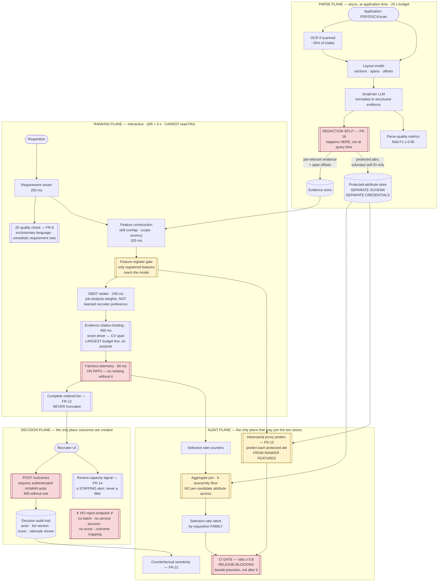

# 11 · HLD — HR: Recruitment & Candidate Matching

> ← [`01_requirements.md`](01_requirements.md) · **Next:** [`03_lld.md`](03_lld.md) →
>
> **Three-sentence compression:** the system **has no reject endpoint**, so FR-3's zero-auto-rejection guarantee is a property of the architecture rather than a policy anyone could override · I rejected training on historical recruiter decisions because it reproduces bias while *improving* every offline metric, so v1 ranks job-relevant evidence with job-analysis weights · the failure mode I'd volunteer is **proxies, not protected attributes** — a model that never sees a name can still rank on age via graduation year, tenure and CV formatting, which is why adversarial probe detection replaces the blocklist audit.

---

## 2.1 Architecture

Four planes, separated by **what each is allowed to know**. That separation — not the model — is the design.

Red is a boundary the system **cannot** cross. Amber is a gate it must pass through. Note the one edge that does not exist: **nothing goes from `PAS` into the ranking plane.**

---

## 2.2 Component choices

| Concern | Choice | Why | Rejected alternative (and why not) | Revisit when |
|---|---|---|---|---|
| **Rejection capability** | **No reject endpoint exists.** One outcome endpoint, requires an authenticated human actor id | FR-3/FR-11 is a legal boundary, not a quality target. A property beats a promise: it survives a bug, a new client, an automation and a change of management | **Feature flag** — gets flipped, and flags get flipped during incidents. **Score threshold** — that *is* auto-rejection with extra steps. **Policy doc** — guarantees nothing | Never |
| **Response completeness** | **Full ordered list, never truncated** (FR-12) | Ranking is not rejection; **hiding is**. A candidate filtered out of the response has been rejected by a machine | **Return top-50** — the single most natural API design here, and it is auto-rejection by omission. **Score cut-off** — same thing | Never |
| **Ranking model** | **GBDT over structured evidence, job-analysis weights** | Interpretable per-feature contributions, cheap (240 ms for 500 candidates), and its drivers map cleanly to citations. Weights derived from job analysis, not learned from screening decisions (FR-19) | **Cross-encoder / LLM ranker** — better at nuance, ~100× cost, and its rationale is generated prose rather than traceable attribution. **Learned-to-rank on recruiter decisions** — reproduces bias *while improving every offline metric* (§C of requirements). **Linear model** — auditable but too weak on interactions like "leadership × scope" | A later-stage outcome label exists (interview pass, on-role performance) **and** the fairness gate holds in shadow |
| **Text embeddings** | **Retrieval recall only — never a scoring feature** (FR-16) | An embedding of CV prose encodes writing style, formatting and vocabulary, all demographically loaded. It is a proxy nobody chose and nobody can inspect | **Embed the CV and score cosine similarity to the JD** — the standard approach, fast, and it makes FR-4 unauditable because the leak is distributed across 768 uninspectable dimensions | A method exists to certify an embedding free of protected signal — which is not currently a solved problem |
| **Redaction point** | **At parse time** (FR-18) | If protected fields are in the ranking store, they are one bad join from being a feature. Redacting at query time protects against intent, not accident | **Query-time filtering** — one `SELECT *` away from a violation. **Column-level permissions** — better, still one migration away | Never |
| **Protected-attribute storage** | **Separate schema, separate credentials, aggregate-only access, k-anonymity floor** | FR-5 is impossible without the data and FR-4 forbids its use. Separation resolves the catch-22 structurally rather than procedurally | **Same database, different table** — a join is a typo away. **Don't collect it** — then FR-5's audit cannot be computed and the compliance requirement fails. **Third-party auditor holds it** — viable, adds a dependency to a release-blocking gate | A privacy-preserving aggregation service (secure enclave / MPC) is available — a genuine improvement |
| **Proxy detection** | **Adversarial probes over the live feature set** (FR-15) | Flips the question from "did we exclude the bad fields?" (misleading) to "can the information be recovered?" (what the law is about). Probe feature-importance also says *which* feature leaks | **Blocklist audit** — creates false confidence; a model that never sees a name still ranks on age via graduation year. **Correlation checks per feature** — misses combinations, which is where most leakage lives | — |
| **Explainability** | **Evidence citation to CV spans, generated with the ranking and persisted** (FR-26/27) | A SHAP plot is not usable by a candidate or a tribunal. And an explanation reconstructed later is a *reconstruction* — it drifts as models and features change | **Post-hoc SHAP on request** — cheap, and not an explanation anyone can contest. **LLM-generated rationale** — reads well and can describe evidence that isn't there | — |
| **Citation budget** | **400 ms on-path — the largest single line, above the model's 240 ms** | The allocation *is* the requirement. Generated off-path, there exists a code path producing a decision with no record of its basis | **Generate lazily on request** — saves 400 ms of the 1,430 ms headroom and forfeits FR-27 | — |
| **Fairness telemetry** | **On-path, 60 ms** (FR-28) | Emitted lazily, a requisition can be ranked and never audited — and the failure is invisible because the ranking worked | **Batch from logs** — cheaper, and log loss becomes audit loss silently | — |
| **Fairness gate** | **In CI, release-blocking, beside precision** | A metric that is not a gate is not a requirement. A model improving precision while degrading the selection-rate ratio **must not ship** | **Post-release monitoring** — finds the problem after candidates were affected. **A dashboard** — nobody blocks a release on a dashboard | Never |
| **Audit granularity** | **Requisition families** (role × level × region) over a window, with a minimum sample and the self-ID response rate reported (FR-24/25) | A 40-applicant requisition cannot support a group ratio. Rolling up is the only statistically honest option | **Per-requisition ratios** — noise presented as compliance. **Global ratio only** — hides an entire biased role family inside a fair aggregate | — |
| **Parse pipeline** | **Layout model + small-tier LLM normalisation, async** | Parsing at application time (20 s budget) is what makes interactive ranking cheap. Layout preserves the **span offsets** citations need | **LLM-only parsing from raw text** — loses layout and offsets, so citations cannot point anywhere. **Regex/heuristic** — brittle across CV formats, and 0.95 F1 is not reachable | — |
| **JD quality check** | **On the requisition path** (FR-8) | The cheapest fairness intervention available is fixing the *requisition*: exclusionary language and unrealistic requirement stacks shrink the qualified pool before any model runs | **Skip it** — leaves the largest and cheapest lever unused | — |
| **Review capacity** | **Surfaced as a staffing signal, never as a filter** (FR-14) | Volume exceeding capacity is a resourcing fact. Responding by filtering converts it into auto-rejection | **Auto-filter low scorers when volume is high** — precisely the violation FR-3 exists to prevent, arriving disguised as an operational necessity | Never |

---

## 2.3 Data flow, narrated

**The parse path** (async, at application time, 20 s budget — off the interactive path entirely):

1. **Intake** of PDF, DOCX or scanned image. ~25% are scans and need OCR.
2. **Layout analysis** identifies sections, blocks and — critically — **character offsets** for every extracted span. This is what makes FR-26's citations possible; a pipeline that flattens to plain text can never point back.
3. **Small-tier LLM normalisation** turns extracted text into structured evidence: skills with supporting spans, roles with durations, credentials, scope indicators. Parse-quality metrics track field F1 against the 0.95 floor, because **ranking on bad evidence is worse than not ranking** — it produces confident, well-cited nonsense.
4. **The redaction split** (FR-18). Job-relevant evidence goes to the evidence store. Protected attributes — only where voluntarily self-identified with stated purpose — go to a **separate schema with separate credentials**. The ranking service's database role cannot read that schema. This is the single most important edge in the architecture, and it is an edge that *does not exist*.

**The ranking path** (~1,570 ms of a 3,000 ms SLO):

5. **Requirement vector** from the requisition, and a **JD quality check** (FR-8) flagging exclusionary language and unrealistic requirement stacks. Cheapest fairness lever in the system: a requisition demanding "10 years of a 6-year-old framework" shrinks the qualified pool before any model is involved.
6. **Feature construction** over pre-parsed evidence: skill overlap, demonstrated scope, credential match, recency. Fast because the expensive work happened asynchronously.
7. **The feature register gate.** Only features present in the register — each with its recorded proxy assessment, mitigation and owner (FR-17) — reach the model. A new feature cannot be added without a registered decision, which makes §B.3's judgement call impossible to skip.
8. **GBDT ranking** with job-analysis weights (FR-19). Per-feature contributions come out interpretable, which is what the next stage consumes.
9. **Evidence citation binding** — 400 ms, the largest line in the budget, above the model itself. Each score driver resolves to a CV span with page and line offsets, including the **negative** findings ("no evidence found for financial-services domain"), which are the ones a candidate can contest (FR-29).
10. **Fairness telemetry**, on-path (FR-28). Selection-rate counters increment as part of producing the response, so there is no code path that ranks without auditing.
11. **The complete ordered list** (FR-12). All applicants, ranked. Pagination is a UI affordance over a complete list, never a cut.

**The decision path:**

12. **A recruiter reviews and acts.** `POST /outcomes` requires an authenticated human actor id and returns 400 without one. There is no batch variant and no service-account path (FR-11).
13. **The audit trail** records the actor, the ranked-list version, and **the score and rationale as presented at that moment** (FR-13) — not as recomputable later, because a model update would change the recomputation and the record must reflect what the human actually saw.

**The audit path** (the only plane permitted to touch both stores):

14. **Aggregate join** of selection-rate counters against self-identified attributes, with a k-anonymity floor. Per-candidate attribute access is impossible through any interface (FR-23).
15. **Selection-rate ratios by requisition family**, always reported with the self-ID response rate (FR-24) — a ratio without its response rate is not a finding.
16. **Adversarial proxy probes** (FR-15): for each protected attribute, train a model to predict it *from the ranker's own features*. Probe AUC and its feature importances go into the release gate.
17. **The CI gate**: selection-rate ratio ≥ 0.8 and probe AUC within bounds, evaluated **beside** precision. A model that improves precision and degrades the ratio does not ship.

---

## 2.4 NFR mapping

| NFR (from shared block) | Delivered by |
|---|---|
| **Ranking p95 < 3 s / 500 applicants** | Budget §2.5 (~1,570 ms) · parsing async and off-path · GBDT over structured features · pre-parsed evidence fetch |
| Parse p95 < 20 s (async) | Separate plane; layout model + small tier; OCR only for the ~25% scanned |
| Availability 99.9% | Degraded mode = chronological/manual review — **which is lawful**, since the system never had rejection authority to lose |
| **Parse accuracy ≥ 0.95 field F1** | Layout-preserving extraction · per-field quality metrics · candidate correction channel (FR-29) feeding parse-quality signal |
| **Selection-rate ratio ≥ 0.8, release-blocking** | On-path telemetry (FR-28) · aggregate audit join with k-anonymity (FR-23) · **CI gate beside precision** · family-level roll-up with minimum sample (FR-25) |
| **Auto-rejections = 0** | **No reject endpoint** (FR-11) · complete untruncated responses (FR-12) · human actor id required on every outcome · capacity surfaced as staffing, never as a filter (FR-14) |
| **Explainability 100%** | Citation binding on-path (FR-26) · generated with the ranking and persisted (FR-27) · negative findings included and contestable (FR-29) |
| Audit retention per statute | Immutable decision trail (FR-13) with actor, list version, score and rationale-as-shown |
| Throughput 50k applications/day | Parse plane scales horizontally and independently; ranking is per-requisition and interactive |
| **Cost ≤ $0.05/application** | ~$0.0016 — **30× inside budget**. Surplus deliberately spent on the audit apparatus, which is labour and tooling |

---

## 2.5 Latency budget (rank a 500-applicant requisition, p95)

| Stage | Budget | Note |
|---|---|---|
| Auth + requisition fetch | 30 ms | |
| Requirement vector construction | 250 ms | Includes the JD quality check |
| Candidate evidence fetch (500 pre-parsed records) | 180 ms | Cheap because parsing was async |
| Feature construction | 320 ms | Skill overlap, scope, recency |
| Feature register gate | 5 ms | Registered features only |
| **GBDT ranking** | **240 ms** | 500 candidates |
| **Evidence citation binding** | **400 ms** | **Largest line — above the model.** On-path by requirement (FR-27) |
| **Fairness telemetry emit** | **60 ms** | **On-path** (FR-28) |
| Response assembly | 90 ms | Complete ordered list |
| **Total** | **~1,575 ms** | SLO 3,000 ms ✅ **~1,425 ms headroom** |

> **Two lines here are unusual and both are deliberate.** Citation binding costs **more than the ranking model** — 400 ms against 240 ms. And fairness telemetry sits on the critical path rather than being batched from logs. Both are the same argument: *a compliance artefact produced off the critical path implies a code path that produces the decision without it.* Pay the milliseconds; there is 1,425 ms of headroom precisely so this is affordable.
>
> The generous headroom exists because parsing is async. That single architectural choice — do the expensive work at application time, not at view time — is what buys the room to put compliance on-path.

---

## 2.6 Failure modes and blast radius

| Failure | Detection | Blast radius | Mitigation / degraded mode |
|---|---|---|---|
| **Parse quality degrades** | Per-field F1 vs 0.95 floor | Every ranking for affected applications — **confident, well-cited nonsense** | Below floor, the candidate is marked `evidence_incomplete` and surfaced for manual review rather than ranked on partial evidence. **The worst version of this failure is silent**, which is why F1 is monitored per field, not in aggregate |
| **A new feature leaks a protected attribute** | Probe AUC in the CI gate (FR-15) | Systematic, across every requisition | Release blocked. Feature register requires a recorded decision before any feature ships (FR-17) |
| **Selection-rate ratio breaches 0.8** | CI gate, release-blocking | Prospective — caught before deployment | Model does not ship. If detected in production telemetry on a live model, roll back; a live fairness breach is a compliance incident, not a quality regression |
| **Self-ID response rate collapses** | Reported with every ratio (FR-24) | **The audit becomes uninformative while still producing numbers** | Ratios below a minimum response rate are reported as "insufficient basis", never as a pass. This is the failure mode where a compliance artefact overstates its own strength |
| **Recruiter volume exceeds review capacity** | Capacity signal (FR-14) | Slow time-to-shortlist; **pressure to filter** | Escalate as staffing. The one response that is forbidden is filtering low scorers — that is FR-3's violation arriving disguised as operational necessity |
| **Someone adds a top-N cut-off** | API contract test (FR-12) | Auto-rejection by omission, at scale, invisibly | Contract test asserts result count equals applicant count. **This is the most likely way this system becomes unlawful**, because truncating a list is the most natural API optimisation there is |
| **Ranking service gains read access to the protected store** | Credential test in CI (FR-22) | Catastrophic — features could include protected attributes | Separate schema, separate credentials, tested. Not "does not read"; **cannot** read |
| **Explanation cites a span that moved** | Offset validation against the stored document version | Contestability — an explanation pointing at the wrong text | Citations pin the document version; a re-parse creates a new version rather than mutating spans |
| **LLM normalisation invents evidence** | Span-grounding check: every claim must resolve to a real offset | A candidate ranked on experience they never claimed | Any evidence item without a valid span is dropped and counted. **The LLM may only point at text, never assert** |
| **Historical-bias contamination via FR-9** | Fairness gate + counterfactual tests (FR-21) | Systematic, and **every offline metric improves** | v1 does not train on screening decisions (FR-19). Any future outcome-trained model is shadow-only until fairness *and* quality both hold, with a named approver (FR-20) |
| **JD quality check flags nothing** | Rate monitoring | The cheapest fairness lever silently inactive | Alert on a flag rate near zero — real requisitions contain exclusionary phrasing at a measurable rate, so zero means the check broke |
| **Audit cell identifies an individual** | k-anonymity floor (FR-23) | Privacy breach through the compliance mechanism | Cells below `k` suppressed and rolled up. The audit must not itself leak the attributes it protects |

---

## 2.7 Scale plan

| | What breaks first | Why | What I'd change |
|---|---|---|---|
| **10×** (500k applications/day) | **Human review capacity — and it is not close** | Parsing and ranking both scale horizontally and cost almost nothing. FR-3 makes *people* the ceiling: 500k applications/day cannot be reviewed by any plausible recruiting organisation | This is where the design gets genuinely hard, and the honest answer is that it is **not primarily an engineering problem**. Engineering can help by improving *ranking quality* so recruiter attention is better spent, by better requisition targeting (FR-8) so fewer unqualified applications arrive, and by internal-mobility matching (FR-10). What it must **not** do is filter — so at some volume the product must change (invite-only requisitions, staged application flows) rather than the architecture bending FR-3 |
| **10×** (secondary) | Audit computation and family definitions | 10× requisitions means many more families, each needing a minimum sample, and the k-anonymity floor bites more often | Precompute family aggregates incrementally rather than batch-recomputing; formalise family taxonomy with an owner — the same hierarchical-governance move as the defect taxonomy in [`../06_manufacturing_cv_inspection/`](../06_manufacturing_cv_inspection/) |
| **100×** (5M/day) | **Jurisdictional fragmentation** | At this scale you operate across many legal regimes with materially different rules on what counts as an automated decision, audit cadence, and notice. A single global pipeline cannot satisfy all of them | Per-jurisdiction policy configuration as **first-class deployment config**, not conditionals in code: which features are permitted, what audit cadence applies, what notice is served, whether ranked presentation itself is regulated. The ranker becomes one component inside a per-market compliance envelope |
| **100×** (secondary) | Proxy detection cost and coverage | Probes must run over every feature combination across every market's permitted feature set | Continuous probing on a sampled basis rather than exhaustive per-release; prioritise by feature novelty and market risk |

**What does not break:** the compliance boundaries. No reject endpoint, complete responses, on-path citation and telemetry, and store separation are all per-request or structural properties, independent of volume. **The scaling story is human capacity and legal fragmentation, not computation** — and the most important consequence is that at high volume the *product* must change rather than the architecture relaxing FR-3.

---

> ← [`01_requirements.md`](01_requirements.md) · **Next:** [`03_lld.md`](03_lld.md) →
