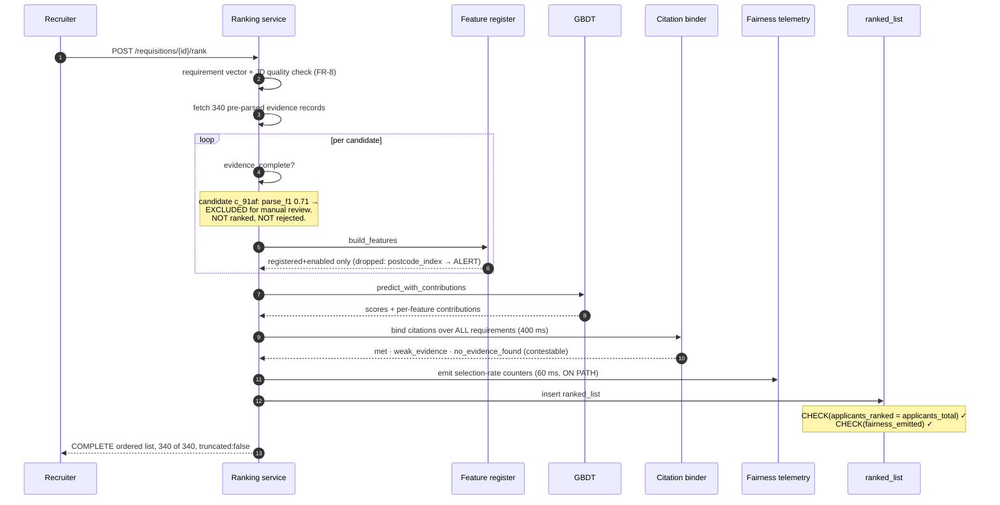
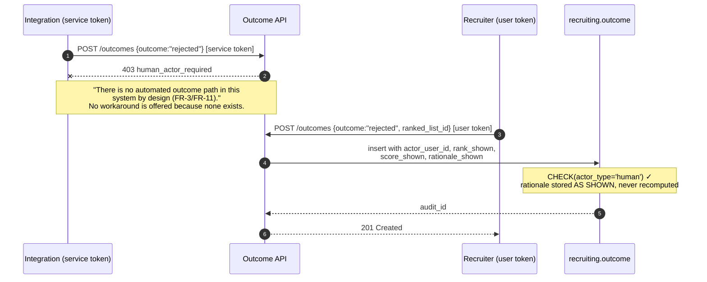
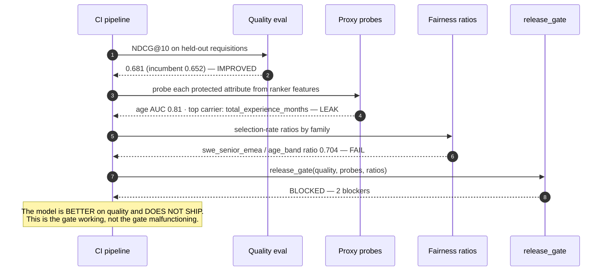

# 11 · LLD — HR: Recruitment & Candidate Matching

> ← [`02_hld.md`](02_hld.md) · **Next:** [`04_production_and_interview.md`](04_production_and_interview.md) →
>
> The organising principle: **separation is enforced by the schema, not by the code.** Where a compliance boundary can be expressed as a permission, a constraint, or an absent table, it is — because those survive a refactor and conventions do not.

---

## 3.1 Data models

### Two schemas, and the boundary between them

This is the most consequential structure in the system, so it comes first.

```sql
-- ═══════════════════════════════════════════════════════════════════
-- SCHEMA: recruiting        readable by the RANKING service
-- ═══════════════════════════════════════════════════════════════════
CREATE SCHEMA recruiting;

-- ═══════════════════════════════════════════════════════════════════
-- SCHEMA: protected         NOT readable by the ranking service.
--                          Readable ONLY by the audit role, and only
--                          through aggregate views.
-- ═══════════════════════════════════════════════════════════════════
CREATE SCHEMA protected;

CREATE ROLE ranking_svc;
CREATE ROLE audit_svc;
CREATE ROLE parse_svc;

GRANT USAGE  ON SCHEMA recruiting TO ranking_svc, parse_svc, audit_svc;
GRANT USAGE  ON SCHEMA protected  TO parse_svc, audit_svc;      -- NOT ranking_svc
REVOKE ALL   ON SCHEMA protected  FROM ranking_svc;

-- the audit role cannot read raw rows either — only the aggregate view
REVOKE ALL ON ALL TABLES IN SCHEMA protected FROM audit_svc;
GRANT SELECT ON protected.selection_rate_agg TO audit_svc;
```

> **`REVOKE ALL ON SCHEMA protected FROM ranking_svc` is the single line that makes FR-4 real.** Everything else in this design — the redaction split, the feature register, the probes — is defence in depth behind it. If the ranking service's credentials cannot reach the schema, then no feature, no bad join, no `SELECT *` and no future refactor can put a protected attribute into the model. **Not "does not read" — cannot read**, and it is verified by a CI test that asserts the grant fails (§3.6, case 1).
>
> Note the second revoke: even the **audit** role cannot read individual rows. It sees only `selection_rate_agg`, which has the k-anonymity floor baked into its definition (FR-23). The audit apparatus must not itself leak the attributes it exists to protect — a compliance mechanism that becomes a privacy breach is a real and embarrassing failure mode.

### Evidence — what the ranker sees

```sql
CREATE TABLE recruiting.application (
    application_id   UUID PRIMARY KEY,
    requisition_id   UUID        NOT NULL,
    candidate_id     UUID        NOT NULL,     -- pseudonymous
    applied_at       TIMESTAMPTZ NOT NULL,

    -- the parsed document, versioned: citations pin a version (FR-26)
    document_version INTEGER     NOT NULL,
    document_ref     TEXT        NOT NULL,
    page_count       SMALLINT    NOT NULL,
    was_scanned      BOOLEAN     NOT NULL,

    -- parse quality: below the floor, do not rank (FR-1)
    parse_f1_est     REAL        NOT NULL,
    evidence_complete BOOLEAN    NOT NULL,

    UNIQUE (requisition_id, candidate_id)
);

CREATE TABLE recruiting.evidence_item (
    application_id   UUID     NOT NULL REFERENCES recruiting.application,
    evidence_id      UUID     NOT NULL,
    document_version INTEGER  NOT NULL,

    kind             TEXT     NOT NULL,   -- skill|role|credential|scope|education
    canonical_key    TEXT     NOT NULL,   -- normalised: 'kubernetes', 'people_mgmt'
    value_text       TEXT,
    value_numeric    NUMERIC,             -- e.g. months of tenure
    confidence       REAL     NOT NULL,

    -- THE SPAN. Citations are impossible without it (FR-26)
    page             SMALLINT NOT NULL,
    line_start       SMALLINT NOT NULL,
    line_end         SMALLINT NOT NULL,
    char_start       INTEGER  NOT NULL,
    char_end         INTEGER  NOT NULL,
    quoted_text      TEXT     NOT NULL,   -- verbatim, for display

    PRIMARY KEY (application_id, evidence_id),

    -- an evidence item with no span is an ASSERTION, not evidence
    CHECK (char_end > char_start),
    CHECK (length(quoted_text) > 0)
);
```

> **The `CHECK` constraints implement "the LLM may point at text, never assert."** The normalisation model's job is extraction: every evidence item must resolve to a real span of a real document version, with the quoted text stored verbatim. An item the model invented has no span, fails the constraint, and cannot be inserted.
>
> This is the structural answer to hallucinated evidence, and it is strictly better than a post-hoc grounding check because the invalid state is unrepresentable rather than detected. A candidate cannot be ranked on experience they never claimed, because the claim has nowhere to live.

**`document_version` on both tables, and on citations.** A re-parse (better model, corrected OCR, candidate correction per FR-29) creates a **new version** rather than mutating spans. Otherwise an explanation shown to a recruiter in March points at different text in June, and the audit trail becomes fiction.

### Protected attributes — separated, minimal, consented

```sql
CREATE TABLE protected.self_identification (
    candidate_id     UUID        NOT NULL,
    -- one row per attribute, so declining one does not decline all
    attribute        TEXT        NOT NULL,   -- gender|ethnicity|disability|age_band|veteran
    value            TEXT        NOT NULL,   -- includes 'prefer_not_to_say'

    consented_at     TIMESTAMPTZ NOT NULL,
    consent_purpose  TEXT        NOT NULL,   -- always 'fairness_auditing'
    consent_version  TEXT        NOT NULL,   -- which notice text they saw

    PRIMARY KEY (candidate_id, attribute)
);

-- The ONLY interface the audit role has. k-anonymity is in the DEFINITION.
CREATE VIEW protected.selection_rate_agg AS
SELECT
    f.family_id,
    si.attribute,
    si.value,
    COUNT(*)                                        AS applicants,
    COUNT(*) FILTER (WHERE o.outcome = 'advanced')  AS advanced,
    COUNT(*) FILTER (WHERE si.value = 'prefer_not_to_say') AS declined
FROM protected.self_identification si
JOIN recruiting.application a  USING (candidate_id)
JOIN recruiting.requisition_family f USING (requisition_id)
LEFT JOIN recruiting.outcome o USING (application_id)
GROUP BY f.family_id, si.attribute, si.value
HAVING COUNT(*) >= 20;                              -- k-anonymity floor (FR-23)
```

Four properties worth naming:

| Property | Why |
|---|---|
| **One row per attribute** | A candidate may disclose ethnicity and decline gender. A single wide row forces all-or-nothing and depresses the response rate the audit depends on |
| **`'prefer_not_to_say'` is a stored value, not a NULL** | It is the difference between *declined* and *never asked*, and FR-24 needs to report the response rate |
| **`consent_version`** | Which notice text they agreed to. "The candidate consented" is only defensible if you can say to what |
| **`HAVING COUNT(*) >= 20` in the view** | The floor cannot be forgotten by a query author, because there is no query author — the view is the whole interface |

### Feature register — the gate that forces the judgement call

FR-17 requires a recorded decision for every feature with a known proxy relationship. Making that a table is what makes it unskippable.

```sql
CREATE TABLE recruiting.feature_register (
    feature_key       TEXT PRIMARY KEY,
    description       TEXT    NOT NULL,

    -- the proxy assessment (FR-15 probe output feeds this)
    known_proxy_for   TEXT[],                    -- e.g. '{age}' for graduation_year
    probe_auc         REAL,                      -- latest adversarial probe result
    probe_measured_at TIMESTAMPTZ,

    -- the decision, and who owns it
    mitigation        TEXT    NOT NULL,   -- none|coarsened|dropped|replaced
    mitigation_detail TEXT,               -- e.g. 'bucketed 0-2,3-5,6-10,10+'
    accuracy_cost_ndcg REAL,              -- measured cost of the mitigation
    decision_owner    TEXT    NOT NULL,   -- a PERSON, and not the modeller
    decided_at        TIMESTAMPTZ NOT NULL,
    rationale         TEXT    NOT NULL,

    enabled           BOOLEAN NOT NULL DEFAULT FALSE,

    -- a feature with a known proxy CANNOT be enabled without a mitigation decision
    CHECK (NOT enabled
           OR known_proxy_for IS NULL
           OR array_length(known_proxy_for, 1) IS NULL
           OR mitigation <> 'none'
           OR rationale IS NOT NULL)
);
```

> **`enabled DEFAULT FALSE` and the `CHECK` are the mechanism.** A modeller who adds `graduation_year` to the feature pipeline gets nothing: the register gate (§3.3) drops unregistered and disabled features silently-but-loudly (dropped, counted, alerted). Enabling it requires a row with a probe result, a mitigation, a measured accuracy cost, and a **named owner who is not the modeller**.
>
> `accuracy_cost_ndcg` is there to keep the conversation honest in both directions. "We can't drop tenure, it's too important" is a claim; measuring it at −0.03 NDCG makes it a fact, and sometimes the fact is that the proxy was barely earning its place.

### Outcomes — the only place a decision exists

```sql
CREATE TABLE recruiting.outcome (
    application_id   UUID PRIMARY KEY REFERENCES recruiting.application,

    outcome          TEXT        NOT NULL,   -- advanced|rejected|withdrawn
    -- FR-11: a HUMAN, always. There is no system actor.
    actor_user_id    TEXT        NOT NULL,
    actor_type       TEXT        NOT NULL DEFAULT 'human',
    decided_at       TIMESTAMPTZ NOT NULL,

    -- FR-13: what the human actually SAW, not what we could recompute
    ranked_list_id   UUID        NOT NULL,
    rank_shown       SMALLINT    NOT NULL,
    score_shown      REAL        NOT NULL,
    rationale_shown  JSONB       NOT NULL,   -- the citation set, as displayed
    model_version    TEXT        NOT NULL,
    feature_set_hash TEXT        NOT NULL,

    reason_code      TEXT,                   -- recruiter's stated reason
    note             TEXT,

    -- the strongest form of FR-3 available in a schema
    CHECK (actor_type = 'human'),
    CHECK (length(actor_user_id) > 0)
);
```

> **`CHECK (actor_type = 'human')` makes a machine-authored outcome unrepresentable.** Combined with there being no reject endpoint (§3.2), FR-3 is enforced at two independent layers: the API has no path, and the database would reject the row anyway. Two independent mechanisms for a legal boundary is proportionate — a single mechanism is one refactor from gone.
>
> **`rationale_shown` is stored, not recomputed.** This is FR-27, and the reason is that a model update changes the recomputation. Six months later, "why was this candidate rejected?" must be answerable with what the recruiter saw, not with what the current model would say. Regenerating an explanation is producing a *plausible* explanation, which is exactly the thing a tribunal should not accept.

### Ranked list — immutable, because outcomes reference it

```sql
CREATE TABLE recruiting.ranked_list (
    ranked_list_id   UUID PRIMARY KEY,
    requisition_id   UUID        NOT NULL,
    generated_at     TIMESTAMPTZ NOT NULL,

    model_version    TEXT        NOT NULL,
    feature_set_hash TEXT        NOT NULL,
    weight_set_id    TEXT        NOT NULL,   -- job-analysis weights (FR-19)

    -- FR-12: completeness is recorded and asserted
    applicants_total SMALLINT    NOT NULL,
    applicants_ranked SMALLINT   NOT NULL,

    -- FR-28: telemetry emitted as part of generation
    fairness_emitted BOOLEAN     NOT NULL,

    CHECK (applicants_ranked = applicants_total),   -- NO truncation, ever
    CHECK (fairness_emitted)                        -- no list without an audit
);
```

> **Two `CHECK`s that encode two requirements as impossibilities.**
>
> `applicants_ranked = applicants_total` is FR-12. Truncating a list is the most natural API optimisation in a ranking system, and it is auto-rejection by omission. Making a truncated list unstorable means the optimisation cannot ship by accident — someone would have to delete a constraint, which shows up in a migration review.
>
> `CHECK (fairness_emitted)` is FR-28. A ranked list that was never audited cannot be persisted, so there is no code path that ranks without incrementing selection-rate counters.

---

## 3.2 API contracts

### Rank a requisition

```http
POST /v1/requisitions/{requisition_id}/rank
{ "as_of": "2027-02-11T09:00:00Z" }
```

```json
200 OK
{
  "ranked_list_id": "rl_8823…",
  "model_version": "rank-2027.02.1",
  "weight_set_id": "job-analysis-swe-senior-v3",

  "completeness": {
    "applicants_total": 340,
    "applicants_ranked": 340,
    "truncated": false,
    "note": "All applicants are returned, ordered. Pagination is display-only."
  },

  "excluded_from_ranking": [
    { "candidate_id": "c_91af…", "reason": "evidence_incomplete",
      "parse_f1_est": 0.71,
      "disposition": "surfaced_for_manual_review",
      "note": "Not ranked and NOT rejected — requires human review." }
  ],

  "candidates": [
    {
      "candidate_id": "c_2f80…",
      "rank": 12, "score": 0.741,
      "requirements": [
        { "requirement": "Kubernetes in production", "status": "met",
          "contribution": 0.18,
          "citation": { "document_version": 2, "page": 2,
                        "line_start": 14, "line_end": 15,
                        "quoted_text": "owned the Kubernetes migration for 40 services" } },
        { "requirement": "People management, 3+ years", "status": "met",
          "contribution": 0.14,
          "citation": { "document_version": 2, "page": 1, "line_start": 22,
                        "line_end": 22,
                        "quoted_text": "led a team of 6 engineers, 2021-2024" } },
        { "requirement": "Financial-services domain", "status": "no_evidence_found",
          "contribution": -0.09,
          "citation": null,
          "contestable": true,
          "contest_url": "/v1/applications/a_77e1…/contest" },
        { "requirement": "Go", "status": "weak_evidence",
          "contribution": 0.02,
          "citation": { "document_version": 2, "page": 3, "line_start": 4,
                        "line_end": 4, "quoted_text": "Go, Rust, Python" },
          "note": "Listed as a skill; no project evidence found." }
      ]
    }
  ]
}
```

Four things this contract does that a conventional ranking API does not:

1. **`completeness` is an explicit object with `truncated: false`.** Not an implicit property — a stated, testable one. The contract test in CI asserts `applicants_ranked == applicants_total` (§3.6, case 2).
2. **`excluded_from_ranking` carries a `disposition`, and the disposition is never "rejected".** A candidate whose CV parsed badly must not be ranked on bad evidence *and* must not be dropped. The only lawful third option is human review, and the response says so in words a client author will read.
3. **Negative findings are first-class and `contestable`.** `no_evidence_found` with a contest URL turns FR-29 from a policy into an affordance. It is also the highest-value data-quality signal in the system: candidates are strongly motivated to correct a false negative about themselves.
4. **`weak_evidence` exists as a distinct status.** "Go" appearing in a skills list is not the same as evidence of using Go, and collapsing the two either over-credits list-padding or under-credits real skills. The distinction is visible to the recruiter, which is where the judgement belongs.

### Record an outcome — the only mutation

```http
POST /v1/applications/{application_id}/outcomes
Authorization: Bearer <user token>        ← a USER token, not a service token
{
  "outcome": "rejected",
  "ranked_list_id": "rl_8823…",
  "reason_code": "insufficient_domain_experience",
  "note": "No financial-services background; role requires regulatory familiarity."
}
```

```json
201 Created
{ "application_id": "a_77e1…", "outcome": "rejected",
  "actor_user_id": "u_recruiter_318", "decided_at": "2027-02-11T11:04:22Z",
  "audit_id": "ad_5512…" }
```

And the failure that matters:

```json
403 Forbidden
{ "error": "human_actor_required",
  "detail": "Outcomes require an authenticated human user token. This request presented a service credential.",
  "remedy": "There is no automated outcome path in this system by design (FR-3/FR-11). Route this decision to a recruiter."
}
```

> **The error message names the requirement and refuses to suggest a workaround.** That is deliberate: the person reading this error is an integrator under deadline pressure looking for the batch endpoint, and the most useful thing the API can tell them is that it does not exist and why. An error saying only "403" invites a search for the other endpoint.
>
> Note also `ranked_list_id` is **required** on the request. The outcome must reference the exact list the recruiter was looking at, which is what makes `rationale_shown` recordable (FR-13). An outcome that cannot say what evidence was on screen is not auditable.

### Endpoints that deliberately do not exist

Worth writing down, because absence is the design:

```
✗ POST /v1/requisitions/{id}/auto-reject
✗ POST /v1/outcomes:batch
✗ POST /v1/requisitions/{id}/shortlist        (would imply a cut)
✗ GET  /v1/requisitions/{id}/rank?top=50      (would imply truncation)
✗ any endpoint accepting a service-account token for an outcome
✗ any configuration key mapping a score to an outcome
```

The last two are enforced by test, not by convention: a CI check greps the routing table for outcome paths reachable without a user principal, and the config schema has no score-threshold key to set.

### Fairness audit

```http
GET /v1/audit/selection-rates?family=swe_senior_emea&window=2027-Q1
```

```json
200 OK
{
  "family_id": "swe_senior_emea",
  "window": "2027-Q1",
  "applicants": 4180,

  "self_id_response_rate": 0.62,
  "basis_sufficient": true,
  "basis_note": "Response rate 0.62. Ratios are estimates over the self-identified population, which may not represent the applicant population.",

  "attributes": [
    { "attribute": "gender",
      "groups": [
        { "value": "female", "applicants": 980,  "advanced": 118, "rate": 0.120 },
        { "value": "male",   "applicants": 1420, "advanced": 186, "rate": 0.131 },
        { "value": "prefer_not_to_say", "applicants": 210, "advanced": 26, "rate": 0.124 }
      ],
      "selection_rate_ratio": 0.916,
      "threshold": 0.8,
      "status": "pass" },

    { "attribute": "age_band",
      "groups": [
        { "value": "under_30", "applicants": 1510, "advanced": 214, "rate": 0.142 },
        { "value": "30_45",    "applicants": 1120, "advanced": 138, "rate": 0.123 },
        { "value": "over_45",  "applicants": 390,  "advanced": 39,  "rate": 0.100 }
      ],
      "selection_rate_ratio": 0.704,
      "threshold": 0.8,
      "status": "FAIL",
      "note": "Ratio 0.704 for over_45 vs under_30. Investigate tenure and graduation-year features (feature_register: probe_auc 0.81 for age)." }
  ],

  "suppressed_cells": 3,
  "suppression_reason": "below k-anonymity floor (k=20)"
}
```

> **`basis_sufficient` and `basis_note` are the honesty fields**, and they are the difference between a compliance artefact and a compliance theatre. A ratio computed over 62% self-identification is an estimate with unknown skew, and reporting it without that caveat overstates what the audit proves (requirements §D.1). Below a minimum response rate the API returns `basis_sufficient: false` and refuses to report a `status` of `pass` — it will report `FAIL` but never `pass`, because an unfounded pass is the dangerous direction.
>
> The `age_band` failure is written the way a real finding reads: it names the ratio, the comparison, and **points at the specific features implicated by the probe**. A finding that says only "fails 0.8" starts an investigation; this one starts a fix.

---

## 3.3 Core algorithms

### The feature register gate

```python
def build_features(app: Application, req: Requirements,
                   register: FeatureRegister) -> dict[str, float]:
    """Only REGISTERED, ENABLED features reach the model (FR-17).
    Anything else is dropped, counted and alerted — never silently included."""
    raw = compute_all_candidate_features(app, req)
    kept, dropped = {}, []

    for key, value in raw.items():
        entry = register.get(key)
        if entry is None:
            dropped.append((key, "unregistered"))
            continue
        if not entry.enabled:
            dropped.append((key, "registered_but_disabled"))
            continue
        kept[key] = entry.apply_mitigation(value)      # e.g. coarsen tenure
        
    if dropped:
        # LOUD: an unregistered feature reaching the pipeline is a process failure
        emit_alert("unregistered_features_dropped", features=dropped,
                   model_version=MODEL_VERSION)
    return kept
```

> **Fail-closed, and noisy about it.** The default for an unknown feature is exclusion, so a modeller who adds `postcode_deprivation_index` gets a feature that does nothing and an alert naming them. The alternative default — include unless blocked — means every new feature is live until someone notices, and "someone notices" is not a compliance control.
>
> `apply_mitigation` is where the register's decisions take effect: a feature registered with `mitigation='coarsened'` is bucketed here, so the mitigation is applied at one point rather than trusted to every call site.

### Ranking, and why the weights are declared

```python
def rank(apps: list[Application], req: Requirements,
         weights: JobAnalysisWeights) -> RankedList:
    """FR-19: weights derive from JOB ANALYSIS, not learned recruiter preference."""
    rows = []
    for app in apps:
        if not app.evidence_complete:
            # NOT ranked and NOT rejected. The only lawful third option.
            rows.append(Excluded(app, reason="evidence_incomplete",
                                 disposition="surfaced_for_manual_review"))
            continue
        feats = build_features(app, req, REGISTER)
        score, contributions = MODEL.predict_with_contributions(feats)
        rows.append(Scored(app, score, contributions, feats))

    scored = sorted([r for r in rows if isinstance(r, Scored)],
                    key=lambda r: -r.score)

    citations = [bind_citations(r, req) for r in scored]      # 400 ms, on-path
    emit_fairness_telemetry(req, scored)                      # 60 ms, on-path

    return RankedList(
        candidates=citations,
        excluded=[r for r in rows if isinstance(r, Excluded)],
        applicants_total=len(apps),
        applicants_ranked=len(scored) + len([r for r in rows
                                             if isinstance(r, Excluded)]),
        fairness_emitted=True,
    )
```

Three things to notice:

**`evidence_complete` routes to exclusion-with-review, not to a low score.** Scoring a badly-parsed CV low is auto-rejection through the back door: the candidate ranks 340th of 340 because the OCR failed, and a recruiter working top-down never reaches them. Excluding them into a review queue is the only handling that is neither ranking-on-noise nor rejection-by-machine.

**`predict_with_contributions`, not `predict`.** The contributions are what citation binding consumes. A model that only emits a score forces explanation to be post-hoc, which is FR-27's failure mode.

**`applicants_ranked` counts excluded candidates too.** They were *processed*, and the `CHECK` in §3.1 asserts everyone is accounted for. If exclusions were not counted, a parse outage would silently shrink every list and satisfy the constraint.

### Citation binding

```python
def bind_citations(scored: Scored, req: Requirements) -> CandidateResult:
    """Map each score driver to a CV span. Negative findings included (FR-26)."""
    results = []
    for requirement in req.requirements:                  # ALL, not just met ones
        contribution = scored.contributions.get(requirement.feature_key, 0.0)
        items = evidence_for(scored.app, requirement.canonical_key,
                             scored.app.document_version)

        if not items:
            results.append(Requirement(
                requirement.text, status="no_evidence_found",
                contribution=contribution, citation=None,
                contestable=True,                          # FR-29
                contest_url=contest_url(scored.app)))
            continue

        best = max(items, key=lambda e: e.confidence)
        status = ("met" if best.confidence >= STRONG
                  else "weak_evidence")
        results.append(Requirement(
            requirement.text, status=status, contribution=contribution,
            citation=Citation(document_version=best.document_version,
                              page=best.page,
                              line_start=best.line_start, line_end=best.line_end,
                              quoted_text=best.quoted_text)))
    return CandidateResult(scored.app.candidate_id, scored.rank,
                           scored.score, results)
```

> **Iterating over *requirements*, not over *matched evidence*, is the whole design.** The obvious implementation loops over what the candidate has and lists it. That produces a flattering summary and no explanation of the ranking — because a candidate's rank is driven as much by what is **missing** as by what is present.
>
> Explaining rank 340 requires saying what was absent. And a `no_evidence_found` with a contest URL is the field that makes the whole explainability apparatus useful to the person it is meant to protect: a candidate can look at "no financial-services evidence" and reply "page 3, second role, two years at a broker" — which corrects the record and flags a parse failure at the same time.

### Adversarial proxy probes (FR-15)

```python
def probe_for_proxies(feature_matrix: pd.DataFrame,
                      audit_population: pd.DataFrame) -> list[ProbeResult]:
    """The question is NOT 'did we exclude protected fields?'
    It is 'can a protected attribute be RECOVERED from the features we kept?'"""
    results = []
    for attribute in PROTECTED_ATTRIBUTES:
        labels = audit_population[attribute]              # self-ID only
        mask = labels.notna() & (labels != "prefer_not_to_say")
        if mask.sum() < MIN_PROBE_SAMPLE:
            results.append(ProbeResult(attribute, auc=None,
                                       status="insufficient_sample"))
            continue

        X, y = feature_matrix[mask], labels[mask]
        probe = GradientBoostingClassifier(max_depth=3)
        auc = cross_val_score(probe, X, y, scoring="roc_auc", cv=5).mean()

        probe.fit(X, y)
        carriers = sorted(zip(X.columns, probe.feature_importances_),
                          key=lambda t: -t[1])[:5]

        results.append(ProbeResult(
            attribute=attribute, auc=auc,
            leaking_features=carriers,
            status="LEAK" if auc > PROBE_AUC_CEILING else "ok",
            sample=int(mask.sum()),
            note=f"top carriers: {', '.join(f for f, _ in carriers)}"))
    return results
```

```python
def release_gate(model_metrics, probes, ratios) -> GateDecision:
    """FR-5 NFR: the fairness metric sits BESIDE precision, not after it."""
    blockers = []

    if model_metrics.ndcg_at_10 < NDCG_FLOOR:
        blockers.append(f"quality: NDCG {model_metrics.ndcg_at_10:.3f}")

    for r in ratios:
        if r.basis_sufficient and r.selection_rate_ratio < 0.8:
            blockers.append(f"fairness: {r.family}/{r.attribute} "
                            f"ratio {r.selection_rate_ratio:.3f} < 0.8")

    for p in probes:
        if p.status == "LEAK":
            blockers.append(f"proxy: {p.attribute} recoverable at AUC "
                            f"{p.auc:.3f} via {p.leaking_features[0][0]}")

    return GateDecision(pass_=not blockers, blockers=blockers)
```

> **One function, both kinds of blocker.** That is the architectural expression of "fairness is a requirement, not an aspiration": there is no code path that ships a model past the quality check without also passing the fairness and proxy checks, because they are evaluated in the same call and returned in the same list.
>
> Note `basis_sufficient` gating the ratio check. A ratio computed on too little self-ID data must not *block* a release either — an unfounded block is as bad for the process as an unfounded pass, because it trains people to override the gate. Insufficient basis is reported as insufficient, and the response is to improve self-ID rates, not to guess.

---

## 3.4 Sequence diagrams

### Parse — the redaction split

```mermaid
sequenceDiagram
    autonumber
    participant C as Candidate
    participant API as Application API
    participant P as Parse worker
    participant L as Layout model
    participant N as Normaliser (small tier)
    participant EV as recruiting.evidence_item
    participant PA as protected.self_identification

    C->>API: submit CV + OPTIONAL self-ID (consented, purpose stated)
    API->>P: enqueue (async — 20 s budget, off the interactive path)
    P->>L: layout analysis
    L-->>P: sections + spans + CHARACTER OFFSETS
    P->>N: normalise to structured evidence
    N-->>P: evidence items, each with a span
    P->>P: drop any item whose span does not resolve
    Note over P: an item without a span is an ASSERTION, not evidence —<br/>the CHECK constraint would reject it anyway
    P->>EV: insert evidence (job-relevant only)
    P->>PA: insert self-ID (SEPARATE SCHEMA, parse_svc credentials)
    Note over EV,PA: ranking_svc has NO grant on the protected schema.<br/>Not "does not read" — CANNOT read.
    P->>P: emit parse_f1_est; if < 0.95 → evidence_complete = FALSE
```

### Rank — with an unrankable candidate



### The outcome, and the refused shortcut



### The release gate blocking a good model



> That last diagram is the one worth internalising. A model that improves NDCG by 3 points and degrades the age selection-rate ratio to 0.704 is exactly the release that ships in a system where fairness is monitored rather than gated — because the quality win is visible, quantified and championed, and the fairness regression is a chart nobody was blocking on.

---

## 3.5 State machines

### Application

```
   submitted
       │
       ▼
  ┌──────────┐  parse ok, F1 >= 0.95   ┌───────────┐
  │ PARSING  ├────────────────────────►│ RANKABLE  │
  └────┬─────┘                         └─────┬─────┘
       │ F1 < 0.95                            │ appears in a ranked list
       ▼                                      ▼
  ┌────────────────────┐              ┌───────────────┐
  │ EVIDENCE_INCOMPLETE│              │ RANKED        │
  └────────┬───────────┘              └───────┬───────┘
           │ surfaced for manual review        │ human acts
           │                                   ▼
           │                    ┌──────────────────────────┐
           └───────────────────►│ ADVANCED / REJECTED /    │ terminal
              (human may also   │ WITHDRAWN                │
               act directly)    │ actor_type = 'human'     │
                                └──────────────────────────┘

   ✗ there is NO transition into REJECTED that is not authored by a human ✗
   ✗ EVIDENCE_INCOMPLETE never auto-transitions to REJECTED ✗
```

**The two absent edges are the point.** `EVIDENCE_INCOMPLETE → REJECTED` is the tempting one — a CV that would not parse is easy to treat as a failed application — and it is auto-rejection caused by an OCR problem. It does not exist.

### Feature lifecycle

```
   proposed by a modeller
          │
          ▼
   ┌─────────────┐   no register row
   │ UNREGISTERED├──────────────────► DROPPED at the gate + ALERT
   └──────┬──────┘
          │ register row created
          ▼
   ┌──────────────────┐
   │ REGISTERED       │  enabled = FALSE by default
   │ probe pending    │
   └──────┬───────────┘
          │ probe run
     ┌────┴─────┐
  no │          │ leak (AUC > ceiling)
 leak│          ▼
     │   ┌─────────────────────┐
     │   │ MITIGATION REQUIRED │
     │   └──────┬──────────────┘
     │          │ owner (NOT the modeller) records
     │          │ mitigation + measured accuracy cost + rationale
     ▼          ▼
   ┌──────────────┐
   │ ENABLED      │ → reaches the model
   └──────────────┘
```

---

## 3.6 Edge cases and correctness

| # | Edge case | Handling | Why this way |
|---|---|---|---|
| 1 | **Someone grants `ranking_svc` read on `protected`** | CI test asserts the grant **fails**; a successful read is a build failure | The boundary is a permission, so the test is a permission test. Reviewing code for "does it read protected data?" does not scale; asserting it *cannot* does |
| 2 | **Someone adds `?top=50`** | Contract test asserts `applicants_ranked == applicants_total`; DB `CHECK` refuses the row | Truncation is the most natural optimisation in a ranking API and it is auto-rejection by omission. Two independent layers |
| 3 | **CV will not parse at all** | `EVIDENCE_INCOMPLETE` → manual review. **Never ranked low, never rejected** | Ranking on noise puts them 340th and a top-down recruiter never reaches them — rejection by ordering |
| 4 | **Candidate declines self-ID** | `'prefer_not_to_say'` stored as a value; counted in the response rate; excluded from probe training | Distinguishing *declined* from *never asked* is what makes FR-24's response rate computable |
| 5 | **A requisition has 12 applicants** | No per-requisition ratio; rolls into its family; reported "insufficient sample" | A ratio over 12 people is noise wearing a compliance badge |
| 6 | **All applicants in a family share a protected value** | Ratio undefined; reported as such, not as 1.0 | Reporting 1.0 for a homogeneous population is a false pass, and false passes are the dangerous direction |
| 7 | **Probe has too few labels** | `insufficient_sample`; does **not** pass the gate silently, and does not block it either | An unfounded block trains people to override the gate — nearly as damaging as an unfounded pass |
| 8 | **Candidate contests a `no_evidence_found`** | Correction recorded; **re-parse creates a new `document_version`**; logged as a parse-quality signal | Mutating spans in place would make earlier explanations point at different text and turn the audit trail into fiction |
| 9 | **Model updated between ranking and decision** | `outcome` stores `rationale_shown`, `model_version` and `feature_set_hash` **as presented** | "Why was this candidate rejected?" must be answerable with what the recruiter saw, not what today's model would say |
| 10 | **Recruiter rejects a rank-1 candidate** | Recorded normally with a reason code; **not** treated as a label | FR-19 — this is exactly the signal that would teach the model recruiter bias. It is audit data, not training data |
| 11 | **Same candidate applies to two requisitions** | Two `application` rows, one `candidate_id`; ranked independently | A rejection for one role must not influence another, which is both fair and, in some regimes, required |
| 12 | **JD quality check flags the requisition itself** | Warning to the recruiter before ranking; ranking still proceeds | Blocking would make FR-8 a gate on the recruiter's own work, which gets it disabled. A warning where the fix is cheapest |
| 13 | **Duplicate/near-duplicate CVs (plagiarised)** | Flagged for human attention; **not** scored down automatically | A similarity signal is not an integrity finding, and automating that judgement is a defamation risk |
| 14 | **Audit cell would identify one person** | Suppressed by the view's `HAVING`, counted in `suppressed_cells` | The compliance mechanism must not leak the attributes it protects |
| 15 | **Requisition closed mid-review with candidates un-actioned** | Outcomes remain absent; candidates enter a `withdrawn_requisition` disposition with notice | Leaving applications in limbo is its own harm, and an absent outcome is not a rejection |
| 16 | **Feature with `mitigation='coarsened'` used raw somewhere** | Mitigation applied inside `register.apply_mitigation`, one call site | Applying mitigations at every call site guarantees one is missed |

---

> ← [`02_hld.md`](02_hld.md) · **Next:** [`04_production_and_interview.md`](04_production_and_interview.md) →
