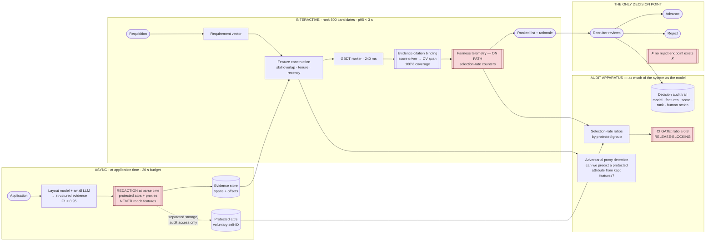

# 11 — HR: Recruitment & Candidate Matching

> **Archetype D · Retrieval & ranking.** The ranking machinery overlaps [`../../27_ai-platform-system-design/06_recommendation_system/`](../../27_ai-platform-system-design/06_recommendation_system/README.md). What makes this design distinct — and the most legally constrained in the folder — is that **anti-discrimination law makes auditable fairness a functional requirement, not an aspiration.**

---

## The three-sentence compression

1. **The choice that matters most:** the system **has no reject endpoint**. FR-3's "never auto-reject" is enforced architecturally rather than by policy — there is no API a client could call to reject a candidate, so the guarantee holds even against a bug, a rushed integration, or a future product manager. **A boundary you cannot cross beats a boundary you promised not to.**
2. **The alternative I rejected:** training the ranker on historical recruiter advance/reject decisions (FR-9). It is the obvious source of labels and it is the most dangerous requirement in the system — it reproduces whatever bias those decisions contained, and it does so while *improving* every offline metric, because the metric is agreement with the biased labels. v1 ranks on **job-relevant evidence**, not on learned recruiter preference.
3. **The failure mode I'd volunteer:** **proxies, not protected attributes.** Excluding name, age, gender and photo is easy and insufficient. Postcode, university, career-gap length, and even CV formatting reconstruct protected characteristics in combination — so the design needs adversarial proxy detection (can a model predict a protected attribute *from the features we kept*?) rather than a blocklist.

---

## Architecture at a glance

---

## Key numbers

| | |
|---|---|
| Ranking latency | **p95 < 3 s** for 500 applicants (budget ~1,570 ms — 1,430 ms headroom) |
| Parse latency | p95 < 20 s per application, **async and off-path** |
| Parse accuracy | ≥ **0.95** field F1 — below this, ranking rests on bad evidence |
| **Selection-rate ratio** | **≥ 0.8** across protected groups — **release-blocking, in CI** |
| **Auto-rejections** | **0 — a hard architectural boundary, not a tunable** |
| Explainability coverage | **100%** of ranked candidates |
| Throughput | 50k applications/day · 1.5M/month |
| Cost | **~$0.0016 per application — 30× inside the $0.05 ceiling** |
| **Where the money actually goes** | **Governance, not inference.** The surplus buys audit tooling and human review capacity |

---

## Files

| File | Contents |
|---|---|
| [`01_requirements.md`](01_requirements.md) | Why there is no reject endpoint · the proxy problem · the FR-9 trap · the auditing catch-22 |
| [`02_hld.md`](02_hld.md) | Architecture, component choices with rejected alternatives, data flow, NFR mapping, failure modes, scale plan |
| [`03_lld.md`](03_lld.md) | Schemas with separated protected-attribute storage, contracts, ranking and citation algorithms, proxy detection, sequence diagrams, edge cases |
| [`04_production_and_interview.md`](04_production_and_interview.md) | AI-specific concerns, runbook, common mistakes, interview follow-ups, glossary |

**Shared requirements block:** [`../00_requirements_all_systems.md#11-hr--recruitment--candidate-matching`](../00_requirements_all_systems.md#11-hr--recruitment--candidate-matching)

---

## The three findings to leave with

1. **Enforce compliance boundaries in the architecture, not in policy.** "We never auto-reject" is a promise; "there is no reject endpoint" is a property. The second survives a bug, a new integration and a change of management. Same instinct as the immutable audit path in [`../04_healthcare_clinical_ai/`](../04_healthcare_clinical_ai/).
2. **A fairness metric that isn't in the CI gate isn't a requirement.** The selection-rate ratio sits beside precision, and a model that improves precision while degrading the ratio **does not ship**. That is the whole difference between fairness as an intention and fairness as an architecture.
3. **The expensive part is the governance, not the model.** Inference costs ~$0.0016 per application — 30× inside budget. The real cost is the audit apparatus: the fairness suite, adversarial proxy testing, and the human review capacity FR-3 mandates. A design that budgets only for inference has costed the wrong system.
