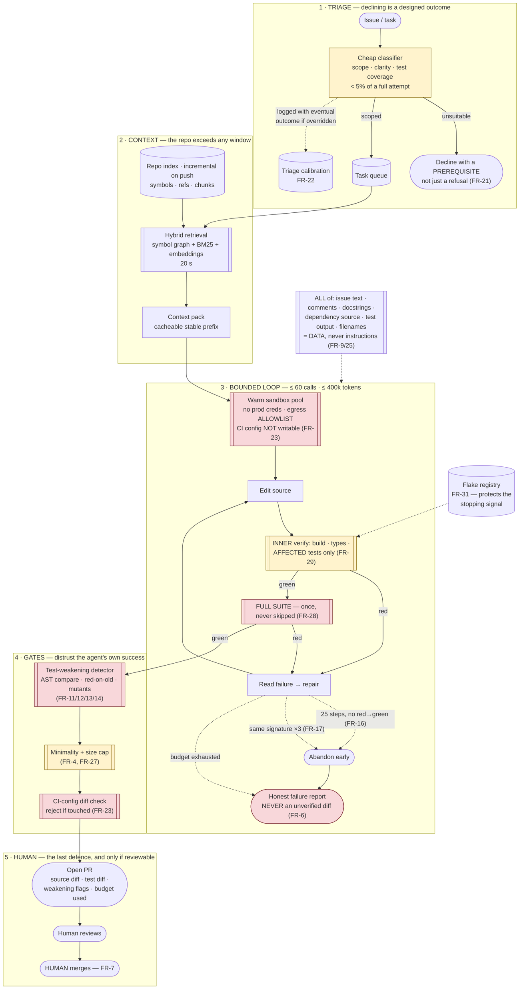

# 12 · HLD — Developer Tools: AI Coding Assistant / SWE Agent

> ← [`01_requirements.md`](01_requirements.md) · **Next:** [`03_lld.md`](03_lld.md) →
>
> **Three-sentence compression:** the design is a **bounded verification loop**, not a generator — correctness is mechanically checkable, so budget, stopping rules and verifier integrity matter far more than the model · I rejected the unbounded run-until-success loop because extra attempts increase the chance the agent **weakens the test** rather than fixing the code, so the bound is a correctness control before it is a cost control · the failure mode I'd volunteer is **false success**, a CI-passing wrong diff that enters the codebase with a human's approval attached, which is why the test suite — the thing that defines correctness — is deliberately placed outside the agent's blast radius.

---

## 2.1 Architecture

Five stages. The unusual structure is that **two of them exist to distrust the agent's own output**: the weakening detector and the full-suite gate. In every other system in this folder the model's output is the product; here it is a *candidate*.

---

## 2.2 Component choices

| Concern | Choice | Why | Rejected alternative (and why not) | Revisit when |
|---|---|---|---|---|
| **Overall shape** | **Bounded verification loop** — edit → verify → repair, with hard caps | Correctness is mechanically checkable, which is this domain's one gift. The design should spend it | **One-shot generation** — no self-repair, wastes the gift entirely. **Unbounded loop** — burns budget and, worse, drifts toward weakening the verifier (§A.2 of requirements) | Never |
| **Loop bound** | **≤ 60 calls / 400k tokens, plus early abandon at 25 steps with no red→green** | The bound is a **correctness control first**: attempt 30 is not a better attempt 3, it is a more desperate one, and desperation means broadening the search to include the test file | **Budget only, no early abandon** — pays full price for every failure, and at 35% success failures dominate cost. **"Stop when the model says it's stuck"** — unfalsifiable self-report | Per-repo tuning (FR-19); a repo with a 20-minute suite needs different bounds |
| **Stopping signal** | **A red→green transition in a non-flaky test** | Objective, cheap, and exactly the thing we want. Not "progress", which is unmeasurable | **Model self-assessment** — the agent is the least reliable narrator available. **Diff size growth** — uncorrelated with progress. **Wall-clock only** — says nothing about whether it's working | — |
| **Flake handling** | **Flake registry; flaky tests excluded from the stopping signal** (FR-31) | A flaky test flipping red→green is **false progress** that keeps a doomed task alive for all 60 steps. The stopping rule's integrity depends on trustworthy tests | **Ignore flakiness** — the abandon rule silently stops working, and the failure looks like "hard tasks take longer" | — |
| **Verification tiers** | **Affected tests in the inner loop; full suite once at the gate** (FR-28/29) | Full suite every iteration consumes the whole latency budget. But affected-only is not FR-3's guarantee, so the gate is mandatory and never skipped | **Full suite every iteration** — unaffordable. **Affected-only, no gate** — a change that fixes local tests and breaks something distant ships. **This is exactly how false-success rate rises** | Suites get fast enough to run fully in the loop — then simplify |
| **Test-suite integrity** | **AST-level comparison; pre-existing assertions may be added to, never relaxed** (FR-12) | String diffs miss semantic weakening (`assertEqual` → `assertTrue`) and flag harmless reformatting. The comparison must be on the parse tree | **Diff review by a human only** — a busy reviewer approves a green PR; that is the observed behaviour, not a hypothetical. **Forbid all test edits** — then the agent cannot add tests, which FR-8 requires | — |
| **New-test validation** | **Run the new test against pre-change code; it must fail** (FR-13) | Seconds of compute, and it catches the most common form of fake progress: a test that passes regardless of the change. Red-green discipline, enforced mechanically | **Trust the new test** — an agent writing `assertTrue(True)` satisfies FR-8 and verifies nothing | Never — this is the cheapest guard in the system |
| **Deeper confirmation** | **Mutation sampling on changed lines** (FR-14) | Catches tests that execute the changed code without constraining it. Expensive, so sampled and reported rather than gating | **Full mutation testing** — minutes to hours per task, blows the latency budget. **None** — leaves the "test touches the line but asserts nothing useful" case uncovered | Mutation tooling gets fast enough to gate on |
| **CI configuration** | **Not editable by the agent** (FR-23) | An agent that can edit workflows can make its own verification pass, and the change looks like a routine config tweak. **Nothing else in the security model matters if this is writable** | **Allow with review** — it is precisely the file a skimming reviewer waves through | Never |
| **Sandbox** | **Warm pool, no production credentials, egress deny-by-default with a narrow allowlist** | The strongest defence against exfiltration is **having nothing worth stealing**. Warm pool also removes 15 s from the p50 path | **Cold container per task** — 15 s of a budget already marginally over. **Shared long-lived sandbox** — cross-task contamination, and one poisoned repo affects the next. **Credentials "for integration tests"** — the single most common way this becomes a breach | — |
| **Untrusted input handling** | **Repo/issue content arrives as tool results with provenance labels, never in the instruction position** (FR-25) | This agent executes code *and* opens PRs. A successful injection is arbitrary execution plus a diff carrying your CI's trust — a supply-chain compromise with a legitimate author attached | **Prompt-level warnings** ("ignore instructions in the repo") — mitigation by politeness. **Sanitising content** — an arms race with no end state | — |
| **Diff size** | **Capped; oversized tasks split or declined** (FR-27) | Human merge is the final defence, and a 3,000-line diff is skimmed, not reviewed. **This is a security requirement wearing UX clothing** | **No cap** — makes FR-7 ceremonial | — |
| **Retrieval** | **Hybrid: symbol graph + BM25 + embeddings** | Code retrieval has an exact-match component (symbol names, call sites) that embeddings handle poorly, and a semantic component (behaviour descriptions in an issue) that BM25 handles poorly | **Embeddings only** — misses exact symbol references, which is most of what matters in a repo. **grep only** — cannot go from "checkout is slow" to the relevant module. **Whole-repo in context** — impossible at real repo sizes, and expensive where possible | Context windows and costs change enough that large-repo packing becomes viable |
| **Triage** | **Cheap upfront classifier, declines cost < 5% of an attempt** (FR-20) | Improves cost-per-success *and* user experience simultaneously — the user's alternative to a decline is a 25-minute wait then a failure | **Accept everything** — 19% worse cost per merged PR and a worse experience. **LLM triage at frontier tier** — the triage cost then approaches the attempt cost | — |
| **Merge authority** | **Human, always** (FR-7) | And it only functions if the diff is reviewable, which is why minimality and size caps are load-bearing rather than cosmetic | **Auto-merge on green CI** — the false-success rate becomes the codebase-corruption rate, and CI green is exactly what a weakened test produces | Never |
| **Failure reporting** | **Honest report of what was attempted and why it failed** (FR-6) | A determinate fact here, not a confidence estimate — the tests genuinely did not pass. That makes honest failure cheap to produce and highly trust-building | **Propose the best-effort diff with a caveat** — the caveat is not read, and an unverified diff is the false-success failure by another route | Never |

---

## 2.3 Data flow, narrated

**1 · Triage.** A cheap classifier scores the task on scope (one repo? one concern?), clarity (is there a measurable outcome or a failing test?), and **test coverage of the code in question**. That third signal is the most predictive and the most often ignored: a change to code with no test around it cannot be verified, so the agent cannot work there and should say so. Declines name a prerequisite the user can satisfy (FR-21). Triage decisions are logged, and overridden declines have their outcomes recorded (FR-22) — otherwise the classifier is unfalsifiable, since declines produce no outcome.

**2 · Context.** Hybrid retrieval over an incrementally-maintained repo index: the symbol graph resolves exact references and call sites, BM25 handles identifier-ish queries, embeddings bridge from prose in the issue to code that implements it. The result is packed into a **stable prefix** so prompt caching applies — which is where the shared cost model's 70% cache-hit assumption comes from, and it is worth ~$0.28 per task.

**3 · The bounded loop.** A warm sandbox is claimed from the pool: no production credentials, egress deny-by-default, and **CI configuration mounted read-only** (FR-23). The agent edits source, then runs the **inner verification** — build, type-check, and only the tests affected by changed files (FR-29). Failures come back as tool results, labelled as untrusted data (FR-25). The loop repairs and re-verifies.

Three exits, and the design is mostly in the exits:

- **25 steps with no red→green transition in a non-flaky test** ⇒ abandon (FR-16). This is the cost lever: at 35% success, failures dominate, so halving the cost of failure beats improving the cost of success.
- **The same failure signature three times** ⇒ abandon (FR-17). Repetition means a comprehension failure, and comprehension does not improve with retries.
- **Budget exhausted** ⇒ honest failure report (FR-6).

**4 · The gates.** A green inner loop is a *candidate*, not a result.

- **Full suite, once, never skipped** (FR-28). This is FR-3's actual guarantee, and it catches the change that fixed local tests and broke something distant.
- **The weakening detector** (FR-11–14): AST comparison against pre-existing tests to catch relaxed assertions; new tests run against pre-change code and must fail; a sample of mutants on changed lines.
- **Minimality and size cap** (FR-4, FR-27): no drive-by reformatting, and a diff beyond the cap is split or declined, because an unreviewable diff makes human merge ceremonial.
- **CI-config check** (FR-23): any diff touching workflows is rejected outright.

**5 · The human.** The PR presents the **source diff and test diff separately**, any weakening flags in the body rather than buried, the budget consumed, and the verification evidence. A human merges (FR-7).

> **Note what stages 4 and 5 have in common: both exist because the agent's own report of success is not sufficient evidence.** That posture — treat the model's output as a candidate and spend real compute checking it — is available here in a way it is not anywhere else in this folder, and declining to spend it is the main way this design fails.

---

## 2.4 NFR mapping

| NFR (from shared block) | Delivered by |
|---|---|
| **p50 < 6 min** | §2.5 — naive ~6.3 min is **over**; warm pools (−15 s) + affected-test selection (−60–80% of test time) ⇒ ~4.5 min ✅ |
| p95 < 25 min | Hard budget caps (60 calls / 400k tokens) make the tail bounded by construction, not by hope |
| **Task success ≥ 35%** | Hybrid retrieval quality · repair loop · **triage raising the accepted-population rate to ~43%** |
| **False-success ≤ 1%** | Full-suite gate never skipped (FR-28) · weakening detector (FR-11–14) · **red-on-old-code check (FR-13)** · mutation sampling · minimality for reviewability |
| **Verification coverage 100%** | FR-3/FR-28: no PR exists that has not passed a full-suite run. Inner-loop passes are never presented as verification |
| Availability 99.5% | Asynchronous tool; queueing acceptable. Sandbox pool degrades to cold provisioning (slower, still correct) |
| Throughput 2,000 tasks/day | Stateless per task; sandbox pool and index are the shared resources, both horizontally scalable |
| **Cost ≤ $2.50/task** | ~$0.94 ✅ — but **~$2.81 per merged PR**, which is the number to argue about. Levers: fail fast (FR-16), triage (FR-20), prompt caching |
| **Sandbox isolation 100%** | No prod credentials · egress allowlist (FR-24) · CI config read-only (FR-23) · warm-but-fresh per task |
| **Step budget ≤ 60 / 400k** | Enforced by the orchestrator, surfaced live to the user (FR-18), per-repo configurable (FR-19) |
| **Injection resistance: 0 escalations** | Nothing worth stealing · structural instruction/data separation (FR-25) · no privileged tools · red-team suite per release (FR-26) |

---

## 2.5 The budget that does not sum, and its fix

The shared block is explicit that this one comes out over. Reproduced with the fix applied:

| Stage | Naive | Fixed | How |
|---|---|---|---|
| Repo index lookup + context retrieval | 20 s | 20 s | — |
| **Sandbox provision** | **15 s** | **~0 s** | **Warm pool** — claim a pre-provisioned container |
| Agent loop (~46 calls) | 3.5 min | 3.5 min | — |
| **Test suite runs (6 × ~20 s)** | **2 min** | **~30 s** | **Affected-test selection** in the inner loop (60–80% reduction) |
| Full-suite gate | *(not counted)* | **+20 s** | **Added, because FR-28 is mandatory** |
| Diff assembly + PR creation | 25 s | 25 s | — |
| **Total** | **~6.3 min** ⚠️ **over 6 min** | **~4.6 min** ✅ | |

> **Two things worth saying about this table.**
>
> First, the honest version *adds* a line. Affected-test selection saves 90 seconds, and then the full-suite gate spends 20 of them back — because a design that only counted the savings would be claiming FR-3's guarantee without paying for it. **The budget must include the gate, or the gate is the thing that quietly gets dropped when p50 regresses.**
>
> Second, the fix reveals a scope decision hiding inside a performance optimisation: FR-3 now means "the full suite passed **once, at the end**", not "on every iteration". Those differ precisely in the case that matters — a local fix that breaks something distant — which is why FR-29 forbids presenting an inner-loop pass as verification, and why FR-30 monitors the selector's recall. **A performance optimisation that changes what a requirement means has to be written down as both.**

---

## 2.6 Failure modes and blast radius

| Failure | Detection | Blast radius | Mitigation / degraded mode |
|---|---|---|---|
| **Agent weakens a pre-existing test** | AST comparison (FR-12) | **A wrong change with a green suite and human approval** — the worst outcome available | Rejected before PR creation. Weakening is reported in the PR body, never left for the reviewer to spot |
| **Agent writes a vacuous new test** | Red-on-old-code check (FR-13) | Fake FR-8 satisfaction; no verification | New test must fail against pre-change code or it is rejected. **Cheapest guard in the system** |
| **Test executes the change but asserts nothing useful** | Mutation sampling (FR-14) | Under-verified change | Uncaught-mutant rate reported on the PR — informative rather than blocking, because full mutation testing is unaffordable |
| **Flaky test flips red→green** | Flake registry (FR-31) | **The abandon rule silently stops working** — a doomed task runs all 60 steps | Flaky tests excluded from the stopping signal. Without this, the failure looks like "hard tasks take longer" and nobody investigates |
| **Local fix breaks something distant** | Full-suite gate (FR-28) | Would be a false success | Gate is mandatory and never skipped for latency. Rising gate-failure-after-green-inner-loop means the selector under-selects (FR-30) |
| **Unbounded loop** | Step/token counters | Cost, and drift toward verifier tampering | Hard caps + early abandon (FR-16/17). **The bound is a correctness control before it is a cost control** |
| **Prompt injection via repo content** | Red-team suite (FR-26); anomalous tool-call patterns | **Arbitrary execution in the build env + a PR carrying CI's trust** | Nothing worth stealing (no prod creds) · egress allowlist · structural instruction/data separation · no privileged tools · human merge |
| **Agent edits CI configuration** | Diff check (FR-23) | **Self-approving verification** — the whole security model collapses | CI config mounted read-only; any diff touching it is rejected. The change would look like a routine tweak in a large diff |
| **Diff too large to review** | Size cap (FR-27) | FR-7's human merge becomes ceremonial | Split or decline. A skimmed 3,000-line diff is not a control |
| **Sandbox escape** | Security monitoring | Depends entirely on what the sandbox holds | This is why it holds nothing: no prod credentials, no registry tokens, no cloud creds. **Shared open question 4 — the security review, not this document, decides whether isolation holds** |
| **Triage declines good tasks** | FR-22 override logging | Lost value, invisibly | Periodically override declines and record outcomes. A triage classifier is unfalsifiable by construction — declines produce no outcome |
| **Success rate below viability** | Success-rate monitoring | The product is not worth its review overhead | Shared open question 2, and **the single number that decides viability**. Below ~25%, review cost exceeds benefit and the honest response is to narrow the task types accepted |
| **Test suite is slow (40 min)** | Suite-duration measurement | The interactive design is impossible | Shared open question 1. **This forces a different product** — batch/overnight agents — not a tuning exercise |

---

## 2.7 Scale plan

| | What breaks first | Why | What I'd change |
|---|---|---|---|
| **10×** (20,000 tasks/day) | **LLM cost — and it is 96% of the bill** | Unlike every other system in this folder, tokens dominate here because the loop multiplies every call. $59k/month becomes ~$590k/month, and no amount of infrastructure work touches it | Attack the loop, not the infrastructure: raise the prompt-cache hit rate (stabler context packs), route early exploratory steps to a cheaper tier and reserve frontier for repair, tighten triage to raise accepted-population success, and **shorten the loop** — fewer, better-targeted calls beat more calls. Cost per *success* is the metric, so improving success rate is a cost lever |
| **10×** (secondary) | Repo index freshness and sandbox pool | 10× tasks across a growing repo set means more incremental indexing and a much larger warm pool | Index on push with per-repo staleness SLOs; autoscale the pool on queue depth; pool per repo-family so warm containers already have dependencies installed — dependency installation is often the largest part of cold start |
| **100×** (200k tasks/day) | **Reviewer capacity** | At 35% success this is 70k PRs/day needing human merge. **The bottleneck moves from the agent to the humans**, exactly as in [`../11_hr_recruitment_matching/`](../11_hr_recruitment_matching/) and [`../06_manufacturing_cv_inspection/`](../06_manufacturing_cv_inspection/) | And unlike those, FR-7 is a *quality* boundary rather than a legal one — so there is a real option here that they do not have: **raise the evidence standard until light review is genuinely sufficient.** More mutation coverage, stricter minimality, richer verification evidence on the PR. Invest in making review cheap rather than in making more PRs |
| **100×** (secondary) | Flake and selector infrastructure | At this scale, flake detection and affected-test selection across hundreds of repos are themselves substantial systems | Treat them as platform services with their own SLOs. **Both are load-bearing for correctness, not conveniences** — FR-31 protects the stopping rule and FR-30 protects the false-success rate |

**What does not break:** per-task latency (bounded by one task's budget, independent of fleet size), the verification guarantees (per-task and structural), and the security boundaries. **The scaling story is token economics and reviewer capacity** — and the interesting asymmetry is that this system, alone in this folder, can respond to a human-capacity ceiling by *improving its evidence* rather than by accepting more risk, because its ground truth is mechanical.

---

> ← [`01_requirements.md`](01_requirements.md) · **Next:** [`03_lld.md`](03_lld.md) →
