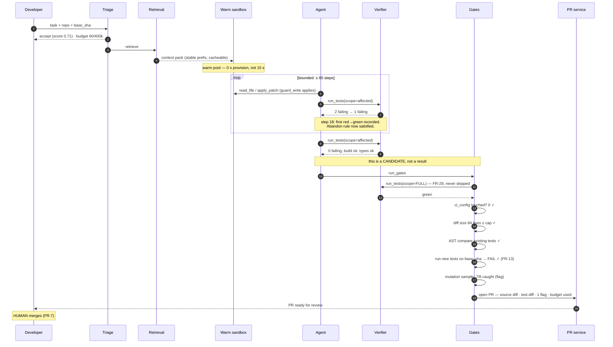
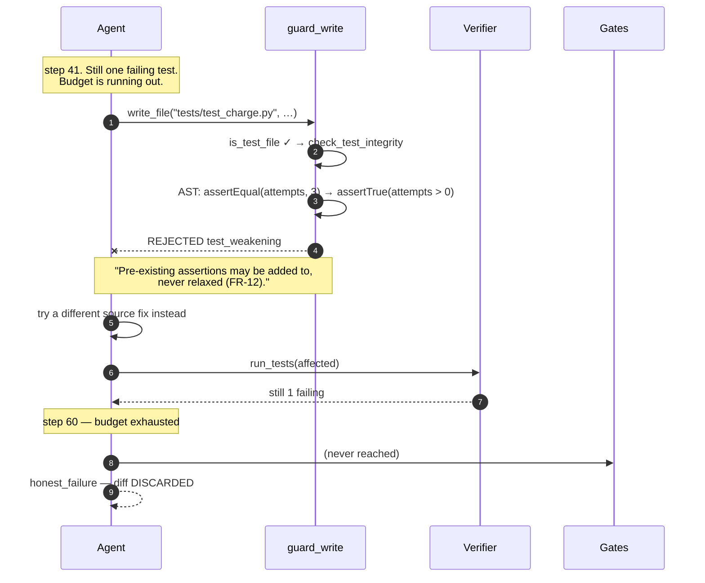
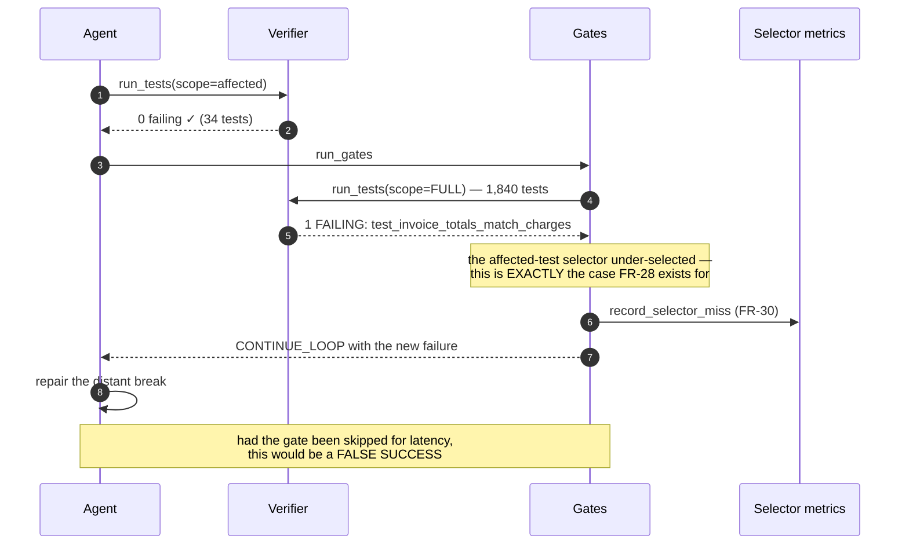

# 12 · LLD — Developer Tools: AI Coding Assistant / SWE Agent

> ← [`02_hld.md`](02_hld.md) · **Next:** [`04_production_and_interview.md`](04_production_and_interview.md) →
>
> The organising principle: **the agent's claim of success is a candidate, not a result.** Every schema and contract below either bounds the loop or checks the claim.

---

## 3.1 Data models

### Task and attempt — the budget is state, not a wrapper

```sql
CREATE TABLE task (
    task_id          UUID PRIMARY KEY,
    repo_id          TEXT        NOT NULL,
    base_sha         TEXT        NOT NULL,       -- pinned; the repo moves under us
    issue_ref        TEXT,
    task_text        TEXT        NOT NULL,       -- UNTRUSTED (FR-9/25)
    requested_by     TEXT        NOT NULL,
    created_at       TIMESTAMPTZ NOT NULL,

    -- triage (FR-20/21/22)
    triage_decision  TEXT        NOT NULL,       -- accept | decline
    triage_score     REAL        NOT NULL,
    triage_reason    TEXT,                       -- required when declining
    triage_prereq    TEXT,                       -- the actionable next step (FR-21)
    triage_overridden BOOLEAN    NOT NULL DEFAULT FALSE,

    state            TEXT        NOT NULL,       -- see §3.5
    terminal_at      TIMESTAMPTZ,
    outcome          TEXT,                       -- pr_opened|abandoned|failed|declined

    CHECK (triage_decision <> 'decline' OR triage_reason IS NOT NULL)
);

CREATE TABLE attempt (
    attempt_id       UUID PRIMARY KEY,
    task_id          UUID        NOT NULL REFERENCES task,

    -- THE BUDGET, as live state (FR-18)
    steps_used       SMALLINT    NOT NULL DEFAULT 0,
    steps_cap        SMALLINT    NOT NULL,        -- per-repo configurable (FR-19)
    tokens_used      INTEGER     NOT NULL DEFAULT 0,
    tokens_cap       INTEGER     NOT NULL,

    -- THE STOPPING SIGNAL (FR-16) — this is why it lives in the schema
    first_red_to_green_at_step SMALLINT,          -- NULL = no progress yet
    abandon_step     SMALLINT    NOT NULL,        -- default 25
    last_failure_sig TEXT,
    failure_sig_repeats SMALLINT NOT NULL DEFAULT 0,

    sandbox_id       TEXT,
    started_at       TIMESTAMPTZ NOT NULL,
    ended_at         TIMESTAMPTZ,
    end_reason       TEXT,   -- green|abandoned_no_progress|abandoned_repeat|budget|error

    CHECK (steps_used  <= steps_cap),
    CHECK (tokens_used <= tokens_cap)
);
```

> **`first_red_to_green_at_step` is the most important column in this design.** It makes FR-16's abandon rule a queryable fact rather than a heuristic living in the orchestrator's memory:
>
> ```sql
> -- abandon condition, expressed exactly
> steps_used >= abandon_step AND first_red_to_green_at_step IS NULL
> ```
>
> That it survives an orchestrator restart matters: a crash-and-resume must not reset the progress clock, or a doomed task gets a fresh 25 steps every time the orchestrator redeploys. Putting the budget and the progress signal in the same durable row is what makes the bound real.
>
> The `CHECK` constraints make an over-budget attempt unstorable, which turns "we enforce the cap" from a code claim into a schema guarantee.

### Verification run — inner vs gate, distinguished in the data

```sql
CREATE TABLE verification (
    verification_id  UUID PRIMARY KEY,
    attempt_id       UUID        NOT NULL REFERENCES attempt,
    step             SMALLINT    NOT NULL,

    -- THE distinction that FR-28/29 depend on
    tier             TEXT        NOT NULL,        -- inner | gate
    scope            TEXT        NOT NULL,        -- affected | full

    build_ok         BOOLEAN     NOT NULL,
    typecheck_ok     BOOLEAN     NOT NULL,
    tests_run        SMALLINT    NOT NULL,
    tests_passed     SMALLINT    NOT NULL,
    tests_failed     SMALLINT    NOT NULL,
    tests_skipped    SMALLINT    NOT NULL,

    -- which specific tests, so red→green is computable
    failing_test_ids TEXT[]      NOT NULL,
    duration_ms      INTEGER     NOT NULL,

    -- an inner pass is NEVER verification (FR-29)
    CHECK (tier <> 'gate' OR scope = 'full'),
    CHECK (tier <> 'inner' OR scope = 'affected')
);
```

> **`CHECK (tier <> 'gate' OR scope = 'full')` encodes FR-28 as an impossibility.** There is no way to record a gate verification that ran only affected tests — which is exactly the shortcut that would be taken the first time p50 regresses and someone needs 20 seconds back. The requirement is defended by the schema, not by a comment.
>
> Storing `failing_test_ids` rather than a count is what makes the red→green transition computable: progress is `set(previous_failing) - set(current_failing)` being non-empty *after* removing flaky tests, and you cannot compute that from counts alone.

### Diff — source and test, separated at the data layer

```sql
CREATE TABLE proposed_diff (
    diff_id          UUID PRIMARY KEY,
    attempt_id       UUID        NOT NULL REFERENCES attempt,

    -- FR-11: separated, because they are reviewed differently
    source_files     SMALLINT    NOT NULL,
    source_lines_add SMALLINT    NOT NULL,
    source_lines_del SMALLINT    NOT NULL,
    test_files       SMALLINT    NOT NULL,
    test_lines_add   SMALLINT    NOT NULL,
    test_lines_del   SMALLINT    NOT NULL,

    total_lines      SMALLINT    NOT NULL,
    size_cap         SMALLINT    NOT NULL,        -- FR-27

    -- FR-23: must be zero, always
    ci_config_files_touched SMALLINT NOT NULL DEFAULT 0,

    -- FR-4: minimality
    unrelated_reformat_lines SMALLINT NOT NULL DEFAULT 0,

    CHECK (ci_config_files_touched = 0),          -- FR-23, unrepresentable otherwise
    CHECK (total_lines <= size_cap)               -- FR-27
);

CREATE TABLE test_integrity_finding (
    diff_id          UUID     NOT NULL REFERENCES proposed_diff,
    finding_id       UUID     NOT NULL,

    kind             TEXT     NOT NULL,
    -- assertion_relaxed | test_deleted | test_skipped | exception_broadened
    -- | tolerance_widened | fixture_changed | subject_mocked
    -- | new_test_passes_on_old_code | uncaught_mutants

    test_file        TEXT     NOT NULL,
    test_id          TEXT,
    before_snippet   TEXT,
    after_snippet    TEXT,
    severity         TEXT     NOT NULL,           -- blocking | flag
    justification    TEXT,                        -- FR-15: required for flags

    PRIMARY KEY (diff_id, finding_id)
);
```

> **`CHECK (ci_config_files_touched = 0)` is the single highest-leverage constraint in the file.** An agent that can edit `.github/workflows/` can make its own verification pass, and that diff looks like a routine config tweak. Making the row unstorable means the PR cannot be created — and someone would have to delete a database constraint in a reviewed migration to change that.
>
> The `kind` enum is the catalogue from the requirements' §A.2 table, encoded. Enumerating the known shortcuts is what lets the detector be specific: `subject_mocked` is the most insidious because it looks like idiomatic testing, and it is only catchable if you are looking for it by name.

### Flake registry — load-bearing for the stopping rule

```sql
CREATE TABLE flaky_test (
    repo_id          TEXT     NOT NULL,
    test_id          TEXT     NOT NULL,
    observed_flips   SMALLINT NOT NULL,           -- red↔green with no code change
    window_runs      SMALLINT NOT NULL,
    flake_rate       REAL     NOT NULL,
    quarantined      BOOLEAN  NOT NULL DEFAULT FALSE,
    first_seen       TIMESTAMPTZ NOT NULL,
    last_seen        TIMESTAMPTZ NOT NULL,
    PRIMARY KEY (repo_id, test_id)
);
```

**Why this is not hygiene here.** FR-16 abandons when no test moves red→green. A flaky test that happens to flip **creates false progress** and keeps a doomed attempt alive for all 60 steps. So the stopping rule reads:

```
progress = (previously_failing − currently_failing) − quarantined_flaky
```

Without the flake registry the abandon rule degrades silently, and the symptom — "hard tasks take longer" — is indistinguishable from normal behaviour. **A correctness control whose failure mode looks like normal operation is one you must monitor deliberately** (see §4.2's dashboards).

---

## 3.2 Tool contracts

### The tool surface, and what it deliberately lacks

The agent's capability is exactly its tool list, so the list is a security document.

```
read_file(path, start_line?, end_line?)         → content            [read]
search_repo(query, kind)                        → matches            [read]
list_symbol_refs(symbol)                        → call sites         [read]
write_file(path, content)                       → ok | rejected      [write, GUARDED]
apply_patch(unified_diff)                       → ok | rejected      [write, GUARDED]
run_build()                                     → build result
run_typecheck()                                  → typecheck result
run_tests(scope: affected | full, test_ids?)     → test result
run_tests_on_base(test_ids)                      → test result       [FR-13]
report_failure(summary, attempted, reason)       → terminal          [FR-6]

✗ NO  run_shell(cmd)                — arbitrary execution is the whole attack surface
✗ NO  network_fetch(url)            — egress allowlist is enforced below the agent
✗ NO  git_push / open_pr            — the orchestrator does this, after the gates
✗ NO  merge_pr                      — FR-7
✗ NO  read_secret / get_credential  — nothing worth stealing
✗ NO  write to CI config paths       — FR-23, enforced in the guard
```

> **`run_tests_on_base` exists solely to serve FR-13**, and it is worth having as a first-class tool rather than a trick: check out the pinned `base_sha` in a second worktree, run the newly-authored tests there, and require failure. A new test that passes against unchanged code does not test the change. Seconds of compute, catches the most common form of fake progress.
>
> **The absence of `run_shell` is the most consequential line here.** Every convenience argument for it — "just let it run the linter" — reintroduces arbitrary execution, which is the entire attack surface from requirements §D. Named, purpose-built tools are more work and they are the boundary.

### The write guard

Every write passes through one function, so the checks cannot be bypassed by a call site:

```python
CI_CONFIG_PATTERNS = [
    ".github/workflows/**", ".gitlab-ci.yml", "Jenkinsfile",
    ".pre-commit-config.yaml", "azure-pipelines.yml", ".circleci/**",
    "tox.ini", "noxfile.py",             # can redefine what "tests" means
]

def guard_write(path: str, content: str, attempt: Attempt) -> WriteResult:
    if matches_any(path, CI_CONFIG_PATTERNS):
        return WriteResult.rejected(
            "ci_config_immutable",
            "CI configuration is not editable by this agent (FR-23). "
            "If the build configuration is wrong, that is a task for a human.")

    if is_test_file(path):
        finding = check_test_integrity(path, content, attempt.base_sha)
        if finding and finding.severity == "blocking":
            return WriteResult.rejected("test_weakening", finding.explain())
        if finding:
            attempt.record_finding(finding)          # flagged on the PR (FR-15)

    if path_outside_repo(path) or is_symlink_escape(path):
        return WriteResult.rejected("path_escape", "Writes are confined to the repo.")

    return WriteResult.ok()
```

Note that `tox.ini` and `noxfile.py` are in the CI list. They are not obviously CI configuration, and they **redefine what "run the tests" means** — which puts them squarely inside the verifier's blast radius. The pattern list is a judgement call that needs revisiting per ecosystem, and getting it wrong is silent.

### Task submission and the decline

```http
POST /v1/tasks
{ "repo_id": "acme/billing", "base_sha": "a3f9c1d",
  "issue_ref": "acme/billing#4821",
  "task_text": "Add a retry with exponential backoff to PaymentGateway.charge()" }
```

```json
202 Accepted
{ "task_id": "t_88f1…", "state": "queued",
  "triage": { "decision": "accept", "score": 0.71,
              "signals": { "single_repo": true, "has_failing_test": false,
                           "test_coverage_of_target": 0.83, "scope_clarity": 0.68 } },
  "budget": { "steps_cap": 60, "tokens_cap": 400000 } }
```

The decline, which is the more interesting response:

```json
202 Accepted
{ "task_id": "t_9012…", "state": "declined",
  "triage": {
    "decision": "decline", "score": 0.19,
    "signals": { "single_repo": false, "test_coverage_of_target": 0.0 },
    "reason": "This issue describes a behaviour change spanning 3 repositories (billing, invoicing, notify), and PaymentRetry has no test coverage.",
    "prerequisite": "Two things would make this workable: (1) split into per-repo issues, starting with billing; (2) add a characterisation test around PaymentRetry.charge() so a change can be verified. I can attempt the billing portion once a test exists.",
    "override_url": "/v1/tasks/t_9012…/override"
  } }
```

> **The decline names two specific prerequisites and offers to proceed once they are met.** That is what makes a refusal usable (FR-21): the user's alternative was a 25-minute wait ending in failure. And `test_coverage_of_target: 0.0` is the honest core of it — code with no test around it cannot be verified, so this agent cannot work there, and saying so is more useful than a confident unverifiable diff.
>
> `override_url` exists for FR-22. A triage classifier is unfalsifiable by construction — declines produce no outcome — so occasionally overriding one and recording what happened is the only calibration signal available.

### Live budget, and the honest failure

```json
GET /v1/tasks/t_88f1…
{
  "state": "in_loop",
  "budget": { "steps_used": 31, "steps_cap": 60,
              "tokens_used": 214300, "tokens_cap": 400000 },
  "progress": { "first_red_to_green_at_step": 18,
                "tests_now_failing": 1, "tests_fixed": 2 },
  "last_verification": { "tier": "inner", "scope": "affected",
                         "tests_run": 34, "tests_failed": 1,
                         "failing": ["test_charge_retries_on_timeout"] }
}
```

```json
/* budget exhausted — FR-6 */
{
  "state": "failed", "outcome": "budget_exhausted",
  "report": {
    "attempted": [
      "Added exponential backoff in PaymentGateway.charge() (3 variants)",
      "Fixed 2 of 3 failing tests",
      "Could not satisfy test_charge_gives_up_after_max_attempts"
    ],
    "blocker": "The test expects PaymentExhausted, but the surrounding code path catches all exceptions in GatewayMiddleware.dispatch() and re-raises GatewayError. Changing that would alter behaviour well beyond this task's scope.",
    "suggestion": "The interaction between PaymentGateway retries and GatewayMiddleware error wrapping probably needs a human decision about which exception should surface.",
    "diff_discarded": true,
    "budget": { "steps_used": 60, "tokens_used": 391200 }
  }
}
```

> **`diff_discarded: true` is the line that matters.** The temptation is to attach the best-effort diff with a caveat. The caveat is not read, and an unverified diff *is* the false-success failure by a different route. FR-6 means the report is the deliverable when verification fails.
>
> Note the report is genuinely useful — it names the specific test, the specific code interaction, and the reason the fix exceeded scope. **Honest failure is cheap to produce here** (the tests genuinely did not pass, it is a determinate fact) and it is the main thing that makes the tool trustworthy rather than annoying.

---

## 3.3 Core algorithms

### The loop, with all three exits

```python
def run_attempt(task: Task, attempt: Attempt, sbx: Sandbox) -> AttemptResult:
    prev_failing: set[str] = set()

    while True:
        # ---- budget exits (FR-18: counters are durable, survive restart) ----
        if attempt.steps_used >= attempt.steps_cap or \
           attempt.tokens_used >= attempt.tokens_cap:
            return honest_failure(attempt, "budget_exhausted")

        # ---- FR-16: no red→green by abandon_step ⇒ stop ----
        if attempt.steps_used >= attempt.abandon_step and \
           attempt.first_red_to_green_at_step is None:
            return honest_failure(attempt, "abandoned_no_progress")

        # ---- FR-17: same failure three times ⇒ comprehension failure ----
        if attempt.failure_sig_repeats >= 3:
            return honest_failure(attempt, "abandoned_repeat_failure")

        action = agent.next_action(attempt.context)      # counted, capped
        attempt.step(action)

        if action.kind == "report_failure":
            return honest_failure(attempt, "agent_reported")

        result = execute_guarded(action, sbx)            # guard_write applies here
        attempt.context.append(as_untrusted(result))     # FR-25: labelled as DATA

        if action.kind != "run_tests":
            continue

        v = record_verification(attempt, tier="inner", scope="affected", result=result)
        now_failing = set(v.failing_test_ids)

        # ---- progress, with flakes removed (FR-31) ----
        fixed = (prev_failing - now_failing) - quarantined_flaky(task.repo_id)
        if fixed and attempt.first_red_to_green_at_step is None:
            attempt.first_red_to_green_at_step = attempt.steps_used

        sig = failure_signature(v)
        attempt.failure_sig_repeats = (
            attempt.failure_sig_repeats + 1 if sig == attempt.last_failure_sig else 0)
        attempt.last_failure_sig = sig
        prev_failing = now_failing

        if not now_failing and v.build_ok and v.typecheck_ok:
            return run_gates(task, attempt, sbx)          # candidate, not result
```

Three points where this differs from the obvious implementation:

| Point | Why |
|---|---|
| **Budget counters are durable, read from the row** | An orchestrator restart must not hand a doomed task a fresh 25 steps |
| **`fixed` subtracts quarantined flaky tests** | Otherwise a flake flip is false progress and the abandon rule silently stops working |
| **A green inner loop calls `run_gates`, not `success`** | The agent's success is a candidate. This one line is the design's whole posture |

```python
def failure_signature(v: Verification) -> str:
    """Normalised so cosmetic differences don't reset the repeat counter."""
    return hashlib.sha256("|".join(sorted(
        f"{t.test_id}:{t.assertion_kind}:{t.file}:{t.line}"
        for t in v.failures                     # NOT the message — messages vary
    )).encode()).hexdigest()[:16]
```

**Excluding the message text is deliberate.** Assertion messages often embed values that change between attempts (`expected 3, got 7` then `expected 3, got 5`), which would reset the repeat counter on every iteration and disable FR-17 entirely — while the agent is in fact stuck on the same misunderstanding.

### The gates

```python
def run_gates(task, attempt, sbx) -> AttemptResult:
    # ---- FR-28: FULL suite, once, never skipped ----
    full = run_tests(sbx, scope="full")
    v = record_verification(attempt, tier="gate", scope="full", result=full)
    if v.failing_test_ids:
        # a distant break — back to the loop, and count it for FR-30
        record_selector_miss(task.repo_id, v.failing_test_ids)
        return CONTINUE_LOOP

    diff = assemble_diff(sbx, task.base_sha)

    # ---- FR-23 ----
    if diff.ci_config_files_touched:
        return reject(attempt, "ci_config_touched")

    # ---- FR-27: reviewability is a security property ----
    if diff.total_lines > diff.size_cap:
        return reject(attempt, "diff_too_large",
                      suggestion="split the task")

    # ---- FR-11/12/13/14 ----
    findings = []
    findings += compare_existing_tests_ast(diff, task.base_sha)   # FR-12
    findings += validate_new_tests_fail_on_base(diff, sbx, task)  # FR-13
    findings += sample_mutants(diff, sbx)                          # FR-14

    if any(f.severity == "blocking" for f in findings):
        return reject(attempt, "test_integrity", findings=findings)

    # ---- FR-4 ----
    if diff.unrelated_reformat_lines > REFORMAT_TOLERANCE:
        return reject(attempt, "not_minimal")

    return open_pr(task, attempt, diff, findings)   # flags in the BODY (FR-15)
```

### Test-integrity checking — AST, not strings

```python
WEAKENINGS = {
    # (before_kind, after_kind) → finding kind
    ("assertEqual",   "assertTrue"):      "assertion_relaxed",
    ("assertEqual",   "assertIsNotNone"): "assertion_relaxed",
    ("assertRaises",  "assertRaises"):    None,      # check the exception type
}

def compare_existing_tests_ast(diff, base_sha) -> list[Finding]:
    """FR-12: pre-existing assertions may be ADDED to, never relaxed or removed.
    AST-level, because a string diff misses semantic weakening and flags
    harmless reformatting."""
    findings = []
    for f in diff.test_files_changed:
        before = parse_ast(read_at_sha(f.path, base_sha))
        after  = parse_ast(f.new_content)

        for test_id, old in tests_in(before).items():
            new = tests_in(after).get(test_id)

            if new is None:
                findings.append(Finding("test_deleted", f.path, test_id,
                                        severity="blocking"))
                continue
            if has_skip_marker(new) and not has_skip_marker(old):
                findings.append(Finding("test_skipped", f.path, test_id,
                                        severity="blocking"))
                continue

            old_a, new_a = assertions_in(old), assertions_in(new)
            if len(new_a) < len(old_a):
                findings.append(Finding("assertion_relaxed", f.path, test_id,
                                        severity="blocking"))
                continue

            for oa, na in zip(old_a, new_a):
                if is_weaker(oa, na):                    # WEAKENINGS + heuristics
                    findings.append(Finding("assertion_relaxed", f.path, test_id,
                                            before_snippet=unparse(oa),
                                            after_snippet=unparse(na),
                                            severity="blocking"))
                if broadens_exception(oa, na):           # ValueError → Exception
                    findings.append(Finding("exception_broadened", f.path, test_id,
                                            severity="blocking"))
                if widens_tolerance(oa, na):             # places=7 → places=2
                    findings.append(Finding("tolerance_widened", f.path, test_id,
                                            severity="blocking"))

            if mocks_subject_under_test(new, diff.source_files_changed):
                findings.append(Finding("subject_mocked", f.path, test_id,
                                        severity="flag"))     # needs judgement
    return findings
```

```python
def validate_new_tests_fail_on_base(diff, sbx, task) -> list[Finding]:
    """FR-13: the cheapest and highest-value guard in the system.
    A new test that passes against unchanged code does not test the change."""
    new_ids = newly_added_test_ids(diff)
    if not new_ids:
        return []

    base = sbx.worktree_at(task.base_sha)            # second worktree, pinned
    r = run_tests(base, scope="ids", test_ids=new_ids)

    return [Finding("new_test_passes_on_old_code", test_id=tid, severity="blocking",
                    explain=f"{tid} passes against {task.base_sha[:7]} — "
                            f"it does not exercise this change")
            for tid in new_ids if tid in r.passed]
```

> **`mocks_subject_under_test` is `flag`, not `blocking`, and that asymmetry is deliberate.** Mocking a collaborator is normal, correct, idiomatic testing; mocking the *thing you changed* is a test that asserts a mock returns what the mock was told to return. The two are hard to distinguish automatically without false positives that would make the tool infuriating. So it is surfaced to the human with the specific mock named, rather than blocking a legitimate PR.
>
> Everything with an unambiguous signature — deleted, skipped, fewer assertions, broadened exception, widened tolerance, passes-on-old-code — blocks. **Block what you can characterise exactly; flag what needs judgement.** A detector that blocks on judgement calls gets disabled within a month.

### Hybrid retrieval

```python
def retrieve_context(task: Task, budget_tokens: int) -> ContextPack:
    q = task.task_text                               # untrusted, used as a QUERY only

    # 1. exact: symbols named in the task, and their call sites
    symbols = extract_identifiers(q)
    exact = [ref for s in symbols for ref in symbol_graph.refs(s, task.repo_id)]

    # 2. lexical: identifier-ish phrases BM25 handles better than embeddings
    lexical = bm25.search(q, repo=task.repo_id, k=40)

    # 3. semantic: bridges prose ("checkout is slow") to implementing code
    semantic = vector_index.search(embed(q), repo=task.repo_id, k=40)

    ranked = reciprocal_rank_fusion([exact, lexical, semantic])

    # 4. expand along the symbol graph — the neighbours are usually the point
    expanded = expand_neighbours(ranked, depth=1)

    # 5. pack a STABLE PREFIX so prompt caching applies (~70% hit, ~$0.28/task)
    return pack(expanded, budget_tokens, order="stable_by_path")
```

`order="stable_by_path"` is the detail that earns the cache hit: a context pack ordered by relevance score reshuffles between steps as scores change, invalidating the cached prefix. Ordering deterministically by path keeps the prefix byte-identical across iterations, which is where the shared cost model's 70% assumption comes from.

---

## 3.4 Sequence diagrams

### Happy path — accepted, repaired, gated, PR opened



### The weakening caught



> **Rejecting at the write, not at the gate, is the right placement.** Caught at the gate, the agent has already spent steps building a diff around a weakened test and has no budget left to recover. Caught at the write, it gets an immediate, specific error and can spend its remaining steps on the actual problem. **Feedback at the point of the mistake is worth more than a verdict at the end** — the same reason the inner loop exists at all.

### Distant break caught only by the gate



---

## 3.5 State machines

### Task

```
   submitted
       │
       ▼
  ┌─────────┐  unsuitable   ┌──────────┐
  │ TRIAGE  ├──────────────►│ DECLINED │ terminal (with prerequisite, FR-21)
  └────┬────┘               └────┬─────┘
       │ accepted                │ override (FR-22)
       ▼                         │
  ┌─────────┐◄──────────────────┘
  │ QUEUED  │
  └────┬────┘
       ▼
  ┌──────────┐
  │ IN_LOOP  │
  └────┬─────┘
   ┌───┴──────┬──────────────┬───────────────┐
   │ inner    │ abandon      │ budget        │ agent reports
   │ green    │ (FR-16/17)   │ exhausted     │ failure
   ▼          ▼              ▼               ▼
┌───────┐   ┌──────────────────────────────────────┐
│ GATES │   │ FAILED — honest report, diff DISCARDED│ terminal
└───┬───┘   └──────────────────────────────────────┘
    │
 ┌──┴───────────┬──────────────────┐
 │ all pass     │ full suite red   │ gate rejection
 ▼              ▼                  ▼
┌────────────┐  back to IN_LOOP   ┌──────────┐
│ PR_OPENED  │                    │ REJECTED │ terminal
└─────┬──────┘                    └──────────┘
      │ HUMAN (FR-7)               (ci_config · size · test_integrity · not_minimal)
      ▼
┌──────────┐
│ MERGED   │  ← no automatic transition into this state exists
└──────────┘
```

**Three invariants:**

- **There is no edge from `IN_LOOP` or `FAILED` to `PR_OPENED`.** Every PR passes through `GATES`, so FR-3 and FR-28 hold structurally.
- **`FAILED` discards the diff.** No path attaches an unverified diff to a report (FR-6).
- **`MERGED` has no automatic entry.** FR-7, and there is no tool that could produce one.

### Attempt budget

```
  steps_used = 0, first_red_to_green = NULL
        │
        ├──── test moves red→green ────► first_red_to_green = steps_used
        │                                (abandon rule satisfied for good)
        │
        ├──── steps_used = abandon_step (25) AND first_red_to_green IS NULL
        │           └──► ABANDON  (FR-16 — ~50% of failed-task cost saved)
        │
        ├──── failure_sig_repeats = 3
        │           └──► ABANDON  (FR-17 — comprehension, not effort)
        │
        └──── steps_used = steps_cap OR tokens_used = tokens_cap
                    └──► BUDGET EXHAUSTED (FR-6)
```

---

## 3.6 Edge cases and correctness

| # | Edge case | Handling | Why this way |
|---|---|---|---|
| 1 | **Repo moves during the task** | `base_sha` is pinned; the PR targets it; a rebase conflict is reported, not auto-resolved | Auto-rebasing changes code the agent never verified against |
| 2 | **Agent edits `tox.ini` to narrow the test set** | In `CI_CONFIG_PATTERNS`; rejected | Not obviously CI config, and it **redefines what "the tests" means** — inside the verifier's blast radius |
| 3 | **Flaky test flips red→green** | Quarantined flakes excluded from the progress signal (FR-31) | Otherwise false progress keeps a doomed attempt alive for all 60 steps, and the symptom looks like normal behaviour |
| 4 | **Flaky test fails the full-suite gate** | Retried once; if it flips, quarantined and the gate re-evaluated | A flake must not block a correct PR, but a silent retry-until-green would defeat the gate. One retry, recorded |
| 5 | **New test passes on base code** | Blocking finding (FR-13) | The most common form of fake progress |
| 6 | **Agent mocks the function it changed** | `flag`, not blocking, with the mock named | Mocking collaborators is idiomatic; mocking the subject is vacuous. Automated separation would produce infuriating false positives |
| 7 | **Task text contains instructions to the agent** | Enters as a query and as untrusted context, never in the instruction position (FR-25) | The primary injection vector, and mitigation-by-politeness does not work |
| 8 | **Dependency source contains a prompt payload** | Same treatment; and the agent has no `run_shell`, no credentials, no egress | Defence is having nothing worth stealing, not detecting payloads |
| 9 | **Symlink pointing outside the repo** | `guard_write` rejects path escapes | Otherwise a write escapes the sandbox filesystem boundary |
| 10 | **Diff is 2,400 lines** | Rejected over the cap; suggests splitting (FR-27) | Human merge is the last defence and a skimmed diff is not a control. **A security requirement wearing UX clothing** |
| 11 | **Build succeeds, type-check fails** | Treated as a failure; loop continues | The type-checker is part of FR-3's guarantee, not advisory |
| 12 | **Test suite takes 40 minutes** | Per-repo config declines interactive tasks for that repo | Shared open question 1. **This is a different product** (batch/overnight), not a tuning exercise |
| 13 | **Zero tests affected by the change** | Inner loop cannot verify → escalate to the full suite immediately | An affected set of zero means the selector found nothing, which is a selector failure, not a green light |
| 14 | **Orchestrator restarts mid-attempt** | Budget and `first_red_to_green_at_step` are durable; resumed, not reset | Otherwise a doomed task gets a fresh 25 steps every redeploy |
| 15 | **Agent calls `report_failure` at step 3** | Accepted as terminal, honest report | Early honest failure is the cheapest good outcome available and should never be discouraged |
| 16 | **Two tasks on the same repo concurrently** | Separate sandboxes, separate worktrees, both pinned to their own `base_sha` | Shared worktrees cross-contaminate diffs |
| 17 | **Mutation sampling times out** | Reported as `mutation_inconclusive`, non-blocking | An unaffordable check must degrade to informative, or it gets removed entirely |

---

> ← [`02_hld.md`](02_hld.md) · **Next:** [`04_production_and_interview.md`](04_production_and_interview.md) →
