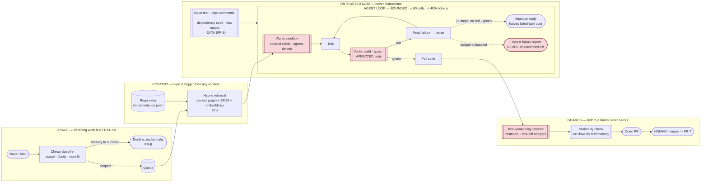

# 12 — Developer Tools: AI Coding Assistant / SWE Agent

> **Archetype C · Transactional agent**, with a property no other system in this folder has: **correctness is mechanically verifiable.** Tests pass or they don't. Complements [`../../23_ai-coding-agents-and-code-eval/`](../../23_ai-coding-agents-and-code-eval/README.md), which covers the landscape and evaluation methodology as a tutorial — this is the system design.

---

## The three-sentence compression

1. **The choice that matters most:** the design is a **verification loop**, not a generator. Because the agent can run the tests and the type-checker, the quality of the system is almost entirely the quality of that loop — its budget, its stopping rules, its honesty — and the model is very nearly incidental. FR-3 is absolute: no PR is proposed unless build, type-check and tests pass.
2. **The alternative I rejected:** letting the agent run until it succeeds. Unbounded loops are a real, expensive production failure, and worse, an agent with unlimited attempts eventually finds the cheapest way to make the suite green — **which is to weaken the test**. So the loop has a hard 60-call / 400k-token cap, an **early-abandon rule at 25 steps if no test has moved red→green**, and a test-weakening detector.
3. **The failure mode I'd volunteer:** **false success — a confidently wrong, CI-passing diff.** An agent that fails visibly is merely unhelpful; one that produces a plausible wrong diff transfers its error into the codebase *with a human's approval attached*. Hence the ≤ 1% target, and hence declining work is a first-class feature.

---

## Architecture at a glance

---

## Key numbers

| | |
|---|---|
| Task wall-clock | p50 < 6 min · p95 < 25 min |
| **Naive p50** | **~6.3 min — marginally OVER.** Fixed by warm pools + affected-test selection ⇒ ~4.5 min |
| **Task success rate** | ≥ **35%** of scoped tasks produce a mergeable PR |
| **False-success rate** | ≤ **1%** — the most damaging failure available |
| Verification coverage | **100%** of proposed PRs pass build + tests (FR-3, absolute) |
| **Step budget** | ≤ **60 tool calls**, ≤ **400k tokens** — unbounded loops are a real production failure |
| Early abandon | **25 steps with no test moving red→green** ⇒ stop. Cuts failed-task cost ~50% |
| Cost per task | **~$0.94** ✅ inside the $2.50 ceiling |
| **Cost per *merged PR*** | **~$2.81** — every success carries ~1.9 failed attempts |
| **LLM share of cost** | **96%** — the opposite of every other system in this folder |
| Throughput | 2,000 tasks/day · 60k/month · ~$59k/month |

---

## Files

| File | Contents |
|---|---|
| [`01_requirements.md`](01_requirements.md) | Verifiability as the design axis · why the loop must be bounded · the test-weakening problem · cost-per-success · untrusted-data boundary |
| [`02_hld.md`](02_hld.md) | Architecture, component choices with rejected alternatives, data flow, NFR mapping, the budget that doesn't sum and its fix, failure modes, scale plan |
| [`03_lld.md`](03_lld.md) | Schemas, tool contracts, retrieval and loop algorithms, the weakening detector, sequence diagrams, state machines, edge cases |
| [`04_production_and_interview.md`](04_production_and_interview.md) | AI-specific concerns, runbook, common mistakes, interview follow-ups, glossary |

**Shared requirements block:** [`../00_requirements_all_systems.md#12-developer-tools--ai-coding-assistant--swe-agent`](../00_requirements_all_systems.md#12-developer-tools--ai-coding-assistant--swe-agent)

---

## The three findings to leave with

1. **Verifiability changes the whole design.** This is the only system here whose output can be mechanically checked, so the architecture is a verification loop and the model is nearly incidental. Every other system in this folder must instead *infer* whether it was right.
2. **Cost per attempt is not cost per success.** $0.94/task at 35% success is $2.81 per merged PR — every success carries ~1.9 failures. Which makes **failing fast** and **declining work upfront** cost levers, not UX compromises. Same arithmetic as the 4% book rate in [`../10_travel_planning_assistant/`](../10_travel_planning_assistant/).
3. **A verifier the agent can edit is not a verifier.** Give an agent unlimited attempts at a green suite and it will eventually weaken the test, because that is the cheapest path. The test suite is the ground truth *and* it is inside the blast radius — which is the genuinely novel problem in this design.
