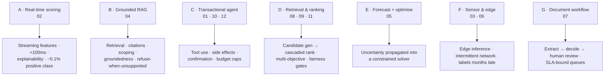

# 🏭 AI System Design by Industry — 12 Designs (Requirements → HLD → LLD)

> Twelve AI system designs cut **by industry vertical** — e-commerce, banking, automotive, healthcare, logistics, manufacturing, insurance, media, real estate, travel, HR, developer tools. Each carries full **Requirements** (quantified NFRs, latency budgets, capacity arithmetic), **HLD** (architecture, component choices *with rejected alternatives*, failure modes, scale plan), and **LLD** (schemas, API contracts, algorithms, sequence diagrams, state machines, edge cases).
>
> **Read [`00_requirements_all_systems.md`](00_requirements_all_systems.md) first.** It is the contract every design must satisfy — and the discipline it enforces (*numbers before boxes*) is the whole point of the set.

**Why a vertical cut, when two system-design folders already exist here.** The architectures rhyme; the **constraints** don't. A fraud model and a clinical decision-support model can share a feature store and a serving path and still be completely different designs — because one is bounded by a card-network authorisation window and the other by clinical liability, HIPAA, and a physician who will ignore any tool that interrupts their workflow. **What makes a design defensible is the domain constraint**, and that's what this folder is organised around.

---

## ⚠️ Honest overlap with existing folders

Read both sides where they overlap. Where a folder listed below is deeper, **it is the better source** and this one defers to it.

| This folder | Existing design | How they differ |
|---|---|---|
| `02` Banking fraud | [`21/05_fraud_anomaly_detection`](../21_ai-system-design-deep-dives/05_fraud_anomaly_detection.md) | `21` is **loan-application** fraud, explainability-driven. `02` is **transaction-stream** fraud, bounded by a sub-100 ms authorisation window and AML/SAR reporting duty |
| `04` Healthcare · `07` Insurance | [`21/02_document_intelligence_agent`](../21_ai-system-design-deep-dives/02_document_intelligence_agent.md) · [`27/05_document_intelligence`](../27_ai-platform-system-design/05_document_intelligence/README.md) | Both existing designs own the **extraction pipeline**. These two focus on what sits *after* extraction: clinical liability, and regulated settlement timelines |
| `08` Media · `09` Real estate · `11` HR | [`27/06_recommendation_system`](../27_ai-platform-system-design/06_recommendation_system/README.md) · [`21/07_marketplace_matching_ranking`](../21_ai-system-design-deep-dives/07_marketplace_matching_ranking.md) | **`27/06` is the reference recsys design** (candidate generation → ranking → serving) and is deeper on the retrieval/ranking machinery. These three contribute the **domain constraint that changes the objective**: engagement-vs-harm multi-objective (`08`), calibrated valuation intervals + fair-housing (`09`), and legally-auditable fairness (`11`) |
| `12` Coding agent | [`23_ai-coding-agents-and-code-eval`](../23_ai-coding-agents-and-code-eval/README.md) | `23` is a **tutorial** set (landscape, code-eval methodology, review workflow), not a system design. `12` is the design — repo-scale retrieval, the verification loop, and step/token budgets |
| Cross-cutting | [`21/06_prompt_injection_defense`](../21_ai-system-design-deep-dives/06_prompt_injection_defense.md) · [`21/04_agent_eval_guardrail_platform`](../21_ai-system-design-deep-dives/04_agent_eval_guardrail_platform.md) | Every design here **references** those rather than restating them. Injection defence and eval gating get solved once, not twelve times |

### Three systems deliberately *not* built here

| Not built | Read instead | Why |
|---|---|---|
| Lending — Credit Risk & Underwriting | [`21/08_credit_risk_scoring_engine`](../21_ai-system-design-deep-dives/08_credit_risk_scoring_engine.md) | Deeper on the scoring engine, model-risk governance, and adverse-action reasoning |
| Customer Service — Voice AI Agent | [`27/08_realtime_voice_assistant`](../27_ai-platform-system-design/08_realtime_voice_assistant/README.md) | Owns the speech pipeline, barge-in handling, and turn-latency budget |
| Enterprise SaaS — RAG + AI Agent | [`27/01_production_rag_system`](../27_ai-platform-system-design/01_production_rag_system/README.md) | The reference RAG design in this repo |

The findings that came out of scoping them are preserved in [cross-system observations](00_requirements_all_systems.md#cross-system-observations) — the enterprise semantic-cache × permission-model collision, and the voice turn-latency budget that didn't sum.

---

## 📋 The twelve problems

Each row names the **defining constraint** — the single fact that shapes the design more than any other. If you remember one thing per system, remember that column.

| # | Domain | Design | Defining constraint | Primary AI pattern |
|---|---|---|---|:---|
| 01 | 🛒 E-commerce | [AI Shopping Agent](01_ecommerce_shopping_agent/) | Conversational **and transactional** — it spends the user's money, so side effects need explicit confirmation | Agent + tools + catalogue RAG |
| 02 | 🏦 Banking | [Fraud Detection & Transaction Monitoring](02_banking_fraud_detection/) | Regulatory duty to **explain and report** (SAR filing), not merely to block | Streaming features + GBDT + graph |
| 03 | 🚗 Automotive | [Predictive Maintenance](03_automotive_predictive_maintenance/) | Telemetry from **intermittently-connected** vehicles; failure labels arrive months later | Time-series + survival modelling |
| 04 | 🏥 Healthcare | [Clinical Decision Support & Medical Docs](04_healthcare_clinical_ai/) | **Clinical liability** — the system advises, a clinician decides, and the audit trail must prove it | RAG + extraction + hard guardrails |
| 05 | 📦 Logistics | [Demand Forecasting + Route Optimisation](05_logistics_forecast_optimisation/) | A **forecast** feeds an **NP-hard optimisation** under a hard dispatch deadline | Probabilistic forecasting + VRP solver |
| 06 | 🏭 Manufacturing | [CV Quality Inspection](06_manufacturing_cv_inspection/) | Inference runs **on the line, at line rate**, often without reliable network | Edge CV + anomaly detection |
| 07 | 🛡️ Insurance | [Claims Automation](07_insurance_claims_automation/) | **Regulated settlement timelines** collide with fraud investigation | Document AI + fraud scoring + workflow |
| 08 | 📰 Media | [Content Recommendation & Ranking](08_media_recommendation_ranking/) | Optimising engagement alone is a **known harm** — the objective must be multi-term with release-blocking guardrails | Two-tower retrieval + cascaded ranking |
| 09 | 🏠 Real Estate | [Search, Valuation & Recommendation](09_realestate_search_valuation/) | Valuation needs a **calibrated interval**, and fair-housing law constrains ranking | Quantile regression (AVM) + semantic search |
| 10 | ✈️ Travel | ✅ | ✅ | ✅ | ✅ |
| 11 | 💼 HR | ✅ | ✅ | ✅ | ✅ |
| 12 | 🧑‍💻 Developer Tools | ✅ | ✅ | ✅ | ✅ |

---

## 🧩 The seven archetypes

Twelve problems, seven underlying shapes. Learning the archetype means you can derive the others from the one you know — and, more usefully in an interview, **recognise which archetype a novel problem is** before you start drawing boxes.

| Archetype | Systems | The hard part |
|---|---|---|
| **A · Real-time scoring** | 02 | The latency budget is imposed from outside, and the positive class is ~0.1% |
| **B · Grounded RAG** | 04 | Query-time scoping, and a *refuse* path that actually fires |
| **C · Transactional agent** | 01, 10, 12 | Side effects. Compare the three: 01 spends money, 10 must handle a distributed transaction with no 2PC, 12 can verify its own work |
| **D · Retrieval & ranking** | 08, 09, 11 | The objective is genuinely multi-term, and in 08/11 one term is a release-blocking gate |
| **E · Forecast + optimise** | 05 | Forecast uncertainty must reach the optimiser, not be flattened to a point estimate |
| **F · Sensor & edge** | 03, 06 | You don't control the network, and ground truth arrives long after the prediction |
| **G · Document workflow** | 07 | Human-review capacity is the real bottleneck, not model accuracy |

*(Archetype D · Real-time conversation is covered by [`27/08`](../27_ai-platform-system-design/08_realtime_voice_assistant/README.md).)*

---

## 📐 Shared assumptions register

**Every capacity estimate in this folder resolves against this table.** Change a number here and the downstream arithmetic is meant to be re-derived — that's why it lives in one place rather than being restated per design. Aligned with [`27/00_requirements`](../27_ai-platform-system-design/00_requirements_all_systems.md) so the two folders don't contradict each other.

| Input | Assumed value | Used for |
|---|---|---|
| **Small LLM** (mini/flash class) | $0.15 / 1M in · $0.60 / 1M out | Routing, classification, intent parsing, simple turns |
| **Frontier LLM** (large class) | $3.00 / 1M in · $15.00 / 1M out | Hard reasoning, final answers, agent loops |
| **Cached input** | ~10% of the input rate | Prompt caching on stable prefixes |
| **Embedding** | $0.02 / 1M tokens | Ingestion + query |
| **Rerank** | ~$1.00 / 1k queries | Cross-encoder |
| **GPU** (A10G-class) | ~$1.00 / hour | Self-hosted inference, OCR, CV, ranker fleets |
| **CPU** vCPU-hour | ~$0.04 | Feature computation, batch, solvers, sandboxes |
| **Managed Postgres** | ~$0.12 / GB-month | Metadata + pgvector |
| **Object storage** | ~$0.023 / GB-month | Documents, images, telemetry, audit |

> **⚠️ Every row is an assumption, not a fact.** Provider prices move constantly. **Verify before quoting any of these in a real review** — a design citing precise-sounding prices without flagging them as inputs is quietly fragile. Each capacity estimate states which tier it assumes.

**Availability arithmetic** (also shared):

| Target | Downtime/month | What it takes |
|---|---|---|
| 99.0% | ~7.3 h | Single AZ |
| 99.9% | ~43 min | Multi-AZ, stateless services |
| 99.95% | ~22 min | + provider fallback |
| 99.99% | ~4.4 min | Multi-region active-active |

> **The ceiling that catches people:** if your answer path depends on one external LLM provider, **your availability ceiling is that provider's SLA** (typically 99.9%). Promising more requires a fallback provider *and* a degraded non-LLM path.

---

## 🎯 How to rehearse this set

This is prep material, not just reference.

1. **Before opening a file, say the three-sentence compression out loud:** (a) the one architectural choice that matters most, (b) the alternative you rejected and why, (c) the failure mode you'd volunteer unprompted.
2. **Then check yourself against §2.2** (the component-choice table). If you can't defend a row against *"but why not X?"*, you don't own that design yet.
3. **Practise the requirements phase separately.** Spending 5 of 45 interview minutes on scope, SLOs, and non-goals is not lost time — it's what makes everything after it defensible. Jumping straight to boxes is the single most common failure.
4. **Answer "why not X" with a threshold, not an opinion.** *"pgvector until ~50M vectors, then reconsider"* beats *"Pinecone is overkill."*
5. **Say "I'd measure that"** where you genuinely would — then name the metric. It beats inventing a number.

---

## 📚 Suggested reading order

Not 01→12. Read **one system per archetype** first, then fill in:

```mermaid
flowchart LR
    R["00_requirements<br/>(all 12)"] --> A["02 · Banking fraud<br/>(archetype A)"]
    A --> C["01 · Shopping agent<br/>(archetype C)"]
    C --> D["08 · Media ranking<br/>(archetype D)"]
    D --> B["04 · Healthcare<br/>(archetype B)"]
    B --> E["05 · Logistics<br/>(archetype E)"]
    E --> F["06 · Manufacturing CV<br/>(archetype F)"]
    F --> G["07 · Insurance claims<br/>(archetype G)"]
    G --> Rest["Then 03 · 09 · 10 · 11 · 12,<br/>which now read fast"]
```

**If you only have time for four:** `02` (hard external latency budget), `05` (hardest design, cheapest system), `08` (multi-objective as architecture), `12` (verifiability changes everything).

---

## 🔗 Related folders

| Topic | Where |
|---|---|
| Platform-generic AI system designs (RAG, agents, inference, evals, voice, recsys) | [`../27_ai-platform-system-design/`](../27_ai-platform-system-design/README.md) |
| Fintech/debt-markets system designs (credit risk, KYC, collections) | [`../21_ai-system-design-deep-dives/`](../21_ai-system-design-deep-dives/README.md) |
| AI coding agents & code evaluation (tutorial companion to `12`) | [`../23_ai-coding-agents-and-code-eval/`](../23_ai-coding-agents-and-code-eval/README.md) |
| Interview framework + spoken answers | [`../19_agentic-ai-interview/`](../19_agentic-ai-interview/README.md) |
| Guardrails & prompt-injection defence | [`../03_llm-security-and-guardrails/`](../03_llm-security-and-guardrails/README.md) |
| Evaluation discipline (the CI gate every design references) | [`../16_evals/`](../16_evals/README.md) |
| Retrieval internals | [`../12_rag/`](../12_rag/README.md) · [`../06_vector-databases/`](../06_vector-databases/README.md) |
| Gradient boosting (the model behind archetypes A, D, E, F) | [`../24_xgboost/`](../24_xgboost/README.md) |
| ML metrics (calibration, PR-AUC, imbalanced classes) | [`../26_ml-evaluation-metrics/`](../26_ml-evaluation-metrics/README.md) |
| Operating it in production | [`../../Shared/02_mlops/`](../../Shared/02_mlops/README.md) · [`../../Shared/03_llmops/`](../../Shared/03_llmops/README.md) |

---

## 📊 Contents — complete

| # | System | Requirements | HLD | LLD | Prod + Interview |
|---|---|:---:|:---:|:---:|:---:|
| — | [`00_requirements_all_systems.md`](00_requirements_all_systems.md) | ✅ **all 12** | — | — | — |
| 01 | E-commerce shopping agent | ✅ | ✅ | ✅ | ✅ |
| 02 | Banking fraud detection | ✅ | ✅ | ✅ | ✅ |
| 03 | Automotive predictive maintenance | ✅ | ✅ | ✅ | ✅ |
| 04 | Healthcare clinical AI | ✅ | ✅ | ✅ | ✅ |
| 05 | Logistics forecast + optimisation | ✅ | ✅ | ✅ | ✅ |
| 06 | Manufacturing CV inspection | ✅ | ✅ | ✅ | ✅ |
| 07 | Insurance claims automation | ✅ | ✅ | ✅ | ✅ |
| 08 | Media recommendation & ranking | ✅ | ✅ | ✅ | ✅ |
| 09 | Real-estate search & valuation | ✅ | ✅ | ✅ | ✅ |
| 10 | Travel planning assistant | ✅ | ✅ | ✅ | ✅ |
| 11 | HR recruitment matching | ✅ | ✅ | ✅ | ✅ |
| 12 | Dev-tools coding agent | ✅ | ✅ | ✅ | ✅ |

**All 12 systems are complete: 60 per-system files plus the shared requirements register, ~16,700 lines / ~176,000 words.**

Each folder holds the same five files, so they can be read in any order:

| File | What it is for |
|---|---|
| `README.md` | The three-sentence compression, an architecture diagram, the key numbers |
| `01_requirements.md` | The tensions the shared block only names, and the requirements they generate |
| `02_hld.md` | Architecture, every component choice with its **rejected alternatives** and a revisit-when threshold, data flow, NFR mapping, failure modes, 10×/100× scale plan |
| `03_lld.md` | Schemas, API contracts, the algorithms that carry the design, sequence diagrams, state machines, an edge-case table |
| `04_production_and_interview.md` | AI-specific concerns, dashboards + on-call triage order + rollback, common mistakes as mistake→why→instead, spoken interview answers, glossary |

