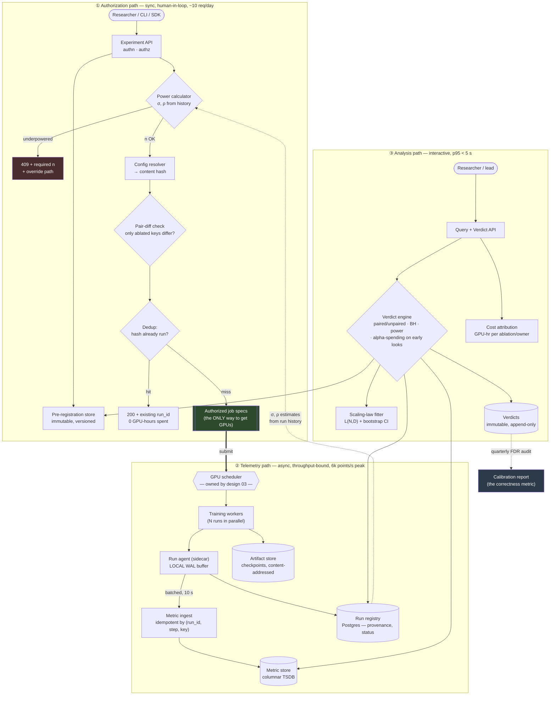

# 02 — HLD: Research Experiment Platform

> ← [01_requirements.md](01_requirements.md) · [system README](README.md) · → [03_lld.md](03_lld.md)

**Three-sentence compression:** Three paths with genuinely different characteristics — a **synchronous
authorization path** (human-in-the-loop, gated on a power calculation), an **asynchronous telemetry
path** (must survive a control-plane outage without killing a 25-minute run), and an **interactive
analysis path** (must produce a verdict in under 5 seconds). The choice that matters most is that
**authorization is a hard gate in front of the scheduler, not a dashboard beside it** — advisory rigor
is not rigor. The failure I would volunteer: **a control-plane outage must degrade to "runs continue,
metrics buffer locally, verdicts unavailable"** — because the alternative, a 2-hour ablation dying
because Postgres failed over, is the fastest way to teach researchers to bypass the platform.

---

## 2.1 Architecture

Three paths, drawn separately because they have different scale, latency and failure profiles.
Conflating them is the classic mistake: the authorization path is 10 requests/day and latency-bound on
human patience; the telemetry path is 6,000 points/s and must be durable through a control-plane
failure.

**Read the one thick arrow.** `AUTHZ ==> SCHED` is the trust boundary of the entire design: **the only
path to a GPU runs through the power gate.** If a researcher can reach `SCHED` directly, every
guarantee in [`01_requirements.md`](01_requirements.md) becomes a suggestion — which is why it is the
first row of §2.2 and open question 3 of §1.7.

---

## 2.2 Component choices

| Concern | Choice | Why | Rejected alternative (and why not) | Revisit when |
|---|---|---|---|---|
| **Enforcement boundary** | **Authorization is a hard gate: the scheduler accepts only signed job specs issued by this platform** | Advisory rigor is bypassed under deadline pressure, every time. Making the platform the *only* path to GPUs is the only mechanism that survives a bad week | **Advisory dashboard beside the scheduler** — cheaper, no org change, and empirically ignored. **Post-hoc audit** — finds the problem after the flagship already consumed the wrong decision | Never, for shared clusters. On a researcher's own dedicated GPUs, an advisory mode is the honest compromise — and should be labelled as such rather than pretended to be enforcement |
| **σ, ρ source** | **Measured from run history per `(family, scale, metric)`; stale/thin estimates flagged** | The power calculation is only as good as σ, and a default σ is a guess dressed as arithmetic. History makes it empirical and self-improving | **Fixed default σ** — makes every power number fiction. **Ask the researcher** — they don't know either, and a self-reported σ is optimistic in exactly the wrong direction | σ estimates are thin for a new model family; then run the variance census (§1.7 Q1) before trusting the gate |
| **Pairing** | **Enforced by construction**: the platform generates arm configs from one base + the ablated keys, and verifies the resolved diff | 4.8× fewer runs at ρ=0.8, for free. Letting humans construct paired arms means a stray default silently breaks pairing and nobody notices | **Trust the researcher to pair** — the failure is silent, which is the worst property a failure can have. **Always unpaired** — correct but 4.8× the cost | The ablated variable changes the noise structure (new init scheme, new data pipeline) → pairing is *refused*, not assumed |
| **Metric store** | **Timescale/columnar TSDB on Postgres** | 6×10⁹ points/quarter compresses to 18 GB. Same database as the run registry ⇒ **metrics and provenance join transactionally**, which is the system's core requirement | **Kafka + Spark + Parquet lake** — correct at 100× this volume, and here it buys an operational burden plus a *lost join*. **Prometheus** — wrong retention model, wrong cardinality story for per-run series. **A vendor tracker (W&B/MLflow)** — excellent UI, but the power gate and the verdict engine are the product, and neither is available as a hosted feature | > 10¹¹ points/quarter, or the join can be maintained across systems with acceptable staleness |
| **Config identity** | **Content hash of the fully-resolved config tree** (after all defaults, includes, and overrides are applied) | Dedup (FR-8) and pair-verification (FR-4) both need an exact identity. Hashing the *unresolved* file is the classic bug: two files with different defaults hash differently but train identically, and vice versa | **Hash the config file** — misses resolved defaults. **Autoincrement run ID as identity** — no dedup, no pairing check | Never. This is load-bearing |
| **Provenance for environment** | **Container image digest**, never a tag | Tags move. A `pytorch:2.6-cuda12` tag rebuilt in June changes cuBLAS kernel selection, which changes numerics, which changes loss by a margin comparable to the ablations being measured | **Tag** — silently non-reproducible. **`pip freeze`** — captures Python, misses CUDA/cuDNN/NCCL/driver, which is where the numerics live | Never |
| **Verdict statistics** | **Paired t-test where legal, BH-FDR across arms, O'Brien–Fleming for interim looks; bootstrap CI for non-normal metrics** | Matches the actual experimental designs. BH controls FDR (the stated correctness NFR) without the power destruction of Bonferroni | **Bonferroni** — correct but so conservative it pushes `n` up ~2× for a 20-arm sweep. **Raw per-arm p-values** — 64% false-winner rate at 20 arms (§00_concepts 5.1). **Bayesian posterior** — defensible and arguably better, but the lab must interpret priors; deferred rather than dismissed | The lab is comfortable specifying priors → a Bayesian verdict gives a more natural "probability B is better" and should be offered alongside |
| **`inconclusive` as a first-class verdict** | **Three outcomes: `supported` / `not_supported` / `inconclusive`** — the last returned whenever achieved power < 0.80 | A two-outcome system converts "we couldn't see it" into "it doesn't work", which is a **false negative laundered as a finding** and kills good ideas | **Binary significant/not** — the industry default, and the source of most abandoned-but-real results | Never |
| **Telemetry durability** | **Local WAL in the run agent; idempotent server-side ingest keyed `(run_id, step, key)`** | Decouples a 25-minute GPU run from control-plane availability. Retries are safe, so the agent can be dumb and aggressive | **Direct synchronous writes** — a Postgres failover kills runs. **Fire-and-forget UDP** — loses the tail of the loss curve, which is exactly the part the verdict reads | Never |
| **Artifact store** | **Content-addressed object store**, keyed by checkpoint hash | Deduplicates identical checkpoints across runs and makes `replay` verification trivial (compare hashes, not floats) | Path-based naming — collides, and makes retention policy ambiguous | > 1 PB, where a tiered/tape policy is needed |
| **Ladder as a platform object** (FR-9) | **First-class `ladder` entity that owns its rungs and fit** | The fit must be re-derivable, and the extrapolation must carry its CI to the flagship decision. Ad-hoc notebooks lose both | Notebook + copy-pasted numbers — the extrapolation's uncertainty is where the whole decision lives, and it is the first thing lost | Never |
| **Queue isolation** | **Reserved ablation partition (~104 GPUs) with a preemptible overflow class** | §1.5's 30-min queue budget is the SLO's weakest term; a reservation is the only way to bound it | **Pure fair-share** — a single flagship run starves every ablation and the turnaround SLO fails 100% of the time | Cluster utilization < 50% (reservation becomes waste) or a real preemption-with-checkpoint story exists at sub-minute granularity |

---

## 2.3 Data flow, narrated

**Path ① — authorization (the flow that makes this a rigor platform rather than a tracker):**

1. **Researcher declares a hypothesis** via CLI/SDK: metric, direction, effect size δ, base config, ablated keys, horizon. *This hop exists because a hypothesis declared after seeing data is not a hypothesis* — it is the thing §00_concepts 5.2 warns about.
2. **API looks up σ and ρ** for `(model_family, scale, metric)` from run history, with sample count and age. *Empirical, not default — the power number is only as good as this lookup.*
3. **Power calculator returns required `n`** for both paired and unpaired designs. If the requested `n` is short, it returns `409` with the required value and an override path. *This is the gate; everything else is bookkeeping.*
4. **Pre-registration is written immutably** with the horizon and the correction method. *It must be immutable, or the guarantee is retroactively editable.*
5. **Config resolver expands** defaults/includes/overrides into a full tree per arm per seed, and content-hashes each. *Resolution before hashing — see §2.2.*
6. **Pair-diff check** asserts that any two arms' resolved configs differ in *exactly* the pre-registered ablated keys. *This catches the silent pairing break that a human would never notice.*
7. **Dedup lookup** on `(config_hash, code_sha, image_digest, data_manifest_hash, seed)`. A hit returns the prior run and spends zero GPU-hours. *At 5,000 runs/quarter with heavy config reuse this is a real double-digit-percent saving, and it also prevents the "we already know this" rerun.*
8. **Signed job specs** are emitted to the scheduler. *Signed, because the scheduler's authorization check must be verifiable without calling back into a control plane that may be down.*

**Path ② — telemetry (the flow that must survive the control plane):**

9. **The scheduler places runs**; each worker starts a **run agent sidecar** that owns all platform communication. *Isolating this in a sidecar means the trainer has no platform dependency and cannot be killed by one.*
10. **Agent writes every metric to a local WAL first**, then batches to the ingest API every 10 s. *WAL-first is why a Postgres failover costs a stale dashboard rather than 26 dead runs.*
11. **Ingest is idempotent** on `(run_id, step, metric_key)`. *So the agent retries blindly on any error, forever, with no dedup logic of its own.*
12. **Checkpoints go directly to the artifact store**, content-addressed; the agent records only the hash. *Large-object traffic never touches the control plane.*
13. **Terminal status is written by the agent**, with an independent scheduler-side reconciler for agents that die without reporting. *A run whose agent is OOM-killed must not sit `running` forever — that pollutes the verdict's `n`.*

**Path ③ — analysis:**

14. **Verdict API loads the pre-registration**, then the runs matching its arms, then the metric series. *In that order — the pre-registration defines what is legal to test, before any data is read.*
15. **Verdict engine selects the test** (paired if the design is paired and the pair-diff check passed), applies BH across the ablation's arms, and computes **achieved** power from observed σ.
16. **If queried before the horizon**, an alpha-spending boundary is applied and the response says so. *Naive early stopping is unreachable through the API, by construction.*
17. **Verdict is appended immutably** with the exact run set and code version of the engine itself. *A verdict whose statistical method silently changed is not an audit trail.*
18. **Quarterly, the calibration job** re-checks `supported` verdicts against subsequent confirmation runs and reports realized FDR. *This is the only feedback loop that tells the lab whether the platform works.*

---

## 2.4 NFR mapping

| NFR ([§1.3](01_requirements.md)) | Delivered by |
|---|---|
| Turnaround p95 < 2.5 h | Turnaround budget §1.5 + **reserved ablation partition** (§2.2) bounding the 30-min queue term + 13 concurrent run slots |
| Pre-registration < 2 min | 6 required fields; σ/ρ auto-filled from history (FR-3) so the researcher supplies only δ and the ablated keys |
| Metric freshness p95 < 10 s | 10 s agent batch interval + single-hop idempotent ingest (no queue in the path at 6k points/s) |
| Ingest 6,000 points/s peak | Batched writes + columnar TSDB on one node; measured headroom, not an assumption — see §2.6 |
| Verdict < 5 s | Pre-aggregated final-metric materialized view; the test itself is O(n) on ≤ 256 numbers |
| **FDR ≤ 0.05** | BH correction (§2.2) + `inconclusive` verdict + alpha-spending on interim looks + **quarterly calibration audit** that measures the realized rate rather than assuming it |
| Reproducibility (bit-exact replay) | 5-column `NOT NULL` provenance + image **digest** + seed tuple + `replay` command (FR-12) |
| Control-plane availability 99.5% **without killing runs** | Agent WAL + idempotent ingest + scheduler-side reconciler; degraded mode in §2.5 |
| Cost ≤ $60k/quarter | Two-tier screening policy (FR-10) → $36.8k (§1.6.2) + dedup (FR-8) + cost attribution alerts (FR-13) |
| Durability 11 nines for verdicts | Verdicts and run records in Postgres with PITR + cross-region backup; they are ~10 MB/quarter, so this is free |

---

## 2.5 Failure modes and blast radius

| Failure | Detection | Blast radius | Mitigation / degraded mode |
|---|---|---|---|
| **Control plane down** (Postgres failover, API deploy) | Health check; agent WAL depth rising | **No in-flight run dies.** Verdicts and new submissions unavailable | Agent buffers to local WAL and replays on recovery. **Degraded mode: "runs continue, results stale, no new submissions."** Explicitly *not* "runs die" |
| **Metric ingest lag** (>10 s) | WAL depth per agent; ingest p95 | Stale dashboards; verdicts on completed runs unaffected | Agents back off with jitter; ingest sheds *sampled intermediate* steps but **never the final step of a run** (that is the value the verdict reads) |
| **σ/ρ estimate is stale or thin** | Estimate age + sample count on every power call | **Silent and severe** — every power number derived from it is wrong | Flag `stale` in the response and in the verdict; block the *gate* (not the run) if `n_history < 8`; scheduled variance census |
| **Pairing silently broken** (a default changed between arms) | **Pair-diff check at submission** (FR-4) | Would invalidate the paired test → an overstated result | Reject at submission. Post-hoc, the verdict engine re-verifies the diff from stored resolved configs and downgrades to an unpaired test with a warning rather than reporting a paired p-value |
| **Researcher bypasses the platform** | Scheduler rejects unsigned specs; reconciler reports unattributed GPU-hours | The platform's guarantees no longer hold for that work | Scheduler-side signature enforcement (§2.2 row 1). Detection alone is worth having even where enforcement is politically impossible — surfaced in the lead's portfolio view as *unattributed cluster spend* |
| **Run dies mid-ablation** (node fault, OOM) | Agent heartbeat + scheduler reconciler | Ablation has fewer seeds than pre-registered → **achieved power drops** | Auto-resubmit up to 2×; verdict recomputes achieved power from the runs that *actually completed* and returns `inconclusive` if it fell below 0.80. **Never silently reports a verdict at reduced n** |
| **Verdict engine version change** | Engine version recorded on every verdict | Historical verdicts computed by different logic | Verdicts are immutable and version-stamped; a recompute creates a *new* verdict and links the superseded one. The calibration audit groups by engine version |
| **Duplicate-run flood** (a script resubmitting in a loop) | Submission rate per principal | Wasted GPU-hours | Dedup (FR-8) absorbs identical configs at zero cost; per-principal submission rate limit catches the rest |
| **Artifact store fills** | Bytes-used trend vs retention policy | New checkpoints fail to write, runs fail late | Retention job (final-checkpoint-only for verdict-referenced runs); alert at 70% of budget, not 95% |
| **Loss becomes NaN in one arm** | Agent-side NaN/Inf detector on every metric | That run is useless; if unnoticed it drops `n` | Agent kills the run immediately, marks `failed_nan`, auto-resubmits with the *same* seed tuple. **A NaN run must never be counted as a completed seed** |
| **Clock skew across workers** | NTP drift metric | Step-indexed metrics are unaffected; wall-clock comparisons are wrong | All metrics are indexed by **optimizer step**, not timestamp — timestamps are metadata only. This is a design choice, not a mitigation |

**Volunteered unprompted:** the control-plane degraded mode. Most experiment-tracker designs make the
tracker a hard dependency of the training loop, so a tracker deploy kills a 25-minute (or 30-day) run.
Getting this wrong once teaches an entire lab to disable telemetry, and the platform never recovers.

---

## 2.6 Scale plan

**What breaks first, in order** — named specifically, not "add replicas."

| Scale | First bottleneck | Why | What changes |
|---|---|---|---|
| **10× runs** (50k/quarter, 2,000 concurrent) | **Metric ingest write amplification**, not volume. 60k points/s sustained against a single TSDB node | 18 GB→180 GB/quarter is still small; the problem is per-row insert cost and index maintenance at 2,000 concurrent writers | Batch at the agent to 30 s; add a write-through aggregation tier that pre-computes per-run final/min/max so the verdict path stops scanning raw series; shard the TSDB by `run_id` hash. **Do not** introduce Kafka — the join to provenance is worth more than the ingest headroom |
| **10× runs** (second) | **Reserved-partition contention** — the turnaround SLO, not the platform | 13 concurrent slots cannot serve 2,000 concurrent runs; §1.5's 50-min execution term explodes | Turnaround SLO must be *re-negotiated per tier*, not defended by buying GPUs: screening keeps a 1-hour SLO, confirmation moves to a 6-hour SLO. Being explicit that the SLO tiers is better than quietly missing one number |
| **100× runs** (500k/quarter) | **Verdict-path query cost** and, before that, **human attention** | 500k runs/quarter is ~5,500/day; no lab reads that. The real bottleneck stops being technical | Columnar warehouse for the metric tier with the registry staying transactional; and a *portfolio* verdict layer (which ablations moved the flagship decision) because per-ablation verdicts no longer get read |
| **10× metric cardinality** (600 metrics/run) | **Series cardinality** in the TSDB — 3M active series | Index size and per-write index maintenance | Enforce a per-run metric budget with an explicit opt-in for high-cardinality debugging series, and route those to a separate short-retention table. Cardinality limits are a *product* decision here, not an infra one |
| **10× ablation arms** (200-arm sweeps) | **Statistics, not systems** | BH across 200 arms at q=0.05 needs the smallest p-values to clear ~0.00025; per-arm `n` must rise substantially | The platform should *refuse* 200-arm sweeps at δ=0.01 and propose a two-stage design (screen 200 at δ=0.03, confirm 10). **This is the case where the right scale plan is to change the experiment, not the system** |

**The 100× answer that matters:** at 100× volume the constraint is that **nobody reads 5,500 verdicts a
day**. The honest scale plan is not a bigger database — it is that the platform's output must shift from
per-ablation verdicts to *decision-level* summaries, and that is a product change with a systems
consequence, not the reverse.

---

← [01_requirements.md](01_requirements.md) · [system README](README.md) · → [03_lld.md](03_lld.md)
