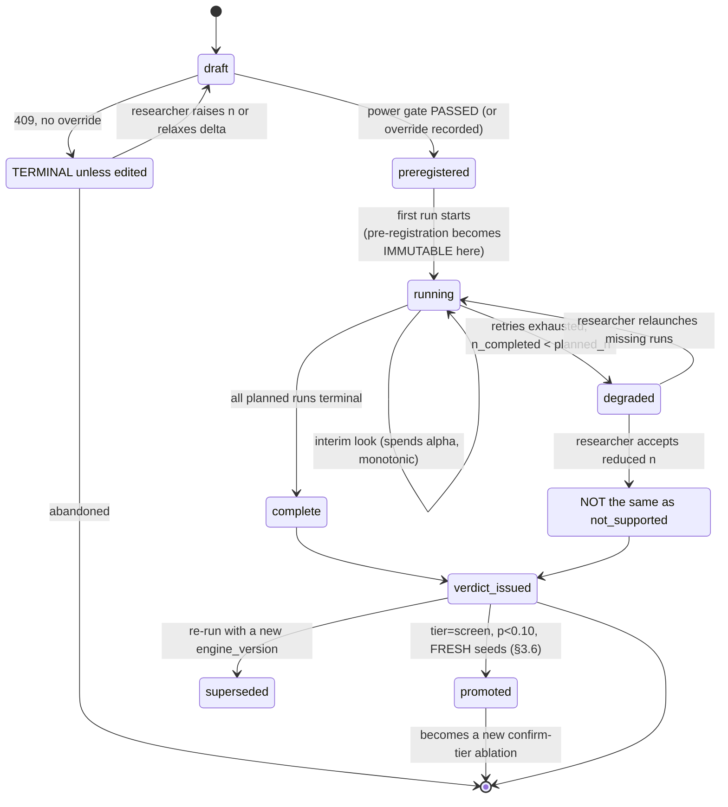
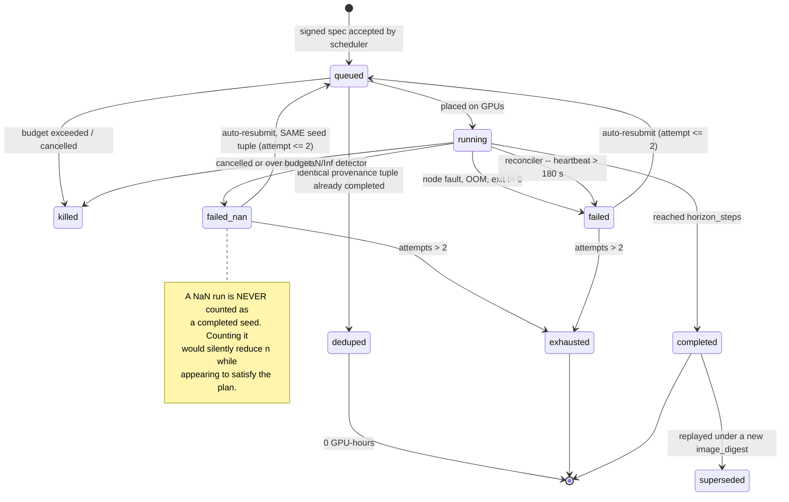

# 03 — LLD: Research Experiment Platform

> ← [02_hld.md](02_hld.md) · [system README](README.md) · → [04_production_and_interview.md](04_production_and_interview.md)

**Three-sentence compression:** The schema's whole job is to make a metric **unjoinable to nothing** —
five `NOT NULL` provenance columns and a content-addressed config hash, so no number can exist without
a defensible origin. The algorithm with real judgement in it is the **verdict engine**, which must pick
paired vs unpaired, apply BH across arms, compute *achieved* rather than planned power, and return
`inconclusive` rather than `not_supported` when power is short. The failure path worth drawing is
**"three of 26 runs died"** — because that is the case where a naive system silently reports a verdict
at reduced `n`, and this one must not.

---

## 3.1 Data models

Postgres (with the Timescale extension for the metric hypertable). The registry and the metrics live in
**one** database on purpose — §2.2: the transactional join between a metric and its provenance is the
product.

### 3.1.1 Provenance — the join key of the whole system

```sql
-- A fully-resolved config, content-addressed. Immutable.
CREATE TABLE configs (
    config_hash    BYTEA PRIMARY KEY,              -- sha256 of canonical-JSON of the RESOLVED tree
    resolved       JSONB       NOT NULL,            -- after defaults/includes/overrides applied
    model_family   TEXT        NOT NULL,            -- 'gpt-dense', 'moe-8x', ... -> partitions sigma/rho
    param_count    BIGINT      NOT NULL,            -- for the scaling ladder and for sigma bucketing
    created_at     TIMESTAMPTZ NOT NULL DEFAULT now()
);
-- Why: sigma/rho are looked up per (model_family, scale bucket, metric). Without an index on the
-- resolved-config's family + size, every power call scans. JSONB alone can't serve that cheaply.
CREATE INDEX idx_configs_family_scale ON configs (model_family, param_count);

-- Datasets are versioned by manifest, not by path. A silently re-tokenized corpus is the
-- single most common invisible confound (00_concepts §7).
CREATE TABLE data_manifests (
    manifest_hash    BYTEA PRIMARY KEY,
    dataset_name     TEXT        NOT NULL,
    revision         TEXT        NOT NULL,
    tokenizer_id     TEXT        NOT NULL,
    tokenizer_hash   BYTEA       NOT NULL,          -- the tokenizer itself is data
    shard_count      INT         NOT NULL,
    token_count      BIGINT      NOT NULL,
    shard_digests    BYTEA[]     NOT NULL,          -- per-shard content hashes
    decontam_run_id  UUID,                          -- FK to the decontamination job (design 02 §3.3)
    decontam_passed  BOOLEAN,
    UNIQUE (dataset_name, revision, tokenizer_hash)
);
-- Why decontam_passed lives here and not on the run: contamination is a property of the DATA, so it
-- is checked once per manifest and inherited by every run that uses it. Putting it on the run invites
-- per-run drift and re-checking 5,000 times.
```

### 3.1.2 Pre-registration — immutable, versioned

```sql
CREATE TYPE design_kind AS ENUM ('paired', 'unpaired');
CREATE TYPE metric_dir  AS ENUM ('lower_is_better', 'higher_is_better');

CREATE TABLE ablations (
    ablation_id     UUID PRIMARY KEY,
    version         INT         NOT NULL DEFAULT 1,
    superseded_by   UUID REFERENCES ablations(ablation_id),
    owner           TEXT        NOT NULL,

    -- THE PRE-REGISTRATION. Immutable once first_run_started_at is set.
    hypothesis      TEXT        NOT NULL,
    metric_key      TEXT        NOT NULL,            -- e.g. 'val/loss'
    metric_dir      metric_dir  NOT NULL,
    effect_size     DOUBLE PRECISION NOT NULL,       -- delta, in metric units
    design          design_kind NOT NULL,
    horizon_steps   INT         NOT NULL,            -- the fixed horizon; interim looks are penalized
    base_config     BYTEA       NOT NULL REFERENCES configs(config_hash),
    ablated_keys    TEXT[]      NOT NULL,            -- dotted paths that ARE allowed to differ
    correction      TEXT        NOT NULL DEFAULT 'benjamini_hochberg',
    alpha           DOUBLE PRECISION NOT NULL DEFAULT 0.05,
    target_power    DOUBLE PRECISION NOT NULL DEFAULT 0.80,

    -- What the power calculator said, recorded so the decision is auditable later
    sigma_used      DOUBLE PRECISION NOT NULL,
    rho_used        DOUBLE PRECISION,                -- NULL for unpaired
    sigma_source    TEXT        NOT NULL,            -- 'measured:<n_runs>@<date>' | 'override'
    required_n      INT         NOT NULL,
    planned_n       INT         NOT NULL,
    power_override_reason TEXT,                      -- NOT NULL-equivalent when planned_n < required_n

    tier            TEXT        NOT NULL DEFAULT 'screen',   -- 'screen' | 'confirm'
    promoted_from   UUID REFERENCES ablations(ablation_id),   -- FR-10; forces fresh seeds (see §3.6)

    budget_gpu_hr   DOUBLE PRECISION NOT NULL,
    created_at      TIMESTAMPTZ NOT NULL DEFAULT now(),
    first_run_started_at TIMESTAMPTZ,

    CONSTRAINT underpowered_needs_reason CHECK (
        planned_n >= required_n OR power_override_reason IS NOT NULL),
    CONSTRAINT paired_needs_rho CHECK (design <> 'paired' OR rho_used IS NOT NULL)
);
-- Why these two CHECKs are in the DATABASE and not only in the API: the gate must survive a new
-- client, a migration script, or a well-meaning backfill. A rigor guarantee enforced only in
-- application code is one `psql` session away from being untrue.

CREATE TABLE arms (
    arm_id       UUID PRIMARY KEY,
    ablation_id  UUID NOT NULL REFERENCES ablations(ablation_id) ON DELETE CASCADE,
    label        TEXT NOT NULL,                      -- 'control' | 'warmup_100' | ...
    is_control   BOOLEAN NOT NULL DEFAULT false,
    config_hash  BYTEA NOT NULL REFERENCES configs(config_hash),
    UNIQUE (ablation_id, label)
);
CREATE UNIQUE INDEX idx_one_control ON arms (ablation_id) WHERE is_control;
-- Why: exactly one control per ablation. Two controls silently changes what BH is correcting across.
```

### 3.1.3 Runs — five NOT NULL provenance columns

```sql
CREATE TYPE run_status AS ENUM
  ('queued','running','completed','failed','failed_nan','killed','superseded');

CREATE TABLE runs (
    run_id          UUID PRIMARY KEY,
    arm_id          UUID        NOT NULL REFERENCES arms(arm_id),
    pair_index      INT,                             -- NOT NULL for paired designs: the pair this run belongs to

    -- ===== THE FIVE PROVENANCE COLUMNS. All NOT NULL, by design. =====
    config_hash     BYTEA       NOT NULL REFERENCES configs(config_hash),
    code_sha        TEXT        NOT NULL,
    code_dirty      BOOLEAN     NOT NULL,
    image_digest    TEXT        NOT NULL,            -- sha256:..., NEVER a tag
    manifest_hash   BYTEA       NOT NULL REFERENCES data_manifests(manifest_hash),
    seed_init       BIGINT      NOT NULL,            -- kept SEPARATE so pairing can hold these equal
    seed_shuffle    BIGINT      NOT NULL,            --   while the ablated key differs
    seed_dropout    BIGINT      NOT NULL,
    deterministic   BOOLEAN     NOT NULL,            -- torch.use_deterministic_algorithms

    status          run_status  NOT NULL DEFAULT 'queued',
    final_metric    DOUBLE PRECISION,                -- denormalized: the verdict path must not scan series
    final_step      INT,
    gpu_hours       DOUBLE PRECISION,
    started_at      TIMESTAMPTZ,
    ended_at        TIMESTAMPTZ,
    failure_reason  TEXT,
    agent_heartbeat TIMESTAMPTZ,                     -- reconciler input

    CONSTRAINT paired_needs_pair_index CHECK (pair_index IS NOT NULL OR true)  -- enforced per-design in §3.3
);

-- Dedup (FR-8): the exact identity of "the same run". Partial, because only completed runs
-- can be served from cache -- a failed run must be re-runnable.
CREATE UNIQUE INDEX idx_runs_dedup ON runs
    (config_hash, code_sha, image_digest, manifest_hash, seed_init, seed_shuffle, seed_dropout)
    WHERE status = 'completed' AND NOT code_dirty;
-- Why NOT code_dirty: a dirty tree has no reproducible identity, so it must never satisfy a
-- dedup lookup. This is the index that turns FR-5's "marked dirty" into an actual guarantee.

-- The verdict path's hot query: all completed runs for an ablation, with pairing.
CREATE INDEX idx_runs_verdict ON runs (arm_id, status, pair_index) INCLUDE (final_metric);

-- Reconciler: find runs whose agent stopped reporting.
CREATE INDEX idx_runs_stale ON runs (agent_heartbeat) WHERE status = 'running';
```

### 3.1.4 Metrics — the hypertable

```sql
CREATE TABLE metrics (
    run_id      UUID        NOT NULL REFERENCES runs(run_id) ON DELETE CASCADE,
    step        INT         NOT NULL,                -- INDEXED BY STEP, NOT TIME (§2.5, clock skew)
    metric_key  TEXT        NOT NULL,
    value       DOUBLE PRECISION NOT NULL,
    wall_ts     TIMESTAMPTZ NOT NULL,                -- metadata only; never a comparison axis
    PRIMARY KEY (run_id, step, metric_key)           -- == the idempotency key for ingest (FR-6)
);
SELECT create_hypertable('metrics', 'step', chunk_time_interval => 5000);
ALTER TABLE metrics SET (timescaledb.compress,
    timescaledb.compress_segmentby = 'run_id, metric_key',
    timescaledb.compress_orderby   = 'step');
-- Why segment by (run_id, metric_key): every read is "one series for one run" or "the same series
-- across N runs". Segmenting this way makes both a contiguous scan and gets the ~3 bytes/point
-- from §1.6.4. Segmenting by time instead would scatter each series across every chunk.

-- Why the PK is the idempotency key: the agent retries blindly (§2.3 step 11). ON CONFLICT DO
-- NOTHING makes a duplicate batch free rather than a correctness problem.
```

### 3.1.5 Verdicts and the variance census

```sql
CREATE TYPE verdict_kind AS ENUM ('supported','not_supported','inconclusive');

CREATE TABLE verdicts (
    verdict_id      UUID PRIMARY KEY,
    ablation_id     UUID NOT NULL REFERENCES ablations(ablation_id),
    arm_id          UUID NOT NULL REFERENCES arms(arm_id),      -- verdict is per treatment arm vs control
    kind            verdict_kind NOT NULL,
    effect          DOUBLE PRECISION NOT NULL,                  -- observed, in metric units
    ci_low          DOUBLE PRECISION NOT NULL,
    ci_high         DOUBLE PRECISION NOT NULL,
    p_raw           DOUBLE PRECISION NOT NULL,
    p_adjusted      DOUBLE PRECISION NOT NULL,
    test_used       TEXT NOT NULL,                              -- 'paired_t' | 'welch_t' | 'bootstrap'
    correction      TEXT NOT NULL,
    achieved_power  DOUBLE PRECISION NOT NULL,                  -- from OBSERVED sigma and completed n
    n_completed     INT  NOT NULL,
    n_planned       INT  NOT NULL,
    interim         BOOLEAN NOT NULL,
    looks_used      INT NOT NULL DEFAULT 1,
    boundary        TEXT,                                       -- 'obrien_fleming' when interim
    run_ids         UUID[] NOT NULL,                            -- the EXACT run set, for audit
    engine_version  TEXT NOT NULL,                              -- verdicts are method-versioned (§2.5)
    superseded_by   UUID REFERENCES verdicts(verdict_id),
    created_at      TIMESTAMPTZ NOT NULL DEFAULT now()
);
CREATE INDEX idx_verdicts_audit ON verdicts (created_at, kind) WHERE superseded_by IS NULL;
-- Why: the quarterly FDR calibration audit scans exactly this -- current verdicts by outcome and date.

-- Measured sigma/rho per (family, scale bucket, metric). Refreshed by the variance census.
CREATE MATERIALIZED VIEW variance_estimates AS
SELECT c.model_family,
       width_bucket(c.param_count, 1e7, 1e11, 8) AS scale_bucket,
       m.metric_key,
       stddev_samp(r.final_metric)               AS sigma,
       count(*)                                  AS n_runs,
       max(r.ended_at)                           AS newest
FROM runs r
JOIN configs c ON c.config_hash = r.config_hash
JOIN LATERAL (SELECT DISTINCT metric_key FROM metrics WHERE run_id = r.run_id) m ON true
WHERE r.status = 'completed' AND NOT r.code_dirty
GROUP BY 1,2,3
HAVING count(*) >= 8;                             -- FR-3: fewer than 8 runs is not an estimate
```

---

## 3.2 API contracts

```http
POST /v1/ablations
Authorization: Bearer <oidc-jwt>        # owner derived from the token, never from the body
Idempotency-Key: <uuid>                 # required: submission authorizes GPU spend
Content-Type: application/json

{
  "hypothesis": "LR warmup of 100 steps reduces final val loss",
  "metric_key": "val/loss", "metric_dir": "lower_is_better",
  "effect_size": 0.01,
  "design": "paired",
  "horizon_steps": 20000,
  "base_config_ref": "configs/gpt-200m.yaml@a1b2c3",
  "arms": [ {"label":"control","ablated":{}},
            {"label":"warmup_100","ablated":{"optim.warmup_steps":100}} ],
  "tier": "screen",
  "planned_n": 4
}

201 Created
{ "ablation_id":"...", "design":"paired",
  "power": { "sigma":0.0201, "sigma_source":"measured:41@2026-08-14",
             "rho":0.81, "required_n":4, "planned_n":4, "achieved_power_planned":0.83 },
  "runs_to_launch": 8, "estimated_gpu_hours": 26.9, "estimated_cost_usd": 80.9 }

409 Conflict — UNDERPOWERED (the gate)
{ "error":"underpowered",
  "required_n": 13, "planned_n": 3,
  "detectable_at_planned_n": 0.0193,
  "message":"n=3 can only detect delta>=0.0193 at power 0.80. Requested delta=0.01 needs n=13 pairs.",
  "options": [
    {"action":"increase_n","planned_n":13,"estimated_cost_usd":263.1},
    {"action":"relax_delta","effect_size":0.0193,"planned_n":3},
    {"action":"override","requires":"power_override_reason"} ] }

400 ablated keys not present in base config · 401 bad token
409 pair_diff_violation — resolved arm configs differ in keys outside `ablated_keys` (body lists them)
409 no_variance_estimate — fewer than 8 historical runs for (family, scale, metric); body links the
    variance-census job to run first
422 decontamination not passed for the referenced data manifest
429 submission rate limit (Retry-After)
```

```http
POST /v1/ablations/{id}/runs:launch      # idempotent; returns existing runs on retry
200 { "launched":[{"run_id":"...","pair_index":0,"arm":"control","seed_init":991,...}],
      "deduped":[{"run_id":"...","reason":"identical provenance tuple already completed"}] }

POST /v1/runs/{id}/metrics               # called by the agent, batched
{ "points":[{"step":1200,"metric_key":"train/loss","value":2.914,"wall_ts":"..."}] }
202 Accepted { "ingested":600, "duplicates_ignored":120 }   # ON CONFLICT DO NOTHING
409 run is terminal — agent must stop retrying (the ONLY non-retryable ingest error)
503 Retry-After: 5 — control plane degraded; agent keeps buffering to WAL (§2.5)

GET /v1/ablations/{id}/verdict
200 { "ablation_id":"...", "interim": false,
      "verdicts": [
        { "arm":"warmup_100", "kind":"supported",
          "effect":-0.0142, "ci":[-0.0209,-0.0075],
          "p_raw":0.0011, "p_adjusted":0.0022, "correction":"benjamini_hochberg",
          "test_used":"paired_t", "n_completed":13, "n_planned":13,
          "achieved_power":0.86, "run_ids":[...] } ],
      "provenance_warnings": [] }

200 (interim query, before horizon)
{ "interim": true, "looks_used": 3, "boundary":"obrien_fleming",
  "adjusted_alpha": 0.0089,
  "note":"Queried at step 8000 of a 20000-step horizon. Naive alpha would be 0.05; spending
          boundary gives 0.0089. Stopping now is legal at this threshold." }

200 (degraded n -- the case that matters)
{ "verdicts":[{ "arm":"warmup_100", "kind":"inconclusive",
                "n_completed":10, "n_planned":13, "achieved_power":0.68,
                "reason":"3 runs failed (2 failed_nan, 1 node fault). Achieved power 0.68 < 0.80.
                          This is NOT evidence against the hypothesis.",
                "remedy":{"action":"relaunch","runs_needed":3,"estimated_cost_usd":60.7} }] }

GET  /v1/ladders/{id}/fit
200 { "coefficients":{"E":1.69,"A":406.4,"alpha":0.34,"B":410.7,"beta":0.28},
      "bootstrap_ci":{"alpha":[0.31,0.37],"beta":[0.25,0.31]},
      "extrapolation":{"target_N":7.055e10,"predicted_loss":1.94,"ci":[1.88,2.01],
                       "orders_of_magnitude_beyond_largest_rung":1.73,
                       "warning":"Extrapolating 1.73 OOM beyond the largest rung (1.3B).
                                  Treat the CI as a lower bound on true uncertainty." } }

POST /v1/variance-census                 # the $81 job that makes every power number real
{ "model_family":"gpt-dense","param_count":200000000,"metric_key":"val/loss","n_runs":8 }
202 { "census_id":"...","estimated_cost_usd":80.9 }
```

**Cross-cutting contract rules:**
- `Idempotency-Key` is **required** on every endpoint that can spend GPU-hours. A retried submission must never double-launch 26 runs.
- `tenant`/`owner` always derives from the token, never the body.
- The **only** non-retryable ingest error is `409 run is terminal`. Everything else — including `503` — means "keep buffering." This single rule is what makes the agent's WAL logic ~30 lines.

---

## 3.3 Core algorithms

### 3.3.1 Power calculator — with the inversion that matters

```python
from math import ceil, sqrt
from statistics import NormalDist

Z = NormalDist()

def required_n(sigma, delta, design, rho=None, alpha=0.05, power=0.80):
    """Returns (n, kind). For 'paired', n is PAIRS (2n runs). See 00_concepts §3-4."""
    k = (Z.inv_cdf(1 - alpha / 2) + Z.inv_cdf(power)) ** 2      # 7.849 at 0.05/0.80
    if design == "unpaired":
        return ceil(2 * k * sigma**2 / delta**2), "runs_per_arm"
    if rho is None:
        raise ValueError("paired design requires a measured rho")
    if rho < 0.5:
        # Pairing costs a constraint and buys nothing below rho=0.5. Refuse rather than
        # silently apply it -- HLD §2.2 'pairing' row.
        raise PairingNotBeneficial(rho=rho, advice="use unpaired design")
    sigma_d = sigma * sqrt(2 * (1 - rho))
    return ceil(k * sigma_d**2 / delta**2), "pairs"

def detectable_delta(sigma, n, design, rho=None, alpha=0.05, power=0.80):
    """THE INVERSION. Ask this FIRST. 'What is the smallest effect n runs can see?'"""
    k = (Z.inv_cdf(1 - alpha / 2) + Z.inv_cdf(power)) ** 2
    if design == "unpaired":
        return sigma * sqrt(2 * k / n)
    sigma_d = sigma * sqrt(2 * (1 - rho))
    return sigma_d * sqrt(k / n)

# sigma=0.02, n=3, unpaired -> 0.0457 nats. The number that motivates the platform.
```

**Why `detectable_delta` is a first-class API and not a helper:** the 409 response in §3.2 leads with
it. Telling a researcher "you need 13" invites an override; telling them "n=3 is blind to anything
below 0.019 nats and you're looking for 0.01" changes their mind.

### 3.3.2 Pair-diff check — the silent-failure catcher

```python
def verify_pairing(ablation, resolved_arm_configs):
    """FR-4. Asserts arms differ in EXACTLY the pre-registered keys. Rejects at submission."""
    allowed = set(ablation.ablated_keys)
    base = resolved_arm_configs[ablation.control_label]
    violations = []
    for label, cfg in resolved_arm_configs.items():
        if label == ablation.control_label:
            continue
        diff = flat_diff(base, cfg)                     # dotted-path -> (old, new)
        unexpected = set(diff) - allowed
        missing    = allowed - set(diff)
        if unexpected:
            violations.append((label, "unexpected_keys", sorted(unexpected)))
        if missing:
            # An arm that does NOT differ in an ablated key is a duplicate of control.
            violations.append((label, "ablated_key_unchanged", sorted(missing)))
    if violations:
        raise PairDiffViolation(violations)             # -> 409, body lists the keys

    # Seeds must be EQUAL within a pair and DIFFERENT across pairs.
    for pair in ablation.pairs:
        seeds = {(r.seed_init, r.seed_shuffle, r.seed_dropout) for r in pair.runs}
        if len(seeds) != 1:
            raise PairDiffViolation([(pair.index, "seed_mismatch_within_pair", sorted(seeds))])
```

### 3.3.3 Verdict engine

The judgement-carrying algorithm. Note the ordering: **power is checked before significance**, because
a significant result at power 0.4 is not more trustworthy than an insignificant one.

```python
def compute_verdict(ablation, *, at_step=None):
    runs = load_completed_runs(ablation)               # excludes failed/NaN/dirty by default
    interim = at_step is not None and at_step < ablation.horizon_steps

    # (1) Interim looks get a spending boundary. Naive early stopping is unreachable (FR-11).
    alpha = ablation.alpha
    boundary = None
    if interim:
        looks = count_prior_looks(ablation) + 1
        alpha = obrien_fleming_alpha(ablation.alpha, look=looks,
                                     planned_looks=ablation.planned_looks)
        boundary = "obrien_fleming"

    results = []
    for arm in ablation.treatment_arms:
        ctrl = runs[ablation.control_arm]; trt = runs[arm]

        # (2) Choose the test. Degrade paired -> unpaired if pairing did not hold, and SAY SO.
        if ablation.design == "paired" and pairing_intact(ctrl, trt):
            pairs = align_by_pair_index(ctrl, trt)
            d = [c.final_metric - t.final_metric for c, t in pairs]
            eff, ci, p, test = paired_t(d, alpha)
            n_eff, sigma_obs = len(d), stdev(d)
        else:
            eff, ci, p, test = welch_t([r.final_metric for r in ctrl],
                                       [r.final_metric for r in trt], alpha)
            n_eff = min(len(ctrl), len(trt))
            sigma_obs = pooled_stdev(ctrl, trt)
            if ablation.design == "paired":
                warn(arm, "pairing_broken_downgraded_to_welch")

        # (3) Non-normal metrics (win-rate, pass-rate) -> bootstrap, not t (§1.7 A7).
        if ablation.metric_is_bounded:
            eff, ci, p, test = bootstrap_diff(ctrl, trt, alpha, n_boot=10_000)

        # (4) ACHIEVED power, from OBSERVED sigma and the runs that actually completed.
        ach = achieved_power(sigma_obs, ablation.effect_size, n_eff, ablation.design, alpha)
        results.append(dict(arm=arm, effect=eff, ci=ci, p_raw=p, test=test,
                            n_completed=n_eff, achieved_power=ach, sigma_obs=sigma_obs))

    # (5) Multiple-comparison correction ACROSS arms of this ablation (00_concepts §5.1).
    for r, p_adj in zip(results, benjamini_hochberg([r["p_raw"] for r in results], q=alpha)):
        r["p_adjusted"] = p_adj

        # (6) THE RULE THAT MATTERS: power gates the verdict before significance does.
        if r["achieved_power"] < ablation.target_power:
            r["kind"] = "inconclusive"                 # NEVER 'not_supported'
            r["reason"] = (f"achieved power {r['achieved_power']:.2f} < "
                           f"{ablation.target_power}; {r['n_completed']} of "
                           f"{ablation.planned_n} runs usable")
        elif p_adj < alpha and sign_matches(r["effect"], ablation.metric_dir):
            r["kind"] = "supported"
        else:
            r["kind"] = "not_supported"

    persist_immutable(results, engine_version=ENGINE_VERSION, boundary=boundary, interim=interim)
    return results
```

**Termination and budget caps** (the skill's requirement, and they are real here):
- `bootstrap_diff` is capped at `n_boot = 10_000` — enough for a 3-decimal p-value, bounded at ~40 ms.
- Verdict computation reads only `runs.final_metric` (denormalized, §3.1.3), never the metric series — that is what keeps it inside the 5 s NFR at 256 runs.
- `count_prior_looks` is monotonic and persisted: an interim look **spends** alpha permanently. A researcher cannot reset it by re-querying, and the API does not expose a way to.

### 3.3.4 Scaling-law fit

```python
def fit_scaling_law(rungs, n_boot=2000):
    """L(N,D) = E + A/N^alpha + B/D^beta. Huber loss in log space (outlier-robust), then bootstrap."""
    def loss_fn(params, pts):
        E, A, al, B, be = params
        return sum(huber(log(E + A / N**al + B / D**be) - log(L)) for N, D, L in pts)

    theta = minimize(loss_fn, x0=INIT, args=(rungs,), bounds=BOUNDS).x
    boots = [minimize(loss_fn, x0=theta, args=(resample(rungs),), bounds=BOUNDS).x
             for _ in range(n_boot)]

    def extrapolate(N_target, D_target):
        preds = sorted(E + A / N_target**al + B / D_target**be for E, A, al, B, be in boots)
        oom = log10(N_target / max(N for N, _, _ in rungs))
        return dict(predicted=predict(theta, N_target, D_target),
                    ci=[preds[int(.025*n_boot)], preds[int(.975*n_boot)]],
                    oom_beyond_largest_rung=oom,
                    # THE HONEST PART: bootstrap CI measures fit uncertainty, not
                    # model-misspecification risk. Beyond ~1.5 OOM, say so.
                    warning=("CI is a LOWER BOUND on true uncertainty" if oom > 1.5 else None))
    return theta, extrapolate
```

### 3.3.5 Dedup lookup

```python
def resolve_or_launch(spec):
    """FR-8. A cache hit spends zero GPU-hours."""
    key = (spec.config_hash, spec.code_sha, spec.image_digest,
           spec.manifest_hash, spec.seed_init, spec.seed_shuffle, spec.seed_dropout)
    if spec.code_dirty:
        return launch(spec)          # dirty tree has no reproducible identity -> never dedup
    hit = find_completed_run(key)    # served by idx_runs_dedup
    if hit and not spec.force_rerun:
        return Deduped(run_id=hit.run_id,
                       reason="identical provenance tuple already completed")
    return launch(spec)
```

---

## 3.4 Sequence diagrams

### 3.4.1 Happy path — a paired screening ablation

```mermaid
sequenceDiagram
    autonumber
    participant R as Researcher
    participant API as Experiment API
    participant VAR as variance_estimates
    participant PWR as Power calc
    participant SCH as Scheduler (design 03)
    participant AG as Run agent x8
    participant TS as Metric store
    participant VE as Verdict engine

    R->>API: POST /v1/ablations (delta=0.02, paired, planned_n=4)
    API->>VAR: sigma, rho for (gpt-dense, 200M, val/loss)
    VAR-->>API: sigma=0.0201 (n=41, 18d old), rho=0.81
    API->>PWR: required_n(0.0201, 0.02, paired, 0.81)
    PWR-->>API: 4 pairs  (planned 4 >= required 4 OK)
    API->>API: resolve configs -> hash; verify_pairing() -> OK
    API-->>R: 201 {8 runs, 26.9 GPU-hr, $80.9}

    R->>API: POST /runs:launch
    API->>API: dedup lookup x8 -> 1 hit, 7 miss
    API->>SCH: 7 signed job specs
    API-->>R: 200 {launched:7, deduped:1}

    loop every 10 s per run
        AG->>AG: append to local WAL
        AG->>TS: POST /metrics (batch, idempotent)
    end
    AG->>API: run completed (final_metric, gpu_hours)

    R->>VE: GET /verdict
    VE->>TS: final_metric x8 (denormalized -- no series scan)
    VE->>VE: paired_t -> BH -> achieved_power=0.83
    VE-->>R: supported, effect -0.0142 [-0.0209,-0.0075], p_adj=0.0022
```

### 3.4.2 Failure path — three runs die mid-ablation

**The case that separates this design from a tracker.** A naive system reports a verdict at whatever
`n` survived; this one refuses to.

```mermaid
sequenceDiagram
    autonumber
    participant AG as Run agents (26)
    participant REC as Reconciler
    participant REG as Run registry
    participant R as Researcher
    participant VE as Verdict engine

    Note over AG: 23 runs complete normally
    AG->>REG: run#7 loss=NaN at step 4102
    Note right of AG: agent-side NaN detector fires immediately
    AG->>REG: status=failed_nan, auto-resubmit with SAME seed tuple
    Note over AG: run#12 node fault -- agent dies without reporting
    REC->>REG: heartbeat > 180 s and status=running
    REC->>REG: status=failed (node_fault), auto-resubmit (attempt 2 of 2)
    Note over AG: run#19 OOM on resubmit attempt 2 -- retries exhausted

    R->>VE: GET /verdict
    VE->>REG: completed runs -> 10 pairs usable of 13 planned
    VE->>VE: sigma_obs=0.0213; achieved_power(0.0213, 0.01, 10, paired)=0.68
    VE->>VE: 0.68 < 0.80  ==> kind = inconclusive  (NOT not_supported)
    VE-->>R: 200 inconclusive + "this is NOT evidence against the hypothesis"<br/>+ remedy: relaunch 3, $60.7

    Note over R,VE: The naive failure this prevents:<br/>reporting p=0.09 at n=10 as "hypothesis not supported"<br/>and abandoning a real effect.
```

---

## 3.5 State machines

### 3.5.1 Ablation lifecycle



### 3.5.2 Run lifecycle



---

## 3.6 Edge cases and correctness

| # | Edge case | Handling |
|---|---|---|
| 1 | **Zero completed runs** (whole ablation failed) | `inconclusive`, `n_completed=0`, no effect or CI reported. **Never** a verdict with a null effect rendered as 0 |
| 2 | **One arm completed, control did not** | `inconclusive` with `reason=control_missing`. A treatment mean with nothing to compare against is not a result |
| 3 | **Promotion reuses screening runs** | **Forbidden.** `promoted_from` forces a fresh seed range; the API rejects a confirm-tier launch whose seed tuples intersect its screen's. Reusing them conditions the confirmation on the selection event and invalidates the p-value (§1.7 A4) |
| 4 | **Pairing broken after launch** (a default changed under a mutable base config) | `base_config` is a hash, so it cannot change. If pairing still fails the post-hoc check, the engine **downgrades to Welch and labels the verdict** rather than reporting a paired p-value |
| 5 | **ρ < 0.5 for this ablation type** | `PairingNotBeneficial` at submission; the platform proposes an unpaired design with the (larger) correct `n`. Silently applying pairing would add a constraint for no variance reduction |
| 6 | **Metric never emitted** (typo in `metric_key`) | Detected at first-metric-arrival: if no point with `metric_key` arrives within 5% of the horizon, the run is failed with `metric_key_never_seen`. Catching this at step 1,000 instead of step 20,000 saves 95% of the run |
| 7 | **Interim look spam** | `looks_used` is monotonic and persisted. The 10th look faces a much stricter boundary; the API surfaces `alpha_remaining` so the cost is visible before the query |
| 8 | **Horizon reached but loss still falling** | Reported as `supported/not_supported` at the horizon **plus** a `horizon_may_be_short` flag. Extending the horizon post-hoc creates a *new* ablation version — it does not amend this one |
| 9 | **Duplicate metric points** (agent WAL replay) | `ON CONFLICT (run_id, step, metric_key) DO NOTHING`. Reported as `duplicates_ignored`, not an error |
| 10 | **Conflicting metric values at the same step** (a genuine bug) | Same PK, so the first write wins and the conflict is *invisible* — therefore the agent hashes each `(step, key)` batch and the ingest logs a `metric_value_conflict` warning when the hash differs. **A silently-dropped disagreement is worse than a duplicate** |
| 11 | **Dirty working tree** | Run proceeds, permanently `code_dirty=true`, **excluded from `variance_estimates` and from verdicts by default**, and never satisfies a dedup lookup |
| 12 | **Config hash collision** | sha256; treated as impossible. But `configs.resolved` is stored, so a collision would be *detectable* rather than silent |
| 13 | **Dataset re-tokenized under the same name** | Different `tokenizer_hash` ⇒ different `manifest_hash` ⇒ different dedup identity ⇒ no false cache hit, and the verdict's runs are visibly split across two manifests |
| 14 | **Contaminated dataset** | `data_manifests.decontam_passed = false` ⇒ `422` at submission. Contamination is a data property, checked once, inherited by every run |
| 15 | **Two researchers submit the same ablation** | Dedup makes the runs free; both ablations exist and are linked as `equivalent_to`. Two independent pre-registrations of the same hypothesis is *good* — but they must not be pooled into one test without re-correcting |
| 16 | **Budget exceeded mid-ablation** | Queued runs are killed, running runs finish (killing them wastes what is already spent). Verdict returns `inconclusive` with the remedy cost |
| 17 | **Control-plane outage during a run** | Agent WAL buffers; run completes; metrics replay. **Only** observable effect is dashboard staleness |
| 18 | **Verdict requested for a superseded ablation version** | `301` to the current version with an explicit note that the pre-registration changed and which fields differ |
| 19 | **Bounded metric near 0 or 1** (pass-rate at 0.98) | t-test invalid; bootstrap path (§3.3.3 step 3) plus a Wilson interval for the rate itself. A normal-approximation CI would cross 1.0 |
| 20 | **`horizon_steps` differs across arms** | Rejected at submission — comparing final losses at different step counts compares training length, not the hypothesis |

---

← [02_hld.md](02_hld.md) · [system README](README.md) · → [04_production_and_interview.md](04_production_and_interview.md)
