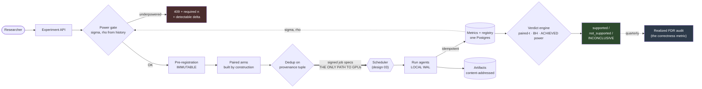

# 01 — Research Experiment Platform

> **Prompt:** Design the platform a frontier lab's research scientists run experiments on — ablations,
> seeds, hyperparameter sweeps, scaling-law ladders, metric tracking, reproducibility, and the decision
> of whether a result is real.
>
> **Role this maps to:** [01 · AI/ML Research Scientist](../../00_jobs/01_ai-research-scientist/README.md)
> · **Sample project:** [`project.md`](../../00_jobs/01_ai-research-scientist/project.md)

---

## The three-sentence compression

*Rehearse this before opening any other file. It is the opening answer.*

1. **The choice that matters most:** **the power gate sits in front of the scheduler, and paired arms
   are constructed by the platform rather than by the researcher** — because pairing turns a 126-run
   ablation into a 26-run one at zero cost, and a gate that is merely advisory is bypassed under
   deadline pressure every time.
2. **The alternative I rejected:** an experiment *tracker* — dashboards, metric logging, run
   comparison, beside the scheduler rather than in front of it. It is far cheaper and it is what most
   labs have. It cannot refuse an underpowered ablation, cannot detect that pairing silently broke, and
   cannot stop a low-power null being read as a refutation.
3. **The failure mode I'd volunteer:** **the platform can be perfectly correct and still be bypassed.**
   If pre-registration costs a researcher more than ~2 minutes they will run `python train.py`
   directly. So σ and ρ are auto-filled from history, the override is self-serve, and the rejection
   message leads with *"n=3 is blind below 0.046 nats and you're looking for 0.01"* rather than
   *"denied."*

---

## Architecture at a glance



**The thick arrow is the whole design.** If a researcher can reach the scheduler without passing the
gate, every guarantee below is optional.

---

## Key numbers

| Dimension | Value |
|---|---|
| **Turnaround: hypothesis → verdict** | **p95 < 2.5 h** (budget sums to 83 min — 67 min headroom) |
| Pre-registration cost to researcher | **< 2 min**, ≤ 6 fields — the adoption constraint |
| Scale | 5,000 runs/quarter · 200 concurrent · 6×10⁹ metric points/quarter |
| Metric store size | **18 GB/quarter** — this is *not* a big-data problem |
| Ingest | 1,200 points/s sustained · 6,000 peak |
| Verdict latency | < 5 s for 64 arms × 256 runs |
| **Correctness metric** | **realized FDR ≤ 0.05**, audited quarterly |
| Unit run | 200M params × 4B tokens = 25.3 min on 8×H100 = **3.37 GPU-hr = $10.11** |
| **Cost** | **$36.8k/quarter** (two-tier) vs $60.1k (confirm-everything) · ceiling $60k |
| Scaling-law ladder | **$3,391 = 0.31%** of the $1.11M flagship it de-risks |

---

## The findings that matter

**1. A 3-seed ablation is blind to the effects it is looking for.**

```
sigma = 0.02 nats (seed-to-seed std of final val loss, 200M params)

delta_min at n seeds = sigma · sqrt(15.70/n)
  n=3  ->  0.0457 nats     <-- the industry default
  n=63 ->  0.0100 nats     <-- what you'd need for a normal-sized effect

Real architectural effects: 0.005 - 0.02 nats.
```

**The default experimental protocol in ML cannot see the effects it is testing for.** Full derivation
in [`00_concepts.md §3`](00_concepts.md).

**2. Pairing is a 4.8× saving that costs nothing but discipline.** Hold the seed tuple, data order and
eval batches identical across arms; test the *differences*:

| ρ (measurable from run history) | Pairs for δ=0.01 | Total runs | vs 126 unpaired |
|---|---|---|---|
| 0.5 | 32 | 64 | 2.0× |
| **0.8** | **13** | **26** | **4.8×** |
| 0.9 | 7 | 14 | 9.0× |

So the platform **constructs** paired arms and **verifies** the resolved config diff — because a stray
default silently breaking pairing is a failure no human notices.

**3. Full power on every ablation does not fit the budget; tiering the effect size does.**

```
(a) status quo, underpowered  1,200 runs = $12.1k/quarter  -- but delta_min = 0.046, buys nothing
(b) confirm everything at 0.01  5,200 runs = $52.6k + $7.5k infra = $60.1k  ← OVER the $60k ceiling
(c) screen at delta=0.02 (4 pairs), confirm the 25% that pass at delta=0.01 (13 pairs)
      200 x 8 + 50 x 26 = 2,900 runs = $29.3k + $7.5k = $36.8k   ✅ 39% under
```

Same structural move as [`27/07`](../../27_ai-platform-system-design/07_llm_evaluation_platform/README.md)'s
tiered eval suites: **tier the rigor to fit the budget, rather than lowering it everywhere.**

**4. A 20-arm sweep manufactures a winner 64% of the time under the null** — so BH correction and a
fresh-seed confirmation run are load-bearing, not ceremony. And `inconclusive` must be a first-class
verdict: a two-outcome system converts *"we couldn't see it"* into *"it doesn't work"*, which is a
false negative laundered as a finding.

---

## Files

| File | Contents |
|---|---|
| **[00_concepts.md](00_concepts.md)** | 🎓 **Read first if you're new.** Nats and loss · where randomness comes from · power from scratch · pairing · multiple comparisons · sequential peeking · scaling laws · what must be pinned |
| **[01_requirements.md](01_requirements.md)** | Problem · FR-1…16 with acceptance criteria · NFRs · non-goals · **turnaround budget** · cost arithmetic and the two-tier fix · assumptions |
| **[02_hld.md](02_hld.md)** | Three-path architecture · component choices with rejected alternatives · narrated data flow · NFR mapping · failure modes · 10×/100× plan |
| **[03_lld.md](03_lld.md)** | DDL with index justifications · API contracts incl. the 409 · power calculator · pair-diff check · **verdict engine** · ladder fit · sequence diagrams (happy + "3 runs died") · state machines · 20 edge cases |
| **[04_production_and_interview.md](04_production_and_interview.md)** | Training-side AI concerns (**and which serving-side rows don't apply**) · runbook · **the quarterly FDR audit** · 14 common mistakes · 8 interview follow-ups · glossary |
| **[project/](project/)** | 🏃 **Runnable.** `python run.py` — measures real σ and ρ from 24 real training runs, then runs the actual power calculator and verdict engine on them |

**Shared front-matter:** [`../00_requirements_all_systems.md`](../00_requirements_all_systems.md)
— hardware/price assumptions, the `6ND` / `16N` / power primitives, the cross-system contract.

---

## Relationship to the other designs

| Relates to | How |
|---|---|
| [03 — Distributed training platform](../03_distributed_training_platform/README.md) | **Two sides of one cluster.** This platform decides *which* runs deserve GPU-hours; 03 makes those hours count. They meet at the signed-job-spec boundary, which is also the enforcement boundary |
| [02 — Post-training pipeline](../02_post_training_pipeline/README.md) | A consumer. This platform is metric-agnostic, so a post-training win-rate is an ablation like any other — but a bounded metric takes the bootstrap path, not the t-test ([§1.7 A7](01_requirements.md)) |
| [`27/07` — LLM evaluation platform](../../27_ai-platform-system-design/07_llm_evaluation_platform/README.md) | Same *tiering* insight, different domain: that one tiers eval suites to fit a CI gate; this one tiers effect sizes to fit a research budget. Read both — the structural move transfers |

---

← [folder README](../README.md) · → [00_concepts.md](00_concepts.md)
