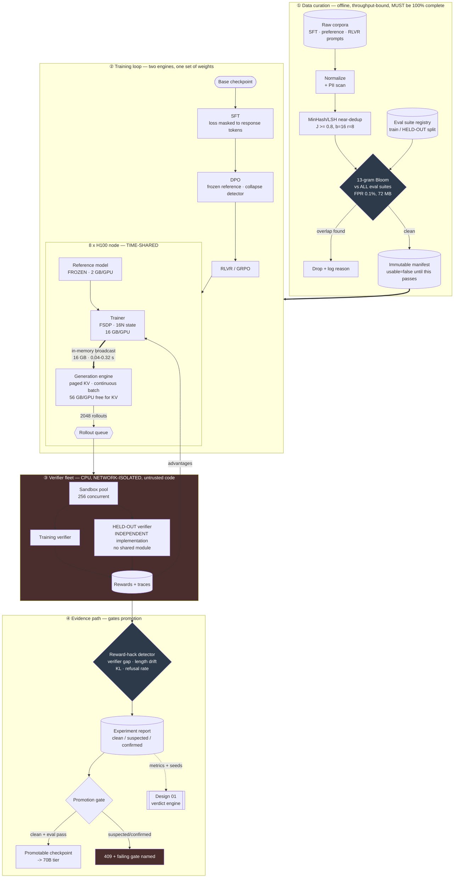

# 02 — HLD: Post-Training Pipeline

> ← [01_requirements.md](01_requirements.md) · [system README](README.md) · → [03_lld.md](03_lld.md)

**Three-sentence compression:** Three paths again, and again they have nothing in common — an **offline
data-curation path** (throughput-bound, must be 100% complete or it invalidates everything downstream),
a **training loop** that runs *two engines over one set of weights* with an in-memory weight barrier
each step, and an **evidence path** that gates promotion on a reward-hacking verdict. The choice that
matters most is **co-locating the generation and training engines on the same GPUs with an in-memory
weight broadcast** — because the obvious disaggregated alternative pays a checkpoint round-trip that is
63% of a step. The failure I would volunteer: **the verifier sandbox is arbitrary code execution by
design**, so it is the security boundary of the whole system, not a detail.

---

## 2.1 Architecture

**Three things the diagram is drawn to make unavoidable:**

1. **`DECON` gates everything** (`usable=false` until it passes). Contamination downstream of this box
   makes every number in path ④ meaningless — including the reward-hacking detector's held-out rate.
2. **The thick `TR ==> GEN` arrow is inside one node.** That is the weight-sync decision, and it is why
   the two engines are co-located rather than disaggregated.
3. **The verifier fleet is drawn as its own red trust boundary.** It runs model-generated code.

---

## 2.2 Component choices

| Concern | Choice | Why | Rejected alternative (and why not) | Revisit when |
|---|---|---|---|---|
| **Weight sync trainer→generator** | **In-memory broadcast of BF16 weights over NVLink, engines co-located on the same GPUs** | 16 GB in 0.04 s (NVLink) / 0.32 s (IB), against an 89 s step. Time-sharing also lets the trainer's 16 GB/GPU of optimizer state stay resident while 56 GB/GPU is free for KV | **Checkpoint to object store + reload the inference engine** — the obvious first implementation, and it costs ~56 s/step (16 s I/O + ~40 s engine reload and CUDA-graph rebuild): a **63% tax**. **Disaggregated inference cluster** — cleaner separation, but then every step pays a cross-cluster 16 GB transfer *and* you provision two pools that are each idle half the time | Policy > ~100B where weights don't co-reside with optimizer state; or an async/off-policy algorithm where sync isn't per-step. Then disaggregation wins |
| **RL algorithm** | **GRPO** (group-relative advantage, no critic) | Not primarily an algorithmic preference: **PPO's critic optimizer state pushes max concurrent rollouts from 2,967 to 2,013, below the 2,048 requirement** (§1.6.2). GRPO fits with 45% headroom | **PPO with a learned critic** — better advantage estimates, and it does not fit this node at this group size. **REINFORCE with no baseline** — fits easily, and the gradient variance is high enough to need far more rollouts, which costs more than the critic saved | Two nodes available (critic can live on the second), or group size drops below ~4 where the group-mean baseline gets too noisy |
| **Reward source** | **RLVR — a program (unit tests, answer check, schema validation)** | A program's attack surface is *the program*. A learned reward model's attack surface is every out-of-distribution region of its input space, and it fails **silently and confidently** | **Learned reward model (RLHF)** — necessary for un-checkable qualities like helpfulness or tone, and deferred to FR-16 precisely because it makes reward hacking harder to detect. **LLM-as-judge** — 4× the cost per rollout and it inherits the judge's biases | The target behaviour genuinely isn't mechanically checkable. Then add an RM *alongside* the verifier, and treat divergence between them as a signal |
| **Held-out verifier** | **≥ 1,500 prompts, independently implemented, import-graph-checked to share no module with the training verifier** | Shared code shares bugs, and a model that games a shared bug passes both. The 1,500 comes from arithmetic: 2 SE at n=1,500 is 3.7 points, and below it detection degrades fast (§00_concepts 6) | **Same verifier, held-out prompts** — catches prompt-specific overfitting, misses verifier gaming entirely, which is the hack that matters. **100 held-out prompts** — can only detect a 14.1-point gap; decorative | Never fewer. More if the pass rate sits far from 0.5 — but note §1.7 A8: past ~1,500 the *training* side dominates the SE, so the next improvement is a longer window, not more prompts |
| **Verifier sandbox** | **gVisor/Firecracker-class isolation · no network · read-only FS + scratch · 2 s CPU · 512 MB · no host credentials · no shared writable volume** | Model-generated code is untrusted input from an adversarial optimizer that is *actively searching* for reward. Docker's default namespace isolation is not a security boundary against that | **Plain container** — shares the kernel, and one CVE means cluster compromise. **`exec` in-process** — catastrophic. **No sandbox, trust the prompt** — the model is *optimizing against* your reward, which makes it the most motivated adversary you will ever have | Never weaken. Strengthen if verifiers ever need network (they shouldn't — mock the dependency) |
| **Verify/generate overlap** | **One-step-off-policy pipelining with a declared `max_staleness`, and the weight version recorded on every rollout** | Recovers 16 s of the 89 s step where every GPU is idle. Staleness 1 is standard practice and the recorded version makes the concession auditable | **Fully synchronous** — correct and burns 18% of the budget. **Unbounded async (large staleness)** — much better utilization and the policy gradient degrades; unbounded staleness is how an RL run silently stops improving | `max_staleness` > 1 needs an A/B through [design 01](../01_research_experiment_platform/README.md), not an assumption |
| **DPO reference model** | **Frozen copy resident in BF16 (2 GB/GPU), logprobs recomputed each step** | Correctness: DPO's log-ratio is meaningless if the reference drifts. 2 GB/GPU is affordable | **Cache reference logprobs once per pair** — a real 12 s/step saving and it silently breaks as soon as any prompt/response is regenerated (i.e. always, in RLVR). **Reference = periodically-updated policy** — that's a different algorithm with different convergence properties; don't do it accidentally | Memory pressure at 70B; then shard the reference or recompute from a checkpoint |
| **Dedup** | **MinHash 128 perms, LSH b=16/r=8, Jaccard ≥ 0.8** | 256 MB of signatures for 500k docs; P(catch \| J=0.8) = 0.947, P(candidate \| J=0.5) = 0.061 — the asymmetry (b, r) exists to produce | **Exact dedup by hash** — misses near-duplicates, which are the ones that silently upweight a phrasing. **Embedding-similarity clustering** — semantically better and needs a GPU pass over 500k docs plus a threshold nobody can defend | Corpus > ~50M docs, where signature storage and LSH bucket skew need a distributed implementation |
| **Decontamination** | **13-gram Bloom filter, FPR 0.1% (72 MB), 100% of registered suites** | ~10 CPU-minutes for 600M tokens. FPR 0.1% over 40M shingles means ~40k false drops — an acceptable price for near-zero false *keeps* | **Exact n-gram set in RAM** — 40M × ~50 B = 2 GB, workable but 28× the memory for a guarantee that doesn't change decisions. **Sampled checking** — gives false confidence at no meaningful saving. **Embedding-based contamination detection** — catches paraphrase, and has no defensible threshold | Paraphrased contamination becomes the dominant concern; then add embedding checks *on top*, never instead |
| **Rollout retention** | **5% uniform sample + 100% of flagged steps** | 1.18B tokens/experiment × 86 experiments/month is not storable. The *evidence* is the aggregate metrics plus the rollouts from steps the detector flagged | **Keep everything** — ~4.7 TB/experiment. **Keep nothing but metrics** — then a confirmed reward hack cannot be *shown to anyone*, and "we detected a hack" without the transcript does not survive review | Storage becomes free relative to compute, or an auditor requires full retention |
| **Promotion gate** | **Hard gate: eval pass + `clean` hacking verdict, override requires a recorded reason** | The 70B tier is 48% of the cost from 10% of experiments (§1.6.3). The gate is simultaneously the cost control and the correctness control | **Advisory report** — the 70B budget then absorbs every unpromising 8B result. **Fully automatic promotion** — promotes reward hacks | Never remove. Loosen the *eval* threshold if it turns out to be the binding constraint; never the hacking verdict |

---

## 2.3 Data flow, narrated

**Path ① — curation (offline, and the reason anything downstream is believable):**

1. **Raw corpora are normalized** (encoding, whitespace, boilerplate strip) and PII-scanned. *Normalization first, because dedup on inconsistent whitespace finds nothing.*
2. **MinHash signatures are computed** (128 permutations) and LSH-bucketed. *Signatures, not documents, because 500k pairwise comparisons is 1.25×10¹¹ and signatures make it 256 MB of RAM.*
3. **Candidate pairs are exact-checked** and near-duplicates dropped at Jaccard ≥ 0.8. *LSH gives candidates; the exact check keeps precision.*
4. **Every 13-gram is probed against the eval-suite Bloom filter.** Any hit drops the document with the offending suite recorded. *Before training, not after — a contaminated corpus cannot be un-trained, only re-trained.*
5. **An immutable manifest is emitted** with `usable=true` only if decontamination ran against *every* registered suite. *The flag is the gate; a manifest is unusable by default rather than usable by default.*

**Path ② — the training loop:**

6. **SFT runs first**, cross-entropy masked to response tokens. *Masking is asserted at startup, because the failure symptom (a model that asks questions instead of answering) is easy to misdiagnose as a data problem.*
7. **The reference model is snapshotted** from the SFT output and frozen. *This snapshot is the anchor for every KL and log-ratio for the rest of the pipeline; if it drifts, DPO's objective quietly changes.*
8. **DPO runs**, logging the implicit-reward margin, accuracy, and both mean lengths every step. **The collapse detector aborts if `dpo_loss < 0.10` before 20% of steps** — because from §00_concepts 3, that means `β·Δ > 2.2` and there is no gradient left to spend the remaining 80% of the run on.
9. **RLVR begins.** Each step: broadcast current weights into the generation engine in-memory (0.04–0.32 s), generate `256 × k=8` rollouts with paged KV and continuous batching.
10. **Rollouts go to the sandbox pool** — 256 concurrent, network-isolated. **Both** verifiers score: the training verifier on the training prompts, the independent held-out verifier on its ≥1,500 reserved prompts.
11. **Advantages are computed group-relatively** — `(r_i − mean_k)/std_k`. Groups with `std = 0` contribute nothing and are counted (`frac_zero_std_groups`), because an all-zero or all-one group is the cold-start and the saturation signal respectively.
12. **Reference logprobs are computed** and the policy is updated with the clipped objective plus a KL penalty. *Reference logprobs are recomputed, never cached — in RLVR the responses are new every step, so a cache would be silently stale.*
13. **With FR-11**, batch *t*'s verification overlaps batch *t+1*'s generation; every rollout records the weight version that produced it so staleness is auditable rather than assumed.

**Path ④ — evidence:**

14. **The detector runs every N steps** on four signals: verifier gap (train vs held-out), length drift, KL to reference, refusal rate. *Four, because each single signal has a benign explanation and the conjunction does not.*
15. **A flagged step triggers 100% rollout retention** for that step. *The transcript is what makes a hacking claim reviewable; aggregate metrics alone don't.*
16. **The report is signed and immutable**, containing raw and length-normalized win rate, the gap with its CI, KL trajectory, and the verdict.
17. **Promotion requires `clean` + eval pass.** *This is the same gate for cost control and for correctness, which is why it is hard rather than advisory.*
18. **Metrics are emitted to [design 01](../01_research_experiment_platform/README.md)** with seed and provenance metadata, so "did this experiment beat that one" is answered by a power-aware verdict engine rather than by eyeballing two numbers.

---

## 2.4 NFR mapping

| NFR ([§1.3](01_requirements.md)) | Delivered by |
|---|---|
| 8B experiment < 14 h | Step budget §1.5 (89.8 s × 500 = 12.5 h); pipelining (FR-11) gives 10.3 h |
| Step p95 < 100 s | The budget itself, with 10 s headroom — and the two biggest terms (decode, update) are the two named for optimization |
| **Weight sync p95 < 2 s** | **In-memory NVLink broadcast** (0.04 s measured intra-node, 0.32 s over IB) — a 6× margin, versus 56 s for the rejected checkpoint round-trip |
| **≥ 2,048 concurrent rollouts** | **GRPO's absent critic** frees 16 GB/GPU → 56 GB/GPU for KV → 2,967 rollouts (§1.6.2) |
| GPU idle < 3% | One-step-off-policy pipelining (FR-11) overlapping the 16 s CPU-bound verify with the next generation |
| Gap ≥ 3.7 points detectable | ≥ 1,500 held-out prompts (arithmetic in §00_concepts 6), scored by an independently implemented verifier, **with the gap computed over a rolling 8-step window** so the training side is not the noisier half (§1.7 A8) |
| Sandbox: zero egress, bounded CPU/mem | gVisor/Firecracker-class isolation, no network namespace, read-only FS + scratch, cgroup caps, escape-attempt test suite in CI |
| Verifier throughput ≥ 128/s | 256 concurrent sandboxes × 2 s mean = 128/s → 2,048 rollouts in 16 s |
| Decontamination 100%, < 2 h | 72 MB Bloom filter, ~10 CPU-min for 600M tokens; the rest of the 2 h is ingest and dedup |
| Cost ≤ $60k/month | §1.6.3 → $55.8k, held there by the **8B→70B promotion gate** (FR-13), which is the only lever that matters |
| Reproducibility | Bit-exact for SFT/DPO; RLVR stores rollout RNG state and the weight version per rollout |
| DPO collapse caught | FR-4 threshold derived from the loss table in §00_concepts 3, not chosen by feel |

---

## 2.5 Failure modes and blast radius

| Failure | Detection | Blast radius | Mitigation / degraded mode |
|---|---|---|---|
| **Reward hacking** | Verifier gap ≥ 3 pts · length drift > 25% · KL above band · refusal-rate rise | **The entire experiment is worthless, and it looks successful** | Detector runs every N steps → `suspected` blocks promotion; 100% rollout retention on flagged steps; the report names the triggering signal. **This is the design's headline failure mode** |
| **Contaminated training data** | Manifest `usable=false`; post-hoc: implausibly high eval scores | **Every downstream number, including the hack detector's held-out rate** | Hard gate at FR-1: no manifest without 100% suite coverage. Retroactively: quarantine the manifest, mark every checkpoint derived from it, re-run |
| **DPO loss collapse** | `dpo_loss < 0.10` or `reward_accuracy > 0.99` before 20% of steps | Remaining 80% of the run does nothing | Abort by default (FR-4). Diagnosis order: check length delta between chosen/rejected first, then a shared token, then lower β |
| **Zero-gradient cold start** | `frac_zero_std_groups > 0.9` for 10 steps | Whole RLVR run learns nothing | Halt with `cold_start_no_signal` (FR-12); remedy is an easier prompt mix or more SFT, not more steps |
| **Verifier sandbox escape** | Egress attempt, write outside scratch, cgroup violation | **Cluster compromise. The worst case in the document** | Fail closed; kill the pool; quarantine the rollout that triggered it; escape-attempt suite in CI. Sandbox weakening requires security review, not a config change |
| **Verifier is slow / hangs** | Verifier p95, timeout rate | Step time blows out; verify stops fitting its 16 s | Hard 2 s CPU cap → timeout counts as reward 0 **and** increments `verifier_timeout_rate`. If that rate rises, the *verifier* is the bug: a timeout silently scored 0 teaches the model that timing out is as good as failing |
| **Response length runaway** | Mean rollout length trend | Self-reinforcing: longer responses → slower decode → slower steps → fewer steps in budget | Length is a tracked metric with an alert band; length-normalized win rate (FR-10) makes the reward-side cause visible |
| **Weight-sync divergence** (generator serving stale weights) | Weight version recorded per rollout; assert version ≤ staleness bound | Policy gradient computed against the wrong distribution — degrades quality *silently* | Version stamp on every rollout; assertion at advantage-computation time; abort on violation |
| **Reference model drift** | Hash the reference at every stage boundary | DPO's objective silently changes; KL becomes meaningless | Reference is content-addressed and frozen; a hash mismatch is a hard failure |
| **All-pass saturation** | Reward mean → 1.0, `frac_zero_std_groups` rising | No signal left; steps are wasted | Detected as the mirror of cold start; remedy is harder prompts, and the platform should say so rather than letting the run finish |
| **Generation engine OOM** (KV pressure from long rollouts) | KV utilization; admission rejections | Step fails or degrades | KV-aware admission control (same mechanism as [`27/04`](../../27_ai-platform-system-design/04_llm_inference_platform/README.md)): admit a rollout only if its projected KV fits; shed to a smaller group size rather than crashing |
| **Held-out verifier shares code** | **CI import-graph check** | The central safeguard is silently disabled | Fail the build. This is a *code-structure* invariant, so it is enforced where code structure is enforced |
| **Node fault mid-experiment** | Heartbeat | Loses up to one checkpoint interval | Checkpoint every 50 steps; resume needs the policy, the optimizer state, the reference hash, **and** the RNG/prompt-cursor state — a resume that loses the prompt cursor silently re-trains on the same prompts |

**Volunteered unprompted:** the verifier sandbox. Every RLVR system executes code written by a model
that is *actively optimizing against your reward function* — the most motivated adversary the system
will ever face. Treating that sandbox as a container-configuration detail rather than as the security
boundary is the single most consequential mistake available in this design.

---

## 2.6 Scale plan

| Scale | First bottleneck | Why | What changes |
|---|---|---|---|
| **10× experiments** (200 × 8B/week) | **Verifier sandbox fleet**, not GPUs | 2,048 rollouts × 2 s / 256 sandboxes = 16 s; ten concurrent experiments need 2,560 sandboxes. CPU fleet cost goes $2.8k → $28k/month and starts rivalling a GPU line item | Autoscale the sandbox pool on **rollout-queue depth**; cache verifier results by `(prompt_id, response_hash)` — RLVR regenerates identical responses more often than intuition suggests, especially late in training |
| **10× experiments** (second) | **Object-store write bandwidth for rollout retention** | 5% of 1.18B tokens × 200 experiments/week | Retention becomes tiered: metrics always, rollouts only from flagged steps plus a 1% sample |
| **10× policy size** (8B → 80B) | **The memory budget in §1.6.2 collapses** | 16N = 1,280 GB of optimizer state alone — 16 GPUs before any KV cache. Time-sharing weights between engines stops being possible | **Disaggregate**: a separate generation pool with its own weights, and the weight-sync decision *inverts* — the in-memory broadcast becomes a cross-node 160 GB transfer. That is when the rejected alternative in §2.2 becomes the right answer, and saying so is the point of a `revisit-when` column |
| **10× group size** (k=8 → 80) | **KV cache** — 20,480 concurrent rollouts × 151 MB = 3.1 TB | Doesn't fit on a node at any configuration | Chunk the group across waves (generation is already batched); or shorten `max_new_tokens`, since KV scales linearly in sequence length. **Note the diminishing return**: the GRPO baseline's noise falls as `1/√k`, so k=80 buys 3.2× less noise than k=8 for 10× the generation cost |
| **10× verifier latency** (2 s → 20 s) | **Verify dominates the step** — 160 s vs a 74 s remainder | Pipelining can hide 16 s behind generation; it cannot hide 160 s | Verifier latency becomes an **admission criterion at task-authoring time**: a task whose verifier exceeds a budget is rejected, not accommodated. The alternative — accepting slow verifiers — makes step time a function of task mix, which makes capacity planning impossible |
| **100× everything** | **Reward-hacking detection, statistically** | With hundreds of experiments/week, checking four signals at α=0.05 across 100 experiments produces false `suspected` flags constantly | The detector needs its own multiple-comparison discipline — which is exactly what [design 01](../01_research_experiment_platform/README.md) provides. **At 100× the two systems stop being separable**, and that is the honest answer rather than a bigger detector |

**The 10× answer that matters:** the first thing to break is **CPU sandboxes**, not GPUs. A design that
scales the GPU tier and leaves the verifier fleet fixed will find that 18% GPU idle becomes 60%.

---

← [01_requirements.md](01_requirements.md) · [system README](README.md) · → [03_lld.md](03_lld.md)
