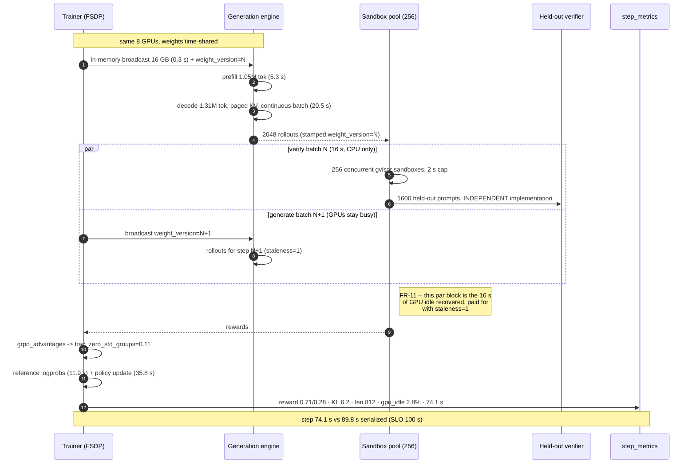
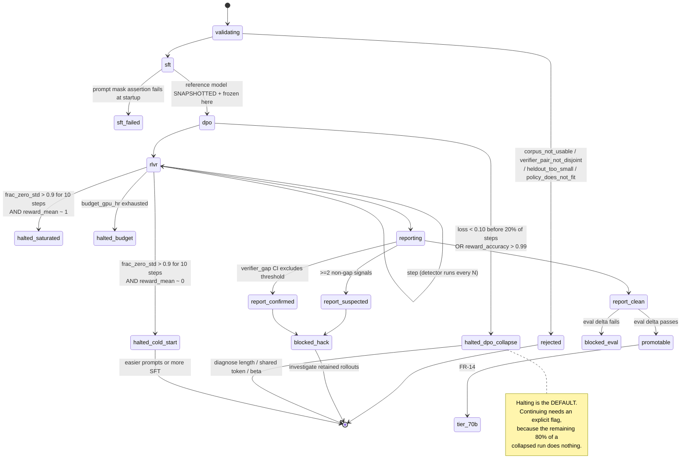

# 03 — LLD: Post-Training Pipeline

> ← [02_hld.md](02_hld.md) · [system README](README.md) · → [04_production_and_interview.md](04_production_and_interview.md)

**Three-sentence compression:** The schema's job is to make **every reward traceable to the exact
weight version, verifier version, and prompt that produced it** — because a reward-hacking claim you
cannot reconstruct is not a finding. The algorithms carrying real judgement are the **GRPO advantage
with its zero-variance-group handling** and the **four-signal reward-hack detector**; both have to
behave sensibly in the degenerate cases (all-pass, all-fail) that occur at the start and end of every
run. The failure path worth drawing is **the reward hack itself** — reward climbing, held-out flat, KL
rising — because that sequence is what "success" looks like when it isn't.

---

## 3.1 Data models

Postgres for the control plane; object store for rollouts and checkpoints. Rollout *text* is never in
Postgres — only hashes and metrics.

### 3.1.1 Data curation

```sql
CREATE TYPE corpus_kind AS ENUM ('sft', 'preference', 'rlvr_prompts');

CREATE TABLE eval_suites (
    suite_id        TEXT PRIMARY KEY,
    revision        TEXT        NOT NULL,
    split           TEXT        NOT NULL,           -- 'train' | 'heldout'
    item_count      INT         NOT NULL,
    ngram_size      SMALLINT    NOT NULL DEFAULT 13,
    bloom_uri       TEXT        NOT NULL,           -- object-store URI of the 13-gram filter
    bloom_fpr       REAL        NOT NULL,
    registered_at   TIMESTAMPTZ NOT NULL DEFAULT now(),
    retired_at      TIMESTAMPTZ,
    UNIQUE (suite_id, revision)
);
-- Why `split` is here and not on the run: the heldout suite must be un-trainable BY CONSTRUCTION.
-- Any manifest that overlaps a 'heldout' suite is unusable, full stop -- there is no per-run override.

CREATE TABLE corpora (
    manifest_hash   BYTEA PRIMARY KEY,
    name            TEXT        NOT NULL,
    kind            corpus_kind NOT NULL,
    revision        TEXT        NOT NULL,
    tokenizer_hash  BYTEA       NOT NULL,           -- the tokenizer is data (design 01 §3.1.1)
    doc_count       BIGINT      NOT NULL,
    token_count     BIGINT      NOT NULL,
    shard_uris      TEXT[]      NOT NULL,

    -- Curation evidence. usable defaults to FALSE.
    usable          BOOLEAN     NOT NULL DEFAULT false,
    dedup_threshold REAL,
    dedup_removed   BIGINT,
    decontam_suites TEXT[],                          -- (suite_id, revision) pairs actually checked
    decontam_removed BIGINT,
    decontam_at     TIMESTAMPTZ,
    pii_scan_at     TIMESTAMPTZ,
    UNIQUE (name, revision, tokenizer_hash)
);

-- FR-1 as a database invariant, not an application check: a corpus is unusable until every
-- currently-registered, non-retired suite appears in decontam_suites.
CREATE OR REPLACE FUNCTION assert_full_decontam() RETURNS TRIGGER AS $$
DECLARE missing TEXT[];
BEGIN
  IF NEW.usable THEN
    SELECT array_agg(s.suite_id || '@' || s.revision) INTO missing
    FROM eval_suites s
    WHERE s.retired_at IS NULL
      AND NOT (s.suite_id || '@' || s.revision = ANY(COALESCE(NEW.decontam_suites, '{}')));
    IF missing IS NOT NULL THEN
      RAISE EXCEPTION 'corpus % cannot be usable: suites not checked: %', NEW.name, missing;
    END IF;
  END IF;
  RETURN NEW;
END $$ LANGUAGE plpgsql;
CREATE TRIGGER trg_full_decontam BEFORE INSERT OR UPDATE ON corpora
  FOR EACH ROW EXECUTE FUNCTION assert_full_decontam();
-- Why a trigger: the single most damaging failure in this system is a contaminated corpus reaching
-- training. Enforcing it only in the API leaves it one backfill script away from being untrue.
```

### 3.1.2 Verifiers — the independence invariant

```sql
CREATE TABLE verifiers (
    verifier_id     TEXT PRIMARY KEY,
    role            TEXT        NOT NULL,           -- 'training' | 'heldout'
    task_family     TEXT        NOT NULL,           -- 'python_unit_tests', 'math_answer', ...
    code_sha        TEXT        NOT NULL,
    image_digest    TEXT        NOT NULL,
    entrypoint      TEXT        NOT NULL,
    module_root     TEXT        NOT NULL,           -- import-graph root; see the CHECK below
    cpu_limit_s     REAL        NOT NULL DEFAULT 2.0,
    mem_limit_mb    INT         NOT NULL DEFAULT 512,
    network         BOOLEAN     NOT NULL DEFAULT false,
    p95_latency_ms  INT,                            -- measured; feeds the step budget
    CONSTRAINT no_network CHECK (network = false),   -- FR-6: not a default, an invariant
    CONSTRAINT sane_limits CHECK (cpu_limit_s <= 10.0 AND mem_limit_mb <= 4096)
);

-- FR-7: the training and heldout verifiers for a task family must not share a module root.
-- Checked in CI by walking the import graph; recorded here so the report can assert it.
CREATE TABLE verifier_pairs (
    task_family     TEXT PRIMARY KEY,
    training_id     TEXT NOT NULL REFERENCES verifiers(verifier_id),
    heldout_id      TEXT NOT NULL REFERENCES verifiers(verifier_id),
    import_graph_disjoint BOOLEAN NOT NULL,
    checked_at      TIMESTAMPTZ NOT NULL,
    CONSTRAINT must_be_disjoint CHECK (import_graph_disjoint),
    CONSTRAINT must_differ CHECK (training_id <> heldout_id)
);
```

### 3.1.3 Experiments and stages

```sql
CREATE TYPE stage_kind   AS ENUM ('sft', 'dpo', 'rlvr');
CREATE TYPE stage_status AS ENUM
  ('pending','running','completed','failed',
   'halted_dpo_collapse','halted_cold_start','halted_saturated','halted_budget');

CREATE TABLE experiments (
    experiment_id   UUID PRIMARY KEY,
    owner           TEXT        NOT NULL,
    base_ckpt       BYTEA       NOT NULL REFERENCES checkpoints(ckpt_hash),
    policy_params   BIGINT      NOT NULL,           -- 8e9 | 7.055e10 -> selects the tier
    target_behavior TEXT        NOT NULL,           -- prose, for the report
    budget_gpu_hr   REAL        NOT NULL,
    -- Emitted to design 01 so its verdict engine can read this experiment
    ablation_id     UUID,
    seed_init       BIGINT      NOT NULL,
    seed_data       BIGINT      NOT NULL,
    seed_sampling   BIGINT      NOT NULL,           -- rollout RNG; needed for RLVR replay
    created_at      TIMESTAMPTZ NOT NULL DEFAULT now()
);

CREATE TABLE stages (
    stage_id        UUID PRIMARY KEY,
    experiment_id   UUID        NOT NULL REFERENCES experiments(experiment_id),
    ordinal         SMALLINT    NOT NULL,
    kind            stage_kind  NOT NULL,
    status          stage_status NOT NULL DEFAULT 'pending',
    corpus_hash     BYTEA       REFERENCES corpora(manifest_hash),
    config          JSONB       NOT NULL,           -- beta, k, lr, max_new_tokens, max_staleness...
    planned_steps   INT         NOT NULL,
    completed_steps INT         NOT NULL DEFAULT 0,
    ref_ckpt        BYTEA       REFERENCES checkpoints(ckpt_hash),   -- the FROZEN reference
    out_ckpt        BYTEA       REFERENCES checkpoints(ckpt_hash),
    halt_reason     TEXT,
    UNIQUE (experiment_id, ordinal)
);
-- Why ref_ckpt is a column on the stage: DPO and RLVR are meaningless if the reference drifts
-- (02_hld §2.5). Storing it per stage makes a drift a detectable hash mismatch rather than a
-- silent change of objective.

CREATE TABLE checkpoints (
    ckpt_hash       BYTEA PRIMARY KEY,              -- content-addressed
    uri             TEXT        NOT NULL,
    params          BIGINT      NOT NULL,
    dtype           TEXT        NOT NULL,
    produced_by     UUID REFERENCES stages(stage_id),
    step            INT,
    promotable      BOOLEAN     NOT NULL DEFAULT false,   -- FR-13 gate
    promotion_block TEXT,                                  -- which gate failed
    created_at      TIMESTAMPTZ NOT NULL DEFAULT now()
);
```

### 3.1.4 Rollouts and rewards — the traceability core

```sql
-- One row per rollout. Text lives in the object store; this table holds hashes and metrics.
-- Partitioned by stage so a finished experiment's partition can be dropped or archived whole.
CREATE TABLE rollouts (
    rollout_id      BIGINT      GENERATED ALWAYS AS IDENTITY,
    stage_id        UUID        NOT NULL,
    step            INT         NOT NULL,
    group_id        INT         NOT NULL,           -- the GRPO group (one prompt)
    k_index         SMALLINT    NOT NULL,           -- 0..k-1 within the group
    prompt_id       BIGINT      NOT NULL,
    response_hash   BYTEA       NOT NULL,           -- dedup key for verifier result caching
    response_uri    TEXT,                            -- NULL when not retained (5% sample)
    response_tokens INT         NOT NULL,

    -- ===== traceability: which weights produced this rollout =====
    weight_version  BIGINT      NOT NULL,           -- monotonic; policy update counter
    staleness       SMALLINT    NOT NULL,           -- current_version - weight_version
    sampling_seed   BIGINT      NOT NULL,           -- exact replay of THIS rollout
    temperature     REAL        NOT NULL,

    -- ===== scores =====
    verifier_id     TEXT        NOT NULL REFERENCES verifiers(verifier_id),
    reward           REAL,                           -- NULL until verified
    verifier_ms      INT,
    verifier_outcome TEXT,                            -- 'pass'|'fail'|'timeout'|'error'|'sandbox_violation'
    advantage        REAL,
    logprob_policy   DOUBLE PRECISION,
    logprob_ref      DOUBLE PRECISION,
    kl_estimate      REAL,

    PRIMARY KEY (stage_id, step, group_id, k_index)
) PARTITION BY LIST (stage_id);

-- Advantage computation reads one whole group at a time.
CREATE INDEX idx_rollouts_group ON rollouts (stage_id, step, group_id) INCLUDE (reward);
-- Verifier-result cache (02_hld §2.6): identical response + identical verifier = identical reward.
CREATE INDEX idx_rollouts_respcache ON rollouts (verifier_id, response_hash) INCLUDE (reward);
-- Staleness audit: assert no rollout exceeded the declared max_staleness.
CREATE INDEX idx_rollouts_stale ON rollouts (stage_id, staleness) WHERE staleness > 0;

-- Per-step aggregates. Denormalized because the detector and dashboards must never scan rollouts.
CREATE TABLE step_metrics (
    stage_id        UUID  NOT NULL,
    step            INT   NOT NULL,
    reward_mean     REAL, reward_std REAL,
    frac_zero_std_groups REAL,                       -- cold start AND saturation signal
    kl_mean         REAL, kl_p95 REAL,
    mean_resp_tokens REAL,
    train_pass_rate REAL,
    heldout_pass_rate REAL,                          -- NULL on steps where heldout wasn't scored
    heldout_n       INT,
    refusal_rate    REAL,
    dpo_loss        REAL, implicit_reward_margin REAL, reward_accuracy REAL,
    mean_chosen_tokens REAL, mean_rejected_tokens REAL,
    verifier_timeout_rate REAL,
    gpu_idle_frac   REAL,
    step_seconds    REAL,
    PRIMARY KEY (stage_id, step)
);
```

### 3.1.5 Reports and hacking verdicts

```sql
CREATE TYPE hack_verdict AS ENUM ('clean', 'suspected', 'confirmed');

CREATE TABLE hack_signals (
    stage_id        UUID NOT NULL,
    step            INT  NOT NULL,
    signal          TEXT NOT NULL,      -- 'verifier_gap'|'length_drift'|'kl_excursion'|'refusal_rise'
    value           REAL NOT NULL,
    threshold       REAL NOT NULL,
    ci_low          REAL, ci_high REAL, -- for verifier_gap: the gap's 95% CI
    fired           BOOLEAN NOT NULL,
    PRIMARY KEY (stage_id, step, signal)
);

CREATE TABLE experiment_reports (
    report_id       UUID PRIMARY KEY,
    experiment_id   UUID NOT NULL REFERENCES experiments(experiment_id),
    out_ckpt        BYTEA REFERENCES checkpoints(ckpt_hash),
    win_rate_raw    REAL NOT NULL,
    win_rate_lennorm REAL NOT NULL,                  -- FR-10: both, always
    length_confounded BOOLEAN NOT NULL,
    eval_delta      JSONB NOT NULL,                  -- per-suite before/after, HELDOUT suites only
    final_gap       REAL, final_gap_ci REAL[2],
    final_kl        REAL,
    verdict         hack_verdict NOT NULL,
    verdict_signals TEXT[] NOT NULL,                 -- which signals fired
    detector_version TEXT NOT NULL,
    signed_at       TIMESTAMPTZ NOT NULL DEFAULT now(),
    CONSTRAINT confirmed_needs_signals CHECK (verdict = 'clean' OR array_length(verdict_signals,1) > 0)
);
```

---

## 3.2 API contracts

```http
POST /v1/corpora
Authorization: Bearer <oidc-jwt>
Idempotency-Key: <uuid>
{ "name":"sft-instruct-v4", "kind":"sft", "revision":"2026-08-30",
  "shard_uris":["s3://.../000.jsonl.zst", "..."], "tokenizer_id":"llama3-128k" }

202 Accepted { "manifest_hash":"...", "usable": false,
               "pipeline":["normalize","pii_scan","minhash_dedup","decontaminate"],
               "eta_minutes": 96 }

GET /v1/corpora/{manifest_hash}
200 { "usable": true, "doc_count": 471203, "token_count": 561_884_112,
      "dedup": {"threshold":0.8, "removed":24610, "method":"minhash-128/b16r8"},
      "decontam": {"suites_checked":40, "suites_registered":40, "removed":4187,
                   "ngram":13, "bloom_fpr":0.001,
                   "top_offenders":[{"suite":"gsm8k@v1.1","removed":1402}]} }

409 Conflict — not usable
{ "error":"decontamination_incomplete",
  "suites_missing":["swebench-verified@v2","mbpp@v1"],
  "message":"corpus cannot be marked usable: 2 of 40 registered suites unchecked" }
```

```http
POST /v1/experiments
{ "base_ckpt":"sha256:...", "policy_params":8e9, "target_behavior":"...",
  "stages":[
    {"kind":"sft",  "corpus":"sha256:...", "steps":2000, "config":{"lr":1e-5}},
    {"kind":"dpo",  "corpus":"sha256:...", "steps":600,
     "config":{"beta":0.1, "collapse_abort_loss":0.10, "collapse_abort_frac":0.20}},
    {"kind":"rlvr", "corpus":"sha256:...", "steps":500,
     "config":{"k":8, "prompts_per_step":256, "max_new_tokens":1024,
               "kl_coef":0.02, "max_staleness":1,
               "task_family":"python_unit_tests"}} ],
  "budget_gpu_hr": 120 }

201 { "experiment_id":"...", "estimated_hours":12.5, "estimated_cost_usd":299,
      "verifier_pair":{"training":"pytest-v3","heldout":"pytest-indep-v2",
                       "import_graph_disjoint":true},
      "heldout_prompts":1600 }

409 verifier_pair_not_disjoint  — training and heldout verifiers share module root "verify.common"
409 corpus_not_usable           — body names the manifest and the missing suites
409 heldout_too_small           — 400 prompts detects only a 7.1-pt gap; >=1500 required for 3 pts
422 policy_does_not_fit         — body shows the §1.6.2 memory table for the requested (k, seq_len)
```

```http
GET /v1/stages/{id}/steps?from=480
200 { "steps":[{ "step":492, "reward_mean":0.71, "reward_std":0.28,
                 "frac_zero_std_groups":0.11, "kl_mean":6.2, "kl_p95":14.8,
                 "mean_resp_tokens":812, "train_pass_rate":0.71,
                 "heldout_pass_rate":0.62, "heldout_n":1600,
                 "refusal_rate":0.03, "verifier_timeout_rate":0.004,
                 "gpu_idle_frac":0.028, "step_seconds":74.1 }] }

GET /v1/experiments/{id}/report
200 { "verdict":"suspected",
      "verdict_signals":["verifier_gap","length_drift"],
      "win_rate_raw":0.68, "win_rate_lennorm":0.52, "length_confounded":true,
      "final_gap":0.09, "final_gap_ci":[0.055,0.125],
      "final_kl":6.2,
      "eval_delta":{"heldout_code@v3":{"before":0.41,"after":0.44},
                    "heldout_math@v2":{"before":0.28,"after":0.27}},
      "signals":[
        {"signal":"verifier_gap","value":0.09,"threshold":0.03,"ci":[0.055,0.125],"fired":true,
         "reading":"train 0.71 vs heldout 0.62 on n=1600; CI excludes 0.03"},
        {"signal":"length_drift","value":0.34,"threshold":0.25,"fired":true,
         "reading":"mean response 606 -> 812 tokens (+34%)"},
        {"signal":"kl_excursion","value":6.2,"threshold":12.0,"fired":false},
        {"signal":"refusal_rise","value":0.03,"threshold":0.10,"fired":false}],
      "retained_rollouts":"s3://.../stage-.../flagged/",   # 100% for flagged steps
      "detector_version":"hackdet-1.4" }

POST /v1/checkpoints/{hash}:promote
409 { "error":"promotion_blocked",
      "gates":[{"gate":"hack_verdict","required":"clean","actual":"suspected"},
               {"gate":"eval_delta","required":">= +0.02 on heldout_code@v3","actual":"+0.03","pass":true}],
      "override":{"requires":"promotion_override_reason","audited":true} }
```

**Cross-cutting rules:** `Idempotency-Key` required on anything that spends GPU-hours; `422` bodies
carry the *arithmetic* that failed (the memory table, the detection-power calculation) rather than a
bare message — a 422 that teaches is a 422 that doesn't get retried blindly.

---

## 3.3 Core algorithms

### 3.3.1 DPO loss + collapse detector

```python
def dpo_step(policy, ref, batch, beta: float):
    """00_concepts §3. logprob = SUM of token logprobs over the response only."""
    lp_pol_w = seq_logprob(policy, batch.prompt, batch.chosen)
    lp_pol_l = seq_logprob(policy, batch.prompt, batch.rejected)
    with torch.no_grad():                       # reference is FROZEN -- never gets a gradient
        lp_ref_w = seq_logprob(ref, batch.prompt, batch.chosen)
        lp_ref_l = seq_logprob(ref, batch.prompt, batch.rejected)

    margin = (lp_pol_w - lp_ref_w) - (lp_pol_l - lp_ref_l)      # Delta
    loss = -torch.nn.functional.logsigmoid(beta * margin).mean()

    return loss, dict(
        dpo_loss=float(loss),
        implicit_reward_margin=float((beta * margin).mean()),
        # Fraction of pairs ranked correctly. Hits 1.00 instantly on collapse.
        reward_accuracy=float((margin > 0).float().mean()),
        mean_chosen_tokens=float(batch.chosen_len.float().mean()),
        mean_rejected_tokens=float(batch.rejected_len.float().mean()),
    )


def check_dpo_collapse(state, metrics, step, planned_steps, cfg):
    """FR-4. Thresholds derived from the loss table in 00_concepts §3, not chosen by feel:
       loss < 0.10  <=>  beta*Delta > 2.2   ->  <15% of the gradient remains.

    BOTH thresholds need a sample size, and this is easy to get wrong:
      - a single batch's loss is noisy, so threshold the EMA (alpha=0.1), not the batch;
      - `reward_accuracy` is a PROPORTION. On a batch of 8, observing 8/8 happens ~27%
        of the time at 85% TRUE accuracy -- so a raw `acc > 0.99` check fires on healthy
        runs within a handful of steps. Window it over >=256 pairs.
    This is the same error class as the un-windowed verifier gap in §3.3.4: a threshold
    on a proportion, with no n.
    """
    if step > cfg.collapse_abort_frac * planned_steps:
        return None
    state.ema_loss = (metrics["dpo_loss"] if state.ema_loss is None
                      else 0.9 * state.ema_loss + 0.1 * metrics["dpo_loss"])
    state.acc_window.extend(metrics["pair_correct"])         # per-pair booleans
    state.acc_window = state.acc_window[-cfg.acc_window:]     # cfg.acc_window = 256

    if state.ema_loss < cfg.collapse_abort_loss:
        return Halt("halted_dpo_collapse",
                    f"EMA(dpo_loss)={state.ema_loss:.3f} at step {step} "
                    f"({step/planned_steps:.0%} of run). beta*margin="
                    f"{metrics['implicit_reward_margin']:.2f} -> saturated.",
                    # The diagnosis order that actually finds the cause:
                    diagnose=[
                        f"length delta chosen-rejected = "
                        f"{metrics['mean_chosen_tokens'] - metrics['mean_rejected_tokens']:+.0f} "
                        f"tokens -- if large, the model separated on LENGTH, not quality",
                        "check for a token present in every chosen and no rejected",
                        f"lower beta below {cfg.beta} and re-run",
                    ])
    if (len(state.acc_window) >= cfg.acc_window
            and mean(state.acc_window) > 0.99):
        return Halt("halted_dpo_collapse",
                    f"reward_accuracy={mean(state.acc_window):.3f} over the last "
                    f"{cfg.acc_window} pairs at step {step}: trivially separable")
    return None
```

### 3.3.2 GRPO advantage — and the degenerate groups

```python
ZERO_STD_EPS = 1e-6

def grpo_advantages(groups):
    """00_concepts §4. Group mean is the baseline; no critic.

    The judgement is entirely in the zero-variance case, which happens on EVERY run:
    early (everything fails) and late (everything passes).
    """
    out, n_zero = [], 0
    for g in groups:                              # g.rewards: list of k rewards, one prompt
        mu = mean(g.rewards)
        sd = pstdev(g.rewards)
        if sd < ZERO_STD_EPS:
            # All k rollouts scored identically -> the group carries NO relative information.
            # Contribute ZERO advantage. Do NOT fall back to (r - mu) (that is exactly 0 anyway)
            # and do NOT divide by an epsilon -- that manufactures enormous spurious advantages
            # from floating-point noise, which is a real and very confusing production bug.
            out.extend([0.0] * len(g.rewards))
            n_zero += 1
            continue
        out.extend([(r - mu) / sd for r in g.rewards])

    frac_zero = n_zero / len(groups)
    return out, frac_zero


def check_signal_health(frac_zero_history, reward_mean, cfg):
    """FR-12 and its mirror. Same statistic, opposite diagnosis -- reward_mean disambiguates."""
    recent = frac_zero_history[-10:]
    if len(recent) == 10 and all(f > 0.9 for f in recent):
        if reward_mean < 0.05:
            return Halt("halted_cold_start",
                        "ZERO-GRADIENT COLD START: >90% of groups have identical rewards and "
                        "reward_mean~0 -- nothing is passing. More steps will not help. "
                        "Remedy: easier prompt mix, or more SFT before RL.")
        if reward_mean > 0.95:
            return Halt("halted_saturated",
                        "SATURATED: >90% of groups identical and reward_mean~1 -- everything "
                        "passes. No signal left. Remedy: harder prompts.")
    return None
```

### 3.3.3 Verifier execution — the security boundary

```python
def run_verifier(verifier, prompt, response, *, cache) -> VerifierResult:
    """FR-6. Executes code written by a model that is ACTIVELY OPTIMIZING against this reward.
    Treat it as the most motivated adversary in the system."""
    key = (verifier.verifier_id, sha256(response))
    if (hit := cache.get(key)) is not None:
        return hit                                  # 02_hld §2.6: identical response, identical reward

    sandbox = Sandbox(
        isolation="gvisor",            # kernel-level; a plain container is NOT a security boundary
        network=None,                  # no interface at all, not a firewall rule
        rootfs_readonly=True,
        writable=["/scratch"],         # tmpfs, wiped per invocation
        env={},                        # NO host credentials, NO cloud metadata access
        cpu_limit_s=verifier.cpu_limit_s,
        mem_limit_mb=verifier.mem_limit_mb,
        pids_max=64,                   # fork-bomb bound
        wall_limit_s=verifier.cpu_limit_s * 2,
        drop_caps="all",
        seccomp="strict",
    )
    try:
        r = sandbox.run(verifier.entrypoint, stdin=json.dumps(
            {"prompt": prompt, "response": response}))
    except SandboxViolation as v:
        # Fail CLOSED and loudly. This is not a rollout problem, it is a security event.
        emit_security_event(verifier, response_hash=key[1], violation=v)
        quarantine(response)
        return VerifierResult(reward=0.0, outcome="sandbox_violation", ms=v.ms)
    except SandboxTimeout as t:
        # A timeout scored 0 with NO separate counter teaches the model that hanging is as
        # good as failing. Count it separately so a slow VERIFIER is distinguishable from a
        # bad RESPONSE (02_hld §2.5).
        return VerifierResult(reward=0.0, outcome="timeout", ms=t.ms)

    res = VerifierResult(reward=clamp(r.reward, 0.0, 1.0),
                         outcome="pass" if r.reward > 0 else "fail", ms=r.ms)
    cache.put(key, res)
    return res
```

### 3.3.4 The four-signal reward-hack detector

```python
def detect_reward_hacking(stage, step, cfg) -> tuple[str, list[Signal]]:
    """FR-8. Four signals, because each ALONE has a benign explanation and the conjunction
    does not. 00_concepts §6."""
    m   = step_metrics(stage, step)
    m0  = step_metrics(stage, step=cfg.baseline_step)      # post-SFT baseline
    sigs = []


    # (1) VERIFIER GAP -- the primary signal. Needs the CI, or n is doing the talking.
    #
    # Computed over a ROLLING WINDOW of cfg.window steps, not one step. Reason: with
    # ~192 rollouts behind a single step's training pass rate, that side contributes
    # SE 0.036 while 1,500 held-out prompts contribute 0.013 -- the TRAINING side is
    # the noisier half, so buying more held-out prompts barely moves the CI. A window
    # of 8 steps gives ~1,536 training samples and balances the two (§1.7 A8).
    w = window_metrics(stage, step, n_steps=cfg.window)     # cfg.window = 8
    if w.heldout_n:
        gap = w.train_pass_rate - w.heldout_pass_rate
        se  = sqrt(w.train_pass_rate * (1 - w.train_pass_rate) / w.train_n +
                   w.heldout_pass_rate * (1 - w.heldout_pass_rate) / w.heldout_n)
        ci  = (gap - 1.96 * se, gap + 1.96 * se)
        # Fire only when the CI EXCLUDES the threshold -- otherwise small n fires on
        # noise, which is how a detector gets switched off by its own false positives.
        # Note this makes the EFFECTIVE firing gap threshold + 1.96*se (~0.066 at
        # n=1500 unwindowed, ~0.055 with W=8), not the nominal 0.03. Deliberate.
        sigs.append(Signal("verifier_gap", gap, cfg.gap_threshold, ci,
                           fired=ci[0] > cfg.gap_threshold))

    # (2) LENGTH DRIFT -- the most common hack, and the cheapest to see.
    drift = (m.mean_resp_tokens - m0.mean_resp_tokens) / m0.mean_resp_tokens
    sigs.append(Signal("length_drift", abs(drift), cfg.length_threshold,
                       fired=abs(drift) > cfg.length_threshold))

    # (3) KL EXCURSION -- the policy left the reference's support.
    sigs.append(Signal("kl_excursion", m.kl_mean, cfg.kl_threshold,
                       fired=m.kl_mean > cfg.kl_threshold))

    # (4) REFUSAL RISE -- refusing can be the safest way to score.
    sigs.append(Signal("refusal_rise", m.refusal_rate, cfg.refusal_threshold,
                       fired=m.refusal_rate > cfg.refusal_threshold))

    fired = [s for s in sigs if s.fired]
    # Verdict rule: the verifier gap alone is CONFIRMED (it is direct evidence). Any two other
    # signals together are SUSPECTED. One non-gap signal alone is not enough -- length can move
    # for legitimate reasons, and a detector that cries wolf gets disabled.
    if any(s.name == "verifier_gap" for s in fired):
        verdict = "confirmed"
    elif len(fired) >= 2:
        verdict = "suspected"
    else:
        verdict = "clean"

    if fired:
        retain_all_rollouts(stage, step)   # the transcript is what makes the claim reviewable
    return verdict, sigs
```

### 3.3.5 Length-normalized win rate

```python
def win_rates(pairs):
    """FR-10. Report BOTH, always. A win that vanishes under normalization was a length win.

    Length-normalized comparison uses PER-TOKEN logprob, so a response cannot win by being
    short (higher total logprob) or long (more chances to include a matching phrase).
    """
    raw = mean(1.0 if p.score_new > p.score_old else 0.0 for p in pairs)
    norm = mean(1.0 if (p.score_new / p.len_new) > (p.score_old / p.len_old) else 0.0
                for p in pairs)
    return dict(win_rate_raw=raw, win_rate_lennorm=norm,
                length_confounded=(raw - norm) > 0.10,
                mean_len_delta=mean(p.len_new - p.len_old for p in pairs))
```

### 3.3.6 Decontamination

```python
def build_suite_filter(suites, n: int = 13, fpr: float = 1e-3) -> BloomFilter:
    """72 MB, 10 hashes, for ~40M shingles (01_requirements §1.6.4)."""
    total = sum(s.estimated_shingles for s in suites)
    bf = BloomFilter(capacity=total, error_rate=fpr)
    for s in suites:
        for item in s.items():
            for sh in shingles(tokenize(item.text), n):
                bf.add(sh)
    return bf


def decontaminate(corpus, bf, suites, n: int = 13, hit_ratio: float = 0.0):
    """A doc is dropped if ANY 13-gram hits. hit_ratio=0.0 means one hit is enough.

    Deliberately aggressive: at FPR 1e-3 over 40M shingles we expect ~40k false drops from
    a 500k-doc corpus. Losing 0.008% of the corpus is free; keeping a contaminated document
    invalidates every eval number downstream. The asymmetry is the whole argument.
    """
    kept, dropped = [], []
    for doc in corpus:
        toks = tokenize(doc.text)
        hits = sum(1 for sh in shingles(toks, n) if sh in bf)
        total = max(1, len(toks) - n + 1)
        if hits / total > hit_ratio:
            dropped.append((doc.id, hits, total, attribute_suite(doc, suites)))
        else:
            kept.append(doc)
    return kept, dropped
```

**Termination and budget caps, explicitly:**
- Verifier: hard `cpu_limit_s` (2 s) *and* `wall_limit_s` (4 s) *and* `pids_max` (64). Three independent bounds, because a model searching for reward will find whichever one you forgot.
- RLVR: `planned_steps` is a hard cap; `budget_gpu_hr` is a second, independent cap that halts with `halted_budget`.
- Rollout generation: `max_new_tokens` bounds KV growth; admission control rejects a rollout whose projected KV footprint doesn't fit rather than OOM-ing the step.
- Detector: runs every `N` steps, reading only `step_metrics` — never scanning `rollouts`.

---

## 3.4 Sequence diagrams

### 3.4.1 Happy path — one GRPO step with pipelined verify



### 3.4.2 Failure path — the reward hack

**The sequence that matters most in this design**, because every observable except one says success.

```mermaid
sequenceDiagram
    autonumber
    participant M as step_metrics
    participant DET as Hack detector
    participant OBJ as Object store
    participant GATE as Promotion gate
    participant RE as Research engineer

    Note over M: step 200 -- train 0.52, heldout 0.50, len 610, KL 2.1
    Note over M: step 350 -- train 0.63, heldout 0.58, len 703, KL 4.4
    Note over M: step 492 -- train 0.71, heldout 0.62, len 812, KL 6.2
    Note right of M: reward is CLIMBING.<br/>On a reward-only dashboard<br/>this is a great run.

    M->>DET: step 492 aggregates
    DET->>DET: gap = 0.71-0.62 = 0.09; SE=0.0175; CI=[0.055,0.125]
    DET->>DET: CI excludes threshold 0.03 -> verifier_gap FIRED
    DET->>DET: length 610->812 = +34% > 25% -> length_drift FIRED
    DET->>DET: KL 6.2 < 12.0 -> not fired ; refusal 0.03 < 0.10 -> not fired
    DET->>DET: verifier_gap present => CONFIRMED (direct evidence)
    DET->>OBJ: retain 100% of step-492 rollouts
    DET->>M: verdict=confirmed, signals=[verifier_gap, length_drift]

    RE->>GATE: promote checkpoint
    GATE-->>RE: 409 promotion_blocked<br/>hack_verdict: required clean, actual confirmed

    RE->>OBJ: read retained rollouts
    Note over RE,OBJ: transcripts show the model wrapping the<br/>solution in try/except and printing the<br/>expected value on failure -- passing the<br/>TRAINING verifier's loose assertion,<br/>failing the independent one.

    Note over RE: Without the held-out verifier this ships as<br/>"+19 points on pass rate" and the regression<br/>surfaces in production instead.
```

---

## 3.5 State machines

### 3.5.1 Experiment / stage lifecycle



### 3.5.2 Rollout lifecycle

```mermaid
stateDiagram-v2
    [*] --> generated: sampled at weight_version=N
    generated --> admitted: projected KV footprint fits
    generated --> shed: KV admission control rejected<br/>(group size reduced, not OOM)
    shed --> [*]

    admitted --> cache_hit: (verifier_id, response_hash) already scored
    cache_hit --> scored
    admitted --> verifying: dispatched to sandbox

    verifying --> scored: pass / fail
    verifying --> timed_out: cpu 2 s or wall 4 s exceeded
    verifying --> violated: SandboxViolation
    verifying --> errored: verifier crashed (verifier's bug, not the model's)

    timed_out --> scored: reward 0 AND verifier_timeout_rate++
    violated --> quarantined: security event; response quarantined
    errored --> scored: reward NULL -> excluded from the group, not scored 0

    scored --> in_group: staleness <= max_staleness
    scored --> rejected_stale: staleness > max_staleness -> ABORT the step
    in_group --> advantaged: group std > eps
    in_group --> zero_advantage: group std ~ 0 (contributes nothing)
    advantaged --> consumed
    zero_advantage --> consumed
    quarantined --> [*]
    rejected_stale --> [*]

    note right of errored
      A verifier CRASH must not
      score 0 -- that teaches the
      model to crash the verifier.
      Excluded from the group instead.
    end note
```



---

## 3.6 Edge cases and correctness

| # | Edge case | Handling |
|---|---|---|
| 1 | **All `k` rollouts in a group score identically** | Advantage 0 for the whole group; counted in `frac_zero_std_groups`. **Never** divide by `std + eps` — that manufactures huge advantages from float noise and is a genuinely baffling production bug |
| 2 | **Every group is zero-variance** | `frac_zero_std_groups > 0.9` for 10 steps → halt. `reward_mean` disambiguates cold start (≈0) from saturation (≈1); the remedies are opposites |
| 3 | **Verifier crashes** (its own bug) | Reward `NULL`, outcome `error`, **excluded from the group** — not scored 0. Scoring 0 teaches the model that crashing the verifier is as good as failing honestly |
| 4 | **Verifier times out** | Reward 0 **and** `verifier_timeout_rate++`. Without the separate counter, a slow verifier is indistinguishable from a bad response, and the model learns to hang |
| 5 | **Response is empty or unparseable** | Reward 0, outcome `fail`. Legitimate: an empty answer *is* wrong. But `frac_empty` is tracked, because a rising empty rate is degeneration, not learning |
| 6 | **Response exceeds `max_new_tokens`** | Truncated and verified as truncated (usually fails). Truncation rate is tracked — a rising rate means the length runaway of §2.5 |
| 7 | **KV cache exhausted mid-generation** | Admission control refuses new rollouts and the group size for that step shrinks; the step records the reduced `k`. **Advantages are computed over the actual `k`, never the planned one** |
| 8 | **Staleness exceeds `max_staleness`** | Hard abort of the step. A rollout from weights 5 updates old is off-policy in a way the clipped objective was not designed for, and the failure is silent quality degradation |
| 9 | **Reference-model hash mismatch** at a stage boundary | Hard failure. DPO's log-ratio and every KL are meaningless against a drifted reference |
| 10 | **DPO pair where chosen == rejected** | Rejected at data-load: `Δ = 0` contributes a constant 0.693 loss and no gradient, and it silently dilutes the batch |
| 11 | **DPO pairs separable purely by length** | Not blocked (sometimes length *is* the target behaviour), but the collapse detector's diagnosis leads with the chosen/rejected length delta, so the cause is named rather than guessed at |
| 12 | **Held-out pass rate is 0 or 1** | The gap's normal-approximation CI is invalid at the boundary; the detector switches to a Wilson interval. At pass rate 0, `frac_zero_std_groups` is the informative signal, not the gap |
| 13 | **Held-out verifier shares a module with the training verifier** | CI import-graph check fails the build; `verifier_pairs.import_graph_disjoint` is a `CHECK` constraint. The safeguard cannot be silently disabled |
| 14 | **New eval suite registered mid-experiment** | Existing corpora keep their manifests (immutable) but are **re-evaluated for usability**; an in-flight experiment continues and its report names the suite it was *not* decontaminated against. Retroactive honesty beats a silently-stale `usable` flag |
| 15 | **Eval suite retired** | `retired_at` set; the decontamination trigger stops requiring it. Previously-dropped documents are **not** restored — reversing a drop would change a corpus's identity, and its hash must be stable |
| 16 | **Two experiments use the same corpus and verifier** | Verifier-result cache is shared by `(verifier_id, response_hash)`. Safe because a verifier is a pure function of `(prompt, response)` — which is only true because verifiers have no network and no writable shared state, i.e. FR-6 is what makes the cache correct |
| 17 | **Sandbox escape attempt** | Fail closed, kill the pool, quarantine the response, emit a security event. **Not** treated as a rollout with reward 0 |
| 18 | **Node fault mid-RLVR** | Resume from the last 50-step checkpoint, restoring policy, optimizer state, reference hash, **RNG state and prompt cursor**. Losing the prompt cursor silently re-trains on the same prompts, which looks like fast progress |
| 19 | **Budget exhausted mid-step** | Finish the current step (an abandoned step wastes what's already spent), then `halted_budget`. Report is still generated from the steps that completed |
| 20 | **Promotion requested for a checkpoint whose report is stale** (detector version changed) | `409` with `detector_version` mismatch; re-run the detector against the retained metrics. Reports are detector-versioned for exactly this reason |
| 21 | **Length-normalized win rate is worse than raw** | `length_confounded=true` in the report. Not a hard block — but it is surfaced in the summary line, because a length-driven "win" is the single most common false positive in post-training |
| 22 | **Contaminated corpus discovered after training** | Quarantine the manifest, mark every derived checkpoint `promotable=false` with `promotion_block='corpus_quarantined'`, and walk the lineage graph (FR-15). This is why lineage is P1 and not P2 |

---

← [02_hld.md](02_hld.md) · [system README](README.md) · → [04_production_and_interview.md](04_production_and_interview.md)
