# 02 — Post-Training Pipeline (SFT → DPO → RLVR)

> **Prompt:** Design the post-training pipeline a frontier lab runs — training-data curation, SFT,
> preference optimization, RL with verifiable rewards, the eval loop that steers the run, and the
> detection of reward hacking.
>
> **Role this maps to:** [02 · Research Engineer — Model Training](../../00_jobs/02_research-engineer-model-training/README.md)
> · **Sample project:** [`project.md`](../../00_jobs/02_research-engineer-model-training/project.md)

---

## The three-sentence compression

1. **The choice that matters most:** **co-locate the generation and training engines on the same GPUs
   with an in-memory weight broadcast** — because generation is 29% of a GRPO step, wants the opposite
   memory layout from training, and the obvious alternative (checkpoint to object store, reload the
   inference engine) costs ~56 s against an ~89 s step: a **63% tax**.
2. **The alternative I rejected:** a disaggregated inference cluster with checkpoint-based weight sync.
   Cleaner separation of concerns, and it pays a 16 GB cross-cluster transfer plus a ~40 s CUDA-graph
   rebuild every single step, while provisioning two pools that are each idle half the time. *It becomes
   the right answer at ~80B, which is the `revisit-when`.*
3. **The failure mode I'd volunteer:** **reward hacking is invisible at the sample sizes people
   actually hold out.** 100 held-out prompts can only resolve a 14.1-point divergence; hacking
   announces itself at 2–5 points. And the held-out verifier must be an independent *implementation* —
   shared code shares bugs, and a model gaming the shared bug passes both graders.

---

## Architecture at a glance

```mermaid
flowchart LR
    SRC[("Raw corpora")] --> DD["MinHash dedup<br/>J>=0.8"]
    DD --> DEC{"13-gram Bloom<br/>vs ALL suites"}
    DEC -->|clean| MAN[("Manifest<br/>usable=false by default")]
    DEC -->|overlap| X["drop + log"]

    MAN ==> SFT["SFT<br/>loss masked to response"]
    SFT --> DPO["DPO<br/>frozen ref · collapse detector"]
    DPO --> RL["RLVR / GRPO"]

    subgraph N["8 x H100 — TIME-SHARED"]
        TR["Trainer · 16N state<br/>16 GB/GPU"]
        TR ==>|"in-memory 16 GB<br/>0.04 s"| GEN["Generation engine<br/>56 GB/GPU for KV<br/>-> 2,967 rollouts"]
    end
    RL --> N
    GEN --> SB["Sandbox fleet · 256<br/>NO NETWORK · 2 s CPU"]
    SB --> V1["training verifier"]
    SB --> V2["HELD-OUT verifier<br/>INDEPENDENT impl"]
    V1 & V2 --> DET{"4-signal detector<br/>gap · length · KL · refusal"}
    DET --> G{"Promotion gate"}
    G -->|clean| P70["-> 70B tier"]
    G -->|suspected| BLK["409 blocked"]

    style DEC fill:#2d3a4a,color:#fff
    style SB fill:#4a2d2d,color:#fff
    style BLK fill:#4a2d2d,color:#fff
    style P70 fill:#2d4a2d,color:#fff
```



---

## Key numbers

| Dimension | Value |
|---|---|
| **GRPO step (8B, 256 prompts × k=8)** | **89.8 s serialized** · 73.8 s pipelined (SLO p95 100 s) |
| Step composition | update **40%** · decode 23% · **verify 18% (GPUs idle)** · ref logprobs 13% · prefill 6% · weight sync 0.3% |
| 8B experiment | 500 steps = **12.5 h** = 99.8 GPU-hr = **$299** |
| **Weight sync** | **0.04 s** in-memory (NVLink) vs **~56 s** checkpoint round-trip |
| KV cache | **128 KB/token** · 151 MB/rollout · **309 GB for 2,048 rollouts** |
| **Max concurrent rollouts** | **GRPO 2,967 ✅ · PPO 2,013 ❌** (requirement: 2,048) |
| Held-out prompts | **≥ 1,500** → 2 SE = 3.7 points, windowed over 8 steps |
| Decontamination | 72 MB Bloom, 13-gram, **100% of suites**, ~10 CPU-minutes |
| **Cost** | **$55.8k/month** (ceiling $60k) — 70B is **48% of spend from 10% of experiments** |

---

## The findings that matter

**1. The gradient step is the minority of the cost, and 18% of every step has no GPU work at all.**

```
policy update    35.8 s   40.0%   GPU busy
decode           20.5 s   22.9%   GPU busy (bandwidth-bound)
verify           16.0 s   17.9%   GPUs COMPLETELY IDLE  <-- CPU sandboxes
ref logprobs     11.9 s   13.3%
prefill           5.3 s    5.9%
weight sync       0.3 s    0.3%
```

Recovering the 16 s requires **one-step-off-policy rollouts** — a real algorithmic concession
(staleness) traded for a systems win, bounded by a declared `max_staleness` and audited by stamping the
weight version on every rollout.

**2. GRPO vs PPO is decided by the memory table, not by algorithm preference.**

| | Used/GPU | Free for KV | Max rollouts | Meets the 2,048 requirement? |
|---|---|---|---|---|
| **GRPO** (policy + reference) | 24 GB | 56 GB → 448 GB | **2,967** | ✅ 45% headroom |
| **PPO** (+ critic + reward model) | 42 GB | 38 GB → 304 GB | **2,013** | ❌ **misses** |

The critic's *optimizer state* — 16 bytes/param, another 16 GB/GPU — is what pushes it under. Same
structural insight as [`27/04`](../../27_ai-platform-system-design/04_llm_inference_platform/README.md):
**KV cache, not weights, caps concurrency** — here it surfaces as an *algorithm* choice.

**3. Reward hacking is arithmetically invisible at the sample sizes people use.**

| Held-out n | 2 SE of the gap |
|---|---|
| 100 | **14.1 points** |
| 400 | 7.1 points |
| **1,500** | **3.7 points** |
| 2,223 | 3.0 points |

And the non-obvious half: **the gap's SE is dominated by the *training* side** (≈192 rollouts/step,
SE 0.036) not the held-out side (SE 0.013). Buying held-out prompts past ~1,500 barely moves the CI —
the fix is a rolling 8-step window. *This was found by writing the runnable demo, not by the original
arithmetic* — see [§1.7 A8](01_requirements.md).

**4. Decontamination is the cheapest P0 requirement in the folder.** 72 MB filter, ~10 CPU-minutes for
600M tokens. Skipping it doesn't just inflate a benchmark — it **disables the hacking detector**, whose
primary signal is a held-out pass rate. Enforced by a database trigger, not an API check.

---

## Files

| File | Contents |
|---|---|
| **[00_concepts.md](00_concepts.md)** | 🎓 **Read first if you're new.** SFT/DPO/RLVR and what each can't do · what β controls (with the loss table) · PPO vs GRPO · KL as the leash · reward-hacking taxonomy and its detection arithmetic · why generation is the systems problem |
| **[01_requirements.md](01_requirements.md)** | FR-1…19 · NFRs · non-goals · **step budget** · **the memory table that decides GRPO vs PPO** · cost · data-pipeline sizing · assumptions incl. A8 |
| **[02_hld.md](02_hld.md)** | Four-path architecture · component choices with rejected alternatives · narrated flow · NFR mapping · 13 failure modes · 10×/100× plan |
| **[03_lld.md](03_lld.md)** | DDL incl. a **decontamination trigger** and the verifier-independence `CHECK` · APIs · DPO loss + collapse detector · GRPO advantages · **sandbox execution** · four-signal detector · sequence diagrams (happy + **the reward hack**) · state machines · 22 edge cases |
| **[04_production_and_interview.md](04_production_and_interview.md)** | AI concerns (**this system is genuinely adversarial**) · runbook · **protecting the detector from itself** · 15 mistakes · 9 interview follow-ups · glossary |
| **[project/](project/)** | 🏃 **Runnable.** A real GRPO loop that **discovers** a verifier exploit; real DPO collapse contrast; real Bloom filter. Also documents two threshold bugs it found in this design |

**Shared front-matter:** [`../00_requirements_all_systems.md`](../00_requirements_all_systems.md)

---

## Relationship to the other designs

| Relates to | How |
|---|---|
| [01 — Research experiment platform](../01_research_experiment_platform/README.md) | This pipeline **emits** metrics with seeds and provenance so design 01's verdict engine can say whether experiment A beat B with adequate power. Note the caveat: a win-rate is a *bounded* metric, so it takes the bootstrap path, not the t-test |
| [03 — Distributed training platform](../03_distributed_training_platform/README.md) | Produces the base checkpoint this pipeline consumes, and owns the parallelism plan for the 70B tier. The `16N` memory rule is shared front-matter |
| [`27/04` — LLM inference platform](../../27_ai-platform-system-design/04_llm_inference_platform/README.md) | **Read alongside.** Its central finding (KV cache caps concurrency, not weights) reappears here as the GRPO-vs-PPO decision. The generation tier here *is* a small inference platform with a different objective function |
| [`AI/10_rl-environments-and-infra`](../../10_rl-environments-and-infra/README.md) | Authors the environments and verifiers this pipeline runs against. Explicit non-goal here — but note that verifier p95 latency becomes an *admission criterion* at task-authoring time ([§2.6](02_hld.md)) |

---

← [folder README](../README.md) · → [00_concepts.md](00_concepts.md)
