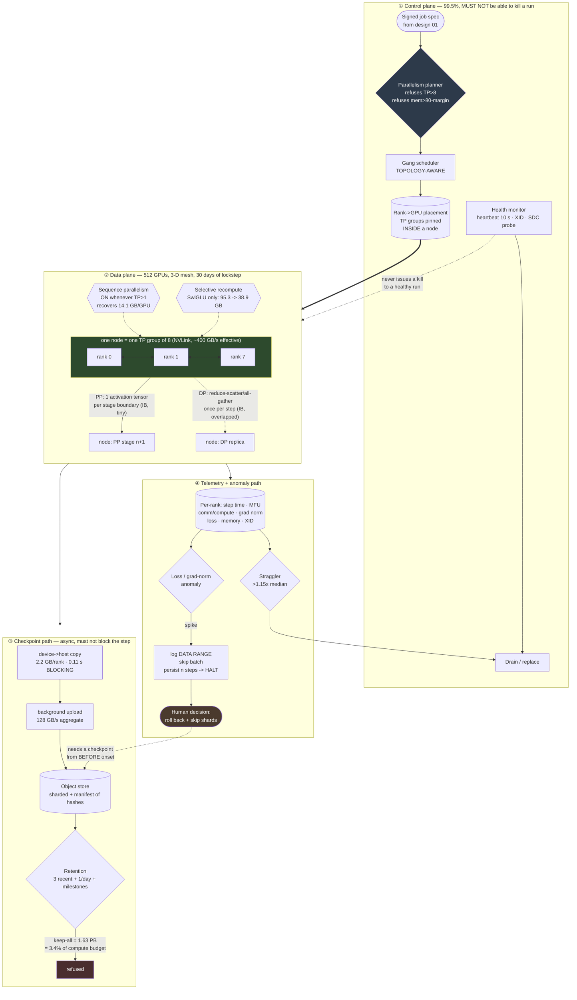

# 02 — HLD: Distributed Training Platform

> ← [01_requirements.md](01_requirements.md) · [system README](README.md) · → [03_lld.md](03_lld.md)

**Three-sentence compression:** The architecture is a **3-D device mesh** — TP=8 inside the NVLink
domain, PP=8 and DP=8 across InfiniBand — plus a control plane that must be able to die without killing
the run. The choice that matters most is that hierarchy, because tensor parallelism crossing a node
boundary costs 213% of compute time in communication versus 26.6% inside it. The failure I would
volunteer: **the loss spike at hour 300** — because it is the one failure where the correct response is
a judgement call with a six-figure cost, and the platform's job is to make that decision *possible*
(retained checkpoints, an identified data range) rather than to automate it.

---

## 2.1 Architecture

Three paths with different characteristics, and — unlike the serving designs in
[`27`](../../27_ai-platform-system-design/README.md) — the interesting split is not read/write but
**data plane vs control plane**: the data plane runs for 30 days in lockstep and must survive the
control plane restarting.

**Three things the diagram is drawn to make unavoidable:**

1. **A TP group never crosses the green node box.** That single constraint is 80% of the parallelism design.
2. **The dashed `HM -.-> MESH` arrow carries no kill authority.** A health monitor that can kill a run *is* an availability risk to the run.
3. **The loss-spike path terminates at a human**, and it depends on the object store still holding a pre-onset checkpoint — which is why retention and anomaly detection are the same design decision.

---

## 2.2 Component choices

| Concern | Choice | Why | Rejected alternative (and why not) | Revisit when |
|---|---|---|---|---|
| **Parallelism hierarchy** | **TP=8 inside the node; PP=8 and DP=8 across nodes** | The arithmetic: TP all-reduces 117 MB of bus volume 40× per micro-step. Over NVLink that is 11.7 ms against **44.2 ms of pure matmul time (26.6%)**; over IB it is 94.0 ms (**213%** — comm exceeds arithmetic and cannot be hidden) | **TP=16 spanning two nodes** — halves the per-GPU state and more than doubles step time. **PP=1, pure FSDP at DP=512** — simplest, and the per-layer all-gather of a 70B model over IB at DP=512 makes comm dominate; also the global batch becomes unmanageable. **TP=1, PP=64** — bubble control needs `m ≥ 256`, forcing an 8.4M-token global batch that changes the optimization; also 64 does not divide 80 layers. **TP=8, PP=16, DP=4** — genuinely competitive (0.1 days faster, 9 GB less memory) and rejected on *operational* grounds: DP=4 gives only 3 spare replicas for elastic recovery and a thin base for cross-replica SDC screening | NVLink domain size changes (NVL72-class systems make TP=16–72 viable and **invert this entire table**). Or model > ~200B where TP=8 no longer fits a stage |
| **DP sharding** | **FSDP / ZeRO-3 within the DP group** | Shards the remaining `16N/(TP·PP)` across DP=8, and its all-gather is per-layer and overlappable with compute | **DDP** — replicates 17.6 GB/rank of state; fits here, and wastes 15 GB/GPU that is better spent on micro-batch size (the ×0.62 kernel factor). **ZeRO-1 only** — less comm, less memory saving; a reasonable alternative if the all-gather turns out not to overlap well | Measured DP all-gather stops overlapping (the ×0.97 factor degrades) → drop to ZeRO-1 |
| **Pipeline schedule** | **Interleaved 1F1B, v=2, m=128** | Bubble 2.7% vs 17.9% for m=32/v=1. 1F1B also holds far fewer in-flight activations than GPipe | **GPipe** — same bubble formula, much more activation memory (holds all `m` micro-batches). **Zero-bubble schedules** — genuinely better on paper and add real scheduling complexity and a less-tested implementation for ~2.7 points | m cannot be raised because the global batch is already at the optimization limit; then a zero-bubble schedule earns its complexity |
| **Activation memory** | **Sequence parallelism always; selective recompute as the lever for `micro_bs > 1`** | SP recovers 14.1 GB/GPU at **zero** collective cost — there is no reason not to. Selective recompute takes activations from 11.9 to 4.9 GB/GPU for ~+8% compute, which is what makes `micro_bs=4` comfortable (43.1 vs 71.3 GB) — and micro-batch is the free MFU lever | **No recompute at micro_bs=4** — 71.3 GB against a 74 GB budget; fits on paper, no margin for fragmentation. **Full recompute** — +33% compute, which alone breaks the MFU floor. **Offload activations to host** — PCIe bandwidth makes it slower than recomputing. **Reaching for recompute to make the run *possible*** — a misread: 95.3 GB is un-sharded; TP=8/PP=8 already brings it to 11.9 GB/GPU | Sequence length past ~16k, where activation memory grows linearly and full recompute becomes necessary again |
| **Numerics** | **BF16 default; FP8 for MLP GEMMs gated on a validation-loss check** | BF16 needs no loss scaling. FP8 on the MLP GEMMs — 82% of each layer — gives a 1.33× blended speedup — **the planned margin against a 0.7-point MFU headroom**, not an optimization | **FP16** — needs a GradScaler and still overflows at scale. **FP8 everywhere including attention and the optimizer** — the remaining FLOPs are small and the numerical risk is not. **Ship FP8 on a throughput number alone** — the risk is a *quality* regression that a throughput benchmark cannot see | FR-12's loss check fails → FP8 does not ship, and the deadline conversation reopens (§1.6.3) |
| **Checkpointing** | **Sharded asynchronous: device→host copy then background upload, with a per-shard hash manifest** | 0.11 s blocking vs 8.8 s synchronous — 80× better for the cost of a background thread. The manifest is what makes "is this checkpoint valid?" answerable | **Single-rank gather + write** — minutes of blocking; unusable. **Sharded synchronous** — 0.49% overhead, fine but needlessly 20× worse. **No manifest** — a truncated upload becomes an unbootable checkpoint discovered at the worst possible moment | Object-store write drops below ~500 MB/s/node (A7), where the background upload no longer finishes between checkpoints |
| **Fault detection** | **10 s per-rank heartbeat + NCCL watchdog set to 10 min (not the ~30 min default)** | Detection p95 < 60 s. Worth **~$5,400 per flagship run** in avoided idle cluster (§1.6.5) | **NCCL default alone** — 30 minutes of 512 idle GPUs per failure, ~7 times a run. **A very short NCCL timeout (60 s)** — false-positive aborts during a legitimately long collective, which is worse than slow detection | Never leave at default. Shorten further only with measured evidence that no legitimate collective approaches the bound |
| **Health monitor authority** | **Advisory: it drains and reports; it cannot kill a healthy run** | A monitor with kill authority becomes an availability risk to the thing it monitors. A false positive at hour 300 is unrecoverable | **Auto-kill on health signal** — one bad probe costs 300 hours. **No monitor** — then a straggler or an SDC rank silently degrades the run for days | Never grant kill authority. Grant *drain* authority freely |
| **Elasticity** | **Elastic DP width, with global batch held constant by raising `m`** | Continue at DP=7 after a node loss rather than blocking for replacement. Holding the global batch constant means the *optimization* is unchanged — only throughput drops | **Block until replaced** — idles 448 healthy GPUs. **Continue at reduced global batch** — silently changes the training run, which is worse than being slower and is very hard to notice later | Never reduce global batch silently. If it must change, it is a new run |
| **Scheduler** | **Gang + topology-aware, with a reserved ablation partition** | All ranks start together or none do; TP groups are pinned within a node. The reserved partition is what makes [design 01](../01_research_experiment_platform/README.md)'s 30-min queue budget achievable | **Plain fair-share (e.g. default k8s)** — will happily place a TP group across two nodes and silently halve throughput. **Pure fair-share without reservation** — one flagship run starves every ablation | Cluster utilization < 50%, where the reservation becomes waste |
| **Data loading** | **Sequential shard streaming with a deterministic, cursor-persisted shuffle** | The requirement is 2.2 MB/s (§1.6.6). The real risks are shuffle quality and cursor determinism, not bandwidth | **A distributed caching/streaming tier** — solves a problem that does not exist at 2.2 MB/s. **Random access with an in-memory shuffle buffer** — fine, and the cursor becomes harder to persist exactly, which breaks bit-exact resume | Small-model regime (1B at 512 GPUs is ~155 MB/s) or sequence length changes the token rate by an order of magnitude |
| **Loss-anomaly response** | **Detect → log the data range → skip batch → escalate to a human after `n` steps** | Skipping one bad batch is safe and automatic. Deciding to discard 20 hours of training and skip a data range is a six-figure judgement call | **Auto-rollback** — a false positive throws away good training, automatically. **Alert only** — nobody is watching at 3 a.m. and the run continues into a divergence | Enough incident history exists to characterize spikes reliably; then auto-rollback for the well-understood classes only |

---

## 2.3 Data flow, narrated

**Path ① — from a signed spec to a placed mesh:**

1. **A signed job spec arrives** from [design 01](../01_research_experiment_platform/README.md) carrying the model config, token budget, deadline and data manifest. *Signed, because the scheduler must verify authorization without calling a control plane that may be down.*
2. **The planner enumerates feasible `(TP, PP, DP, micro_bs, m, recompute)` plans**, rejecting any with `TP > 8` and any whose predicted per-GPU memory exceeds 80 GB minus the safety margin. *It returns the top-k ranked by predicted step time rather than one answer — the choice involves trade-offs (global batch size, bubble, memory headroom) that a human should see.*
3. **The scheduler gang-schedules with topology awareness**, pinning each TP group of 8 within one node's NVLink domain. *This is the single placement constraint that matters; getting it wrong halves throughput silently.*
4. **Ranks initialize the 3-D mesh** and *verify* the plan: measured per-rank state size, an all-reduce bandwidth probe on each of the three mesh dimensions, and a deterministic numerics self-check. *Verify, not assume — a plan that says 400 GB/s of NVLink and gets 250 is better discovered at minute 2 than at day 12.*

**Path ② — the 30-day loop:**

5. **Each step processes `m`=128 micro-batches** through the pipeline on an interleaved 1F1B schedule.
6. **Within a micro-step**, TP all-reduces the activation tensor 4× per layer over NVLink; sequence parallelism turns the LayerNorm regions' all-reduces into reduce-scatter/all-gather pairs, unchanged in volume.
7. **SwiGLU intermediates are dropped on the forward pass and recomputed in backward.** *Chosen because they are 59% of activation memory and cheap to recompute — the ratio is what makes selective recompute better than either extreme.*
8. **After the last micro-batch, DP reduce-scatters gradients** and all-gathers the updated shards, overlapped with the tail of backward.
9. **The optimizer step runs on fp32 master weights**; BF16 weights are re-cast for the next step's compute.
10. **Telemetry is emitted per rank at ≥ 0.1 Hz**, including the comm/compute split. *Without that split, an MFU regression is a number with no next action.*

**Path ③ — checkpointing without blocking:**

11. **Every 30 minutes each rank copies its 2.2 GB shard device→host** (0.11 s, blocking) and returns to training.
12. **A background thread uploads** to the object store and writes a **manifest of per-shard hashes**. *The checkpoint is not "complete" until the manifest lands — an unmanifested checkpoint is a checkpoint you will discover is truncated at the worst moment.*
13. **The retention job prunes** to 3 recent + 1/day + milestones. *Keep-everything is refused with the $37.4k/month arithmetic in the error message, because the requester almost always just hasn't done the sum.*

**Path ④ — anomalies:**

14. **The straggler detector publishes the per-rank step-time distribution.** A rank persistently above 1.15× median is flagged and drainable. *One slow rank gates every collective, so it gates all 512 GPUs — this is the cheapest large win in the platform.*
15. **Gradient-norm and loss monitors watch a trailing window.** A spike beyond `k`σ **logs the exact data range first**, then skips the batch. *Logging first, because the data range is the only thing that makes the later human decision possible.*
16. **If the spike persists**, the run halts and pages a human with: the trailing loss curve, the suspect data range, the list of retained checkpoints, and the cost of each rollback option. *The platform's job is to make the decision possible, not to make it.*

---

## 2.4 NFR mapping

| NFR ([§1.3](01_requirements.md)) | Delivered by |
|---|---|
| **70B × 1.4T in ≤ 30 days** | The MFU budget (§1.5) closing at 45.9% vs 45.2% required — with **FP8 (FR-12) as the planned margin**, not a stretch goal |
| **MFU ≥ 45.2%** | TP inside NVLink (26.6% of compute, not 213%) · interleaved 1F1B v=2 (2.7% bubble) · overlapped DP collectives · recompute kept selective (+8%, not +33%) · straggler detection |
| Per-GPU memory ≤ 80 GB with ≥6 GB margin | Sharding to 17.6 GB of state + activations 11.9 GB (no recompute) or 4.9 GB (selective) after TP/SP + SP's 14.1 GB recovery ⇒ 35.5 GB used at `micro_bs`=1, 43.1 GB at `micro_bs`=4 with selective |
| Checkpoint blocking < 1 s | Async sharded: 0.11 s device→host, background upload |
| **Fault detection < 60 s** | 10 s heartbeat + NCCL watchdog at 10 min instead of the ~30 min default (worth $5,400/run) |
| Recovery < 20 min | Detection 60 s + drain/reschedule 180 s + sharded parallel reload 60 s + ≤15 min redone work |
| Bit-exact resume incl. data cursor | Full RNG + cursor in the checkpoint; loss-curve continuity asserted at resume |
| Retention 39.5 TB | Retention policy enforced in the platform (FR-9), keep-all refused with arithmetic |
| Straggler tolerance 1.15× | Per-rank step-time distribution + drain authority for the health monitor |
| ≥ 92% productive GPU-hours | 0.34% faults + 0.006% checkpointing + drains + the ablation reservation |
| Data loader ≥ 10 MB/s | Trivially met at a 2.2 MB/s requirement — and the design says so rather than building for it |
| Control plane 99.5% **without killing runs** | Health monitor is advisory-only; signed specs verifiable offline; ranks continue through a control-plane restart |
| Cost ≤ $1.5M | $1.11M on-demand / $664k reserved, +15% contingency = $1.27M |

---

## 2.5 Failure modes and blast radius

| Failure | Detection | Blast radius | Mitigation / degraded mode |
|---|---|---|---|
| **Loss spike at hour 300** | Loss / grad-norm beyond `k`σ of trailing window | **Potentially the whole run.** May or may not recover | Log the data range → skip batch → persist ⇒ halt and page. Human chooses: continue, roll back + skip shards, or restart. **Requires a retained pre-onset checkpoint — which is why FR-9 and FR-10 are one decision** |
| **Single GPU / node failure** | Heartbeat (10 s) + XID; NCCL watchdog as backstop | All 512 ranks stall (a collective blocks on the slowest) | Detect < 60 s, drain the node, restart from checkpoint on healthy capacity, or continue **elastic** at reduced DP width with `m` raised to hold the global batch constant |
| **Straggler** (thermal throttle, degraded NVLink, noisy neighbour) | Per-rank step time > 1.15× median for 10 steps | **All 512 GPUs run at the slowest rank's pace** — the most under-appreciated failure | Flag and drain. A 15% straggler costs more than the drain+restart, which is exactly where the threshold comes from |
| **Silent data corruption** | Deterministic per-rank self-check + cross-DP-replica gradient-norm comparison | Silently wrong model. **Worst case in the document** because it may never be noticed | Drain any rank failing the probe. **Honest gap:** subtle SDC shifting loss by 0.5% may be undetectable; the real mitigation is retention wide enough to roll back past a suspected onset (§1.7 Q5) |
| **TP group split across nodes** (scheduler bug) | Startup topology assertion + the bandwidth probe | Comm goes from 26.6% to 213% of compute — and it looks like "training is slow", not like a bug | **Assert at startup and refuse to start.** A run that begins mis-placed will not be caught for days |
| **Checkpoint corrupt / truncated** | Per-shard hash manifest verified on write **and** on read | Discovered exactly when you need it most | Manifest + verify-on-write; keep 3 recent so one bad checkpoint is never fatal; a checkpoint without a manifest is not a checkpoint |
| **Object store slow or full** | Upload backlog depth; bytes-used vs retention budget | Background uploads fall behind; cadence degrades | Alert at 70% of budget, not 95%. Async upload means the *step* never blocks; the degraded mode is a longer effective checkpoint interval, which raises expected redone work |
| **Control-plane outage** | Health check | **No effect on the run.** No new jobs; no drains | Signed specs verify offline; ranks hold their mesh. Degraded mode: "run continues, cannot start or drain" |
| **NCCL hang with no timeout** (the nasty one) | Heartbeat is the *only* signal — the collective never returns | 512 GPUs idle indefinitely | This is precisely why the 10 s heartbeat exists **in addition to** the NCCL watchdog. Watchdog alone at 30 min = $768 of idle cluster per event; a hang that never times out = unbounded |
| **OOM at hour 200** | Memory high-water telemetry | Run dies, restarts from checkpoint | Declared ≥6 GB safety margin (fragmentation and transient allocations are real); memory high-water tracked per rank so a slow creep is visible before it's fatal |
| **Data cursor lost on resume** | Loss-curve discontinuity assertion at resume | **Silently re-trains on the same shards — and looks like fast progress** | Cursor is in the checkpoint; resume asserts loss continuity. Treated as a hard failure (FR-6), not a warning |
| **FP8 quality regression** | Validation loss vs the BF16 reference over ≥5,000 steps | A subtly worse model at 1.33× speed | FR-12 gates on the loss check, not the throughput number. **A throughput benchmark cannot see this failure** |
| **Global batch silently changed** by elastic DP | Assertion that `DP × m × micro_bs × s` is invariant | A different training run wearing the same name | Elastic DP raises `m` to hold the product constant; a change that cannot be compensated halts instead |

**Volunteered unprompted:** the loss spike. It is the only failure here whose correct response is a
judgement call with a six-figure cost, and the platform is measured on whether that call is *possible* —
is there a pre-onset checkpoint, is the data range identified, is the rollback cost quantified — rather
than on whether it was automated. Most designs volunteer node failure instead, which is the easy one.

---

## 2.6 Scale plan

| Scale | First bottleneck | Why | What changes |
|---|---|---|---|
| **10× GPUs** (512 → 5,120) | **DP collective + fault rate**, together | DP width 8 → 80. The reduce-scatter/all-gather spans 640 nodes, so the ×0.97 factor degrades. Simultaneously cluster MTBF falls to 9.8 h — **72 interruptions per run**, and restart time starts to dominate | Hierarchical DP (intra-node → intra-rack → cross-rack reduction trees); checkpoint cadence to ~10 min; **elastic DP becomes mandatory, not P1**. And the global batch grows 10× unless `m` is cut, which changes the optimization — so at this scale batch-size scaling becomes a *research* question, not an infra one |
| **10× GPUs** (second) | **Straggler probability** | With 5,120 GPUs, the chance that *some* rank is degraded at any moment approaches 1 | Straggler detection stops being an optimization and becomes a continuous background process, with automatic drain and elastic continuation |
| **10× model** (70B → 700B) | **TP=8 no longer holds a stage** | `16N` = 11.3 TB. Even at TP=8 × PP=64, per-rank state is 22 GB — workable — but activations per stage and the parameter all-gather volume both grow | Likely MoE (FR-17) rather than dense, which **replaces the dominant collective with all-to-all and makes expert load imbalance the new failure mode** — a different design. If staying dense: TP=8 × PP=32 × DP=20 and sequence-length-dependent recompute |
| **10× sequence** (4k → 40k) | **Activation memory**, linearly | Selective recompute's 38.9 GB becomes 389 GB per micro-batch | Full recompute (+33% compute, breaking the current MFU floor) **plus** context parallelism to shard the sequence dimension across ranks. The MFU floor must be renegotiated — this is a case where the honest answer is that the deadline changes |
| **10× tokens** (1.4T → 14T, i.e. ~10× Chinchilla) | **Wall clock, and nothing else** | 295 days at the same MFU | Not a systems problem: either 10× the GPUs (and inherit the 10×-GPU bottlenecks above) or accept ~10 months. **This is the scale case where the right answer is a business decision, and saying so is better than inventing an architecture** |
| **NVL72-class hardware** | **The whole §2.2 table inverts** | A 72-GPU NVLink domain means TP=16–72 becomes cheap, which changes the optimal `(TP, PP, DP)` completely and may eliminate PP | Re-run the planner. **This is the `revisit-when` that actually fires in practice** — the parallelism hierarchy is a function of the interconnect topology, not a law |

**The 10× answer that matters:** at 5,120 GPUs the binding constraint stops being throughput and becomes
**fault rate** — 72 interruptions per run means the platform's value is almost entirely in detection and
restart speed, not in MFU. The design's centre of gravity moves from §1.5 to §1.6.5.

---

← [01_requirements.md](01_requirements.md) · [system README](README.md) · → [03_lld.md](03_lld.md)
