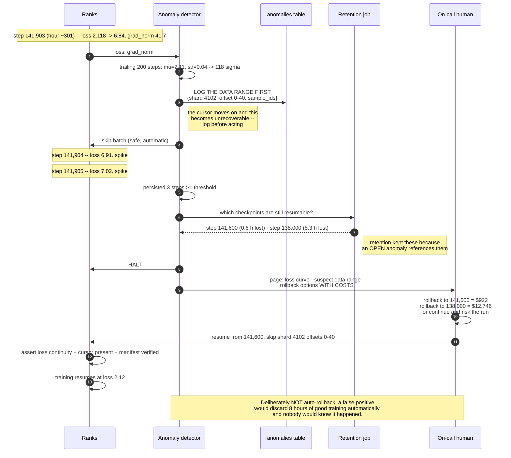
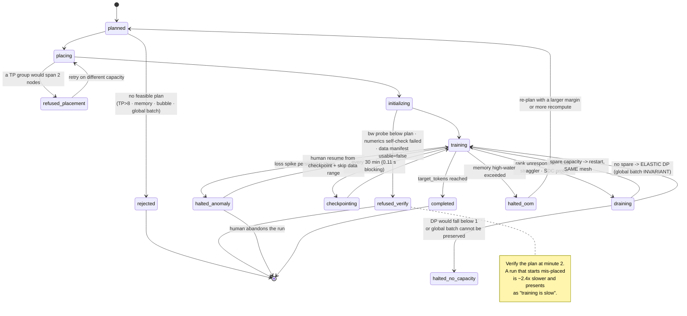

# 03 — LLD: Distributed Training Platform

> ← [02_hld.md](02_hld.md) · [system README](README.md) · → [04_production_and_interview.md](04_production_and_interview.md)

**Three-sentence compression:** The schema's job is to make a run's **exact mesh, plan and data cursor
recoverable from any checkpoint**, because a resume that loses the cursor silently re-trains on the same
shards and looks like fast progress. The algorithm carrying real judgement is the **parallelism planner**
— it enumerates the `(TP, PP, DP, micro_bs, m, recompute)` space, rejects everything that crosses the
NVLink domain or exceeds the memory margin, and ranks the survivors by predicted step time. The failure
path worth drawing is **the loss spike**, because the platform's job there is to make a six-figure human
decision possible, not to automate it.

---

## 3.1 Data models

Postgres for the control plane; object store for checkpoints and telemetry rollups. Per-rank
high-frequency telemetry goes to a TSDB — the control-plane DB never sees 512 ranks × 10 Hz.

### 3.1.1 The plan — a first-class, validated object

```sql
CREATE TYPE recompute_policy AS ENUM ('none', 'selective', 'full');

CREATE TABLE model_configs (
    config_hash     BYTEA PRIMARY KEY,
    name            TEXT   NOT NULL,
    n_layers        INT    NOT NULL,
    d_model         INT    NOT NULL,
    n_q_heads       INT    NOT NULL,
    n_kv_heads      INT    NOT NULL,
    head_dim        INT    NOT NULL,
    d_ff            INT    NOT NULL,
    vocab_size      INT    NOT NULL,
    seq_len         INT    NOT NULL,
    -- Derived and STORED, because every planner decision keys off it and recomputing
    -- it in three places is how two of them end up disagreeing.
    n_params        BIGINT NOT NULL,
    CONSTRAINT gqa_valid CHECK (n_q_heads % n_kv_heads = 0),
    CONSTRAINT dim_valid CHECK (n_q_heads * head_dim = d_model)
);

CREATE TABLE parallelism_plans (
    plan_id         UUID PRIMARY KEY,
    config_hash     BYTEA NOT NULL REFERENCES model_configs(config_hash),
    world_size      INT   NOT NULL,
    tp              INT   NOT NULL,
    pp              INT   NOT NULL,
    dp              INT   NOT NULL,
    micro_bs        INT   NOT NULL,
    n_micro_batches INT   NOT NULL,           -- m
    recompute       recompute_policy NOT NULL,
    sequence_parallel BOOLEAN NOT NULL,
    fp8_mlp         BOOLEAN NOT NULL DEFAULT false,

    -- Predictions, stored so a measured-vs-predicted delta is a first-class signal
    pred_state_gb_per_gpu   REAL NOT NULL,
    pred_act_gb_per_gpu     REAL NOT NULL,
    pred_total_gb_per_gpu   REAL NOT NULL,
    pred_step_seconds       REAL NOT NULL,
    pred_mfu                REAL NOT NULL,
    pred_bubble_frac        REAL NOT NULL,
    pred_tp_comm_frac       REAL NOT NULL,
    global_batch_tokens     BIGINT NOT NULL,

    nvlink_domain   INT NOT NULL,             -- 8 on an H100 node
    mem_margin_gb   REAL NOT NULL,            -- declared safety margin, >= 6

    -- FR-1 as database invariants. These are the two rules that must never be bypassed,
    -- so they are not left to the planner's application code.
    CONSTRAINT mesh_matches_world CHECK (tp * pp * dp = world_size),
    CONSTRAINT tp_within_nvlink   CHECK (tp <= nvlink_domain),
    CONSTRAINT fits_memory        CHECK (pred_total_gb_per_gpu <= 80.0 - mem_margin_gb),
    CONSTRAINT sp_requires_tp     CHECK (NOT sequence_parallel OR tp > 1),
    CONSTRAINT enough_micro       CHECK (n_micro_batches >= pp)   -- else the pipe never fills
);
-- Why tp_within_nvlink is a CHECK and not a lint: a plan that crosses the node boundary is
-- ~2.4x slower and presents as "training is slow", not as an error. It would run for days.
```

### 3.1.2 Runs, mesh placement and the resume state

```sql
CREATE TYPE run_status AS ENUM
  ('planned','placing','initializing','training','checkpointing','draining',
   'halted_anomaly','halted_oom','failed','completed','cancelled');

CREATE TABLE runs (
    run_id          UUID PRIMARY KEY,
    plan_id         UUID NOT NULL REFERENCES parallelism_plans(plan_id),
    job_spec_sig    TEXT NOT NULL,            -- signature from design 01; verifiable OFFLINE
    data_manifest   BYTEA NOT NULL,           -- design 02 §3.1.1; must be usable=true
    target_tokens   BIGINT NOT NULL,
    deadline        TIMESTAMPTZ,
    status          run_status NOT NULL DEFAULT 'planned',
    started_at      TIMESTAMPTZ,
    tokens_done     BIGINT NOT NULL DEFAULT 0,
    steps_done      INT    NOT NULL DEFAULT 0,
    gpu_hours       REAL   NOT NULL DEFAULT 0,
    -- Measured, so measured-vs-predicted is queryable, which is the whole point of §1.5
    measured_mfu    REAL,
    measured_step_s REAL,
    restart_count   INT    NOT NULL DEFAULT 0
);

CREATE TABLE rank_placement (
    run_id      UUID NOT NULL REFERENCES runs(run_id) ON DELETE CASCADE,
    rank        INT  NOT NULL,
    tp_rank     INT  NOT NULL,
    pp_rank     INT  NOT NULL,
    dp_rank     INT  NOT NULL,
    node_id     TEXT NOT NULL,
    gpu_index   INT  NOT NULL,
    PRIMARY KEY (run_id, rank),
    UNIQUE (run_id, tp_rank, pp_rank, dp_rank)
);
-- THE placement assertion (02_hld §2.5): every TP group must sit on ONE node.
-- Checked at startup by this query returning zero rows; a non-empty result refuses to start.
--   SELECT pp_rank, dp_rank, count(DISTINCT node_id) AS nodes
--   FROM rank_placement WHERE run_id = $1
--   GROUP BY pp_rank, dp_rank HAVING count(DISTINCT node_id) > 1;
CREATE INDEX idx_placement_node ON rank_placement (run_id, node_id);

CREATE TABLE checkpoints (
    ckpt_id         UUID PRIMARY KEY,
    run_id          UUID NOT NULL REFERENCES runs(run_id),
    step            INT  NOT NULL,
    tokens_done     BIGINT NOT NULL,
    uri_prefix      TEXT NOT NULL,
    shard_count     INT  NOT NULL,
    total_bytes     BIGINT NOT NULL,

    -- ===== the resume state. All NOT NULL. FR-6. =====
    lr_schedule_state JSONB NOT NULL,
    rng_state_uri     TEXT  NOT NULL,          -- per-rank RNG, sharded like the weights
    data_cursor       JSONB NOT NULL,          -- {shard_index, offset_in_shard, epoch, perm_seed}
    loss_at_step      REAL  NOT NULL,          -- for the resume continuity assertion

    -- ===== validity. A checkpoint without a complete manifest is NOT a checkpoint. =====
    manifest_uri    TEXT,
    manifest_complete BOOLEAN NOT NULL DEFAULT false,
    verified_at     TIMESTAMPTZ,
    retention_class TEXT NOT NULL,             -- 'recent' | 'daily' | 'milestone' | 'prune'
    created_at      TIMESTAMPTZ NOT NULL DEFAULT now(),
    UNIQUE (run_id, step)
);
-- Why data_cursor is NOT NULL and JSONB: losing it means silently re-training on the same
-- shards, which LOOKS LIKE FAST PROGRESS (02_hld §2.5). It is the field most likely to be
-- forgotten and the most expensive to forget.
CREATE INDEX idx_ckpt_resume ON checkpoints (run_id, step DESC) WHERE manifest_complete;
CREATE INDEX idx_ckpt_retention ON checkpoints (retention_class, created_at);
```

### 3.1.3 Telemetry and anomalies

```sql
-- Per-rank, high frequency -> TSDB hypertable, NOT the control-plane tables.
CREATE TABLE rank_metrics (
    run_id      UUID NOT NULL,
    step        INT  NOT NULL,
    rank        INT  NOT NULL,
    step_ms     REAL NOT NULL,
    compute_ms  REAL NOT NULL,
    tp_comm_ms  REAL NOT NULL,               -- the six-factor MFU split lives here...
    pp_wait_ms  REAL NOT NULL,               -- ...without it an MFU regression has no next action
    dp_comm_ms  REAL NOT NULL,
    optim_ms    REAL NOT NULL,
    data_wait_ms REAL NOT NULL,
    mem_alloc_gb REAL NOT NULL,
    mem_peak_gb  REAL NOT NULL,
    grad_norm   REAL,
    loss        REAL,
    xid_errors  INT NOT NULL DEFAULT 0,
    PRIMARY KEY (run_id, step, rank)
);
SELECT create_hypertable('rank_metrics', 'step', chunk_time_interval => 2000);

-- Straggler detection reads this, once per step, instead of scanning 512 rows.
CREATE MATERIALIZED VIEW step_rollup AS
SELECT run_id, step,
       percentile_cont(0.5)  WITHIN GROUP (ORDER BY step_ms) AS median_ms,
       percentile_cont(0.99) WITHIN GROUP (ORDER BY step_ms) AS p99_ms,
       max(step_ms) AS max_ms,
       (array_agg(rank ORDER BY step_ms DESC))[1] AS slowest_rank,
       avg(compute_ms) AS compute_ms, avg(tp_comm_ms) AS tp_comm_ms,
       avg(pp_wait_ms) AS pp_wait_ms, avg(dp_comm_ms) AS dp_comm_ms,
       avg(loss) AS loss, avg(grad_norm) AS grad_norm, max(mem_peak_gb) AS mem_peak_gb
FROM rank_metrics GROUP BY run_id, step;

CREATE TABLE anomalies (
    anomaly_id  UUID PRIMARY KEY,
    run_id      UUID NOT NULL REFERENCES runs(run_id),
    step        INT  NOT NULL,
    kind        TEXT NOT NULL,   -- 'loss_spike'|'grad_norm_spike'|'straggler'|'sdc'|'oom'|'nccl_hang'
    severity    TEXT NOT NULL,   -- 'skip_batch' | 'halt' | 'drain_rank'
    detail      JSONB NOT NULL,
    -- The single most important column here: what data was in the batch.
    -- Without it, the human decision in §3.4.2 is not possible.
    data_range  JSONB,           -- {shard_index, offset_start, offset_end, sample_ids}
    action_taken TEXT NOT NULL,
    resolved_by TEXT,            -- 'auto_skip' | 'human_rollback' | 'human_continue'
    rollback_to UUID REFERENCES checkpoints(ckpt_id),
    created_at  TIMESTAMPTZ NOT NULL DEFAULT now()
);
CREATE INDEX idx_anomalies_run ON anomalies (run_id, created_at DESC);
```

---

## 3.2 API contracts

```http
POST /v1/plans:enumerate
Authorization: Bearer <oidc-jwt>
{ "config": {"n_layers":80,"d_model":8192,"n_q_heads":64,"n_kv_heads":8,"head_dim":128,
              "d_ff":28672,"vocab_size":128256,"seq_len":4096},
  "world_size":512, "nvlink_domain":8, "target_tokens":1.4e12,
  "deadline_days":30, "mem_margin_gb":6.0,
  "global_batch_tokens_max": 8388608 }

200 OK
{ "n_params": 70552518656,
  "total_flops": 5.926e23,
  "mfu_required_for_deadline": 0.452,
  "plans": [
    { "rank":1, "tp":8,"pp":8,"dp":8,"micro_bs":1,"m":128,
      "recompute":"selective","sequence_parallel":true,"fp8_mlp":false,
      "pred_state_gb_per_gpu":17.6, "pred_act_gb_per_gpu":6.1,
      "pred_total_gb_per_gpu":29.7,
      "pred_step_seconds":7.64, "pred_mfu":0.459, "pred_bubble_frac":0.027,
      "pred_tp_comm_frac":0.197,
      "global_batch_tokens":4194304, "pred_days":29.5,
      "meets_deadline": true, "headroom_points":0.7,
      "notes":["micro_bs could rise to 4 within the memory margin -- the cheapest MFU lever"] },
    { "rank":2, "tp":8,"pp":8,"dp":8,"micro_bs":1,"m":128,"fp8_mlp":true,
      "pred_mfu":0.611,"pred_days":22.2,"meets_deadline":true,
      "notes":["FP8 requires the FR-12 validation-loss gate before shipping"] }
  ],
  "rejected": [
    { "tp":16,"pp":4,"dp":8, "reason":"tp_exceeds_nvlink_domain",
      "detail":"TP=16 spans 2 nodes; TP comm would be 456% of compute vs 57% intra-node
                 (100.7 ms vs 12.6 ms, against 22.1 ms of matmul). At TP=8 the same
                 comparison is 213% inter-node vs 26.6% intra-node." },
    { "tp":1,"pp":1,"dp":512, "reason":"memory",
      "detail":"per-GPU state 16N/1 = 1129 GB > 74 GB budget" },
    { "tp":8,"pp":8,"dp":8,"micro_bs":1,"m":32, "reason":"bubble",
      "detail":"m=32 gives an 17.9% bubble; m >= 4*pp recommended" },
    { "tp":1,"pp":64,"dp":8,"m":256, "reason":"global_batch",
      "detail":"8.4M tokens/step exceeds global_batch_tokens_max; would change the optimization" }
  ] }
```

**Note what the `rejected` array is for.** A planner that returns only feasible plans hides its
reasoning; returning the rejections *with the arithmetic* is what lets a human disagree with a
constraint rather than work around it.

```http
POST /v1/runs
{ "plan_id":"...", "job_spec_sig":"...", "data_manifest":"sha256:..." }
201 { "run_id":"...", "status":"placing" }
409 data_manifest_not_usable   — the manifest is marked usable=false (design 02 FR-1)
409 plan_violates_placement    — no topology satisfies TP=8 within a node on free capacity
422 deadline_unreachable       — body carries the required-vs-budgeted MFU and the FP8 option

GET /v1/runs/{id}
200 { "status":"training", "steps_done":141902, "tokens_done":5.95e11,
      "measured": {"mfu":0.441, "step_s":7.95, "days_projected":30.7},
      "predicted": {"mfu":0.459, "step_s":7.64, "days_projected":29.5},
      "delta_explains": [
        {"factor":"tp_comm_frac","predicted":0.197,"measured":0.213},
        {"factor":"bubble_frac","predicted":0.027,"measured":0.031},
        {"factor":"data_wait_frac","predicted":0.010,"measured":0.028,
         "note":"largest single deviation -- profile the loader first"}],
      "projection":"MISSES the 30-day deadline by 0.7 days at current MFU",
      "levers":[{"lever":"micro_bs 1 -> 4","est_mfu_gain":0.02},
                {"lever":"fp8_mlp","est_speedup":1.33,"gate":"FR-12 loss check"}] }
```

> **The `delta_explains` block is the point of the whole telemetry schema.** "MFU is 44.1% instead of
> 45.9%" is not actionable; "`data_wait_frac` is 2.8× its budget" is.

```http
GET  /v1/runs/{id}/checkpoints?resumable=true
200 { "checkpoints":[
        {"ckpt_id":"...","step":141600,"tokens_done":5.94e11,"loss_at_step":2.118,
         "manifest_complete":true,"verified_at":"...","retention_class":"recent",
         "data_cursor":{"shard_index":4118,"offset_in_shard":229376,"epoch":0,
                        "perm_seed":8891},
         "size_gb":1129.0}] }

POST /v1/runs/{id}/checkpoints/{ckpt}:resume
{ "skip_data_ranges":[{"shard_index":4102,"offset_start":0,"offset_end":40}] }
202 { "status":"placing", "asserts":["loss_continuity","cursor_present","manifest_verified"] }
409 manifest_incomplete   — refuses to resume from an unverified checkpoint
409 cursor_missing        — hard failure, never a warning (FR-6)

GET  /v1/runs/{id}/anomalies
200 { "anomalies":[
       {"step":141903,"kind":"loss_spike","severity":"halt",
        "detail":{"loss":6.84,"trailing_mean":2.11,"trailing_std":0.04,"sigmas":118.2,
                  "grad_norm":41.7,"persisted_steps":3},
        "data_range":{"shard_index":4102,"offset_start":0,"offset_end":40,
                      "sample_ids":[...]},
        "action_taken":"skipped batch, then halted after 3 consecutive steps",
        "rollback_options":[
          {"ckpt_id":"...","step":141600,"work_lost_hours":0.6,"cost_usd":922},
          {"ckpt_id":"...","step":138000,"work_lost_hours":8.3,"cost_usd":12746}]}] }

POST /v1/runs/{id}/ranks/{rank}:drain      # health monitor has DRAIN authority, never KILL
202 { "action":"drain", "run_continues":true, "mode":"elastic_dp",
      "dp_width":"8 -> 7", "m":"128 -> 146",
      "global_batch_tokens":"4194304 -> 4194304 (INVARIANT)" }
```

**Cross-cutting rules:** the job-spec signature must be **verifiable offline** (the run cannot depend on
a control plane that may be down); `422` bodies carry the arithmetic that failed; the drain endpoint
exists but there is **no kill endpoint for a healthy run**.

---

## 3.3 Core algorithms

### 3.3.1 The parallelism planner

The algorithm with the real judgement in it. Note it is a *bounded enumeration*, not an optimizer — the
space is small enough to enumerate exactly, and exact beats clever here.

```python
NVLINK_DOMAIN = 8        # H100 node. THE number that shapes everything.
HBM_GB = 80.0

def enumerate_plans(cfg, world_size, *, target_tokens, deadline_days,
                    mem_margin_gb=6.0, global_batch_max=8 << 20, top_k=5):
    N = param_count(cfg)
    C = 6 * N * target_tokens
    mfu_required = C / (world_size * PEAK_BF16 * deadline_days * 86400)

    feasible, rejected = [], []
    for tp in divisors(world_size):
        # --- HARD CONSTRAINT, checked first and cheaply. 02_hld §2.2 row 1. ---
        if tp > NVLINK_DOMAIN:
            rejected.append(dict(tp=tp, reason="tp_exceeds_nvlink_domain",
                detail=f"TP={tp} spans {tp/NVLINK_DOMAIN:.0f} nodes; TP comm would be "
                       f"{tp_comm_frac(cfg, tp, inter_node=True):.0%} of compute vs "
                       f"{tp_comm_frac(cfg, tp, inter_node=False):.0%} intra-node"))
            continue
        for pp in divisors(world_size // tp):
            dp = world_size // (tp * pp)
            for micro_bs in (1, 2, 4, 8):
                for m in (pp, 2 * pp, 4 * pp, 8 * pp, 16 * pp):
                    gb = dp * m * micro_bs * cfg.seq_len
                    if gb > global_batch_max:
                        rejected.append(dict(tp=tp, pp=pp, dp=dp, m=m, reason="global_batch",
                            detail=f"{gb/1e6:.1f}M tokens/step exceeds the cap; raising the "
                                   f"global batch CHANGES THE OPTIMIZATION, it does not "
                                   f"just go faster"))
                        continue
                    for rc in ("selective", "full", "none"):
                        mem = memory_model(cfg, tp, pp, micro_bs, rc, sequence_parallel=(tp > 1))
                        if mem.total_gb > HBM_GB - mem_margin_gb:
                            rejected.append(dict(tp=tp, pp=pp, dp=dp, micro_bs=micro_bs,
                                recompute=rc, reason="memory",
                                detail=f"{mem.total_gb:.1f} GB > "
                                       f"{HBM_GB - mem_margin_gb:.1f} GB budget "
                                       f"(state {mem.state_gb:.1f} + act {mem.act_gb:.1f})"))
                            continue
                        perf = perf_model(cfg, tp, pp, dp, micro_bs, m, rc)
                        if perf.bubble_frac > 0.08:
                            rejected.append(dict(tp=tp, pp=pp, m=m, reason="bubble",
                                detail=f"m={m} gives a {perf.bubble_frac:.1%} bubble; "
                                       f"m >= 4*pp recommended"))
                            continue
                        days = C / (world_size * PEAK_BF16 * perf.mfu * 86400)
                        feasible.append(Plan(tp, pp, dp, micro_bs, m, rc, mem, perf, days,
                            meets_deadline=days <= deadline_days,
                            headroom_points=(perf.mfu - mfu_required) * 100))

    feasible.sort(key=lambda p: p.pred_step_seconds)
    # Return the REJECTIONS too, with their arithmetic -- a planner that hides its
    # reasoning invites people to work around constraints instead of arguing with them.
    return dict(n_params=N, total_flops=C, mfu_required=mfu_required,
                plans=feasible[:top_k], rejected=dedupe_reasons(rejected))
```

```python
def memory_model(cfg, tp, pp, micro_bs, recompute, sequence_parallel):
    """The 16N rule + the activation arithmetic from 00_concepts §3."""
    N = param_count(cfg)
    state_gb = 16 * N / (tp * pp) / 1e9                       # 16 bytes/param, sharded

    layers_per_stage = cfg.n_layers / pp
    s, b, h = cfg.seq_len, micro_bs, cfg.d_model

    # Per-layer saved tensors (BF16, FlashAttention so no s^2 term).
    attn_qkv = s * b * (cfg.n_q_heads + 2 * cfg.n_kv_heads) * cfg.head_dim * 2
    around   = 6 * s * b * h * 2          # layer in, LN1 out, attn out, Wo out, LN2 out, down out
    swiglu   = 3 * s * b * cfg.d_ff * 2   # gate, up, product -- 59% of the total
    per_layer = {"none": around + attn_qkv + swiglu,
                 "selective": around + attn_qkv,          # drop the SwiGLU intermediates
                 "full": 2 * s * b * h * 2}[recompute]      # layer input only

    # TP shards most of it; SP additionally shards the LN/dropout regions that TP leaves
    # replicated (00_concepts §4.5 -- the free 14 GB).
    replicated = (3 * s * b * h * 2) if not sequence_parallel else (3 * s * b * h * 2) / tp
    sharded = (per_layer - 3 * s * b * h * 2) / tp
    act_per_layer = max(0.0, sharded) + replicated

    # 1F1B keeps up to pp micro-batches in flight in the earliest stage.
    in_flight = min(pp, 2) if recompute == "full" else pp
    act_gb = act_per_layer * layers_per_stage * in_flight / 1e9
    return Mem(state_gb=state_gb, act_gb=act_gb, total_gb=state_gb + act_gb + WORKSPACE_GB)


def tp_comm_frac(cfg, tp, inter_node: bool):
    """00_concepts §5.3 -- the 8x cliff, as one function."""
    if tp == 1:
        return 0.0
    payload = cfg.seq_len * 1 * cfg.d_model * 2                 # 67.1 MB at the reference config
    bus = 2 * (tp - 1) / tp * payload                            # ring all-reduce bus volume
    bw = BW_IB if inter_node else BW_NVLINK                      # 50e9 vs 400e9 -- 8x
    comm_s = bus / bw * 4 * cfg.n_layers                         # 4 all-reduces per layer
    compute_s = 6 * param_count(cfg) * cfg.seq_len / tp / (PEAK_BF16 * KERNEL_EFF)
    return comm_s / compute_s
```

**Why enumeration and not an optimizer:** `world_size` has few divisors, `micro_bs` and `m` are small
discrete sets, and `recompute` has three values — a few thousand candidates, evaluated in milliseconds.
An optimizer would add a hyperparameter and remove the ability to explain *why* a plan was rejected.

### 3.3.2 The MFU budget, as code

```python
MFU_FACTORS = [
    ("kernel_efficiency",  0.62, "matmul efficiency on real shapes, incl. FlashAttention"),
    ("tp_comm_residual",   0.92, "TP all-reduce not hidden behind compute"),
    ("pp_bubble",          0.95, "interleaved 1F1B, m=128, v=2"),
    ("dp_comm_residual",   0.97, "reduce-scatter/all-gather overlapped with backward"),
    ("non_matmul",         0.92, "LayerNorm, softmax, elementwise, optimizer step"),
    ("stalls_stragglers",  0.95, "data stalls and straggler jitter"),
]

def budgeted_mfu():
    mfu = 1.0
    for _, f, _ in MFU_FACTORS:
        mfu *= f
    return mfu                                    # 0.459


def attribute_mfu_gap(measured, per_factor_measured):
    """The diagnostic that makes §1.5 worth writing down.

    An MFU regression is only actionable if you know WHICH factor moved. Rank the
    factors by (measured/budgeted) ratio and profile the worst one first.
    """
    rows = []
    for name, budget, desc in MFU_FACTORS:
        got = per_factor_measured.get(name)
        if got is None:
            continue
        rows.append(dict(factor=name, budgeted=budget, measured=got,
                         ratio=got / budget, description=desc))
    rows.sort(key=lambda r: r["ratio"])           # worst ratio first
    return dict(budgeted_mfu=budgeted_mfu(), measured_mfu=measured,
                worst_factor=rows[0]["factor"] if rows else None, factors=rows)


def days_to_train(cfg, tokens, world_size, mfu):
    """THE double-count trap (00_concepts §6.1): do NOT multiply by (1 + bubble).
    MFU already contains the bubble and the comm residual."""
    C = 6 * param_count(cfg) * tokens
    return C / (world_size * PEAK_BF16 * mfu) / 86400
```

### 3.3.3 Async sharded checkpointing

```python
def checkpoint_async(state, step, run, *, executor):
    """FR-5. 0.11 s blocking instead of 8.8 s. 02_hld §2.2."""
    # (1) BLOCKING, and only this part: device -> pinned host memory.
    staged = {k: v.to("cpu", non_blocking=False) for k, v in state.shard_tensors()}
    cursor = state.data_loader.cursor()            # {shard_index, offset, epoch, perm_seed}
    rng = state.rng_snapshot()
    # Training resumes HERE. Everything below runs on a background thread.

    def upload():
        digests = {}
        for name, tensor in staged.items():
            uri = f"{run.uri_prefix}/step-{step}/{name}.safetensors"
            digests[name] = write_and_hash(uri, tensor)
        # The manifest is written LAST and is what makes the checkpoint valid.
        # A truncated upload with no manifest is visibly incomplete rather than
        # silently unbootable (02_hld §2.5).
        manifest = dict(step=step, shards=digests, data_cursor=cursor,
                        rng_uri=write_rng(run, step, rng),
                        lr_state=state.lr_schedule_state(),
                        loss_at_step=state.recent_loss(),
                        total_bytes=sum(t.nbytes for t in staged.values()))
        write_json(f"{run.uri_prefix}/step-{step}/manifest.json", manifest)
        mark_manifest_complete(run.run_id, step)
        enforce_retention(run)                      # FR-9
    executor.submit(upload)


def enforce_retention(run, keep_recent=3, keep_daily=30):
    """FR-9. Keep-all is 1.63 PB = 3.4% of the compute budget (§1.6.4)."""
    cks = list_checkpoints(run, manifest_complete=True)
    keep = set(c.ckpt_id for c in cks[:keep_recent])
    keep |= {newest_per_day(cks)[d].ckpt_id for d in newest_per_day(cks)
             if days_ago(d) <= keep_daily}
    keep |= {c.ckpt_id for c in cks if c.retention_class == "milestone"}
    # Anything referenced by an OPEN anomaly is kept regardless -- it may be the
    # rollback target for a decision nobody has made yet (03_lld §3.4.2).
    keep |= {a.rollback_candidate for a in open_anomalies(run)}
    for c in cks:
        if c.ckpt_id not in keep:
            delete_checkpoint(c)
```

### 3.3.4 Fault detection and elastic recovery

```python
HEARTBEAT_S = 10
HEARTBEAT_MISS_LIMIT = 4          # 40 s -> detection p95 < 60 s (FR-7)
NCCL_TIMEOUT_S = 600              # 10 min, NOT the ~30 min default. Worth ~$5,400/run.

def health_loop(run):
    """FR-7. Note what this function CANNOT do: kill a healthy run (02_hld §2.2)."""
    while run.status == "training":
        now = clock()
        for rank in run.ranks:
            missed = (now - rank.last_heartbeat) // HEARTBEAT_S
            if missed >= HEARTBEAT_MISS_LIMIT:
                # The heartbeat exists IN ADDITION TO the NCCL watchdog because an NCCL
                # hang may never time out at all -- then this is the only signal.
                raise_anomaly(run, kind="rank_unresponsive", severity="drain_rank",
                              detail=dict(rank=rank.id, missed=missed))
                drain_and_recover(run, rank)
            if rank.xid_errors_since_last_check:
                raise_anomaly(run, kind="xid", severity="drain_rank",
                              detail=dict(rank=rank.id, xids=rank.xids))
        check_stragglers(run)
        sleep(HEARTBEAT_S)


def check_stragglers(run, ratio=1.15, consecutive=10):
    """FR-11. One slow rank gates every collective, so it gates all 512 GPUs."""
    roll = recent_step_rollups(run, n=consecutive)
    if len(roll) < consecutive:
        return
    offenders = {}
    for r in roll:
        if r.max_ms > ratio * r.median_ms:
            offenders[r.slowest_rank] = offenders.get(r.slowest_rank, 0) + 1
    for rank, count in offenders.items():
        if count >= consecutive:
            # 1.15 is where the straggler costs more than the drain+restart does.
            raise_anomaly(run, kind="straggler", severity="drain_rank",
                          detail=dict(rank=rank, ratio=roll[-1].max_ms / roll[-1].median_ms))


def drain_and_recover(run, bad_rank):
    """FR-8 + FR-14. Elastic DP, with the GLOBAL BATCH HELD INVARIANT."""
    drain_node(bad_rank.node_id)
    if spare_capacity_available(run.plan):
        return restart_from_latest_checkpoint(run)        # preferred: same mesh

    plan = run.plan
    new_dp = plan.dp - 1
    if new_dp < 1:
        return halt(run, "no_capacity")
    # Raise m so DP × m × micro_bs × seq is UNCHANGED. Reducing the global batch
    # silently would make this a DIFFERENT TRAINING RUN (02_hld §2.5).
    new_m = round(plan.dp * plan.n_micro_batches / new_dp)
    old_gb = plan.dp * plan.n_micro_batches * plan.micro_bs * plan.cfg.seq_len
    new_gb = new_dp * new_m * plan.micro_bs * plan.cfg.seq_len
    if abs(new_gb - old_gb) / old_gb > 0.02:
        return halt(run, "cannot_preserve_global_batch")   # halt beats silently changing it
    return restart_elastic(run, dp=new_dp, m=new_m)
```

### 3.3.5 Loss-anomaly detection — and why it stops at a human

```python
def check_loss_anomaly(run, step, cfg):
    """FR-10. Detect, LOG THE DATA RANGE, skip, escalate. Never auto-rollback."""
    w = trailing_window(run, step, n=cfg.window)          # e.g. 200 steps
    mu, sd = mean(w.loss), stdev(w.loss)
    loss, gn = current_loss(run, step), current_grad_norm(run, step)
    sigmas = (loss - mu) / sd if sd > 0 else 0.0

    if sigmas < cfg.k_sigma and gn < cfg.grad_norm_max:
        run.consecutive_spikes = 0
        return None

    # (1) LOG THE DATA RANGE FIRST. It is the only thing that makes the later human
    #     decision possible, and it is unrecoverable once the cursor has moved on.
    rng = run.data_loader.range_for_step(step)
    a = raise_anomaly(run, kind="loss_spike", severity="skip_batch",
                      detail=dict(loss=loss, trailing_mean=mu, trailing_std=sd,
                                  sigmas=sigmas, grad_norm=gn),
                      data_range=rng)

    # (2) Skipping ONE batch is safe and automatic.
    skip_batch(run, step)
    run.consecutive_spikes += 1

    # (3) A PERSISTENT spike is a judgement call worth six figures. Halt and page,
    #     with the rollback options COSTED so the human is choosing, not guessing.
    if run.consecutive_spikes >= cfg.persist_steps:
        opts = []
        for ck in resumable_checkpoints(run):
            lost_h = (step - ck.step) * run.measured_step_s / 3600
            opts.append(dict(ckpt_id=ck.ckpt_id, step=ck.step,
                             work_lost_hours=round(lost_h, 1),
                             cost_usd=round(lost_h * run.world_size * GPU_HOUR_USD)))
        halt(run, "halted_anomaly")
        page_oncall(run, anomaly=a, rollback_options=opts)
        # Deliberately NO auto-rollback: a false positive would discard good training
        # automatically, and nobody would know it happened (02_hld §2.2).
    return a
```

**Termination and budget caps, explicitly:**
- `enumerate_plans` is bounded: `divisors(512)` × 4 `micro_bs` × 5 `m` × 3 `recompute` ≈ a few thousand candidates.
- Restart attempts are bounded (`restart_count`); repeated failures escalate rather than loop.
- `NCCL_TIMEOUT_S` and `HEARTBEAT_MISS_LIMIT` are the two hard bounds on how long the cluster can be stalled without anyone knowing.
- `enforce_retention` never deletes a checkpoint referenced by an **open** anomaly — the rollback target for an undecided decision.

---

## 3.4 Sequence diagrams

### 3.4.1 Happy path — plan, place, verify, and one step

```mermaid
sequenceDiagram
    autonumber
    participant D1 as Design 01 (signed spec)
    participant PL as Planner
    participant SC as Scheduler
    participant R as 512 ranks
    participant CK as Checkpoint path
    participant TS as Telemetry

    D1->>PL: config · 1.4T tokens · 30 days · 512 GPUs
    PL->>PL: N=70.55B · C=5.93e23 · MFU required = 45.2%
    PL->>PL: enumerate; REJECT TP=16 (456% comm), DP=512 (1129 GB), PP=32 (2.5 layers/stage), DP<2 (no elastic room)
    PL-->>D1: top-5 plans; #1 = TP8/PP8/DP8, m=128, selective, SP on<br/>29.5 days, MFU 45.9%, 0.7 pts headroom

    D1->>SC: create run (plan #1)
    SC->>SC: gang-schedule, TOPOLOGY-AWARE
    SC->>R: place ranks; every TP group pinned INSIDE one node
    R->>R: assert: no TP group spans 2 nodes  (else REFUSE to start)
    R->>R: probe all-reduce bw on all 3 mesh dims; numerics self-check
    Note right of R: verify the plan at minute 2,<br/>not discover it at day 12

    loop 333,786 steps
        loop m = 128 micro-batches (interleaved 1F1B, v=2)
            R->>R: fwd: 4 TP all-reduces/layer over NVLink (11.7 ms vs 59.7 ms compute)
            R->>R: drop SwiGLU intermediates (59% of activation memory)
            R->>R: bwd: recompute SwiGLU; PP send/recv 1 tensor per boundary
        end
        R->>R: DP reduce-scatter + all-gather (overlapped with bwd tail)
        R->>R: optimizer step on fp32 master weights
        R->>TS: per-rank step_ms · compute/tp/pp/dp/optim/data split · grad_norm · loss
    end

    Note over R,CK: every 30 min
    R->>CK: device->host 2.2 GB/rank -- 0.11 s BLOCKING
    R->>R: training resumes
    CK->>CK: background upload; MANIFEST WRITTEN LAST
    CK->>CK: enforce retention (3 recent + 1/day + milestones)
```

### 3.4.2 Failure path — the loss spike at hour 300

**The failure this design is measured on.** Note that every automated step exists to make the *human*
decision possible.



---

## 3.5 State machines

### 3.5.1 Run lifecycle



### 3.5.2 Checkpoint lifecycle

```mermaid
stateDiagram-v2
    [*] --> staged: device->host copy (0.11 s, BLOCKING)
    staged --> uploading: background thread; training already resumed
    uploading --> shards_written
    uploading --> upload_failed: object store error / backlog
    upload_failed --> uploading: retry (bounded)
    upload_failed --> abandoned: retries exhausted -- next cadence supersedes it

    shards_written --> manifest_written: MANIFEST WRITTEN LAST
    manifest_written --> verified: per-shard hashes checked
    verified --> resumable

    resumable --> class_recent: 3 most recent
    resumable --> class_daily: newest of each day, 30 days
    resumable --> class_milestone: explicitly pinned
    resumable --> pruned: none of the above

    class_recent --> class_daily: superseded by a newer checkpoint
    class_daily --> pruned: older than 30 days
    class_milestone --> class_milestone: never pruned

    class_daily --> pinned_by_anomaly: referenced by an OPEN anomaly
    class_recent --> pinned_by_anomaly
    pinned_by_anomaly --> class_daily: anomaly resolved
    pruned --> [*]
    abandoned --> [*]

    note right of manifest_written
      A checkpoint without a
      complete manifest is NOT a
      checkpoint. Resume refuses it
      rather than discovering the
      truncation at hour 300.
    end note
```



---

## 3.6 Edge cases and correctness

| # | Edge case | Handling |
|---|---|---|
| 1 | **`world_size` not divisible by `TP × PP`** | Plan rejected by the `mesh_matches_world` `CHECK`. Never silently pad with idle ranks — idle ranks still gate collectives |
| 2 | **`TP` exceeds the NVLink domain** | `CHECK` constraint, plus the planner's rejection carries the 26.6%-of-compute-vs-213% arithmetic so the requester can argue with the constraint rather than route around it |
| 3 | **`m < pp`** | Rejected: the pipeline never fills, so some stages never run. The `enough_micro` `CHECK` catches it even if the planner is bypassed |
| 3b | **`pp` does not divide `n_layers`** | Rejected — a stage must hold a whole number of layers. With L=80, `pp`=32 gives 2.5 layers/stage. Easy to miss because the mesh arithmetic (`tp·pp·dp = world`) still checks out |
| 3c | **`dp < 2`** | Rejected, because two of this design's *own* requirements need a second replica: **FR-13** cross-DP-replica gradient-norm comparison for SDC screening, and **FR-14** elastic recovery. A DP=1 plan can look optimal on memory and throughput and be operationally indefensible |
| 4 | **Predicted memory fits, actual OOMs at hour 200** | The ≥6 GB declared margin exists for fragmentation and transient allocations. Memory high-water is tracked per rank, so a slow creep is visible days before it is fatal. On OOM the run returns to `planned` for re-planning, not to a blind retry |
| 5 | **A TP group placed across two nodes** | Startup assertion (the `GROUP BY node_id HAVING count > 1` query) **refuses to start**. Without it the run is ~2.4× slower and presents as "training is slow" for days |
| 6 | **Measured all-reduce bandwidth below the plan's assumption** | Startup probe on all three mesh dimensions; a shortfall > 20% refuses to start and reports measured vs assumed. Assumption A2 is exactly this risk, so it is checked rather than trusted |
| 7 | **Checkpoint upload still running when the next cadence fires** | The new checkpoint proceeds; the in-flight one either completes or is abandoned. The *step* never blocks. If the backlog persists, cadence is effectively storage-bound and alerts (A7) |
| 8 | **Resume from a checkpoint with an incomplete manifest** | `409 manifest_incomplete`. Never resume from an unverified checkpoint — a partially-uploaded shard produces a model that trains but is subtly wrong |
| 9 | **Resume with a missing data cursor** | **Hard failure**, never a warning. Silently restarting the data stream re-trains on the same shards and looks like fast progress (FR-6) |
| 10 | **Loss discontinuity across a resume** | Asserted at resume against `loss_at_step`. A discontinuity means some part of the state was not restored, and continuing produces a run nobody can reason about |
| 11 | **Elastic DP cannot preserve the global batch** | **Halt** rather than silently reducing it. A changed global batch is a different training run wearing the same name |
| 12 | **All spare capacity exhausted, DP would drop below 1** | `halted_no_capacity`; the run waits rather than degrading below a valid mesh |
| 13 | **Straggler that is actually the whole node** (thermal event) | Straggler detection flags the rank; the drain is per-*node*, because a thermal event affects all 8 GPUs and draining one leaves 7 degraded |
| 14 | **NCCL hang that never times out** | The 10 s heartbeat is the only signal. This is precisely why the heartbeat exists in *addition* to the watchdog — a watchdog cannot fire on a collective that never returns |
| 15 | **Silent data corruption on one rank** | Deterministic self-check + cross-DP-replica gradient-norm comparison. **Honest limit:** subtle SDC shifting loss ~0.5% may be undetectable; the real mitigation is retention wide enough to roll back past a suspected onset (§1.7 Q5) |
| 16 | **Loss spike caused by a data shard, not hardware** | The `data_range` logged *before* acting is what distinguishes them: if the spike reproduces on that range after a rollback, it is the data; if not, it was transient or hardware |
| 17 | **Two anomalies at once** (straggler during a loss spike) | Both recorded. `drain_rank` and `halt` are independent severities; a straggler drain does not clear a loss-spike halt, and neither masks the other in the page |
| 18 | **Retention would delete the only pre-spike checkpoint** | `enforce_retention` never deletes a checkpoint referenced by an **open** anomaly. Otherwise the rollback target vanishes while a human is still deciding |
| 19 | **Deadline unreachable at the planned MFU** | `422 deadline_unreachable` with the required-vs-budgeted MFU and the FP8 option. **Refuse to start a run that arithmetically cannot meet its deadline** — starting it wastes 30 days to learn what the planner already knew |
| 20 | **FP8 enabled but the validation-loss gate has not run** | `fp8_mlp=true` requires a recorded passing FR-12 check on ≥5,000 steps. A throughput benchmark cannot see a quality regression |
| 21 | **Data manifest marked `usable=false`** (design 02 FR-1) | `409 data_manifest_not_usable`. A contaminated corpus invalidates every downstream eval, so this platform must not be the hole in that gate |
| 22 | **Control plane restarts mid-run** | Ranks hold their mesh; the job-spec signature is verifiable offline. Degraded mode: no new jobs, no drains. **The run does not notice** |

---

← [02_hld.md](02_hld.md) · [system README](README.md) · → [04_production_and_interview.md](04_production_and_interview.md)
