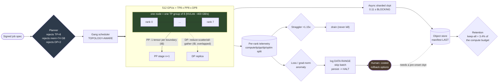

# 03 — Distributed Training Platform

> **Prompt:** Design the platform that trains a 70B-class model on 512 GPUs in 30 days — parallelism,
> collectives, memory, throughput, checkpointing, fault tolerance, and the scheduler other engineers
> run experiments on.
>
> **Role this maps to:** [03 · ML Systems & Training-Infrastructure Engineer](../../00_jobs/03_ml-systems-and-training-infra/README.md)
> · **Sample project:** [`project.md`](../../00_jobs/03_ml-systems-and-training-infra/project.md)

---

## The three-sentence compression

1. **The choice that matters most:** **TP=8 inside the node, PP and DP across nodes** — because tensor
   parallelism is the highest-frequency, least-hideable communication in the design, and crossing the
   NVLink boundary takes it from **26.6% of compute to 213%**, where communication exceeds arithmetic
   and no amount of overlap can hide it.
2. **The alternative I rejected:** pure FSDP at DP=512. Simplest by far, and it fails twice — the
   per-layer parameter all-gather of a 70B model over InfiniBand makes communication dominate, and the
   global batch becomes far larger than the optimization can use.
3. **The failure mode I'd volunteer:** **I would challenge the deadline before accepting it.** The
   arithmetic says 30 days requires **≥45.2% MFU** and the budget lands at 45.9% — 0.7 points of
   headroom against a published-practice range of 38–43%. If "30 days" is really a proxy for "before
   the next hardware generation," the right answer is to wait, not to buy MFU.

---

## Architecture at a glance



---

## Key numbers

| Dimension | Value |
|---|---|
| Model | 70.55 B (L=80, h=8192, GQA 64/8, SwiGLU 28672, V=128k, s=4096) |
| Compute | **C = 6ND = 5.93 × 10²³ FLOPs** for 1.4T tokens |
| **MFU required for 30 days** | **45.2%** — derived, not chosen |
| **MFU budgeted** | **45.9%** (six multiplicative factors) — **0.7 points of headroom** |
| Published-practice MFU | 38–43% ⇒ 31.5–35.6 days ⇒ **misses** |
| **`16N` state** | **1,129 GB = 14.1 × H100-80GB** before any activation |
| Activations (1 micro-batch) | 95.3 GB un-sharded → **11.9 GB/GPU** at TP8/PP8/SP |
| **TP comm** | **26.6% of compute intra-node · 213% inter-node** |
| PP bubble | 2.7% (interleaved 1F1B, v=2, m=128) |
| Chosen plan | TP8 × PP8 × DP8, `micro_bs`=1, m=128, SP on → **35.5 GB/GPU, 29.5 days** |
| Checkpoint | 1,129 GB · **0.11 s** async blocking vs 8.8 s sync |
| Retention | keep-all = 1.63 PB = **3.4% of the compute budget** · policy = 39.5 TB |
| Faults | cluster MTBF 97.7 h · 7.4 interruptions · **$5,474 of value in one timeout setting** |
| Data loading | **2.2 MB/s** — there is no data-throughput problem here |
| **Cost** | **$1.11M** on-demand / $664k reserved (ceiling $1.5M) |

---

## The findings that matter

**1. A deadline is an MFU requirement, not a GPU-count requirement.**

```
MFU_required = C / (G · PEAK · T) = 5.926e23 / (512 × 989e12 × 30 × 86400) = 45.2%

MFU budget (multiplicative -- every inefficiency is a FACTOR):
  kernel efficiency (real shapes, FlashAttention)  ×0.62
  TP comm residual after overlap                   ×0.92
  PP bubble (interleaved 1F1B, m=128, v=2)         ×0.95
  DP reduce-scatter/all-gather residual            ×0.97
  non-matmul ops + optimizer step                  ×0.92
  data stalls + straggler jitter                   ×0.95
                                                   ───── = 45.9%
```

**0.7 points of headroom.** Any single factor 2% worse than budgeted misses the deadline — which is why
FP8 on the MLP GEMMs is treated as the **planned margin**, not an optimization. And the budget's real
value is diagnostic: measured MFU of 38% means one factor is ~2× off, and the table says which to
profile first.

**2. `TP ≤ 8` is the NVLink domain size, and crossing it is a cliff.**

| | Comm per micro-step | vs 44.2 ms of pure matmul |
|---|---|---|
| **NVLink** (intra-node, ~400 GB/s effective) | 11.7 ms | **26.6%** |
| **InfiniBand** (inter-node, 50 GB/s) | 94.0 ms | **213%** |

Communication *exceeds* arithmetic, so overlap cannot help. And note the denominator trap: against
MFU-derived *wall* time the intra-node figure reads a flattering 20.1%, but MFU already contains the
comm penalty — that is circular.

**3. Sharding is the precondition; recompute is a lever.** `16N` = 1,129 GB kills plain DDP outright.
The 95.3 GB activation figure is the reason you must **shard** — at TP8/PP8/SP it is 11.9 GB/GPU and
`none` fits. Selective recompute (SwiGLU intermediates, 59% of activation memory) takes it to
4.9 GB/GPU, and what that buys is `micro_bs = 4` — which improves the kernel-efficiency factor, the
largest term in the MFU budget. *Sequence parallelism separately recovers 14.1 GB/GPU at zero
collective cost; there is no reason to run TP without it.*

**4. The cheapest line of configuration in the platform is worth $5,474.**

```
Cluster MTBF = 50,000 / 512 = 97.7 h  ⇒  7.4 interruptions in a 708 h run

NCCL's ~30-min default watchdog: 49 min/failure → 6.0 h lost → $9,248 of idle cluster
60-s heartbeat health check:     20 min/failure → 2.5 h lost → $3,775
```

And keep the heartbeat *in addition to* the watchdog — an NCCL hang may never time out at all, and then
the heartbeat is the only signal that exists.

**5. Keeping every checkpoint costs 3.4% of the entire compute budget** — $37.4k/month of storage
against $1.11M of compute. Retention is a design requirement, and it must never prune a checkpoint
referenced by an open anomaly, or the rollback option vanishes while a human is still deciding.

---

## Files

| File | Contents |
|---|---|
| **[00_concepts.md](00_concepts.md)** | 🎓 **Read first if you're new.** Params and FLOPs · the `16N` rule · activation memory · the four parallelism dimensions + sequence parallelism · collectives and the `TP ≤ 8` arithmetic · MFU and the double-count trap · BF16/FP8/loss spikes · checkpointing and fault economics |
| **[01_requirements.md](01_requirements.md)** | **The question to ask before designing anything** · FR-1…20 · NFRs · non-goals · **the MFU budget** · memory arithmetic · why more GPUs is the wrong lever · fault budget · assumptions |
| **[02_hld.md](02_hld.md)** | 3-D mesh architecture · component choices with rejected alternatives (incl. TP8/PP16/DP4) · narrated flow · NFR mapping · 13 failure modes · 10×/NVL72 scale plan |
| **[03_lld.md](03_lld.md)** | DDL with `tp_within_nvlink` and `fits_memory` as `CHECK` constraints · APIs incl. the planner's **rejection list** · the planner · MFU attribution · async checkpointing · fault/elastic recovery · anomaly detection · sequence diagrams (happy + **the loss spike**) · state machines · 24 edge cases |
| **[04_production_and_interview.md](04_production_and_interview.md)** | Training-side AI concerns (**and which serving rows don't apply**) · dashboards · **the loss-spike runbook** · 19 mistakes · 9 interview follow-ups · glossary |
| **[project/](project/)** | 🏃 **Runnable.** The planner, the memory model with **measured** activation bytes, the MFU budget, and the fault economics. Documents **three design errors it found**, including a wrong denominator in the TP-comm figure |

**Shared front-matter:** [`../00_requirements_all_systems.md`](../00_requirements_all_systems.md)

---

## Relationship to the other designs

| Relates to | How |
|---|---|
| [01 — Research experiment platform](../01_research_experiment_platform/README.md) | **Two sides of one cluster.** 01 authorizes runs and owns statistical readability; this platform executes them and owns MFU. They meet at the signed job spec, and 01's 30-minute queue budget depends on this platform's reserved ablation partition |
| [02 — Post-training pipeline](../02_post_training_pipeline/README.md) | Produces the base checkpoint 02 consumes, and owns the parallelism plan for 02's 70B tier. The `16N` rule and the GQA KV arithmetic are shared front-matter |
| [`27/04` — LLM inference platform](../../27_ai-platform-system-design/04_llm_inference_platform/README.md) | **Read alongside.** Same structural lesson from the other direction: there, KV cache (not weights) caps concurrency; here, activation and optimizer memory (not FLOPs) cap the parallelism plan. Both designs turn on a *memory* term the FLOP arithmetic doesn't show |
| [`Shared/05_llm-training-pipeline`](../../../Shared/05_llm-training-pipeline/README.md) · [`DL/02_pytorch`](../../../DL/02_pytorch/README.md) | The framework-level foundations this design assumes |

---

← [folder README](../README.md) · → [00_concepts.md](00_concepts.md)
