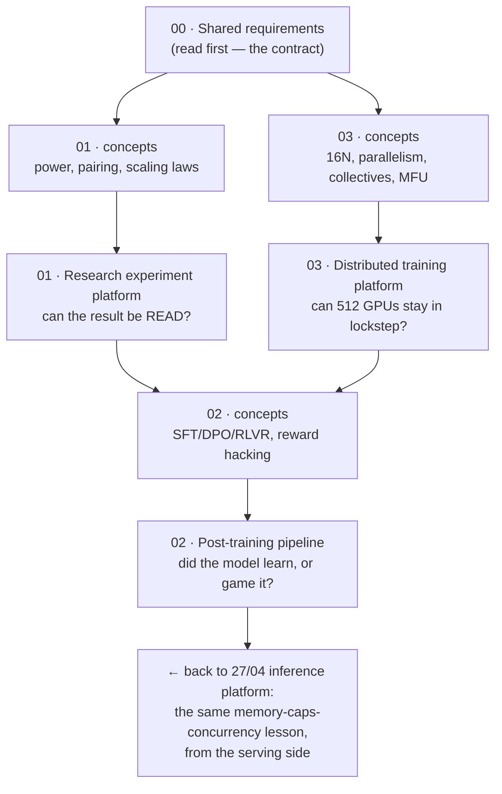

# 🏭 Model-Training System Design — 3 Designs (Requirements → HLD → LLD)

> Three **training-side** system designs — the platforms a frontier lab uses to *produce* a model,
> rather than to serve one. Each carries a from-scratch **concepts primer**, full **Requirements**
> (quantified NFRs, budgets, capacity arithmetic), **HLD** (architecture, component choices *with
> rejected alternatives*, failure modes, scale plan), **LLD** (schemas, APIs, algorithms, sequence
> diagrams, state machines, edge cases), an **interview drill**, and **runnable code**.
>
> **Read [`00_requirements_all_systems.md`](00_requirements_all_systems.md) first.** It holds every
> hardware and price assumption, the four arithmetic primitives (`6ND`, `16N`, Chinchilla, statistical
> power), and the cross-system contract — so a price change re-propagates from one place.

**Relationship to the other system-design folders in this repo.** Those three design systems whose
unit of work is a **request**. This folder designs systems whose unit of work is a **training run**,
and almost nothing transfers:

| Folder | Side of the model | Dominant constraint |
|---|---|---|
| [`21_ai-system-design-deep-dives`](../21_ai-system-design-deep-dives/README.md) | Consume (fintech domain) | Token cost, domain correctness |
| [`27_ai-platform-system-design`](../27_ai-platform-system-design/README.md) | Consume / serve (product-agnostic) | p95 latency, token cost, GPU serving |
| [`28_ai-system-design-by-industry`](../28_ai-system-design-by-industry/README.md) | Consume (per-industry) | Regulatory, domain SLAs |
| **`29` (this folder)** | **Produce** | **GPU-hours, memory, statistical power, MFU** |

- There is **no p95 latency SLO** on a training run — there is a deadline and an MFU floor.
- There is **no cost per request** — there is a fixed ~$1.1M of capital per flagship run.
- The dominant failure is never a 5xx. It is a **loss spike at hour 300**, a **reward hack that looks
  like progress**, or **a conclusion drawn from seed noise**. All three are silent, which is why every
  design here has a load-bearing detection section.

---

## 📋 The three problems

| # | System | Role it maps to | Defining constraint | Status |
|---|---|---|---|---|
| 00 | **[Shared requirements & assumptions](00_requirements_all_systems.md)** | — | The contract all three satisfy | ✅ |
| 01 | **[Research experiment platform](01_research_experiment_platform/README.md)** | [01 · Research Scientist](../00_jobs/01_ai-research-scientist/README.md) | **Statistical power** — can the result be read at all? | ✅ |
| 02 | **[Post-training pipeline](02_post_training_pipeline/README.md)** (SFT → DPO → RLVR) | [02 · Research Engineer](../00_jobs/02_research-engineer-model-training/README.md) | **Generation, not gradients** — rollout dominates and needs a different engine | ✅ |
| 03 | **[Distributed training platform](03_distributed_training_platform/README.md)** | [03 · ML Systems / Training Infra](../00_jobs/03_ml-systems-and-training-infra/README.md) | **MFU** — the deadline is an MFU requirement, not a GPU-count one | ✅ |

**01 and 03 are two sides of one cluster.** 01 decides *which* runs deserve GPU-hours; 03 makes those
hours count. A lab that builds only 03 burns a well-utilized cluster on unreadable experiments; a lab
that builds only 01 has rigorous verdicts about runs that take 3× too long.

---

## 🔍 The most useful thing here: what the arithmetic changed

Following the discipline of [`27`'s requirements doc](../27_ai-platform-system-design/00_requirements_all_systems.md) —
these are the places where doing the sums **changed the design** rather than confirming it.

| System | What the numbers revealed |
|---|---|
| **01** | **A 3-seed ablation can only detect a 0.046-nat effect** (σ=0.02). Real architectural effects are 0.005–0.02 nats — so the standard protocol measures noise. Detecting δ=0.01 needs **63 seeds/arm (126 runs)**; **pairing cuts it to 13 pairs (26 runs)** — a 4.8× saving that costs nothing but discipline. |
| **01** | **A 20-arm sweep produces a "winner" 64% of the time under the null.** And full-power ablations on everything cost $60.1k/quarter against a $60k ceiling — so the fix is **tiering the effect size** (screen at δ=0.02, confirm the 25% that pass at δ=0.01) → $36.8k. A scaling-law ladder costs **$3,391 = 0.31%** of the flagship it de-risks. |
| **02** | **PPO does not fit the node; GRPO does.** The requirement is 2,048 concurrent rollouts. GRPO leaves 56 GB/GPU for KV cache → 2,967 rollouts. PPO's critic adds 16 GB/GPU of *optimizer state* → 38 GB free → **2,013 rollouts, below the requirement.** "No critic" is usually sold as an algorithmic simplification; here it decides whether the configuration exists. |
| **02** | **Syncing weights via a checkpoint round-trip is a 63% tax** (~56 s against an 89 s step, mostly the inference engine's CUDA-graph rebuild). In-memory broadcast is 0.04 s. And **18% of every step has zero GPU work** because verification is CPU-bound sandboxed execution. |
| **02** | **Reward-hack detection with 100 held-out prompts is theater** — 2 SE is 14.1 points, and hacking announces itself at 2–5. ≥1,500 is the floor. Then the code found the sharper point: **the gap's SE is dominated by the *training* side** (~192 rollouts/step), so more held-out prompts barely help — the fix is a rolling window. |
| **03** | **The 30-day deadline is an MFU requirement of ≥45.2%**, and the multiplicative budget lands at 45.9% — **0.7 points of headroom** against a published range of 38–43%. **Adding GPUs is the wrong lever**: it costs $140k more *and* raises the global batch, changing the optimization. FP8 on the MLP GEMMs is free and gives 1.33×. |
| **03** | **Tensor parallelism across nodes costs 213% of compute in communication versus 26.6% inside it.** Communication *exceeds* arithmetic, so overlap cannot help. `TP ≤ 8` is the NVLink domain size, not a heuristic. |
| **03** | **Keeping every checkpoint costs 3.4% of the entire compute budget** ($37.4k/month of storage against $1.11M of compute), and **one config value — the NCCL watchdog timeout — is worth $5,474 per flagship run** at zero engineering cost. |

**And twice the arithmetic said "you're worrying about the wrong thing."** Data-loading bandwidth for
the 70B run is **2.2 MB/s** — there is no throughput problem, and design 03 says so instead of adding a
streaming tier. And design 01's metric store is **18 GB/quarter** — so the hard part is the *join key
and the statistics*, not the volume, and reaching for Kafka would lose the transactional join that makes
a number defensible.

---

## 🧪 The runnable code found five errors in these designs

Each design ships a `project/run.py` that implements its core algorithms for real. Writing them
falsified five things the prose had gotten away with — recorded here because the corrections are more
instructive than the designs would have been without them:

| # | Error | Where it was fixed |
|---|---|---|
| 1 | **A proportion threshold with no sample size.** "Detect a 3-point verifier gap with 1,500 held-out prompts" — 2 SE at n=1,500 is **3.7** points, not 3.0 (3.0 needs n≈2,223) | [02 §1.7 A8](02_post_training_pipeline/01_requirements.md) |
| 2 | **The same error again, in the DPO collapse detector.** `reward_accuracy > 0.99` on a batch of 8 fires ~27% of the time at 85% *true* accuracy — it aborts healthy runs | [02 FR-4](02_post_training_pipeline/01_requirements.md) · [§3.3.1](02_post_training_pipeline/03_lld.md) |
| 3 | **A wrong denominator — and it was my own double-count trap.** The TP-comm figure of "19.7% of compute" divided by an MFU-derived *wall* time, but MFU already contains the comm penalty. Against pure matmul time it is **26.6% intra-node, 213% inter-node** | [03 §00_concepts 5.3](03_distributed_training_platform/00_concepts.md) and throughout |
| 4 | **A misread of what 95.3 GB of activations implies.** It is the reason you must **shard**, not the reason you must recompute — at TP=8/PP=8 the same activations are 11.9 GB/GPU. Recompute's real role is buying `micro_bs > 1` | [03 §3.3](03_distributed_training_platform/00_concepts.md) · [§1.6.1](03_distributed_training_platform/01_requirements.md) |
| 5 | **Two planner constraints the design's own requirements implied.** `pp` must divide the layer count, and `DP ≥ 2` is required by FR-13 (cross-replica SDC screening) and FR-14 (elastic recovery). Without them the top plan was DP=1 — optimal on paper, operationally indefensible | [03 §3.6 edge cases 3b/3c](03_distributed_training_platform/03_lld.md) |

Errors 1, 2 and 3 are the same species: **a threshold or a ratio stated without the denominator it
depends on.** That is the pattern worth carrying into a design review.

---

## 🗺️ Suggested order



**If you have limited time:** read `00`, then **03's concepts + requirements** (the densest systems
arithmetic in the repo), then **01's §3 on power** (the finding most likely to change how you work).

---

## 🎯 What makes these interview-grade

Built on the four rules of the [`ai-system-design` skill](../../.claude/skills/ai-system-design/SKILL.md):

1. **Requirements before architecture.** No box is drawn before scope, scale and SLOs are written. Design 03 goes further and *questions the deadline itself* before designing to it.
2. **Every component choice names its rejected alternative** *and* a **revisit-when threshold**. "GRPO" is not a decision; "GRPO because PPO's critic optimizer state drops max rollouts from 2,967 to 2,013, below the requirement — revisit with a second node" is.
3. **Quantify or admit you're guessing.** Arithmetic is shown; assumptions are labelled and, where cheap to measure, the design says *measure it* (01's $81 variance census; 03's 50-step kernel-efficiency benchmark).
4. **AI systems fail differently** — and *training* systems fail differently again. The concern lists in each `04_` file state explicitly which serving-side rows **don't apply** and what the training-side analogue is, because filling in "prompt injection" for a design with no prompts is checklist-matching.

---

## 🏃 Running the code

```bash
pip install torch

python 01_research_experiment_platform/project/run.py          # ~30 s: measures real sigma/rho
python 02_post_training_pipeline/project/run.py                # ~2 s: discovers a real reward hack
python 03_distributed_training_platform/project/run.py         # ~3 s: the parallelism planner
```

Each takes `--help`, and each has a fast no-dependency path (`--skip-dpo`, `--no-measure`,
`--skip-mc`). What they demonstrate:

| Script | The thing to watch |
|---|---|
| **01** | It **measures** σ and ρ from 24 real training runs, then shows that δ_min at n=3 is always **2.29σ** — a scale-free ratio, which is why "3 seeds" is the wrong default everywhere |
| **02** | A real GRPO loop over three response strategies **discovers a verifier exploit on its own** — training pass rate 0.65 → 0.97 while the independently-implemented held-out verifier goes 0.25 → 0.03 |
| **03** | The planner's **rejection list**, which is more useful than its answer, and `MFU REQUIRED = 45.2%` becoming `90.3%` when you pass `--gpus 256` |

---

## 🔁 Where to go deeper in this repo

| Topic | Folder |
|---|---|
| SFT / RLHF / DPO theory | [`AI/02_fine-tuning-and-alignment`](../02_fine-tuning-and-alignment/README.md) |
| Reward design and reward hacking | [`DL/04_reinforcement-learning`](../../DL/04_reinforcement-learning/README.md) |
| The RLVR environments design 02 trains against | [`AI/10_rl-environments-and-infra`](../10_rl-environments-and-infra/README.md) |
| Pre-training / post-training pipeline overview | [`Shared/05_llm-training-pipeline`](../../Shared/05_llm-training-pipeline/README.md) |
| PyTorch internals | [`DL/02_pytorch`](../../DL/02_pytorch/README.md) |
| The serving-side counterpart | [`AI/27_ai-platform-system-design/04_llm_inference_platform`](../27_ai-platform-system-design/04_llm_inference_platform/README.md) |
| Efficient fine-tuning (LoRA/QLoRA) | [`Shared/01_lora-qlora`](../../Shared/01_lora-qlora/README.md) |

---

← [AI hub](../../README.md) · [AI Jobs hub](../00_jobs/README.md) ·
→ [00 Shared requirements](00_requirements_all_systems.md)
