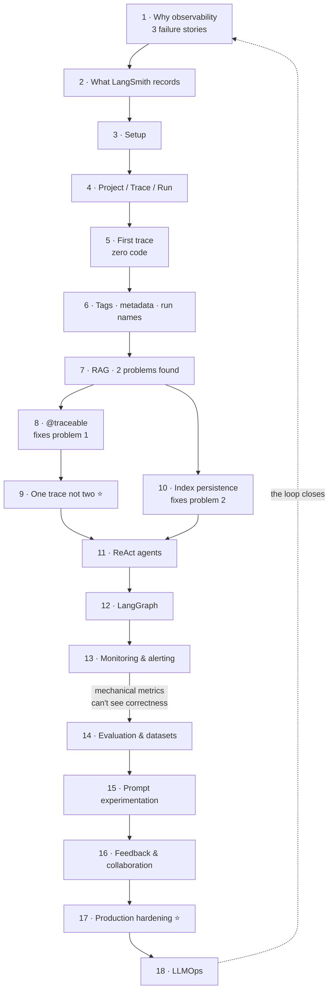

# 🔭 LangSmith — Observability & Evaluation for LLM Applications

> A full tutorial built from the **CampusX "LangSmith Crash Course — Observability in GenAI"** video
> ([`4FFspU4riHk`](https://www.youtube.com/watch?v=4FFspU4riHk), 2 h 08 m, by Nitish), read end-to-end from the transcript.
>
> **Prerequisites:** LangChain fundamentals ([`AI/11_langchain/`](../11_langchain/)) and LangGraph basics ([`AI/13_langgraph/`](../13_langgraph/)).
> Lessons 07–10 assume RAG ([`AI/12_rag/`](../12_rag/)).
> 
> 🪁 **Companion folder:** [`AI/32_langfuse/`](../32_langfuse/) — the same job with LangFuse: open source, self-hostable, OpenTelemetry-native. Read this folder first for the concepts; that one for the case where trace payloads cannot leave your infrastructure.

---

## 📌 Relationship to the existing note in this repo

This video is **already summarised** as a single page in the LangGraph playlist notes:
[`AI/13_langgraph/16_langsmith-crash-course.md`](../13_langgraph/16_langsmith-crash-course.md) (~2,900 words), plus
[`17_observability-langsmith-integration.md`](../13_langgraph/17_observability-langsmith-integration.md).

That summary is accurate and covers the whole video. **This folder is not a replacement for it — it is a different artefact:**

| | [`13_langgraph/16_…`](../13_langgraph/16_langsmith-crash-course.md) | **This folder** |
|---|---|---|
| Shape | One page, playlist note | 18 lessons |
| Length | ~2,900 words | ~27,000 words |
| Use it for | **Revision** — scan before an interview | **Learning** — work through with the code |
| Code | Illustrative snippets | Complete runnable scripts |
| Beyond the video | — | Nesting fix · production hardening · alert design · evaluation SDK · tool comparison |

Read the single page if you want the video's content in ten minutes. Work through this folder if you want to be able to operate the thing.

---

## Lessons

| # | Lesson | Covers | Source |
|---|---|---|:---:|
| **Part I — the case for observability** | | | |
| 1 | [Why LLM Applications Need Observability](01-why-llm-observability.md) | Three failure stories (latency · cost · correctness) · non-determinism · the definition · why this isn't APM · tool landscape | 📹 + ⭐ |
| 2 | [What LangSmith Is, and Exactly What It Records](02-what-langsmith-is-and-what-it-records.md) | The definition · the eight recorded field groups · tags vs metadata · how the callback tracer actually works | 📹 + ⭐ |
| 3 | [Setup: Account, Keys and Environment](03-setup-and-environment.md) | venv · API key · `.env` · the `LANGCHAIN_*` → `LANGSMITH_*` rename · smoke test · five-step failure checklist | 📹 + ⭐ |
| 4 | [Project, Trace, Run](04-project-trace-run.md) | The three concepts · the hierarchy · **runs are a tree, a trace is its root** · `run_type` · `get_current_run_tree()` | 📹 + ⭐ |
| **Part II — tracing, hands on** | | | |
| 5 | [Your First Trace](05-your-first-trace.md) | Zero-code tracing · reading the UI at three levels · where latency actually lives · `tracing_context` | 📹 + ⭐ |
| 6 | [Projects from Code, Run Names, Tags, Metadata](06-tags-metadata-and-run-names.md) | Precedence rules · `config` · auto tags · **declared vs observed metadata** · a metadata schema that survives an incident | 📹 + ⭐ |
| 7 | [Tracing RAG — and the Two Problems It Exposes](07-tracing-rag-what-auto-tracing-misses.md) | Retriever vs generator errors · **only runnables are auto-traced** · the 202-second bug · how to read a bad RAG trace | 📹 + ⭐ |
| 8 | [`@traceable`: Tracing Anything That Isn't a Runnable](08-the-traceable-decorator.md) | The decorator · per-function tags/metadata · `run_type` · `process_inputs` redaction · async & generators | 📹 + ⭐ |
| 9 | [One Trace, Not Two](09-one-trace-not-two.md) | **The fix the video promises and never gives.** `contextvars` nesting · `with trace(...)` · cross-thread and cross-service propagation · *and why the video's stated ideal is wrong for a server* | ⭐ |
| 10 | [FAISS Index Persistence](10-index-persistence-and-latency.md) | 202 s → 1.65 s · the five rebuild conditions · content hash vs mtime · the pickle warning · production index strategy | 📹 + ⭐ |
| 11 | [Tracing a ReAct Agent](11-tracing-react-agents.md) | Thought/Action/Observation · the scratchpad and **why cost grows superlinearly** · four failure signatures · `max_iterations` | 📹 + ⭐ |
| 12 | [Tracing LangGraph](12-tracing-langgraph.md) | Graph = trace, node = run · **`with_structured_output` in the trace** · reading conditional edges and loops · `thread_id` | 📹 + ⭐ |
| **Part III — beyond observability** | | | |
| 13 | [Monitoring and Alerting](13-monitoring-and-alerting.md) | One trace vs many · the chart pairs that triage for you · an alert set that won't cry wolf · **the traffic-floor alert** · what monitoring can't do | 📹 + ⭐ |
| 14 | [Evaluation, Datasets and Annotation](14-evaluation-datasets-and-annotation.md) | Offline vs online · three evaluator kinds · **trace → dataset row → CI gate** · the refusal test case · working `evaluate()` code | 📹 + ⭐ |
| 15 | [Prompt Experimentation, Versioning and the Hub](15-prompt-experimentation.md) | Why eyeballing isn't evidence · Playground Compare · **repo vs hosted prompts** · a prompt-change workflow | 📹 + ⭐ |
| 16 | [User Feedback and Collaboration](16-feedback-and-collaboration.md) | Feedback as a complete bug report · `create_feedback` wiring · implicit signals · shared trace links and their privacy risk | 📹 + ⭐ |
| 17 | [Production Hardening](17-production-hardening.md) | **PII as a legal question** · masking layers · sampling by interest · flushing · silent-failure safeguards · cost levers · full checklist | ⭐ |
| 18 | [LLMOps: Where All of This Fits](18-llmops-and-where-this-fits.md) | The three axes and what each misses · **the maturity ladder** · repo cross-links · five things to carry away | 📹 + ⭐ |

**Legend:** 📹 from the transcript · ⭐ added (marked inline in each lesson)

---

## The arc

---

## The three failure stories the whole tutorial hangs on

Introduced in lesson 01, resolved across the rest:

| | Symptom | Root cause | Caught by |
|---|---|---|---|
| **A** Cover-letter tailor | Latency 2 min → **7–10 min** | A push made stage 2 scan the whole Drive | Monitoring raises · **component latency** localises |
| **B** Research agent | Cost **50 paise → ₹2** on *some* reports | One prompt sentence — *"keep going until it's perfect"* — created a loop | Cost-per-trace + **iteration count** |
| **C** HR policy chatbot | Confidently **wrong** answers | `k=1` retriever, or a lenient grounding prompt | **Neither monitoring nor tracing alone** — needs evaluation + feedback |

> **Story C is the point of the tutorial.** That system is fast, cheap and error-free on every mechanical chart while telling employees there is no leave policy. It is why "observability **and evaluation**" is the product's real shape.

---

## Key numbers from the video

| | |
|---|---|
| Video length | **2 h 08 m** |
| Corpus in the RAG example | *An Introduction to Statistical Learning*, **441 pages** |
| Chunking | `chunk_size=1000`, `chunk_overlap=150` |
| **RAG latency before the fix** | **~202 s per query** — re-embedding the whole book every time |
| **After FAISS persistence** | **1.65 s** warm · ~30 s cold build · 4.42 s on a broader question |
| PDF load, of the ~30 s cold build | **~15 s** |
| LLM call in the trivial chain | **1.11 s** — essentially all of the app's latency |
| LangGraph essay scores | `[4, 4, 4]` → average **4**; `evaluate_analysis` node **3.5 s** |
| Story B cost blow-up | 50 paise → **₹2** (4×) |
| Example alert threshold | latency **> 5 s** → notify the team |

---

## The two rules for LangGraph

Worth memorising; they're the whole integration:

1. **One graph execution = one trace.**
2. **Each node = one run** inside that trace.

Branching, parallelism, subgraphs and loops follow automatically.

---

## What this tutorial adds beyond the video

Marked ⭐ inline. The substantial ones:

| Addition | Why |
|---|---|
| **Lesson 09 in full** | The video reaches the two-sibling-traces problem, says *"next we will modify our code in this way"* — and then doesn't. This supplies three working fixes, **and argues the video's stated ideal is wrong for a server** |
| **Lesson 17 in full** | Full payloads leave your process by default. That's a data-protection decision the video never raises, plus sampling, flushing and cost |
| Evaluation SDK code | The video shows the Evaluators tab and defers the depth; working `create_dataset` / `evaluate` / CI-gate code is here |
| The refusal test case | Most eval sets test recall and never test **restraint**. A RAG system's worst failure is answering when it should decline |
| Alert design | Percentiles not means · same-hour-last-week · severity routing · the **traffic-floor** alert nobody writes |
| `run_type`, `process_inputs`, `tracing_context`, distributed headers | Real SDK surface the crash course had no room for |
| `allow_dangerous_deserialization` warning | FAISS's LangChain wrapper uses pickle. Fine for your own index, unsafe for a received one |
| Content hash vs mtime | The video's size+mtime fingerprint can **silently serve a stale index** |
| Repo vs hosted prompts | A real decision with a real recommendation, and why `:latest` in production is a risk |
| Tool comparison + maturity ladder | Where LangSmith sits among LangFuse / Phoenix / Weave, and what order to build capability in |

---

## Related material in this repo

| Where | What |
|---|---|
| [`AI/16_evals/`](../16_evals/) | **16 lessons on evaluation** — RAG Triad, G-Eval, LLM-as-judge, operational evals. The theory behind lesson 14 |
| [`Shared/03_llmops/`](../../Shared/03_llmops/) | The LLMOps discipline — gateways, CI eval gates, drift, cost engineering, incidents |
| [`Shared/03_llmops/05-observability-and-tracing.md`](../../Shared/03_llmops/05-observability-and-tracing.md) | Vendor-neutral tracing from the platform side |
| [`AI/13_langgraph/`](../13_langgraph/) | LangGraph — assumed by lesson 12 |
| [`AI/11_langchain/`](../11_langchain/) · [`AI/12_rag/`](../12_rag/) | Assumed by lessons 05–10 |
| [`Shared/02_mlops/`](../../Shared/02_mlops/) | Classical MLOps — the lineage LLMOps inherits |

---

## The five things to carry away

1. **LLM systems are non-deterministic, multi-stage, and fail behaviourally rather than exceptionally** — every conventional debugging instinct assumes properties they don't have.
2. **Project → Trace → Run.** Underneath, only runs, in a tree. Nesting is decided by the **call stack at runtime**, not by code layout.
3. **Tag and structure at write time** — traces are immutable, and every skipped metadata key is an incident question you can't answer later.
4. **Mechanical health is not correctness.** Story C looks perfect on every chart. Only evaluation and feedback see it.
5. **The loop is the product:** trace a failure → dataset row → CI gate → ship → watch feedback → repeat.
