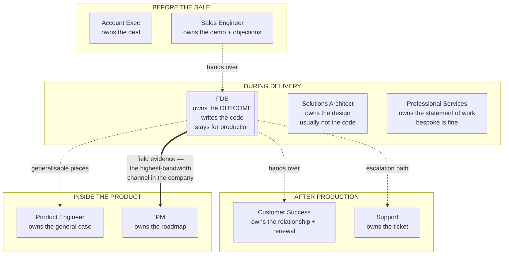

# 01 · What the role actually is

> **Index:** [`README.md`](README.md) · **Next:** [`02-the-demo-to-production-gap.md`](02-the-demo-to-production-gap.md) →

---

## 1.1 The definition that survives contact

Job posts describe the FDE as "customer-facing engineer." That's true and useless. Here's the version that predicts what you'll actually do:

> **An FDE owns the gap between "our product can do this" and "this customer's workflow is now different."**

Three properties follow, and they're what make the role distinct:

**You own an outcome, not a scope.** Nobody hands you tickets. You're given "their claims team takes 11 days and it needs to be 3" and you work backwards. If the answer turns out to be "the model is fine, your intake form is the bottleneck," that's your finding to deliver.

**You work in someone else's constraints.** Their data, their auth, their compliance, their opinions, their politics, their legacy system that only Rakesh understands and Rakesh is on leave. The engineering is real, but the binding constraints are almost never technical.

**Your work has two audiences.** The customer needs it to work. Your product team needs to learn from it. An FDE who ships a beautiful bespoke thing that teaches the product nothing has done half the job — and an FDE who refuses to build anything bespoke has done none of it.

---

## 1.2 The role's origin, and why that matters

The role was invented at **Palantir** as the *Forward Deployed Software Engineer* (FDSE). Palantir's insight was structural: enterprise data problems are so idiosyncratic that a general product cannot land unaided, so they sent engineers — not consultants — to live inside the customer and build the last mile.

That origin explains two things you'll notice in FDE interviews everywhere:

- **The bar is "can you build in the dark."** Unfamiliar codebase, undocumented data, no spec, two weeks. That's the test.
- **The culture prizes the finding over the artifact.** At Palantir the phrase was roughly *the deliverable is the insight*. That survives into AI-native FDE teams as: an eval harness that proves the approach can't hit the bar is a *success*, delivered on time.

The AI-native version (Anthropic, OpenAI, Sierra, Harvey, Glean, Decagon, Ramp) adds one thing Palantir's version didn't have: **non-determinism**. Which means it adds evals, and it adds a whole category of conversation about accuracy that classical FDSE work never needed.

---

## 1.3 Variants — the same title means four different jobs

Read the job post for these signals, because they change what you should prepare.

| Variant | Signals in the post | What the loop tests | Watch out for |
|---|---|---|---|
| **Lab FDE** (Anthropic, OpenAI) | "prototype with our models", "feed learnings to research/product", named frontier models | Depth on model behaviour, evals, prompt/context engineering, cost. Design round is applied | Very high bar; expect a working session with the real API |
| **Product FDE** (Sierra, Decagon, Glean, Harvey) | "deploy our agent for customers", "own onboarding", vertical named | Integration, agent design, their domain, speed | Can drift into implementation-consultant work; ask about the product feedback loop |
| **Platform FDE** (Palantir, enterprise data cos) | "ontology", "data integration", "on-site", clearance mentions | Data modelling, unfamiliar codebases, SQL/pipelines, stakeholder work | Least LLM-centric; heaviest on data plumbing |
| **Pre-sales-leaning SE** | "support the sales cycle", quota mentioned, "POC" | Demo craft, discovery, objection handling | **If comp includes a quota, delivery is not your job** — that's a different role, decide deliberately |

> **The one question that disambiguates all four:** *"After the pilot succeeds, who runs it — me, the customer, or a separate implementation team?"* The answer tells you whether you're a builder, a consultant, or a demo machine.

---

## 1.4 A real week

Not a job-post week. What the calendar actually looks like mid-engagement, and what fraction of the week each block eats.

| Block | Share | What it really is |
|---|---|---|
| **Building** | ~40% | Prototype, eval harness, integration glue, data wrangling. Less than you'd like, more than a consultant gets |
| **Customer synchronous time** | ~25% | Working sessions, demos, the weekly steering call, one escalation |
| **Data and access chasing** | ~15% | Waiting on a VPN account, a service principal, a schema doc, a signature. **This is the real schedule risk and nobody budgets for it** |
| **Internal** | ~10% | Product feedback, handoffs, your own team's rituals, the write-up nobody reads until they need it |
| **Written communication** | ~10% | The status note, the assumptions doc, the decision log. Underrated; this is how you stay trusted when things slip |

Two observations from that table.

**Building is under half the week and that's correct.** If you're at 80% building, you've stopped doing discovery and you're about to build the wrong thing. If you're at 15%, you've become an account manager.

**The 15% access-chasing block is the single most common cause of a missed date.** Front-load it: on day one, ask for the data access you'll need in week three. The request takes ten seconds and the approval takes eleven days.

---

## 1.5 How you're actually measured

Formally: customer outcomes, retention/expansion, time-to-value. Informally, and more accurately, on five things:

| Signal | What good looks like |
|---|---|
| **Did the thing reach production** | Not "did the pilot demo well." Production, with a named owner who isn't you |
| **Did you kill bad work early** | Qualifying out a doomed use case in week two is a *win*. Discovering it in month four is the characteristic failure |
| **Is the customer's trust higher than when you arrived** | Survives slipped dates if you were straight about them; does not survive one oversold demo |
| **Did the product learn something** | A named gap, with evidence, that changed a roadmap decision |
| **Are you redeployable** | Can you leave without the thing breaking? If you're the runbook, you're stuck and so is the account |

> **The counterintuitive one is "did you kill bad work early."** New FDEs optimise for building; strong FDEs optimise for *pointing the build at something that will land*. The best week I can describe is one where you spent four days proving a use case wouldn't work and one day redirecting to the adjacent one that would — and you'd be right to put that on a promo packet.

---

## 1.6 The adjacent-role map

Where the boundaries actually sit, because interviewers probe this and customers constantly try to redraw it.

| Confused with | The distinction that matters |
|---|---|
| **Sales Engineer** | An SE's job ends when the contract is signed. Yours starts there. If your comp has a quota, you're an SE |
| **Solutions Architect** | An SA produces a design. You produce a running system. The SA's failure is a bad diagram; yours is a dead pilot |
| **Professional Services / consultant** | PS is paid to build bespoke and stop. **You are paid to build the minimum bespoke and push the rest into the product.** Bespoke work you don't try to generalise is the failure mode of a drifting FDE team |
| **Customer Success** | CS owns the relationship and the renewal. You own whether the technical thing works. Overlapping, not the same — and when the thing doesn't work, CS cannot fix it and you can |
| **Product Engineer** | They optimise the general case; you optimise time-to-value in one messy reality. **You will build things they'd reject in code review, and that can be correct** — as long as you know which code is throwaway and label it |

### The boundary you'll defend weekly

Customers will try to turn you into staff augmentation. It starts reasonably: *"While you're in here, could you also fix the ingestion job?"* Say yes twice and you're their engineer, not the product's.

The move that works: **redirect to the outcome.** "I could, but it won't move the 11-days-to-3 number. What will is getting the review queue in front of your senior adjuster — can we spend that time there instead?" You've declined without saying no, and you've re-anchored on the thing you're measured against.

---

## 1.7 Who's good at this, honestly

Signals you'll do well:

- You're comfortable being the least-informed person in a room and asking the naive question anyway
- You'd rather ship something rough that gets used than something clean that doesn't
- You can hold a technical position under pressure from someone senior and paying
- You write clearly under time pressure
- You get energy from new domains — you find auto-parts logistics genuinely interesting for a month

Signals you'll struggle:

- You need a spec to start
- Context-switching costs you a lot — an FDE day is fragmented by design
- You dislike travel or dense synchronous customer time (varies a lot by company — ask)
- You want your name on a durable codebase; much of your best work is scaffolding someone else maintains
- **You find it hard to deliver unwelcome news early.** This is the disqualifying one. The role's core value is being the person who says "this won't hit 95%" in week two

---

## 1.8 The five failure modes, named

You'll recognise these in yourself. Naming them early is cheaper.

| Failure mode | What it looks like | The correction |
|---|---|---|
| **The Demo Machine** | Beautiful prototypes, nothing in production, customer delighted then confused | Define production exit criteria in week one ([09](09-pilot-to-production.md)) |
| **The Absorbed Engineer** | Six months in, you're on their standup, fixing their bugs, product learns nothing | Re-anchor on the outcome metric weekly; time-box bespoke work |
| **The Optimist** | "Should be fine by Friday" three Fridays running; trust gone | Publish a written status with a *confidence* on every date |
| **The Purist** | Refuses to ship until the architecture is right; customer loses patience | Label throwaway code as throwaway and ship it |
| **The Order Taker** | Builds exactly what was asked, which was the wrong thing | Ask "what would you stop doing if this worked?" before building ([03](03-discovery-and-scoping.md)) |

---

## 1.9 What to take into the next file

The role is defined by a gap: model capability on one side, a changed workflow on the other. Everything distinctive about FDE work — the discovery, the evals, the economics, the difficult conversations — is instrumentation for crossing it.

[`02`](02-the-demo-to-production-gap.md) measures that gap precisely, because you cannot manage a customer's expectations about a distance you haven't quantified.

---

> **Index:** [`README.md`](README.md) · **Next:** [`02-the-demo-to-production-gap.md`](02-the-demo-to-production-gap.md) →
