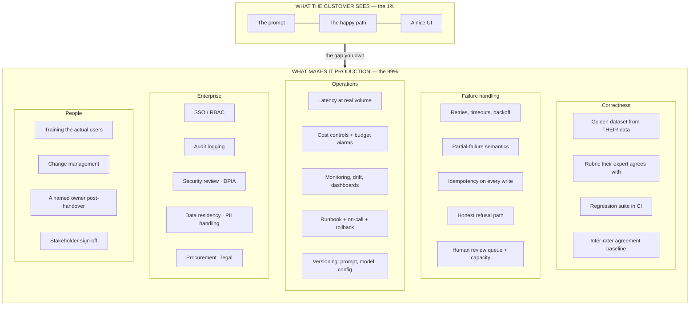

# 02 · The demo-to-production gap

> ← [`01-what-the-role-actually-is.md`](01-what-the-role-actually-is.md) · **Index:** [`README.md`](README.md) · **Next:** [`03-discovery-and-scoping.md`](03-discovery-and-scoping.md) →

**This is the core file.** If you internalise one thing from this tutorial, make it this.

---

## 2.1 The 100× rule

An LLM demo that convincingly solves a real business problem takes an afternoon.

The production system that solves the same problem takes three to six months.

The ratio is roughly **100×**, and almost none of that extra work is visible to the customer — which creates the central political problem of the role:

```
          PERCEIVED PROGRESS                    ACTUAL WORK REMAINING
          ─────────────────────                 ─────────────────────
Demo      ████████████████████  90%             ██                     1%
Pilot     ██████████████████████ 95%            ████████              15%
Prod      ████████████████████████ 100%         ████████████████████ 100%
```

After the afternoon demo, the customer believes you're nearly done. You are 1% done. **Every hard conversation in this role traces back to that mismatch**, and the way to defuse it is to make the remaining 99% concrete and legible *before* the demo lands, not after.

---

## 2.2 The four stages, quantified

| Stage | Time | What you actually build | What breaks — and why |
|---|---|---|---|
| **Demo** | 1 afternoon | A prompt, a happy path, 5 hand-picked examples, maybe a Streamlit page | **Nothing breaks.** You chose the examples. That's precisely why the signal is worthless |
| **Pilot** | 2–3 weeks | + a real data sample, a first eval harness, a UI a real user touches | Accuracy craters — the demo's 95% becomes 60% on the real distribution. Data is messier than the sample you were given (it always is; you were given the clean export) |
| **Production pilot** | 4–8 weeks | + a proper eval suite, error handling, human review queue, monitoring, cost controls, the boring 80% of edge cases | Latency at real volume. The three stakeholders who weren't in the first room. The review queue nobody has capacity to staff |
| **Production** | 3–6 months | + real integration, SSO/auth, audit logging, security review, runbook, on-call, **handover to an owner who isn't you** | Security review (4–8 weeks, and it starts *after* you ask). Procurement. Your champion changes jobs |

### Why accuracy always drops from demo to pilot

Every FDE learns this the same way. The mechanism is worth spelling out because it lets you predict the drop instead of being surprised by it:

| Cause | Effect |
|---|---|
| You picked demo examples that were clear | The real distribution is 30–40% ambiguous cases |
| The customer gave you a clean export | Production data has nulls, dupes, truncated fields, three date formats, and free text where an enum should be |
| You tested the task you were told about | Users bring adjacent tasks the system was never designed for |
| Your 5 examples had one intent each | Real inputs contain two or three intents in one message |
| You judged the output yourself | The customer's expert has stricter and *different* standards |

> **The practical rule:** a demo scoring 95% on hand-picked examples typically lands **55–70%** on a stratified real sample. Say that out loud in week one, before the number appears. If you predict the drop, you're a professional who understands the domain. If it surprises you in public, you're an optimist who oversold — and you've spent trust you'll need later.

---

## 2.3 The iceberg: what the 99% actually consists of



Count the boxes: **3 visible, 23 hidden.** That's the job.

---

## 2.4 Where the time actually goes

Aggregate shape of a successful six-month engagement. Useful because it lets you plan, and lets you push back on a plan that ignores it.

| Work | Share | Notes |
|---|---|---|
| **Data access, wrangling, understanding** | ~30% | The largest single block, every time. Includes waiting for approvals |
| **Evals — building, labelling, iterating** | ~20% | Feels like overhead in week two; it's the reason anything ships in month four |
| Integration and glue | ~15% | Their APIs, their auth, their queue, their weird SFTP |
| Prompt/context/model work | **~10%** | **The thing everyone thinks is the job.** It's a tenth of it |
| Error handling, edge cases, guardrails | ~10% | The unglamorous part that separates pilot from production |
| Communication, docs, handover | ~10% | Cut this and the thing dies after you leave |
| Security, compliance, procurement | ~5% | Small share of *your* hours, huge share of *calendar* |

> **Point this table at anyone who thinks the role is prompt engineering.** Prompt work is 10%. The 30% is data and the 20% is evals — which is why [04](04-evals-are-the-deliverable.md) is the longest technical file here and [05](05-prompt-and-context-engineering-in-the-field.md) is deliberately not.

---

## 2.5 Worked example: the same problem at all four stages

Running example for the rest of the tutorial. Domain: **dealership service department** — service advisors drowning in inbound customer texts asking about repair status. (Same domain as the [job-card exercise](../00_jobs/10_forward-deployed-ai-solutions-engineer/project.md), and a genuinely representative FDE problem: unstructured input, messy internal data, a human in the loop, real liability.)

### Stage 1 — Demo (Thursday afternoon)

```python
# Thursday, 3pm. The whole demo.
NOTES = {"RO-1088": "Oil change + MPI. Rear tire wear flagged for approval. Completed 7/29, ready for pickup."}

def draft(msg, ro):
    return llm(f"""Draft a short, warm reply for a service advisor.
Use ONLY this repair order note. Never invent prices or dates.
Note: {NOTES[ro]}
Customer: {msg}""")

draft("hey is my car ready yet??", "RO-1088")
# → "Good news — your car's ready for pickup! We finished the oil change
#    and inspection on the 29th. We did flag some rear tire wear for you
#    to take a look at when you come in."
```

Customer reaction: *"That's exactly it. How fast can we have this?"*

**You are 1% done.** What you have not yet discovered:

- Advisors handle 4 systems; notes live in 2 of them and neither has an API you've seen
- ~35% of inbound texts aren't status questions at all (rescheduling, complaints, "call me")
- ~20% of messages don't identify the RO, and matching phone→RO is ambiguous for shared household numbers
- Nobody has said who's liable if a draft with a wrong date gets sent
- The 12 advisors have wildly different tone; two will hate this on sight
- The clean note above is the *best* note in the system. The median is `"cust called re: noise. checked. ok."`

### Stage 2 — Pilot (weeks 1–3)

```
Pulled 400 real inbound messages + their repair orders.
Stratified sample, labelled with the customer's lead advisor.

  Intent distribution (surprise #1 — the demo assumed 100% status):
    status enquiry        58%
    reschedule/cancel     17%
    approval response     11%   ← a WRITE action, not a reply. Different system entirely
    complaint/escalation   7%   ← must never be auto-drafted
    other/unclear          7%

  Draft quality on the 58% (surprise #2):
    advisor would send as-is        41%
    would send with minor edit      27%
    would rewrite                   19%
    dangerous (wrong fact/promise)  13%   ← the number that matters

  Median note length: 84 chars. 31% of notes cannot answer the question asked.
```

Demo felt like 95%. Reality is **41% send-as-is and a 13% dangerous rate.** Nothing is wrong with the model; the demo measured the wrong thing on the wrong data.

The pilot's real output isn't the prototype — it's those two distributions. They reshape the product: this is not "draft replies," it's **"triage inbound, draft only the answerable status subset, route the rest."** That reframing came from labelling 400 messages, and no amount of prompt work would have found it.

### Stage 3 — Production pilot (weeks 4–11)

What gets built once the pilot's findings land:

| Added | Because |
|---|---|
| Intent classifier ahead of drafting | 42% of traffic must never reach the drafter |
| **Hard rule: complaints never auto-drafted** | Liability. A guardrail, not a prompt instruction |
| Grounding check — every date/price must appear verbatim in the note | Kills most of the 13% dangerous rate |
| `insufficient_note` refusal path | 31% of notes can't answer; honest "let me check" beats a guess |
| Advisor-specific tone from their own sent history | Two advisors would otherwise reject it outright |
| Review UI with one-keystroke approve | Advisor capacity is the real constraint |
| Phone→RO disambiguation with a confirm step | Shared household numbers |
| Latency budget: p95 < 3 s | Advisors work in bursts between customers |
| Cost tracking per drafted reply | Needed for the renewal conversation |

Measured after: **74% send-as-is, dangerous rate 0.8%, 4.1 minutes saved per advisor-hour.**

### Stage 4 — Production (months 3–6)

| Added | Calendar cost |
|---|---|
| Real integration with the DMS (not the CSV export) | 5 weeks, mostly waiting on their vendor |
| SSO + per-advisor RBAC | 2 weeks |
| Audit log — every draft, who sent, what was edited | 1 week |
| Security review + pen test | **7 weeks, started week 9 because nobody asked earlier** |
| PII handling review (customer phone numbers, vehicle data) | 3 weeks, overlapping |
| Runbook, dashboards, alert routing, rollback | 2 weeks |
| Advisor training, rollout to 12 then 40 stores | 4 weeks |
| Handover to their platform team | 2 weeks |

The critical line is the security review: **7 weeks of calendar, and the clock only started when someone finally asked.** Ask in week one — see [08](08-security-and-enterprise-blockers.md).

---

## 2.6 The gap as a checklist

Print this. Before promising a date, walk it and mark each row known / unknown. **Every unknown is schedule risk you haven't priced.**

```
CORRECTNESS
  [ ] Golden dataset from their real data, stratified (not hand-picked)
  [ ] Rubric their expert has actually signed off
  [ ] Human inter-rater agreement measured  ← the ceiling
  [ ] Regression suite runnable by someone else
  [ ] Known accuracy per input segment, not just aggregate

FAILURE
  [ ] What happens on timeout / rate limit / malformed output
  [ ] Idempotency on every write path
  [ ] An honest "I don't know" path that users trust
  [ ] Review queue exists, and someone's capacity is allocated to it
  [ ] Fail-open vs fail-closed decided per action, with the reason written down

OPERATIONS
  [ ] p95 latency at real peak volume, measured not estimated
  [ ] Cost per business outcome, with the success rate in the denominator
  [ ] Budget alarm before the invoice
  [ ] Monitoring a non-author can read
  [ ] Prompt / model / config versioned; rollback rehearsed

ENTERPRISE
  [ ] Security review scheduled (name + date, not "we'll get to it")
  [ ] Data residency and PII position confirmed in writing
  [ ] SSO / RBAC path known
  [ ] Audit requirements known
  [ ] Procurement path started

PEOPLE
  [ ] Users trained, and at least one is an advocate
  [ ] A named owner after you leave
  [ ] Written exit criteria signed by the people who can say no
  [ ] Someone other than you has run the runbook end to end
```

---

## 2.7 Managing the gap in front of the customer

Three moves, in order of value.

### Move 1 — Show the gap at demo time, not after

The instinct after a successful demo is to accept the applause. Do the opposite, in the same meeting:

> "I want to be straight about what you just saw. Those were five examples I chose, and the model handled them well — that tells us the approach is viable, which is genuinely the thing we needed to learn today. It doesn't yet tell us how it does on your real message mix. My guess is we'll land in the 60s on a real sample, and the next two weeks are about finding the exact number and what's driving the misses. If it's 60% with a clean 'not sure' path, that's a strong product. If it's 60% with confident wrong answers, that's a different conversation."

You've spent 30 seconds and bought: a realistic expectation, a defined next milestone, and credibility for every later date you give.

### Move 2 — Make the invisible work visible

The customer can't see the 23 hidden boxes, so put them on a slide *with owners and dates*. Not to pad the estimate — to convert "why is this taking so long" into "we're on step 14 of 23, and steps 15 and 16 need your security team."

**Anything you don't make visible, the customer assumes isn't happening.**

### Move 3 — Give dates with confidence attached

Never a bare date. Always a date and a confidence and the thing that would move it:

> "Production pilot in front of 5 advisors by 14 March — 80% confident. The 20% is DMS API access; if that slips past the 28th, this moves a week for every week it slips. Who can I talk to about accelerating it?"

That sentence does four jobs: commits, quantifies uncertainty, names the dependency, and asks for help. It's the single most useful sentence pattern in the role.

---

## 2.8 Interview signal

This file *is* the answer to the most common FDE interview question — some version of *"why do AI pilots fail to reach production?"*

A weak answer says "data quality issues and hallucinations." A strong answer sounds like:

> "Because the demo measures the wrong thing on the wrong data, and everyone reads it as 90% done. A demo on hand-picked examples tells you the approach is viable and nothing about the real distribution — I'd expect 95% on demo examples to land in the 60s on a stratified real sample. The work between there and production is roughly 30% data access and wrangling, 20% evals, and only about 10% prompt and model work, plus a security review that's mostly calendar time and doesn't start until someone asks. So the two things I do differently: I measure human inter-rater agreement in week one to establish the ceiling before anyone commits to an accuracy number, and I put written production exit criteria in place before the pilot starts — accuracy bar, volume, p95, who reviews the output and what their capacity is, which security review is needed and who schedules it. Pilots don't usually die of bad models. They die of an undefined finish line."

That answer works because it's specific, numerate, and it names the failure mode as organisational rather than technical — which is what the role is actually about.

---

> ← [`01-what-the-role-actually-is.md`](01-what-the-role-actually-is.md) · **Index:** [`README.md`](README.md) · **Next:** [`03-discovery-and-scoping.md`](03-discovery-and-scoping.md) →
