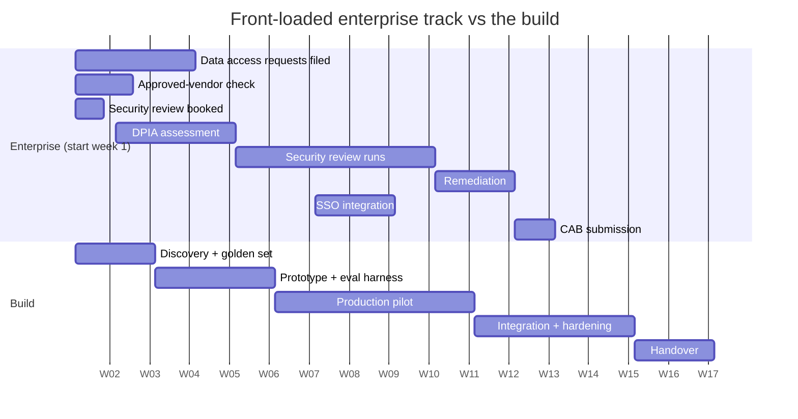

# 08 · Security and the enterprise blockers

> ← [`07-unit-economics.md`](07-unit-economics.md) · **Index:** [`README.md`](README.md) · **Next:** [`09-pilot-to-production.md`](09-pilot-to-production.md) →

---

## 8.1 Why this file exists

Nothing in this file is intellectually hard. All of it is **calendar**, and calendar is what kills engagements.

> **The characteristic failure:** a technically successful pilot, delighted users, and then a security review that starts in month three, takes seven weeks, and finds two things needing architectural changes. The champion loses patience, the budget cycle closes, the project is quietly deprioritised. The system worked. It just never shipped.

The fix is unglamorous and completely effective: **ask about all of this in week one**, when the answers are cheap and the clocks can run in parallel with your build.

---

## 8.2 The blockers, ranked by how often they kill things

| Blocker | Typical calendar | When it usually starts | Front-load it by |
|---|---|---|---|
| **Security review / pen test** | 4–8 weeks | Month 3 ❌ | Asking in week 1 who runs it, and booking the slot |
| **Data access approval** | 1–4 weeks *each* | Whenever you finally ask | Filing week-1 requests for week-3 needs |
| Vendor / model risk assessment | 2–6 weeks | After security review | Asking whether your model provider is *already* approved |
| DPIA / privacy assessment | 2–4 weeks | Late | Asking "does this need a DPIA?" in week 1 |
| Procurement / MSA / DPA | 2–12 weeks | In parallel, usually invisible to you | Asking your AE where it actually stands |
| SSO / identity integration | 1–3 weeks | Production prep | Asking which IdP, and who owns it |
| Change advisory board | 1–4 week cycles | Right before you wanted to ship | Learning the CAB calendar early — it may meet monthly |
| Pen-test remediation | 1–3 weeks | After the test | Designing to the known findings list up front |

### The one-sentence week-one move

> **"Who needs to approve this before it touches production data, and how long does each of them usually take?"**

Asked in the kickoff, that question routinely surfaces a ten-week critical path nobody had mentioned — and it puts the discovery on the record as a *shared fact* rather than your later excuse.

---

## 8.3 The questions to ask in week one

Bring these to kickoff. Ten minutes, and they reshape your plan.

**Data**
1. Where does the data live, and does any of it leave your network today?
2. Is there PII, PHI, payment data, or anything sector-regulated in scope?
3. Is there a data-residency requirement? Which regions are acceptable?
4. Is our model provider already on your approved-vendor list? *(If yes, you may have just saved six weeks.)*
5. Can we work with a de-identified or synthetic sample while approvals run? *(Often yes — and it unblocks everything.)*

**Process**
6. Who runs security review, and what's their current queue?
7. Does this need a DPIA / privacy assessment?
8. Is there a change advisory board, and how often does it meet?
9. **What did the last AI or SaaS project have to do before it shipped?** *(The best single question — precedent moves faster than policy.)*
10. Who can say no at the end, and are they aware this project exists?

Question 10 is the one that saves engagements. **An approver who first hears about your project at the approval gate will say no** — not because it's wrong, but because they weren't consulted. Fifteen minutes with that person in week two is the cheapest insurance available.

---

## 8.4 The AI-specific concerns they'll raise

These come up in every enterprise security review of an LLM system. Have real answers, not reassurances.

| Their concern | The real answer |
|---|---|
| **"Does our data train your model?"** | Know the contractual answer precisely — zero-retention options, training-exclusion terms, whether they apply to *your* tier. Always the first question, and a vague answer is fatal |
| "Where is it processed?" | Region, sub-processors, whether inference crosses a border. Have the diagram ready |
| "How long is data retained?" | Provider retention, **your** logging retention, and prompt/response traces — see below |
| **"What if it says something wrong to a customer?"** | The human-in-the-loop design, the blocking checks, the audit trail. A *design* answer, not a probability answer |
| "Can it be manipulated?" | Injection surfaces enumerated, capability limits described, adversarial cases in the eval suite ([06.6](06-agents-tools-and-integration.md)) |
| "Who can see what?" | RBAC design — specifically whether the system can surface one customer's data to another user |
| "How do we audit a decision?" | Per-decision record: inputs, retrieved evidence, model and prompt version, output, human action |
| "What if the provider has an outage?" | Fallback behaviour. "The feature degrades to manual" is acceptable; "we hadn't considered it" is not |
| "Can we turn it off?" | A kill switch a non-engineer can operate. Offer it before they ask |

### The two answers that carry disproportionate weight

**Prompt and response logging.** Teams instrument traces for debugging and forget the trace store is now a data store containing customer PII — often in a different region, under a different retention policy from the primary data. Security review finds this *every time*. Decide it deliberately: what's logged, where, for how long, who can read it, and is it redacted.

**A kill switch with a UI.** Offering this unprompted changes the tone of the review, because it converts "we're trusting your system" into "we can stop it in thirty seconds." It costs almost nothing and buys real goodwill.

---

## 8.5 Design decisions that pre-empt findings

Cheaper to build in than to retrofit after a review.

| Decision | Pre-empts |
|---|---|
| Per-decision audit record from day one | "How do we audit this?" — and retrofitting audit is genuinely painful |
| Redact PII from prompt/trace logs **at write time** | The logging finding above |
| Scope credentials to exactly the workflow | "What else can it do?" |
| Human confirmation on every irreversible or customer-facing action | "What if it's wrong?" |
| Deterministic blocking checks on safety-critical outputs | "How do you prevent hallucinated prices?" |
| Region-pinned storage and inference | Residency, without a re-architecture |
| Prompt/model/config versioned, rollback rehearsed | Change management, and "can you revert?" |
| A kill switch with a UI | "Can we turn it off?" |

> **Insist on the audit record in week one.** In the [claims design](../28_ai-system-design-by-industry/07_insurance_claims_automation/) the audit write is **synchronous and precedes the action**, because there the record *is* the regulatory artifact — a settlement whose basis can't be produced is a finding regardless of whether the money was right. In the [fraud design](../28_ai-system-design-by-industry/02_banking_fraud_detection/) the same write is **asynchronous**, because a 60 ms authorisation can't afford it and the decision is reconstructable from the transaction. Same technique, opposite call, and **the discriminator is what the record is for.** Reasoning about that distinction out loud is a strong signal in a security review and in an interview.

---

## 8.6 Running the review well

**Bring a written architecture document before they ask.** Data flow, what leaves the network, what's stored where and for how long, credentials and scopes, failure modes. A reviewer with a document in advance arrives with questions; a reviewer without one arrives with suspicion.

**Say "I don't know, I'll find out by Thursday" rather than guessing.** One wrong confident answer and every other answer gets re-verified. That's the most expensive way to lose a week.

**Ask what they've approved before.** Precedent beats policy. "How did the [other vendor] deployment handle this?" often produces a template you can match.

**Offer to reduce scope rather than argue.** If PHI in prompts is the blocker, propose de-identifying before the call. A read-only, de-identified v1 that ships in six weeks beats a full-scope v1 that ships in six months — and it earns the trust to expand.

---

## 8.7 The parallel-track plan

The whole point: these clocks run **beside** your build, not after it.

Both tracks finish together. Start the top track in month three instead and you add roughly **ten weeks** to the end of the project — usually more than the entire build.

---

## 8.8 Interview signal

Expect: *"You've built something that works and the customer loves it. Why might it still not reach production?"*

> "Most often because nobody started the enterprise clock. Security review is typically four to eight weeks and it doesn't begin until someone asks — so if it starts in month three you've added two months to the end of a project that was otherwise done. Same for data-access approvals, a vendor risk assessment if the model provider isn't already approved, a DPIA, and a change advisory board that might only meet monthly.
>
> None of that is hard. It's calendar, and calendar is what kills pilots. So in week one I ask one question: who needs to approve this before it touches production data, and how long does each of them usually take. That routinely surfaces a ten-week critical path nobody mentioned, and it puts it on the record as a shared fact rather than my excuse later.
>
> I'd also design to pre-empt the predictable findings. A per-decision audit record from day one, because retrofitting audit is painful. PII redacted from trace logs at write time — teams instrument traces for debugging and forget the trace store is now a data store full of customer data in possibly a different region, and security review finds that every single time. Credentials scoped to exactly the workflow. And a kill switch a non-engineer can operate, offered before they ask, because that converts 'we're trusting your system' into 'we can stop it in thirty seconds.'
>
> The other reason pilots die is the approver who first hears about the project at the approval gate. They say no because they weren't consulted, not because it's wrong. Fifteen minutes with that person in week two is the cheapest insurance available."

---

> ← [`07-unit-economics.md`](07-unit-economics.md) · **Index:** [`README.md`](README.md) · **Next:** [`09-pilot-to-production.md`](09-pilot-to-production.md) →
