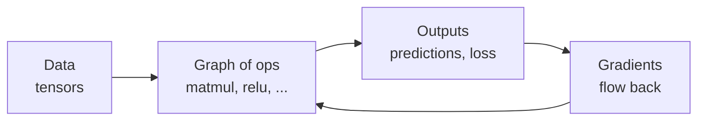
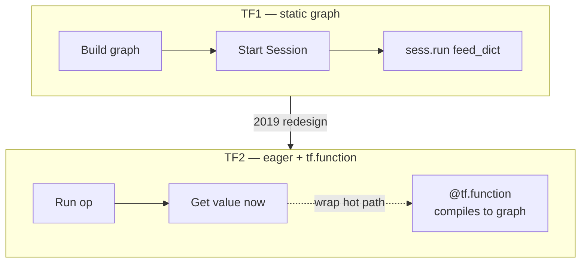
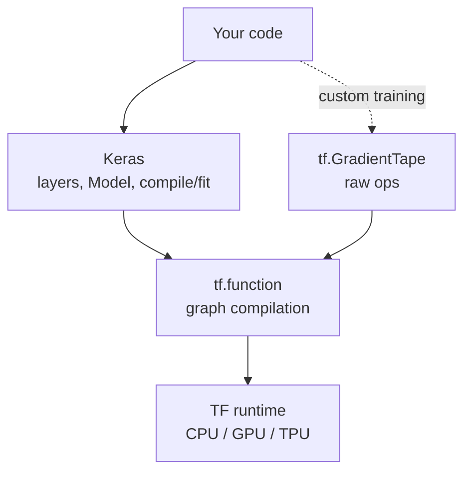
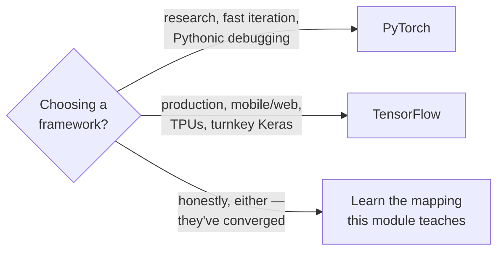

# Intro to TensorFlow

*Practical Deep Learning using TensorFlow · Lesson 1 of 14 · [← index](README.md) · [next → Tensors](02-tensors.md)*

This is the orientation lesson: where TensorFlow came from, the big TF1→TF2 shift that changed how you write it, why Keras is the API you actually type, the surrounding ecosystem, and how the whole thing lines up against PyTorch. It's the mirror of PyTorch Lesson 1, [01-intro-to-pytorch.md](../02_pytorch/01-intro-to-pytorch.md).

## What TensorFlow is

TensorFlow is an open-source deep learning library developed by the **Google Brain** team and released in 2015. Its name is literal: computation is expressed as a **graph of operations** through which **tensors** (n-dimensional arrays) *flow*. It runs the same code on CPU, GPU, and Google's custom **TPU** hardware, and it ships an unusually complete deployment story — mobile, browser, and production serving — which is historically its biggest differentiator from PyTorch.



## History and the TF1 → TF2 shift

The single most important thing to understand about TensorFlow is that **TF1 and TF2 are almost two different libraries**. If you find old Stack Overflow answers with `tf.Session` and `feed_dict`, they are TF1 and you should not copy them.

| Era | Model | How you ran a computation |
| --- | --- | --- |
| **TF1** (2015-2019) | **Static graph** ("define-then-run") | Build a graph symbolically, then execute it inside a `tf.Session` with `sess.run(...)`, feeding values through placeholders. Fast and deployable, but hard to debug — you couldn't just `print` an intermediate value. |
| **TF2** (2019-present) | **Eager execution by default** ("define-by-run") | Ops run immediately and return concrete values, exactly like NumPy or PyTorch. You wrap hot paths in `@tf.function` to *opt back into* a compiled graph for speed. |



The TF2 redesign was, in large part, a response to PyTorch: eager execution made TensorFlow feel Pythonic and debuggable, closing the ergonomics gap that had driven researchers to PyTorch. `@tf.function` then lets you reclaim static-graph performance for the parts that need it — you get eager's debuggability *and* graph-mode speed, choosing per-function.

```python
import tensorflow as tf

# Eager by default: this runs NOW and prints a real value.
x = tf.constant([[1., 2.], [3., 4.]])
print(tf.reduce_sum(x))          # tf.Tensor(10.0, shape=(), dtype=float32)

@tf.function                     # opt into a compiled graph for speed
def forward(a, b):
    return tf.matmul(a, b) + 1.0
```

> **Note:** `@tf.function` is the TF2 replacement for TF1's whole `Session`/graph machinery. You almost never build graphs by hand anymore — you write eager Python and decorate the function you want compiled. Keras applies `@tf.function` internally inside `model.fit`, which is why training is fast without you thinking about graphs.

## Keras is the API you actually type

Since TF2, **Keras is the official high-level API of TensorFlow**, shipped as `tf.keras`. In practice you rarely touch raw TensorFlow ops when building models — you build with Keras layers, optimizers, losses, and the `compile`/`fit` loop, and drop down to raw TF (tensors, `GradientTape`) only when you need custom behavior.



Keras is where the PyTorch parallels live: `keras.Model` is your `nn.Module`, `keras.layers.Dense` is your `nn.Linear`, `keras.optimizers` is your `torch.optim`. The rest of this module is essentially "here is the Keras spelling of the PyTorch thing you know."

## The ecosystem

TensorFlow's breadth beyond training is its historical strength. You train once and deploy the same model across very different targets:

| Piece | What it's for | PyTorch-world analog |
| --- | --- | --- |
| **TensorFlow Lite** | On-device inference (Android, iOS, embedded, microcontrollers) | ExecuTorch / PyTorch Mobile |
| **TensorFlow.js** | Run/train models in the browser and Node.js | ONNX Runtime Web |
| **TF Serving** | High-throughput model serving in production | TorchServe |
| **TFX** | End-to-end production ML pipelines (validation, transform, serving) | TorchX / bespoke |
| **TensorBoard** | Training visualization (loss curves, graphs, histograms) | TensorBoard (PyTorch uses it too) |
| **TensorFlow Hub** | Repository of reusable pretrained models | `torch.hub` / Hugging Face |

## TensorFlow vs PyTorch

The two frameworks have converged enormously — TF2 adopted eager execution, PyTorch added graph compilation (`torch.compile`). The differences that remain are more about culture and deployment than capability.

| Dimension | PyTorch | TensorFlow 2.x |
| --- | --- | --- |
| Default execution | Eager (always) | Eager, opt into graph via `@tf.function` |
| High-level API | `torch.nn` (+ Lightning, community) | Keras (built-in, official) |
| Feel | Pythonic, imperative | Pythonic in TF2; Keras is very declarative |
| Research mindshare | Dominant | Smaller, but strong at Google |
| Deployment / mobile / web | Improving | Very mature (Lite, JS, Serving, TFX) |
| Hardware | CPU/GPU | CPU/GPU/**TPU** (first-class) |
| Debugging | Very easy (native Python) | Easy in eager; graph mode a bit more opaque |



> **Note:** Framework choice matters far less than it did in 2018. The concepts — tensors, autodiff, layers, optimizers, the training loop — transfer directly. This module exists precisely because the *ideas* are identical and only the *spelling* changes.

## Where TensorFlow is used

TensorFlow has broad industry adoption, especially where deployment breadth matters: Google (Search, Photos, Translate), and it's commonly cited across companies like Airbnb, Twitter/X, PayPal, Intel, and many mobile/edge ML products (via TF Lite). Its production tooling (Serving, TFX) makes it a frequent choice for large-scale ML platforms.

## Plan for this module

From here the module follows the PyTorch course beat-for-beat: tensors (02), automatic differentiation (03), a from-scratch training loop (04), the Keras model API (05), input pipelines (06), a full ANN (07), then GPU/scale, regularization, tuning, CNNs, transfer learning, and RNNs/LSTMs (08-14). The foundations module's [`Lesson_05_TensorFlow`](../01_deep-learning-foundations/Lesson_05_TensorFlow/) is good complementary background on the same basics.

## Key takeaways

- TensorFlow is Google Brain's open-source deep learning library (2015); computation is a graph of ops through which tensors flow, running on CPU/GPU/TPU with an unusually strong deployment story.
- **TF1 vs TF2 is the key fault line:** TF1 was static-graph "define-then-run" via `tf.Session`/`feed_dict`; TF2 is eager "define-by-run" by default, with `@tf.function` to opt back into compiled graphs for speed. Ignore TF1-style code you find online.
- **Keras (`tf.keras`) is the official high-level API** and the thing you actually type — `keras.Model` ↔ `nn.Module`, `keras.layers.Dense` ↔ `nn.Linear`, `keras.optimizers` ↔ `torch.optim`. You drop to raw TF (`tf.GradientTape`) only for custom training.
- The ecosystem — **TF Lite** (mobile/edge), **TF.js** (browser), **TF Serving** (production serving), **TFX** (pipelines), **TensorBoard**, **TF Hub** — is TensorFlow's historical differentiator from PyTorch.
- PyTorch and TensorFlow have largely converged (TF2 got eager execution, PyTorch got `torch.compile`); remaining differences are cultural and deployment-oriented, not fundamental. The concepts transfer 1:1, which is exactly what the rest of this module maps.
- This lesson is purely conceptual (no training code); the hands-on tensor work starts in [Lesson 02](02-tensors.md).
