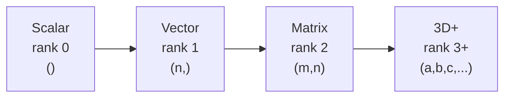
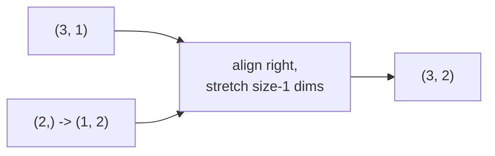

# Tensors

*Practical Deep Learning using TensorFlow · Lesson 2 of 14 · [← prev: Intro](01-intro-to-tensorflow.md) · [next → Automatic Differentiation](03-automatic-differentiation.md)*

Tensors are the core data structure in TensorFlow — the same role they play in PyTorch (see the parallel [02-tensors.md](../02_pytorch/02-tensors.md)). This lesson covers creating tensors, the crucial `tf.constant` vs `tf.Variable` split, dtypes and shapes, the main operation families, broadcasting, reshaping, NumPy interop, and device placement. If you know PyTorch tensors, this is mostly a spelling change — with one genuinely different idea (immutability) worth pausing on.

## The mental model: scalars → vectors → matrices → N-D



Every tensor carries three things: a **shape** (`.shape`), a **dtype** (`.dtype`), and the data itself. In deep learning, a batch of RGB images is a rank-4 tensor `(batch, height, width, channels)`, a batch of token sequences is rank-3 `(batch, timesteps, features)`, and so on.

## The big idea: `tf.constant` vs `tf.Variable`

This is the one place TensorFlow tensors differ conceptually from PyTorch. TF splits tensors into two types by **mutability**:

| | `tf.constant` | `tf.Variable` |
| --- | --- | --- |
| Mutable? | No — immutable | Yes — mutable via `.assign()` |
| Tracked by `GradientTape`? | Only if you `tape.watch(it)` | **Automatically** (it's trainable) |
| Used for | Input data, fixed values | Model weights, anything that gets updated |
| PyTorch analog | `torch.tensor(...)` | `torch.tensor(..., requires_grad=True)` |

```python
import tensorflow as tf

c = tf.constant([[1., 2.], [3., 4.]])   # immutable
# c[0, 0].assign(9.)                    # ERROR: constants can't be assigned

v = tf.Variable([[1., 2.], [3., 4.]])   # mutable, trainable
v.assign(v * 2)                         # in-place update -> [[2,4],[6,8]]
v.assign_sub([[1., 1.], [1., 1.]])      # v -= 1  (this is exactly the manual SGD update in Lesson 04)
v.assign_add([[1., 1.], [1., 1.]])      # v += 1
```

> **Note:** `tf.Variable` is the analog of a PyTorch leaf tensor with `requires_grad=True`. Model weights are always `tf.Variable`s — Keras creates them for you. The `.assign_sub(lr * grad)` pattern above is literally the manual gradient-descent step you'll write by hand in [Lesson 04](04-training-pipeline.md), the mirror of PyTorch's `with torch.no_grad(): w -= lr * w.grad`.

## Creating a tensor

TensorFlow's constructors line up almost one-to-one with PyTorch's:

```python
tf.zeros((2, 3))                       # all zeros
tf.ones((2, 3))                        # all ones
tf.fill((3, 3), 5)                     # filled with 5   (torch.full)
tf.eye(5)                              # 5x5 identity
tf.range(0, 10, 2)                     # [0 2 4 6 8]     (torch.arange)
tf.linspace(0.0, 10.0, 10)             # 10 evenly spaced points
tf.constant([[1, 2, 3], [4, 5, 6]])    # from a nested list

tf.random.set_seed(100)                # reproducible randomness (torch.manual_seed)
tf.random.uniform((2, 3))              # uniform [0,1)    (torch.rand)
tf.random.normal((2, 3))               # standard normal  (torch.randn)

x = tf.constant([[1, 2, 3], [4, 5, 6]])
tf.zeros_like(x)                       # same shape, zeros   (_like family, same as PyTorch)
tf.ones_like(x)
```

| PyTorch | TensorFlow |
| --- | --- |
| `torch.zeros` / `torch.ones` | `tf.zeros` / `tf.ones` |
| `torch.rand` / `torch.randn` | `tf.random.uniform` / `tf.random.normal` |
| `torch.arange` / `torch.linspace` | `tf.range` / `tf.linspace` |
| `torch.full` / `torch.eye` | `tf.fill` / `tf.eye` |
| `torch.manual_seed(n)` | `tf.random.set_seed(n)` |
| `torch.zeros_like(x)` | `tf.zeros_like(x)` |

## Shapes and dtypes

```python
x = tf.constant([[1, 2, 3], [4, 5, 6]])
x.shape          # TensorShape([2, 3])
x.ndim           # 2  (rank)
x.dtype          # tf.int32   (note: TF defaults ints to int32, not int64 like PyTorch)

tf.cast(x, tf.float32)                       # cast dtype  (torch's .to(torch.float32))
tf.constant([1., 2.], dtype=tf.float64)      # force dtype at creation
```

Common dtypes, and when to reach for them:

| Dtype | Use |
| --- | --- |
| `tf.float32` | Default for almost all DL. |
| `tf.float64` | High-precision numerics; rarely needed in DL, costs memory. |
| `tf.float16` / `tf.bfloat16` | Mixed-precision training on GPU/TPU (see [Lesson 08](08-gpu-and-distributed.md)). |
| `tf.int32` | Default integer type; indices, labels. |
| `tf.int64` | Large indices. |
| `tf.uint8` | Raw image pixel data (0-255). |
| `tf.bool` | Boolean masks. |

> **Note:** A common PyTorch→TF gotcha: `torch.tensor([1,2,3])` gives `int64`, but `tf.constant([1,2,3])` gives `int32`. And `SparseCategoricalCrossentropy` labels can be `int32` or `int64` in Keras, whereas PyTorch's `CrossEntropyLoss` strictly wants `torch.long` (int64). Cast explicitly when a shape/dtype error bites.

## Mathematical operations

The same six families as the PyTorch lesson — TF exposes them both as `tf.*` functions and (mostly) as Python operators.

```python
a = tf.random.uniform((2, 2)); b = tf.random.uniform((2, 2))

# 1. Scalar / element-wise ops (operators just work)
a + 2; a - 2; a * 3; a / 3; a ** 2
a + b; a * b; tf.abs(a); tf.math.floor(a); tf.clip_by_value(a, 0.2, 0.8)   # clamp

# 2. Reductions  (note the tf.reduce_* naming)
tf.reduce_sum(a); tf.reduce_sum(a, axis=0); tf.reduce_mean(a)
tf.reduce_max(a); tf.reduce_min(a)
tf.argmax(a, axis=1); tf.argmin(a, axis=0)

# 3. Matrix ops
tf.matmul(a, b)              # or a @ b
tf.transpose(a)
tf.linalg.inv(a); tf.linalg.det(a)
tf.tensordot(u, v, axes=1)   # dot product for 1-D vectors

# 4. Comparisons
a > b; a == b                # element-wise boolean tensor

# 5. Special functions
tf.math.log(a); tf.exp(a); tf.sqrt(a)
tf.sigmoid(a); tf.nn.softmax(a, axis=0); tf.nn.relu(a)
```

| PyTorch | TensorFlow |
| --- | --- |
| `torch.sum` / `torch.mean` | `tf.reduce_sum` / `tf.reduce_mean` |
| `torch.max` / `torch.argmax` | `tf.reduce_max` / `tf.argmax` |
| `torch.matmul` / `a @ b` | `tf.matmul` / `a @ b` |
| `torch.clamp` | `tf.clip_by_value` |
| `dim=` | `axis=` |
| `torch.sigmoid` / `torch.softmax` / `torch.relu` | `tf.sigmoid` / `tf.nn.softmax` / `tf.nn.relu` |

> **Note:** Two naming traps for PyTorch users: reductions are `tf.reduce_*` (not bare `tf.sum`), and the dimension argument is `axis=`, not `dim=`. Otherwise the vocabulary is nearly identical.

## Broadcasting

Broadcasting rules are identical to NumPy and PyTorch: align shapes from the right, dimensions of size 1 stretch.

```python
A = tf.ones((3, 1))          # (3, 1)
b = tf.constant([10., 20.])  # (2,)  -> broadcasts to (1, 2)
A + b                        # (3, 2)  -- rows and cols stretched independently
```



## Reshaping

```python
x = tf.range(12)
tf.reshape(x, (3, 4))                 # x.reshape / x.view
tf.reshape(x, (3, -1))                # -1 infers the dimension
tf.expand_dims(x, axis=0)             # insert a size-1 dim   (torch.unsqueeze)
tf.squeeze(y)                         # drop size-1 dims       (torch.squeeze)
tf.transpose(m, perm=[1, 0])          # reorder dims           (torch.permute)
```

| PyTorch | TensorFlow |
| --- | --- |
| `x.reshape` / `x.view` | `tf.reshape` |
| `x.unsqueeze(dim)` | `tf.expand_dims(x, axis)` |
| `x.squeeze()` | `tf.squeeze(x)` |
| `x.permute(*dims)` | `tf.transpose(x, perm=[...])` |
| `x.flatten()` | `tf.reshape(x, [-1])` |

## NumPy interop

TensorFlow and NumPy interoperate seamlessly. Most TF ops accept NumPy arrays directly, and eager tensors expose `.numpy()`.

```python
import numpy as np

t = tf.constant([[1., 2.], [3., 4.]])
arr = t.numpy()                       # eager Tensor -> np.ndarray

back = tf.convert_to_tensor(arr)      # np.ndarray -> Tensor  (torch.from_numpy analog)
tf.constant(np.arange(6))             # ops accept ndarrays directly too
```

> **Note:** Unlike PyTorch's `torch.from_numpy` (which *shares* memory with the NumPy array), `tf.convert_to_tensor` generally **copies** the data, and `.numpy()` on a GPU tensor copies it back to host. So the "mutate one, mutate the other" aliasing footgun from the PyTorch lesson does **not** apply here — TF tensors are immutable anyway.

## Device placement

Here TensorFlow diverges sharply from PyTorch, and in your favor: **placement is automatic**. TF puts ops on the GPU when one is available, with no `.to(device)` calls. You only reach for explicit placement in special cases.

```python
tf.config.list_physical_devices('GPU')   # [] if no GPU, else a list of devices

with tf.device('/GPU:0'):                 # explicit placement (rarely needed)
    a = tf.random.normal((1000, 1000))
    b = tf.matmul(a, a)

# There is NO x.to('cuda') / model.to(device). TF handles it.
```

| PyTorch | TensorFlow |
| --- | --- |
| `torch.cuda.is_available()` | `tf.config.list_physical_devices('GPU')` |
| `x.to('cuda')` / `x.cuda()` | automatic (or `with tf.device('/GPU:0'):`) |
| `model.to(device)` | automatic |
| manual per-batch `.to(device)` | not needed |

Scaling to *multiple* GPUs or TPUs is a different tool — `tf.distribute` — covered in [Lesson 08](08-gpu-and-distributed.md).

## Key takeaways

- Tensors generalize scalars → vectors → matrices → N-D arrays; each carries a `.shape`, a `.dtype`, and (in eager mode) concrete data you can `.numpy()` out.
- The defining TF split is **`tf.constant` (immutable) vs `tf.Variable` (mutable, auto-tracked for gradients)** — the analog of PyTorch's `requires_grad=False` vs `requires_grad=True`. Model weights are always `tf.Variable`s, updated with `.assign` / `.assign_sub` / `.assign_add`.
- Constructors map almost 1:1 (`tf.zeros`/`ones`/`fill`/`eye`/`range`/`linspace`, `tf.random.uniform`/`normal`, `tf.random.set_seed`), with the `_like` family available too.
- Operation naming has two PyTorch→TF traps: reductions are `tf.reduce_*` (not `tf.sum`) and the axis argument is `axis=` (not `dim=`). Broadcasting, matmul (`@`), and activations are otherwise the same.
- Reshaping maps directly: `tf.reshape` (view/reshape), `tf.expand_dims` (unsqueeze), `tf.squeeze`, `tf.transpose` (permute).
- NumPy interop is seamless (`.numpy()` out, `tf.convert_to_tensor` in), but TF **copies** rather than sharing memory, so the PyTorch memory-aliasing gotcha doesn't apply.
- **Device placement is automatic in TensorFlow** — no `.to(device)`. That whole line of PyTorch boilerplate disappears; multi-device scaling is handled by `tf.distribute` instead (Lesson 08).
