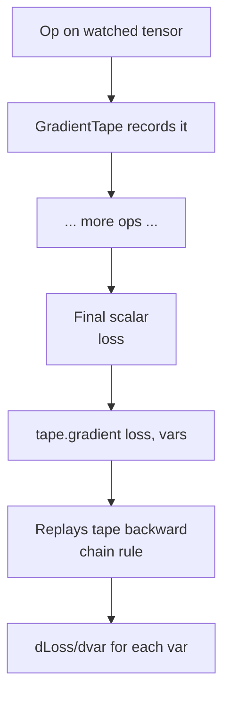
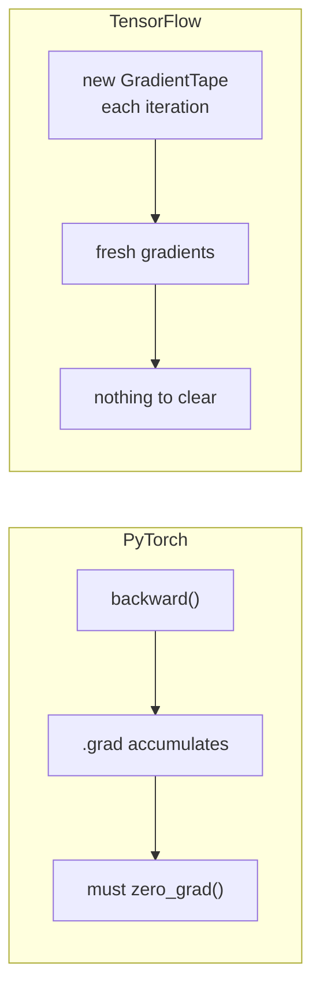

# Automatic Differentiation

*Practical Deep Learning using TensorFlow · Lesson 3 of 14 · [← prev: Tensors](02-tensors.md) · [next → Training Pipeline](04-training-pipeline.md)*

`tf.GradientTape` is TensorFlow's automatic differentiation engine — the direct analog of PyTorch's autograd (see the parallel [03-autograd.md](../02_pytorch/03-autograd.md)). This lesson builds it up exactly as the PyTorch lesson does: a manual derivative to check against, then scalar autodiff, a chained function, a full logistic-regression loss gradient, a vector input, and the practical mechanics (persistent tapes, `watch`, `stop_gradient`, higher-order). This is the mechanism that makes the training loop in [Lesson 04](04-training-pipeline.md) — and every `model.fit` after it — possible.

## What GradientTape is

`tf.GradientTape` is a context manager that **records** every operation involving a watched tensor onto a "tape." Once you exit the block, calling `tape.gradient(target, sources)` replays the tape backward, applying the chain rule to compute the gradient of `target` with respect to each `source`. It is reverse-mode automatic differentiation, the same algorithm as PyTorch autograd — the difference is *where* the recording is controlled.



The key contrast with PyTorch:

| | PyTorch autograd | TensorFlow GradientTape |
| --- | --- | --- |
| What records | Any op on a `requires_grad=True` tensor, **always** | Only ops **inside a `with tf.GradientTape()` block** |
| Trigger the backward pass | `loss.backward()` | `tape.gradient(loss, sources)` |
| Where gradients land | `.grad` attribute on each leaf tensor | returned by `tape.gradient` (nothing stored on the tensor) |
| Watched automatically | tensors with `requires_grad=True` | `tf.Variable`s |
| Gradient accumulation | **Yes** — must `zero_grad()` | **No** — each tape is fresh, nothing to clear |

That last row is the big one: because the tape is scoped and disposable, **there is no `zero_grad` in TensorFlow**. Gradients don't accumulate across iterations the way PyTorch's `.grad` does.

## Manual differentiation warm-up

Same baseline as the PyTorch lesson — compute a derivative by hand first, to check the tape against. For `y = x²`, `dy/dx = 2x`, so at `x = 3` the answer is `6`.

```python
def dy_dx(x):
    return 2 * x
dy_dx(3.0)        # 6.0
```

## GradientTape basics

The same derivative, computed by letting TensorFlow record and differentiate:

```python
import tensorflow as tf

x = tf.Variable(3.0)                 # a Variable is watched automatically
with tf.GradientTape() as tape:
    y = x ** 2                       # tape records this op
dy_dx = tape.gradient(y, x)          # 6.0  -- matches the manual derivative
```

Compare directly with PyTorch:

```python
# PyTorch equivalent:
# x = torch.tensor(3.0, requires_grad=True)
# y = x ** 2
# y.backward()
# x.grad   -> tensor(6.)
```

> **Note:** A `tf.Variable` is watched automatically, just like a PyTorch leaf tensor with `requires_grad=True`. A `tf.constant` is **not** watched — if you want gradients w.r.t. a constant, you must call `tape.watch(c)` inside the block (see below). This is TF's equivalent of the leaf/`requires_grad` distinction.

## Chained functions

Autodiff earns its keep once functions compose. For `z = sin(x²)`, the chain rule gives `dz/dx = 2x·cos(x²)`; at `x = 4` that's about `-7.6613`.

```python
import math
def dz_dx(x):
    return 2 * x * math.cos(x ** 2)
dz_dx(4.0)        # -7.661275842587077

x = tf.Variable(4.0)
with tf.GradientTape() as tape:
    y = x ** 2
    z = tf.sin(y)
tape.gradient(z, x)     # -7.6613  -- matches the manual chain-rule result
```

## Worked example — logistic regression on one data point

The core pedagogical example, mirroring the PyTorch lesson: the gradient of a binary cross-entropy loss w.r.t. a weight `w` and bias `b`, computed by hand and then by the tape.

```python
x = tf.constant(6.7); y = tf.constant(0.0)      # input feature, true label
w = tf.Variable(1.0); b = tf.Variable(0.0)       # weight, bias (watched)

def bce_loss(pred, target):
    eps = 1e-8
    pred = tf.clip_by_value(pred, eps, 1 - eps)  # clamp away from 0/1 to avoid log(0)
    return -(target * tf.math.log(pred) + (1 - target) * tf.math.log(1 - pred))

with tf.GradientTape() as tape:
    z = w * x + b
    y_pred = tf.sigmoid(z)
    loss = bce_loss(y_pred, y)                   # ~6.7012

dw, db = tape.gradient(loss, [w, b])
print(dw.numpy(), db.numpy())                    # ~6.6918, ~0.9988
```

The manual chain rule (`dL/dy_pred · dy_pred/dz · dz/dw`) gives `dL_dw ≈ 6.6918` and `dL_db ≈ 0.9988` — and the tape reproduces them exactly. Note how you can request gradients for **a list of sources** in one call (`[w, b]`), getting a list back; this is exactly how you'll grab gradients for all of a model's weights at once in the next lesson.

## Vector input

Same behavior when the source is a vector rather than a scalar:

```python
x = tf.Variable([1.0, 2.0, 3.0])
with tf.GradientTape() as tape:
    y = tf.reduce_mean(x ** 2)
tape.gradient(y, x)     # [0.6667, 1.3333, 2.0000]  == 2x/3 element-wise
```

## No `zero_grad` — the tape is fresh every time

This is worth showing explicitly because it's the single biggest behavioral difference from PyTorch. In PyTorch, calling `.backward()` twice *accumulates* into `.grad`, so you must `zero_grad()`. In TensorFlow, each `with tf.GradientTape()` block is an independent recording — run it again and you get a fresh, un-accumulated gradient.

```python
x = tf.Variable(2.0)

for step in range(3):
    with tf.GradientTape() as tape:      # a brand-new tape each iteration
        y = x ** 2
    g = tape.gradient(y, x)              # always 4.0 -- NOT accumulating to 8, 12, ...
    print(g.numpy())
# 4.0
# 4.0
# 4.0
```



> **Note:** If you *want* accumulation in TF (e.g. gradient accumulation across micro-batches), you do it explicitly by summing the gradient tensors yourself — it never happens by accident. The absence of a `zero_grad` bug class is a real ergonomic win.

## Persistent tapes and watching constants

By default a tape is consumed by the first `gradient()` call and freed. Two escape hatches:

```python
# persistent=True: call gradient() multiple times off the same tape
with tf.GradientTape(persistent=True) as tape:
    y = x ** 2
    z = x ** 3
tape.gradient(y, x)     # ok
tape.gradient(z, x)     # ok too (would raise without persistent=True)
del tape                # free it manually when done

# tape.watch: differentiate w.r.t. a constant (not just Variables)
c = tf.constant(3.0)
with tf.GradientTape() as tape:
    tape.watch(c)       # explicitly track this constant
    y = c ** 2
tape.gradient(y, c)     # 6.0
```

| Need | PyTorch | TensorFlow |
| --- | --- | --- |
| Multiple backward passes | `loss.backward(retain_graph=True)` | `tf.GradientTape(persistent=True)` |
| Track a non-leaf / constant | `.retain_grad()` / set `requires_grad` | `tape.watch(tensor)` |

## Stopping gradient tracking

Three ways, mirroring PyTorch's `requires_grad_(False)` / `.detach()` / `torch.no_grad()`:

```python
# 1. Just don't compute inside a tape — ops outside any tape aren't recorded (the common case).
y = x ** 2                                   # not tracked; no active tape

# 2. tf.stop_gradient: block gradient flow through a value  (torch's .detach())
with tf.GradientTape() as tape:
    y = tf.stop_gradient(x) ** 2             # gradient will NOT flow back to x here
tape.gradient(y, x)                          # None

# 3. Variable(trainable=False): permanently exclude from automatic watching
frozen = tf.Variable(3.0, trainable=False)   # analog of requires_grad_(False)
```

| PyTorch | TensorFlow |
| --- | --- |
| `x.detach()` | `tf.stop_gradient(x)` |
| `with torch.no_grad():` | simply run outside any `GradientTape` block |
| `x.requires_grad_(False)` | `tf.Variable(..., trainable=False)` |

## Higher-order derivatives

Nest tapes to differentiate twice. For `y = x³`, `dy/dx = 3x²` and `d²y/dx² = 6x`; at `x = 2` those are `12` and `12`.

```python
x = tf.Variable(2.0)
with tf.GradientTape() as outer:
    with tf.GradientTape() as inner:
        y = x ** 3
    dy_dx = inner.gradient(y, x)       # 12.0  (3x^2 at x=2)
d2y_dx2 = outer.gradient(dy_dx, x)     # 12.0  (6x   at x=2)
```

## Key takeaways

- `tf.GradientTape` is reverse-mode autodiff — the same algorithm as PyTorch autograd. The difference is scope: it records only ops **inside its `with` block**, and you trigger the backward pass with `tape.gradient(target, sources)` (returning the gradients) rather than `loss.backward()` (which stores into `.grad`).
- `tf.Variable`s are watched automatically (like `requires_grad=True` leaf tensors); a `tf.constant` must be explicitly `tape.watch(...)`ed to get gradients w.r.t. it.
- **There is no `zero_grad` in TensorFlow.** Each tape is fresh and disposable, so gradients never accumulate across iterations — this whole class of PyTorch bug simply doesn't exist here.
- Across scalar, chained, logistic-regression, and vector examples, the tape's gradients match hand-derived chain-rule results exactly. You can request gradients for a **list of sources** (`tape.gradient(loss, [w, b])`) in one call — the pattern used to grab all model weights at once.
- A default tape is single-use; pass `persistent=True` to call `gradient()` multiple times (analog of `retain_graph=True`), and `del` it when done.
- Stop gradients three ways: run outside any tape (`torch.no_grad()` analog), `tf.stop_gradient(x)` (`.detach()` analog), or `tf.Variable(..., trainable=False)` (`requires_grad_(False)` analog). Nest tapes for higher-order derivatives.
- This `GradientTape` + `apply_gradients` mechanism is exactly what powers the from-scratch loop in [Lesson 04](04-training-pipeline.md) and, under the hood, every `model.fit` after it.
