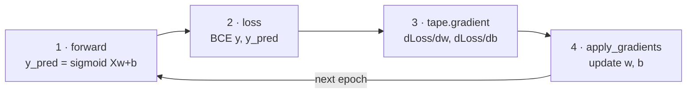

# Training Pipeline

*Practical Deep Learning using TensorFlow · Lesson 4 of 14 · [← prev: Automatic Differentiation](03-automatic-differentiation.md) · [next → Keras Model API](05-keras-model-api.md)*

This lesson builds the canonical TensorFlow training loop **from scratch** — no Keras layers, no `model.fit`, no optimizer magic — using only `tf.Variable`, `tf.GradientTape`, and manual weight updates. It trains a logistic-regression-style binary classifier on the **Breast Cancer Wisconsin** dataset (the same dataset the PyTorch course uses) to establish the loop shape that every later lesson reuses. It is the mirror of PyTorch [04-training-pipeline.md](../02_pytorch/04-training-pipeline.md).

The whole point: expose the loop that `model.fit` (Lesson 05 onward) hides, so you know exactly what it's doing.

## The loop shape



Compare to PyTorch's five steps (forward → loss → `backward` → `step` → `zero_grad`): TensorFlow's loop is the **same, minus `zero_grad`** — the tape computes fresh gradients each pass, so there is nothing to clear.

## Data loading and preprocessing

Same dataset and same preprocessing as the PyTorch lesson — a 569-row Breast Cancer Wisconsin CSV, `StandardScaler` fit on train only (no leakage), `LabelEncoder` for the M/B labels — the only change is converting to TF tensors at the end.

```python
import numpy as np, pandas as pd, tensorflow as tf
from sklearn.model_selection import train_test_split
from sklearn.preprocessing import StandardScaler, LabelEncoder

df = pd.read_csv('https://raw.githubusercontent.com/gscdit/Breast-Cancer-Detection/refs/heads/master/data.csv')
df.drop(columns=['id', 'Unnamed: 32'], inplace=True)   # drop id + stray empty trailing column

X_train, X_test, y_train, y_test = train_test_split(df.iloc[:, 1:], df.iloc[:, 0], test_size=0.2, random_state=42)

scaler = StandardScaler()
X_train = scaler.fit_transform(X_train)     # fit + transform on train
X_test = scaler.transform(X_test)           # transform ONLY on test -- avoids leakage

encoder = LabelEncoder()
y_train = encoder.fit_transform(y_train)    # 'M'/'B' -> 1/0
y_test = encoder.transform(y_test)

# NumPy -> TensorFlow tensors  (float32 from the start; TF's DL default)
X_train_t = tf.constant(X_train, dtype=tf.float32)   # (455, 30)
X_test_t  = tf.constant(X_test,  dtype=tf.float32)
y_train_t = tf.constant(y_train, dtype=tf.float32)   # (455,)
y_test_t  = tf.constant(y_test,  dtype=tf.float32)
```

Inputs are `tf.constant` (fixed data, not updated during training); the model's weights will be `tf.Variable`.

| PyTorch | TensorFlow |
| --- | --- |
| `torch.from_numpy(X_train)` | `tf.constant(X_train, dtype=tf.float32)` |
| defaulted to `float64` (then fought dtype bugs) | `float32` from the start (TF's default DL dtype) |

## The model — written from scratch

No Keras layers here (that's Lesson 05). The weights and bias are raw `tf.Variable`s — the TF analog of PyTorch's `requires_grad=True` tensors — so `GradientTape` watches them automatically.

```python
class MySimpleNN:
    def __init__(self, n_features):
        self.weights = tf.Variable(tf.random.normal((n_features, 1)), dtype=tf.float32)
        self.bias    = tf.Variable(tf.zeros((1,)), dtype=tf.float32)

    def forward(self, X):
        z = tf.matmul(X, self.weights) + self.bias
        return tf.sigmoid(z)                       # logistic-regression-style output

    def loss_fn(self, y_pred, y):
        eps = 1e-7
        y_pred = tf.clip_by_value(y_pred, eps, 1 - eps)          # avoid log(0)
        y = tf.reshape(y, (-1, 1))                                # match y_pred's (N,1) shape
        bce = -(y * tf.math.log(y_pred) + (1 - y) * tf.math.log(1 - y_pred))
        return tf.reduce_mean(bce)
```

`forward` is a linear combination followed by a sigmoid; `loss_fn` is binary cross-entropy by hand, clamping predictions away from 0 and 1 with `tf.clip_by_value` (the `torch.clamp` analog) so `log(0)` never happens — identical logic to the PyTorch lesson.

## The training loop — the canonical pattern

Two ways to do the update. Start with the version the lesson title promises — `optimizer.apply_gradients` — then see the even-more-manual variant.

```python
learning_rate = 0.1
epochs = 25

model = MySimpleNN(X_train_t.shape[1])
optimizer = tf.keras.optimizers.SGD(learning_rate=learning_rate)

for epoch in range(epochs):
    with tf.GradientTape() as tape:                       # 1+2. forward + loss, recorded on the tape
        y_pred = model.forward(X_train_t)
        loss = model.loss_fn(y_pred, y_train_t)

    grads = tape.gradient(loss, [model.weights, model.bias])   # 3. gradients for both params at once
    optimizer.apply_gradients(zip(grads, [model.weights, model.bias]))   # 4. update

    print(f'Epoch: {epoch + 1}, Loss: {loss.numpy():.4f}')
# Loss falls steadily over 25 epochs (mirrors the PyTorch run's ~3.9 -> ~0.75 trajectory)
```

The `forward` pass and loss computation happen **inside** the `GradientTape` block — that's what gets recorded. `tape.gradient` then returns the gradients for both parameters in one call, and `apply_gradients` applies the SGD update. Note there is no `zero_grad`: the next iteration opens a fresh tape.

### The even-more-from-scratch update (manual `assign_sub`)

To see what `apply_gradients` is doing, replace the optimizer with a hand-written gradient-descent step — the exact analog of PyTorch's `with torch.no_grad(): weights -= lr * weights.grad`:

```python
for epoch in range(epochs):
    with tf.GradientTape() as tape:
        y_pred = model.forward(X_train_t)
        loss = model.loss_fn(y_pred, y_train_t)

    dw, db = tape.gradient(loss, [model.weights, model.bias])
    model.weights.assign_sub(learning_rate * dw)     # w -= lr * dw   (no torch.no_grad() wrapper needed)
    model.bias.assign_sub(learning_rate * db)        # b -= lr * db
```

> **Note:** In PyTorch the manual update must be wrapped in `with torch.no_grad():` so the in-place `-=` isn't recorded by autograd. TensorFlow needs no such wrapper — `.assign_sub()` on a `tf.Variable` is simply not inside any `GradientTape` block, so it's never recorded. Cleaner, and one fewer footgun.

| Step | PyTorch | TensorFlow |
| --- | --- | --- |
| forward + loss | plain calls | plain calls **inside `with tf.GradientTape()`** |
| backward | `loss.backward()` | `grads = tape.gradient(loss, vars)` |
| update (optimizer) | `optimizer.step()` | `optimizer.apply_gradients(zip(grads, vars))` |
| update (manual) | `with torch.no_grad(): w -= lr*w.grad` | `w.assign_sub(lr * dw)` |
| clear gradients | `optimizer.zero_grad()` / `w.grad.zero_()` | **nothing — no accumulation** |

## Evaluation

```python
y_pred = model.forward(X_test_t)
y_pred_label = tf.cast(y_pred > 0.5, tf.float32)                  # threshold at 0.5
accuracy = tf.reduce_mean(tf.cast(y_pred_label == tf.reshape(y_test_t, (-1, 1)), tf.float32))
print(f'Accuracy: {accuracy.numpy():.4f}')
```

No `model.eval()` / `torch.no_grad()` ceremony is needed for this raw model — there are no dropout/batchnorm layers to switch modes, and evaluating outside a tape means nothing is recorded anyway. (Once real Keras layers with training-time behavior appear, the `training=` flag handles that automatically — see [Lesson 09](09-optimizing-the-network.md).)

> **Note:** As in the PyTorch lesson, this from-scratch logistic-regression baseline is deliberately minimal — a single linear layer, plain SGD, no batching. Its accuracy is the pedagogical starting point that Lessons 05-06 improve on (Keras layers, `keras.optimizers`, `tf.data` mini-batching), not a tuned target.

## Improvements (foreshadowed, not implemented here)

Everything hand-written above has a Keras replacement, which is exactly Lesson 05:

- the `tf.Variable` weights + manual `forward` → `keras.layers.Dense`
- the hand-written BCE → `keras.losses.BinaryCrossentropy`
- the manual loop → `model.compile()` + `model.fit()`

The loop's *shape* won't change — Keras just runs this same `GradientTape` step for you internally.

## Key takeaways

- The from-scratch TF training loop is **forward → loss → `tape.gradient` → `apply_gradients`**, with forward and loss computed *inside* the `GradientTape` block so they're recorded. It's PyTorch's loop minus the `zero_grad` step.
- Model parameters are `tf.Variable`s (auto-watched by the tape); input data is `tf.constant`. Use `float32` from the start — TF's default DL dtype — sidestepping the float64 dtype fights the PyTorch version hit.
- `tape.gradient(loss, [w, b])` returns gradients for all parameters in one call; `optimizer.apply_gradients(zip(grads, vars))` applies them. The manual equivalent is `w.assign_sub(lr * dw)`.
- TensorFlow needs **no `torch.no_grad()` wrapper** around the manual update — `.assign_sub` isn't inside any tape, so it's never recorded. And there is no `zero_grad`, because each tape is fresh.
- Preprocessing is framework-agnostic: `StandardScaler` fit on train only (no leakage), `LabelEncoder` for M/B → 1/0, then `tf.constant(..., dtype=tf.float32)` to move into TensorFlow.
- This baseline is intentionally minimal; Lesson 05 replaces the hand-rolled weights/loss/loop with `keras.layers.Dense`, `keras.losses`, and `compile`/`fit` — the same delta as PyTorch Video 4 → Video 5, with the loop shape unchanged.
