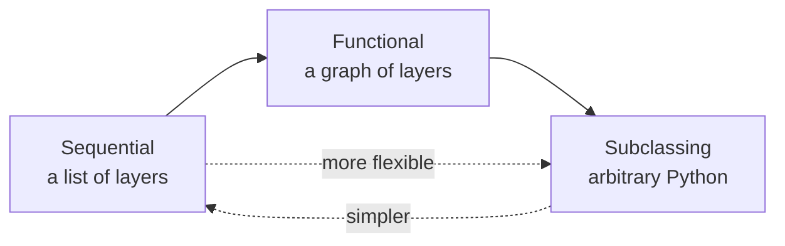
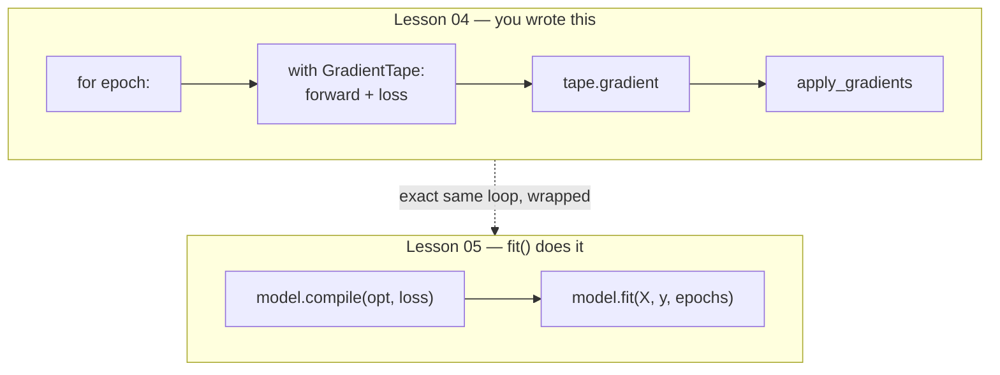

# Keras Model API

*Practical Deep Learning using TensorFlow · Lesson 5 of 14 · [← prev: Training Pipeline](04-training-pipeline.md) · [next → tf.data Input Pipelines](06-tf-data-input-pipelines.md)*

This lesson takes the from-scratch pipeline from [Lesson 04](04-training-pipeline.md) and rebuilds it with **Keras** — the high-level API that plays the role `torch.nn` + `torch.optim` play in PyTorch. It covers the three ways to define a model (Sequential, Functional, subclassing), the layer vocabulary, `model.summary()`, and the `keras.optimizers` / `keras.losses` families. It mirrors PyTorch [05-nn-module.md](../02_pytorch/05-nn-module.md). The core idea is identical to that lesson: the training loop's *shape* stays the same, but hand-written weights, loss math, and updates become library primitives.

## The three ways to build a model

PyTorch has essentially one idiom (`nn.Module` subclass, optionally wrapping `nn.Sequential`). Keras gives you three, on a spectrum from most-declarative to most-flexible.



| Style | Use when | PyTorch analog |
| --- | --- | --- |
| **Sequential** | A plain linear stack of layers | `nn.Sequential` |
| **Functional** | Branches, merges, multiple inputs/outputs, shared layers | `nn.Module` with a hand-wired `forward` |
| **Subclassing** | Dynamic control flow, research code, full control | `nn.Module` (the everyday PyTorch class) |

### Sequential API

The simplest: pass a list of layers. Note that `Dense` takes only the **output** width — Keras infers the input dimension on first call, unlike `nn.Linear(in, out)` which needs both.

```python
from tensorflow import keras
from tensorflow.keras import layers

model = keras.Sequential([
    keras.Input(shape=(5,)),          # declare input shape once
    layers.Dense(3, activation='relu'),
    layers.Dense(1, activation='sigmoid'),
])
```

### Functional API

Layers are called on tensors, building an explicit graph — this is the closest analog to writing a PyTorch `forward`, and it's what you need for anything non-linear (skip connections, multi-input models).

```python
inputs = keras.Input(shape=(5,))
x = layers.Dense(3, activation='relu')(inputs)
outputs = layers.Dense(1, activation='sigmoid')(x)
model = keras.Model(inputs=inputs, outputs=outputs)
```

### Model subclassing — the true `nn.Module` mirror

Subclass `keras.Model`, create layers in `__init__`, and define the forward pass in **`call`** (Keras's `forward`). This is the most PyTorch-like style.

```python
class MySimpleNN(keras.Model):
    def __init__(self, num_features):
        super().__init__()
        self.dense = layers.Dense(1, activation='sigmoid')   # input dim inferred

    def call(self, features):                                # <-- 'call', not 'forward'
        return self.dense(features)

model = MySimpleNN(num_features=30)
model(tf.random.normal((10, 30)))   # invokes call() via __call__, like PyTorch's model(x)
```

| PyTorch | Keras |
| --- | --- |
| `class M(nn.Module):` | `class M(keras.Model):` |
| define layers in `__init__` | define layers in `__init__` |
| forward pass in `forward()` | forward pass in **`call()`** |
| `model(x)` calls `forward` via `__call__` | `model(x)` calls `call` via `__call__` |
| `nn.Linear(in, out)` | `layers.Dense(out)` — input inferred |

> **Note:** The single most common PyTorch→Keras slip is writing `def forward` instead of `def call` when subclassing. Keras won't call `forward`; it calls `call`.

## `model.summary()` — the layer/param inspector

The analog of `torchinfo.summary`. It prints each layer, its output shape, and its parameter count. Weights are created lazily, so call it after the model has seen an input shape (via `keras.Input` or a first call / `model.build`).

```python
model = keras.Sequential([
    keras.Input(shape=(5,)),
    layers.Dense(3, activation='relu'),   # 5*3 + 3 = 18 params
    layers.Dense(1, activation='sigmoid') # 3*1 + 1 = 4  params
])
model.summary()
# Total params: 22   -- same count as the PyTorch nn Lesson's torchinfo run
```

Inspect a specific layer's learned weights, the `model.linear.weight` analog:

```python
model.layers[0].kernel     # weight matrix of the first Dense  (a tf.Variable)
model.layers[0].bias       # its bias vector
model.get_layer(index=0).get_weights()   # [kernel, bias] as NumPy arrays
```

| PyTorch | Keras |
| --- | --- |
| `torchinfo.summary(model, input_size=...)` | `model.summary()` |
| `model.linear.weight` | `model.layers[i].kernel` |
| `model.network[0].weight` | `model.layers[0].kernel` |
| `.parameters()` | `model.trainable_variables` |

## `keras.optimizers` and `keras.losses`

These are the `torch.optim` and loss-function analogs. The big difference: in Keras you usually hand them to `model.compile` and never touch the update step yourself.

```python
optimizer = keras.optimizers.SGD(learning_rate=0.1)     # torch.optim.SGD
optimizer = keras.optimizers.Adam(learning_rate=0.001)  # torch.optim.Adam (the common default)

loss = keras.losses.BinaryCrossentropy()                # torch's nn.BCELoss
loss = keras.losses.SparseCategoricalCrossentropy(from_logits=True)  # nn.CrossEntropyLoss
loss = keras.losses.MeanSquaredError()                  # nn.MSELoss
```

| PyTorch | Keras |
| --- | --- |
| `torch.optim.SGD(model.parameters(), lr=...)` | `keras.optimizers.SGD(learning_rate=...)` |
| `torch.optim.Adam(...)` | `keras.optimizers.Adam(...)` |
| `nn.BCELoss()` | `keras.losses.BinaryCrossentropy()` |
| `nn.CrossEntropyLoss()` (raw logits in) | `keras.losses.SparseCategoricalCrossentropy(from_logits=True)` |
| `nn.MSELoss()` | `keras.losses.MeanSquaredError()` |

## The full pipeline — Breast Cancer, rebuilt with Keras

Same dataset and preprocessing as Lesson 04 (`X_train_t`, `y_train_t`, ... already prepared there). The from-scratch model, hand-written loss, and manual loop collapse into a Sequential model + `compile` + `fit`.

```python
model = keras.Sequential([
    keras.Input(shape=(X_train_t.shape[1],)),      # 30 features
    layers.Dense(1, activation='sigmoid'),          # replaces the hand-rolled weights + sigmoid
])

model.compile(
    optimizer=keras.optimizers.SGD(learning_rate=0.1),   # replaces the manual w -= lr*grad
    loss=keras.losses.BinaryCrossentropy(),              # replaces the hand-written BCE
    metrics=['accuracy'],                                # tracked/printed automatically
)

model.fit(X_train_t, y_train_t, epochs=25, verbose=1)    # replaces the entire for-epoch loop
model.evaluate(X_test_t, y_test_t)                       # -> [loss, accuracy]
```

That single `model.fit` call *is* the Lesson 04 loop — Keras runs a `GradientTape` step (forward → loss → gradient → apply) internally for each batch, for each epoch.



> **Note:** `compile` wires three things — the optimizer, the loss, and the metrics — but adds no new mechanics. It is the same forward/loss/gradient/update loop from Lesson 04, now maintained by Keras. Everything from here uses `compile`/`fit`; you only drop back to a hand-written `GradientTape` loop (Lesson 04 style) when you need custom training behavior Keras's loop can't express.

## Key takeaways

- Keras plays the combined role of `torch.nn` + `torch.optim`: `keras.Model` ↔ `nn.Module`, `keras.layers.Dense` ↔ `nn.Linear`, `keras.optimizers` ↔ `torch.optim`, `keras.losses` ↔ the `nn.*Loss` family.
- Three model-building styles: **Sequential** (linear stack, `nn.Sequential` analog), **Functional** (explicit layer graph, best for branches/multi-IO), and **subclassing** (`keras.Model` with `call()` — the closest mirror of everyday PyTorch `nn.Module`).
- When subclassing, the forward method is **`call`**, not `forward`; calling `model(x)` dispatches to it via `__call__`, exactly like PyTorch.
- `layers.Dense(units)` takes only the **output** width and infers the input dimension on first call — unlike `nn.Linear(in, out)`. Weights are created lazily, so `model.summary()` (the `torchinfo` analog) needs a known input shape first.
- `model.compile(optimizer, loss, metrics)` + `model.fit(...)` replaces the entire hand-written training loop; `model.evaluate(...)` replaces the manual accuracy loop. Under the hood `fit` runs the exact Lesson 04 `GradientTape` loop per batch.
- The Video 4→5 delta is identical in both frameworks: hand-rolled weights → `Dense`, hand-written loss → `keras.losses`, manual update loop → `compile`/`fit` — with the underlying loop shape unchanged. Keras is ergonomics on top of the same autodiff mechanics from [Lesson 03](03-automatic-differentiation.md).
