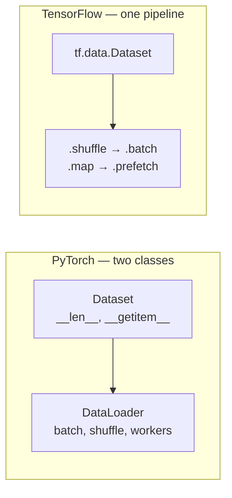
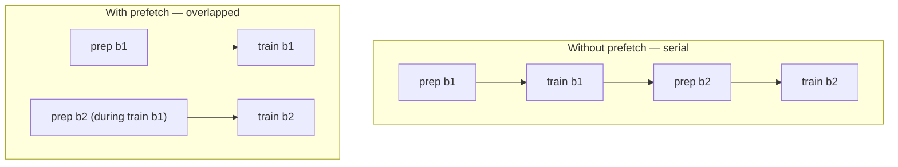

# tf.data Input Pipelines

*Practical Deep Learning using TensorFlow · Lesson 6 of 14 · [← prev: Keras Model API](05-keras-model-api.md) · [next → Building an ANN](07-building-an-ann.md)*

`tf.data.Dataset` is TensorFlow's input-pipeline API — the analog of PyTorch's `Dataset` + `DataLoader` pair (see the parallel [06-dataset-dataloader.md](../02_pytorch/06-dataset-dataloader.md)). This lesson covers building a dataset from tensors, the transformation verbs (`map`/`shuffle`/`batch`/`prefetch`/`cache`), why mini-batching matters, and the performance story (`AUTOTUNE`). It closes by rebuilding the Breast Cancer pipeline to train on mini-batches.

## Why mini-batching matters

Same motivation as the PyTorch lesson. Passing the whole dataset through the model at once has two problems:

1. **Memory** — the full dataset (and its activations) must fit in RAM/GPU at once.
2. **Convergence** — full-batch gradient descent lacks the gradient noise from per-batch estimates that, in practice, helps models converge better and faster.

The fix is the same in both frameworks: train on **batches**. `tf.data` is the tool that produces those batches efficiently.

## `tf.data` vs `DataLoader`: the shape of the analogy

PyTorch splits the job across two classes; TensorFlow puts it in one chainable object.



| PyTorch | TensorFlow |
| --- | --- |
| `class D(Dataset): __getitem__` | `tf.data.Dataset.from_tensor_slices(...)` (or `.from_generator`) |
| `DataLoader(ds, batch_size=32)` | `ds.batch(32)` |
| `DataLoader(..., shuffle=True)` | `ds.shuffle(buffer_size)` |
| per-sample transform in `__getitem__` | `ds.map(fn)` |
| `num_workers=` (parallel loading) | `ds.map(fn, num_parallel_calls=AUTOTUNE)` |
| `pin_memory=True` | `ds.prefetch(AUTOTUNE)` |
| `drop_last=True` | `ds.batch(32, drop_remainder=True)` |
| `collate_fn=` (variable-length) | `ds.padded_batch(...)` |

## Building a dataset from tensors

The most common entry point is `from_tensor_slices`, which slices along the first axis into individual `(features, label)` examples — the direct analog of implementing `__getitem__` to return one pair.

```python
import tensorflow as tf
from sklearn.datasets import make_classification

X, y = make_classification(n_samples=10, n_features=2, n_informative=2,
                           n_redundant=0, n_classes=2, random_state=42)

ds = tf.data.Dataset.from_tensor_slices((X.astype('float32'), y.astype('int32')))
len(ds)                       # 10  -- one element per row
list(ds.take(1))              # [(<Tensor shape=(2,)>, <Tensor shape=()>)]  -- one (features, label) pair

batched = ds.batch(2)         # 5 batches of 2, original order (no shuffle)
for features, labels in batched:
    print(features.shape, labels.shape)   # (2, 2) (2,)
```

This is the minimal contract: `from_tensor_slices` gives you a dataset of individual examples, and `.batch(n)` groups them — no `__len__`/`__getitem__` boilerplate needed for the in-memory case.

## The transformation verbs

A `tf.data` pipeline is a chain of transformations. **Order matters.**

```python
AUTOTUNE = tf.data.AUTOTUNE

ds = (tf.data.Dataset.from_tensor_slices((X, y))
      .shuffle(buffer_size=1000)          # randomize order (see note on buffer size)
      .map(preprocess, num_parallel_calls=AUTOTUNE)   # per-element transform, in parallel
      .batch(32)                          # group into mini-batches
      .cache()                            # keep results in memory after first epoch
      .prefetch(AUTOTUNE))                # overlap data prep with model compute
```


- **`shuffle(buffer_size)`** — fills a buffer of `buffer_size` elements and samples from it. For a *true* shuffle the buffer should be ≥ dataset size; a smaller buffer is a memory/randomness trade-off. This is the one non-obvious knob for PyTorch users, where `shuffle=True` is a single boolean.
- **`map(fn)`** — applies a per-element transform (the `__getitem__` transform / `torchvision.transforms` analog). Add `num_parallel_calls=AUTOTUNE` for parallelism (the `num_workers` analog).
- **`batch(n)`** — groups elements; `drop_remainder=True` is the `drop_last` analog.
- **`cache()`** — after the first epoch, keeps the (post-`map`) elements in memory so expensive preprocessing runs once. No PyTorch `DataLoader` equivalent.
- **`prefetch(AUTOTUNE)`** — decouples production of batch *N+1* from consumption of batch *N*, so the input pipeline and the model run concurrently. Roughly the goal `pin_memory` + `num_workers` serve in PyTorch, but more general.

> **Note:** `shuffle → batch` and `batch → shuffle` do **different** things. `shuffle` before `batch` shuffles individual examples (what you almost always want); `shuffle` after `batch` only shuffles the order of pre-formed batches. Put `shuffle` before `batch`.

## Performance: `AUTOTUNE` and the overlap idea

The single most important performance idea in `tf.data` is **overlapping input preparation with model training**. Without prefetch, the GPU sits idle while the next batch is prepared; with it, the CPU prepares batch *N+1* while the GPU trains on batch *N*.



`tf.data.AUTOTUNE` lets TensorFlow pick the parallelism/buffer values at runtime instead of you hand-tuning `num_parallel_calls` and prefetch depth. Pass it to `map` and `prefetch`.

## Feeding a `tf.data.Dataset` into `fit`

`model.fit` accepts a batched dataset directly — you do **not** pass `batch_size` separately (the dataset already defines it):

```python
model.fit(train_ds, epochs=25, validation_data=val_ds)   # batching is baked into train_ds
model.evaluate(test_ds)
```

## The full pipeline — Breast Cancer with mini-batch training

Rebuilds Lesson 05's pipeline to train on mini-batches via `tf.data`. The only change from Lesson 05 is wrapping the tensors in a batched, shuffled, prefetched dataset — the model and `compile` are unchanged.

```python
from tensorflow import keras
from tensorflow.keras import layers

AUTOTUNE = tf.data.AUTOTUNE

train_ds = (tf.data.Dataset.from_tensor_slices((X_train_t, y_train_t))
            .shuffle(len(X_train_t))       # full-size buffer -> true shuffle
            .batch(32)
            .prefetch(AUTOTUNE))
test_ds = (tf.data.Dataset.from_tensor_slices((X_test_t, y_test_t))
           .batch(32)                      # no shuffle needed for evaluation
           .prefetch(AUTOTUNE))

model = keras.Sequential([
    keras.Input(shape=(X_train_t.shape[1],)),
    layers.Dense(1, activation='sigmoid'),
])
model.compile(optimizer=keras.optimizers.SGD(0.1),
              loss=keras.losses.BinaryCrossentropy(), metrics=['accuracy'])

model.fit(train_ds, epochs=25)             # fit now iterates mini-batches from the pipeline
model.evaluate(test_ds)
```

The structural change from Lesson 05 to Lesson 06 mirrors PyTorch exactly: Lesson 05 passed raw tensors to `fit`; Lesson 06 passes a **batched dataset**. In PyTorch this was adding an inner `for batch in train_loader:` loop; in Keras, `fit` already loops over batches, so you only swap what you hand it — raw tensors become a `tf.data.Dataset`. Either way, the per-step training math (forward → loss → gradient → update) is untouched.

> **Note:** For variable-length sequences — the padding case that `collate_fn` handles in PyTorch, relevant to the RNN/LSTM lessons — the `tf.data` tool is `ds.padded_batch(batch_size, padded_shapes=...)`, which pads each batch to its longest element. See [Lesson 14](14-lstm-next-word-predictor.md).

## Key takeaways

- `tf.data.Dataset` is the single-object analog of PyTorch's `Dataset` + `DataLoader` pair: `from_tensor_slices` replaces `__getitem__`, and chained verbs (`.shuffle`, `.map`, `.batch`, `.prefetch`) replace `DataLoader`'s constructor flags.
- Mini-batching matters for the same two reasons as in PyTorch — memory and better convergence from gradient noise — and `tf.data` is how you produce batches efficiently.
- Pipeline **order matters**: `shuffle → map → batch → prefetch`. Shuffle *before* batch to shuffle examples (not just batch order); `shuffle(buffer_size)` needs a buffer ≥ dataset size for a true shuffle (the one knob with no PyTorch `shuffle=True` equivalent).
- Performance comes from **overlap**: `prefetch(AUTOTUNE)` runs input prep and model compute concurrently (the `pin_memory`+`num_workers` goal), `map(..., num_parallel_calls=AUTOTUNE)` parallelizes transforms, and `cache()` keeps preprocessed data in memory across epochs (no PyTorch equivalent).
- `model.fit` takes a batched dataset directly — do not also pass `batch_size`, since the dataset defines it.
- Moving from Lesson 05 to Lesson 06 only swaps what you feed `fit` (raw tensors → `tf.data.Dataset`); the model, `compile`, and per-step math are unchanged — the same "just add batching" delta as PyTorch Video 5 → Video 6.
- Variable-length/padded batching uses `ds.padded_batch(...)` (the `collate_fn` analog), which becomes relevant for the text lessons (13-14).
