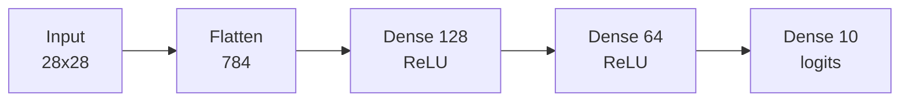
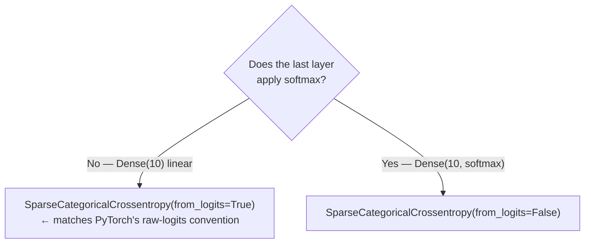

# Building an ANN

*Practical Deep Learning using TensorFlow · Lesson 7 of 14 · [← prev: tf.data Input Pipelines](06-tf-data-input-pipelines.md) · [next → GPU & Distributed](08-gpu-and-distributed.md)*

This lesson builds the module's first multi-class classifier: a 3-layer feedforward network on **Fashion-MNIST** (10 classes), trained with Keras `compile`/`fit`. It's the mirror of PyTorch [07-building-an-ann.md](../02_pytorch/07-building-an-ann.md), and the contrast it sets up is central: where PyTorch writes an explicit training loop, Keras hands you `fit`. Same model, same math — dramatically less code.

## Dataset — Fashion-MNIST

Fashion-MNIST is 70,000 28×28 grayscale images of clothing in 10 classes (t-shirt, trouser, ... ankle boot). Keras ships it as a built-in dataset, so unlike the PyTorch course's CSV, you load it in one line.

```python
from tensorflow import keras
from tensorflow.keras import layers

(X_train, y_train), (X_test, y_test) = keras.datasets.fashion_mnist.load_data()
X_train.shape, y_train.shape          # (60000, 28, 28), (60000,)

# scale pixels to [0,1] (simple, works well for images -- same choice as the PyTorch lesson)
X_train = X_train.astype('float32') / 255.0
X_test  = X_test.astype('float32') / 255.0
```

| PyTorch course | TensorFlow |
| --- | --- |
| `pd.read_csv('fmnist_small.csv')` (6k-row sample) | `keras.datasets.fashion_mnist.load_data()` (full 60k/10k, built in) |
| flat 784 columns | native `(N, 28, 28)` images |
| `X / 255.0` | `X / 255.0` (identical scaling) |

## The model — a 3-layer MLP

The architecture is identical to the PyTorch lesson: `784 → 128 → 64 → 10`, ReLU between hidden layers, and a **linear** final layer emitting raw logits (no softmax) — the direct analog of PyTorch's "no final Sigmoid/Softmax" choice. A `Flatten` layer turns each 28×28 image into a 784-vector.

```python
model = keras.Sequential([
    keras.Input(shape=(28, 28)),
    layers.Flatten(),                       # (28,28) -> (784,)
    layers.Dense(128, activation='relu'),
    layers.Dense(64,  activation='relu'),
    layers.Dense(10),                       # 10 raw logits -- NO softmax here
])
model.summary()
```



## Multi-class loss: the `from_logits` decision

This is the first multi-class problem, so — just as PyTorch swaps `nn.BCELoss` for `nn.CrossEntropyLoss` — Keras uses `SparseCategoricalCrossentropy`. The choice PyTorch doesn't give you is `from_logits`:



| Loss | Label format | Softmax where? | PyTorch analog |
| --- | --- | --- | --- |
| `SparseCategoricalCrossentropy(from_logits=True)` | integer class index | inside the loss | `nn.CrossEntropyLoss` (exact match) |
| `SparseCategoricalCrossentropy(from_logits=False)` | integer class index | in the model's final layer | softmax layer + `nn.NLLLoss` |
| `CategoricalCrossentropy` | one-hot vector | (either) | one-hot + `nn.CrossEntropyLoss` |

We keep the last layer linear and pass `from_logits=True` — numerically the most stable option, and the one that matches PyTorch's convention exactly. "Sparse" means the labels are integer class indices (`0..9`), not one-hot vectors — the analog of PyTorch's `dtype=torch.long` integer labels.

> **Note:** Emitting raw logits + `from_logits=True` is preferred over adding a `softmax` layer + `from_logits=False`, because Keras then folds the softmax into the cross-entropy in a numerically stable way (log-sum-exp) — the same reason PyTorch's `CrossEntropyLoss` wants raw logits rather than post-softmax probabilities.

## Training — `compile` + `fit` vs the PyTorch loop

Here is the whole payoff of the Keras API. The PyTorch lesson writes an explicit double loop (epochs × batches) with manual `zero_grad`/`backward`/`step` and a hand-rolled accuracy loop. Keras collapses all of it:

```python
model.compile(
    optimizer=keras.optimizers.SGD(learning_rate=0.1),
    loss=keras.losses.SparseCategoricalCrossentropy(from_logits=True),
    metrics=['accuracy'],
)

history = model.fit(
    X_train, y_train,
    epochs=100,
    batch_size=32,
    validation_split=0.2,      # carve off 20% of train as validation -- automatic
    verbose=1,
)

test_loss, test_acc = model.evaluate(X_test, y_test)
print(test_acc)                # in the same ballpark as the PyTorch run's ~0.83 for this MLP
```

Side by side, the PyTorch loop and its Keras replacement:

```python
# PyTorch (explicit):
# for epoch in range(epochs):
#     for xb, yb in train_loader:
#         out = model(xb)
#         loss = criterion(out, yb)
#         optimizer.zero_grad(); loss.backward(); optimizer.step()
# # + a separate loop with torch.max(out, 1) for accuracy

# Keras (turnkey):
model.fit(X_train, y_train, epochs=100, batch_size=32)   # loop, backprop, metrics — all inside
```

| Concern | PyTorch (you write it) | Keras (`fit` does it) |
| --- | --- | --- |
| epoch/batch loops | explicit `for` loops | internal |
| backprop | `zero_grad`/`backward`/`step` | internal `GradientTape` step |
| batching | `DataLoader` | `batch_size=` arg (or a `tf.data.Dataset`) |
| accuracy | manual `torch.max` + counting | `metrics=['accuracy']` |
| validation | hand-written eval loop | `validation_split=` / `validation_data=` |
| argmax at predict | `torch.max(outputs, 1)` | `tf.argmax(model.predict(X), axis=1)` |

`fit` returns a `history` object whose `history.history['loss']` / `['val_loss']` / `['accuracy']` / `['val_accuracy']` are the per-epoch curves — handy for spotting the overfitting gap below.

## Reading the result: the overfitting signal

As in the PyTorch lesson, this unregularized MLP will drive training accuracy far above test/validation accuracy — the textbook train/test gap. `validation_split=0.2` makes it visible *during* training: watch `accuracy` climb while `val_accuracy` plateaus.

```python
import matplotlib.pyplot as plt
plt.plot(history.history['accuracy'], label='train')
plt.plot(history.history['val_accuracy'], label='val')
plt.legend(); plt.show()      # train curve pulls away from val -> overfitting
```

> **Note:** A flat validation accuracy well below a near-perfect training accuracy is the exact overfitting signature the PyTorch lesson flags. It's the natural setup for [Lesson 09](09-optimizing-the-network.md) (BatchNorm, Dropout, L2) — and Keras's `validation_split` surfaces it automatically, without a hand-written evaluation loop.

## Key takeaways

- This is the module's first multi-class problem (Fashion-MNIST, 10 classes), so — like PyTorch swapping `BCELoss` for `CrossEntropyLoss` — Keras uses `SparseCategoricalCrossentropy`, with the last layer emitting **raw logits** and `from_logits=True`.
- `from_logits=True` + a linear final layer is the numerically stable choice and the exact analog of PyTorch's raw-logits + `CrossEntropyLoss` convention; "Sparse" means integer labels (the `torch.long` analog), not one-hot.
- The architecture matches PyTorch beat-for-beat: `Flatten → Dense(128, relu) → Dense(64, relu) → Dense(10)`; pixels scaled to `[0,1]` by dividing by 255.
- Fashion-MNIST ships in Keras (`keras.datasets.fashion_mnist.load_data()`) as native `(N,28,28)` images — no CSV wrangling — and a `Flatten` layer turns each image into the 784-vector the Dense stack expects.
- **`compile` + `fit` replaces the entire explicit PyTorch loop**: epoch/batch iteration, `zero_grad`/`backward`/`step`, accuracy counting, and validation all move inside `fit`. `metrics=['accuracy']` and `validation_split=0.2` give you the curves for free.
- The unregularized MLP overfits (train accuracy ≫ validation accuracy); `validation_split` surfaces that gap live, motivating the regularization in [Lesson 09](09-optimizing-the-network.md) — the same narrative beat as the PyTorch course.
