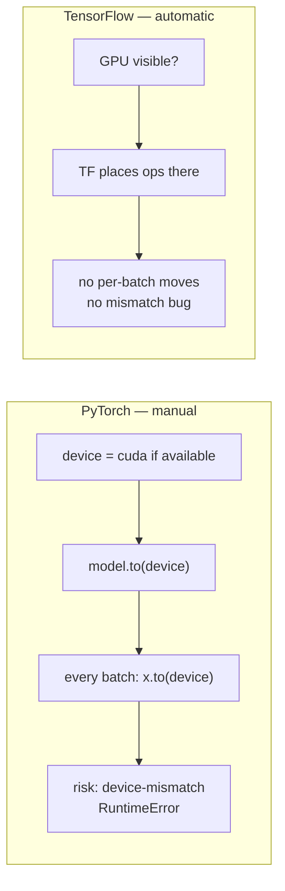
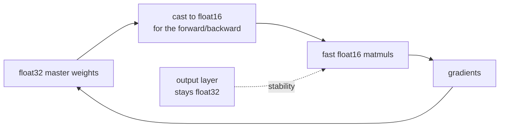
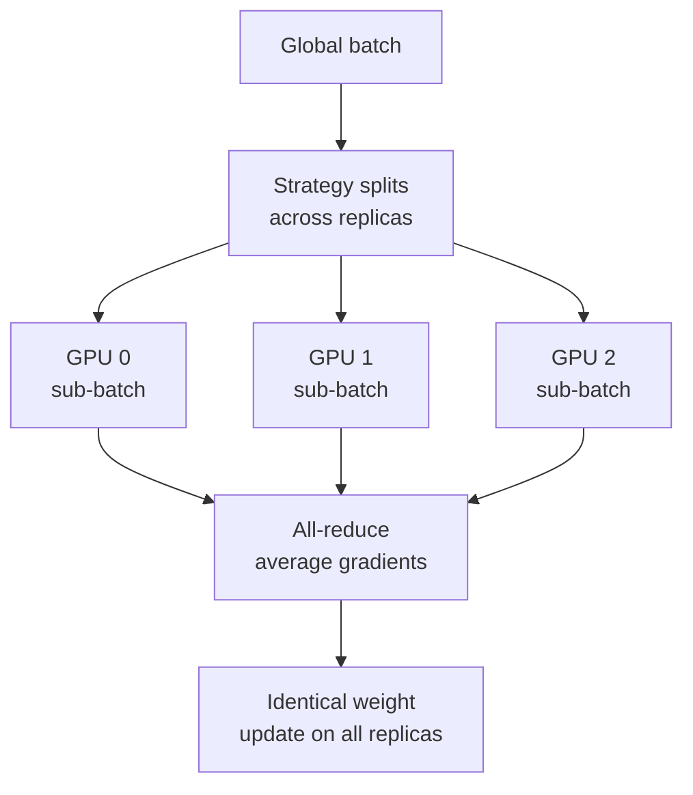

# GPU & Distributed Training

*Practical Deep Learning using TensorFlow · Lesson 8 of 14 · [← prev: Building an ANN](07-building-an-ann.md) · [next → Optimizing the Network](09-optimizing-the-network.md)*

This lesson is about running the Fashion-MNIST ANN from [Lesson 07](07-building-an-ann.md) faster and at scale. It's the mirror of PyTorch [08-training-on-gpu.md](../02_pytorch/08-training-on-gpu.md) — but the punchline is the opposite: where the PyTorch lesson is a 3-step recipe for moving model and data to the GPU, the TensorFlow story is **"you don't have to."** Device placement is automatic. What this lesson actually adds is the *scale-out* tooling PyTorch's `.to(device)` doesn't cover: mixed precision and `tf.distribute`.

## The big difference: no `.to(device)`

The PyTorch lesson's entire content is a 3-step recipe: detect the device, `model.to(device)`, and move every batch with `x.to(device)` — plus a warning about the `RuntimeError: Expected all tensors to be on the same device` bug. **In TensorFlow, none of that exists.** TF automatically places ops on a GPU when one is visible, and moves tensors as needed.



| PyTorch step | TensorFlow equivalent |
| --- | --- |
| `device = torch.device('cuda' if ...)` | *(nothing — automatic)* |
| `model = model.to(device)` | *(nothing — automatic)* |
| `x, y = x.to(device), y.to(device)` per batch | *(nothing — automatic)* |
| `pin_memory=True` on DataLoader | `ds.prefetch(tf.data.AUTOTUNE)` (see [Lesson 06](06-tf-data-input-pipelines.md)) |
| `RuntimeError: tensors on different devices` | rarely seen; TF co-locates automatically |

So the Lesson 07 code, unchanged, already trains on the GPU if one is present. Scaling from a small sample to the full 60k dataset — the PyTorch lesson's other change — is likewise a non-event here, since `keras.datasets.fashion_mnist.load_data()` returns the full dataset already.

## Checking and configuring the GPU

You don't manage placement, but you do sometimes inspect or constrain it:

```python
import tensorflow as tf

tf.config.list_physical_devices('GPU')     # [] on CPU-only; list of GPUs otherwise

# Optional: let GPU memory grow on demand instead of grabbing it all up front
gpus = tf.config.list_physical_devices('GPU')
for gpu in gpus:
    tf.config.experimental.set_memory_growth(gpu, True)

# Optional: pin a block of ops to a specific device (rarely needed)
with tf.device('/GPU:0'):
    y = tf.matmul(a, b)
```

| PyTorch | TensorFlow |
| --- | --- |
| `torch.cuda.is_available()` | `tf.config.list_physical_devices('GPU')` |
| `torch.cuda.get_device_name(0)` | `tf.config.list_physical_devices('GPU')` details |
| (implicit CUDA caching allocator) | `tf.config.experimental.set_memory_growth(...)` |

## Mixed precision — free speedup on modern GPUs

Mixed precision runs most ops in 16-bit (`float16` on GPU, `bfloat16` on TPU) while keeping a `float32` master copy of the weights, roughly halving memory and speeding up matmuls on hardware with tensor cores. Keras makes it a one-liner via a global policy.

```python
from tensorflow import keras

keras.mixed_precision.set_global_policy('mixed_float16')   # set ONCE, before building the model

model = keras.Sequential([
    keras.Input(shape=(28, 28)),
    keras.layers.Flatten(),
    keras.layers.Dense(128, activation='relu'),
    keras.layers.Dense(64,  activation='relu'),
    keras.layers.Dense(10, dtype='float32'),   # <-- force the OUTPUT layer back to float32
])
```



> **Note:** With `mixed_float16`, force the **final layer** to `dtype='float32'` (as above) so the logits and the loss (especially the softmax/cross-entropy) are computed in full precision — float16 there can overflow/underflow. Keras also inserts automatic **loss scaling** to keep small gradients from vanishing in float16; when you use `mixed_precision` with `compile`/`fit` this is handled for you. The PyTorch analog is `torch.cuda.amp.autocast` + `GradScaler`.

## Scaling out: `tf.distribute`

This is what actually replaces (and exceeds) the PyTorch `.to(device)` conversation once you have more than one accelerator. `tf.distribute.Strategy` is TensorFlow's data-parallel training API — the analog of PyTorch's `DistributedDataParallel` (DDP).

The pattern is uniform across strategies: **create a strategy, then build and compile the model inside `strategy.scope()`.** `fit` then shards each batch across devices, runs them in parallel, and all-reduces the gradients.

```python
strategy = tf.distribute.MirroredStrategy()      # all GPUs on ONE machine
print(strategy.num_replicas_in_sync)             # e.g. 4

with strategy.scope():
    model = keras.Sequential([
        keras.Input(shape=(28, 28)),
        keras.layers.Flatten(),
        keras.layers.Dense(128, activation='relu'),
        keras.layers.Dense(64,  activation='relu'),
        keras.layers.Dense(10),
    ])
    model.compile(optimizer='adam',
                  loss=keras.losses.SparseCategoricalCrossentropy(from_logits=True),
                  metrics=['accuracy'])

# scale the global batch size by the number of replicas so per-GPU batch stays constant
model.fit(X_train, y_train, epochs=100, batch_size=32 * strategy.num_replicas_in_sync)
```



| Strategy | Hardware target | PyTorch analog |
| --- | --- | --- |
| `MirroredStrategy` | Multiple GPUs, one machine | `DataParallel` / single-node DDP |
| `MultiWorkerMirroredStrategy` | Multiple machines, each with GPUs | multi-node DDP |
| `TPUStrategy` | Google Cloud TPUs | XLA/PJRT on TPU |
| default (no strategy) | Single CPU/GPU | plain training |

> **Note on TPUs:** `TPUStrategy` follows the same `with strategy.scope():` pattern, after a one-time cluster connect (`tf.distribute.cluster_resolver.TPUClusterResolver` + `tf.tpu.experimental.initialize_tpu_system`). TPUs are a first-class TensorFlow target with no real PyTorch-native equivalent (PyTorch reaches TPUs via the separate PyTorch/XLA project) — one of the areas where TF's hardware story is genuinely broader.

## Key takeaways

- The PyTorch lesson's whole content — detect device, `model.to(device)`, move every batch, avoid the device-mismatch `RuntimeError` — **has no counterpart in TensorFlow, because placement is automatic.** The Lesson 07 code already runs on GPU if one is present.
- You inspect GPUs with `tf.config.list_physical_devices('GPU')` and can opt into on-demand memory growth or explicit `with tf.device('/GPU:0'):` placement, but you never move models or tensors by hand.
- **Mixed precision** is a one-liner: `keras.mixed_precision.set_global_policy('mixed_float16')` — roughly halving memory and speeding matmuls on tensor-core GPUs. Force the **output layer to `float32`**; Keras handles loss scaling automatically inside `fit`. (PyTorch analog: `autocast` + `GradScaler`.)
- **`tf.distribute` is the real scale-out story** and the true replacement for the multi-device conversation: build + compile the model inside `strategy.scope()`, and `fit` shards batches across replicas and all-reduces gradients — the data-parallel analog of PyTorch DDP.
- `MirroredStrategy` (multi-GPU one machine), `MultiWorkerMirroredStrategy` (multi-machine), and `TPUStrategy` (TPUs) all share the same `scope()` pattern; scale the global `batch_size` by `num_replicas_in_sync` to keep the per-device batch constant.
- TPUs are a first-class TensorFlow target via `TPUStrategy`, an area where TF's hardware coverage is broader than PyTorch's native support.
