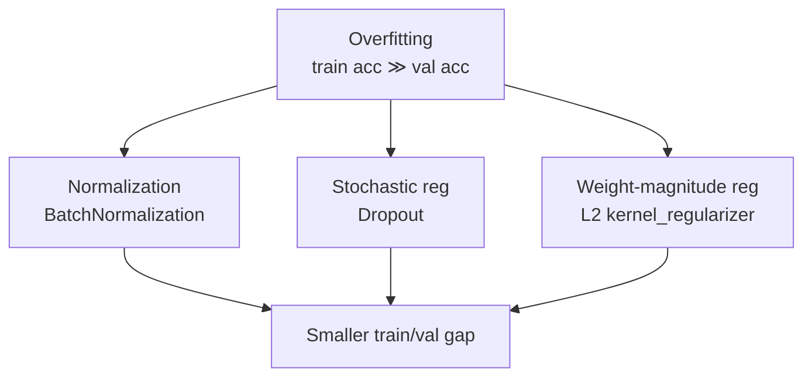
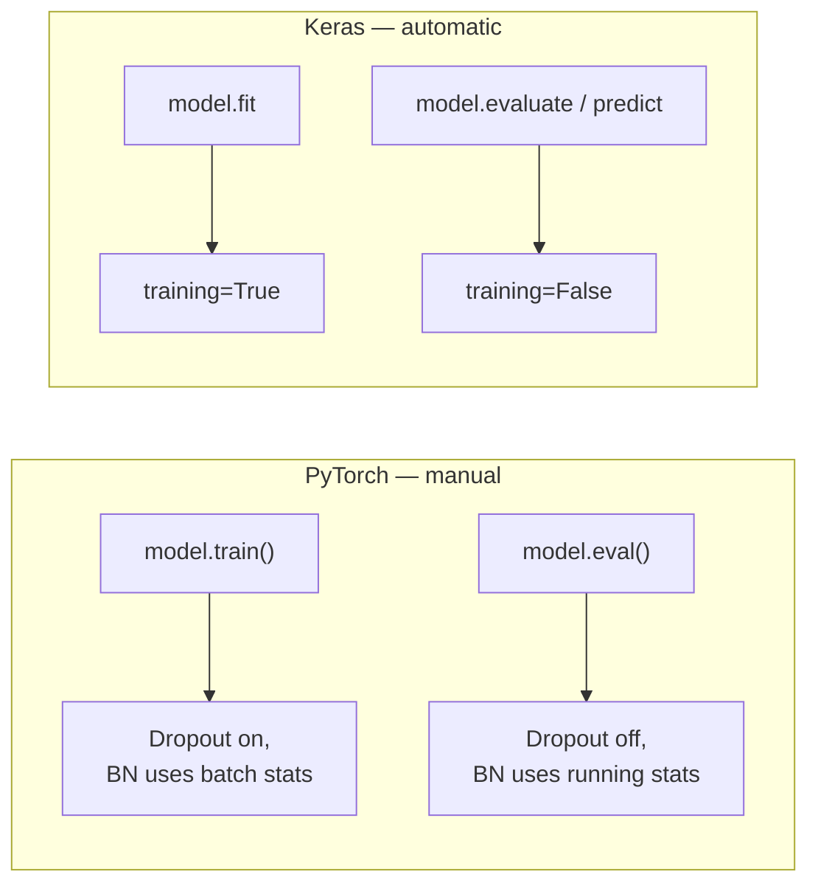
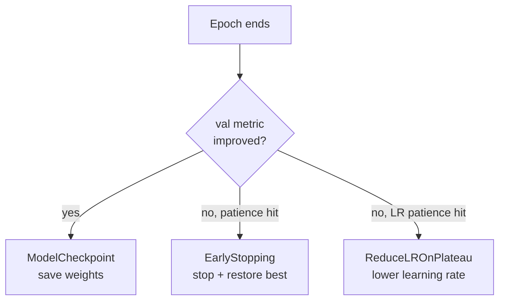

# Optimizing the Network

*Practical Deep Learning using TensorFlow · Lesson 9 of 14 · [← prev: GPU & Distributed](08-gpu-and-distributed.md) · [next → Hyperparameter Tuning (KerasTuner)](10-hyperparameter-tuning-kerastuner.md)*

This lesson closes the overfitting gap left open in [Lesson 07](07-building-an-ann.md) by layering regularization onto the same Fashion-MNIST MLP: **BatchNormalization**, **Dropout**, and **L2 weight regularization** — plus Keras **callbacks** (EarlyStopping, ModelCheckpoint, ReduceLROnPlateau), which the PyTorch course handles with hand-written loop logic. It mirrors PyTorch [09-optimizing-the-network.md](../02_pytorch/09-optimizing-the-network.md).

## Three orthogonal knobs for one problem

Same framing as the PyTorch lesson — three independent levers on a model that fits the training set too aggressively:



1. **Normalization** — `layers.BatchNormalization` keeps activation distributions stable layer-to-layer as weights update.
2. **Stochastic regularization** — `layers.Dropout` forces the network not to rely on any single neuron.
3. **Weight-magnitude regularization** — an L2 penalty discourages any single weight from growing large.

## The regularized model

All three drop onto the identical `Flatten → 128 → 64 → 10` architecture from Lesson 07. Note the L2 placement: unlike PyTorch, where weight decay is an **optimizer** argument, Keras attaches L2 **per layer** via `kernel_regularizer`.

```python
from tensorflow import keras
from tensorflow.keras import layers

model = keras.Sequential([
    keras.Input(shape=(28, 28)),
    layers.Flatten(),

    layers.Dense(128, kernel_regularizer=keras.regularizers.l2(1e-4)),  # L2 penalty on this layer's weights
    layers.BatchNormalization(),        # normalize activations per mini-batch
    layers.Activation('relu'),          # activation AFTER batchnorm (mirrors the PyTorch ordering)
    layers.Dropout(0.3),                # randomly zero 30% of activations at train time

    layers.Dense(64, kernel_regularizer=keras.regularizers.l2(1e-4)),
    layers.BatchNormalization(),
    layers.Activation('relu'),
    layers.Dropout(0.3),

    layers.Dense(10),                   # raw logits (from_logits=True in the loss)
])

model.compile(optimizer=keras.optimizers.SGD(0.1),
              loss=keras.losses.SparseCategoricalCrossentropy(from_logits=True),
              metrics=['accuracy'])
```

Everything else (dataset, `compile`/`fit`) is identical to Lesson 07 — this lesson isolates the effect of the regularization stack.

## The three techniques

1. **`layers.BatchNormalization`** — normalizes each mini-batch's activations to zero mean / unit variance, then applies a learnable scale and shift. It stabilizes training against internal covariate shift. Crucially, it behaves differently at train vs inference time (batch statistics vs. running averages) — Keras switches automatically via the `training=` flag (see below).
2. **`layers.Dropout(0.3)`** — during training, randomly zeroes each activation with probability 0.3 and rescales the rest; automatically **disabled at inference** (all units active). Same train/inference duality as BatchNorm.
3. **L2 regularization** — adds `λ · Σw²` to the loss, shrinking weights toward zero. In Keras this is `kernel_regularizer=keras.regularizers.l2(λ)` on each layer; the per-layer penalties are summed into the total loss automatically.

## Train vs inference mode — automatic in Keras

BatchNorm and Dropout both change behavior between training and inference. PyTorch makes you flip this manually with `model.train()` / `model.eval()`, and forgetting is a classic bug. **Keras handles it for you:** `fit` runs layers with `training=True`, while `evaluate`/`predict` run them with `training=False`.



| PyTorch | Keras |
| --- | --- |
| `model.train()` before training | `model.fit(...)` (sets `training=True`) |
| `model.eval()` before eval | `model.evaluate(...)` / `predict(...)` (sets `training=False`) |
| forgetting `.eval()` → wrong BN/Dropout | can't forget — `fit`/`evaluate` set it |
| `weight_decay=` on optimizer | `kernel_regularizer=l2(...)` per layer |

> **Note:** The `weight_decay` vs `kernel_regularizer` distinction is a real one. Classic L2 regularization is per-layer `kernel_regularizer`. If you specifically want *decoupled* weight decay (the AdamW behavior), use `keras.optimizers.AdamW(weight_decay=...)` or the `weight_decay=` argument now available on Keras optimizers — that is the closer analog of PyTorch's `weight_decay` on the optimizer. For this lesson's L2-on-the-loss behavior, `kernel_regularizer` is the idiomatic choice.

## Callbacks — the loop logic PyTorch writes by hand

Callbacks are Keras hooks that fire at defined points during `fit` (epoch end, batch end, etc.). They cover the training-management logic the PyTorch course implements as manual `if` statements inside its loop.

```python
callbacks = [
    keras.callbacks.EarlyStopping(
        monitor='val_loss', patience=5, restore_best_weights=True),   # stop when val_loss stalls; roll back to the best epoch
    keras.callbacks.ModelCheckpoint(
        'best_model.keras', monitor='val_accuracy', save_best_only=True),  # save the best model to disk
    keras.callbacks.ReduceLROnPlateau(
        monitor='val_loss', factor=0.5, patience=3),                   # halve the LR when val_loss plateaus
]

model.fit(X_train, y_train, epochs=100, batch_size=32,
          validation_split=0.2, callbacks=callbacks)
```



| Callback | What it does | PyTorch equivalent |
| --- | --- | --- |
| `EarlyStopping` | Stop when a monitored metric stops improving; optionally restore best weights | hand-written patience counter + `torch.save`/`load` |
| `ModelCheckpoint` | Persist the best (or every) model to disk | manual `torch.save(model.state_dict())` |
| `ReduceLROnPlateau` | Lower the LR when a metric plateaus | `torch.optim.lr_scheduler.ReduceLROnPlateau` |
| `TensorBoard` | Log metrics/graphs for TensorBoard | `torch.utils.tensorboard.SummaryWriter` |

> **Note:** `restore_best_weights=True` on `EarlyStopping` is quietly important — without it, when training stops after `patience` stale epochs you keep the *last* (slightly worse) weights, not the best ones seen. This is the same subtlety the PyTorch course has to handle by manually caching the best `state_dict`.

## Reading the result

Same signature as the PyTorch lesson: regularization doesn't necessarily raise test accuracy — its hallmark is a **shrinking train/validation gap**. Expect the near-perfect training accuracy from Lesson 07 to come down, val accuracy to stay roughly flat, and the gap between them to narrow. That's regularization working, exactly as the PyTorch results table shows (train/test gap shrinking ~9.3pt → ~4.9pt while test accuracy barely moves).

## Key takeaways

- Regularization's signature is a **shrinking train/validation gap**, not necessarily higher test accuracy — identical to the PyTorch lesson's finding.
- `layers.BatchNormalization` (stabilizes activations), `layers.Dropout(p)` (randomly zeroes activations at train time), and L2 via `kernel_regularizer=keras.regularizers.l2(λ)` are three orthogonal levers, all dropped onto the unchanged Lesson 07 architecture.
- The biggest structural difference from PyTorch: **L2 is a per-layer `kernel_regularizer` in Keras**, not a `weight_decay` argument on the optimizer. For true decoupled weight decay use `AdamW`/the optimizer's `weight_decay=`.
- **Train vs inference mode is automatic in Keras** — `fit` runs with `training=True`, `evaluate`/`predict` with `training=False`. No `model.train()`/`model.eval()` to remember, eliminating that whole PyTorch bug class.
- **Callbacks** implement the training-management logic PyTorch writes by hand: `EarlyStopping` (with `restore_best_weights=True`), `ModelCheckpoint`, and `ReduceLROnPlateau` are passed to `fit(..., callbacks=[...])`.
- The dataset, `compile`, and `fit` call are otherwise unchanged from Lesson 07, isolating the regularization stack's effect — the same controlled comparison as the PyTorch course.
