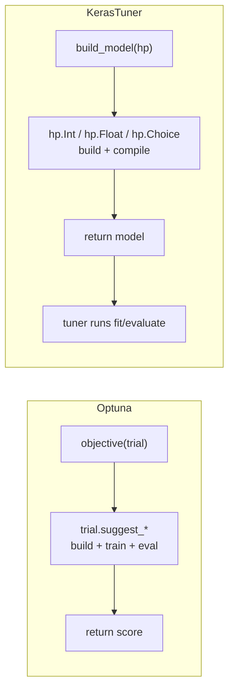
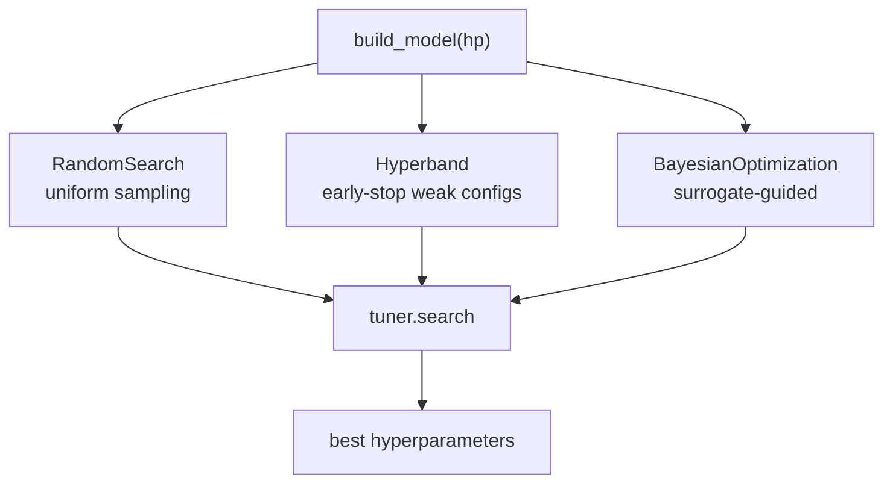

# Hyperparameter Tuning with KerasTuner

*Practical Deep Learning using TensorFlow · Lesson 10 of 14 · [← prev: Optimizing the Network](09-optimizing-the-network.md) · [next → Building a CNN](11-building-a-cnn.md)*

This lesson generalizes the Lesson 09 model into a **parametrized** network (variable depth, width, dropout, learning rate) and uses **KerasTuner** to search the hyperparameter space automatically instead of tuning by hand. KerasTuner is the TensorFlow-native analog of Optuna, so this mirrors PyTorch [10-hyperparameter-tuning-optuna.md](../02_pytorch/10-hyperparameter-tuning-optuna.md) closely.

## The idea: a `build_model(hp)` function

Both Optuna and KerasTuner treat "train and evaluate a model" as a black-box function to maximize over a hyperparameter space. The structural difference:

- **Optuna** — you write an `objective(trial)` that builds the model, **runs the training loop itself**, and returns a score.
- **KerasTuner** — you write a `build_model(hp)` that builds and **compiles** the model; the tuner runs `fit`/`evaluate` for you and reads the metric off the `History`.



| Optuna | KerasTuner |
| --- | --- |
| `trial.suggest_int(name, lo, hi)` | `hp.Int(name, lo, hi, step=...)` |
| `trial.suggest_float(name, lo, hi, log=True)` | `hp.Float(name, lo, hi, sampling='log')` |
| `trial.suggest_categorical(name, [...])` | `hp.Choice(name, [...])` |
| `objective` returns a score | `build_model` returns a compiled model; tuner reads `objective=` metric |
| `study = optuna.create_study(direction='maximize')` | `tuner = kt.RandomSearch(..., objective='val_accuracy')` |
| `study.optimize(objective, n_trials=10)` | `tuner.search(X, y, ..., epochs=...)` |
| `study.best_params` / `study.best_value` | `tuner.get_best_hyperparameters()[0]` / results summary |

## A parametrized network

Same idea as the PyTorch lesson's parametrized `MyNN`: expose depth, width, dropout, and learning rate as hyperparameters. In KerasTuner you read them off the `hp` object inside `build_model`.

```python
import keras_tuner as kt
from tensorflow import keras
from tensorflow.keras import layers

def build_model(hp):
    model = keras.Sequential()
    model.add(keras.Input(shape=(28, 28)))
    model.add(layers.Flatten())

    # tune the NUMBER of hidden layers, and per-layer width + dropout
    for i in range(hp.Int('num_hidden_layers', 1, 5)):
        model.add(layers.Dense(
            units=hp.Int(f'units_{i}', min_value=8, max_value=128, step=8),
            kernel_regularizer=keras.regularizers.l2(1e-4)))
        model.add(layers.BatchNormalization())
        model.add(layers.Activation('relu'))
        model.add(layers.Dropout(hp.Float(f'dropout_{i}', 0.1, 0.5, step=0.1)))

    model.add(layers.Dense(10))   # raw logits

    # tune the learning rate (log scale) and the optimizer choice
    lr = hp.Float('lr', 1e-5, 1e-1, sampling='log')
    optimizer_name = hp.Choice('optimizer', ['adam', 'sgd', 'rmsprop'])
    optimizer = {
        'adam': keras.optimizers.Adam(lr),
        'sgd': keras.optimizers.SGD(lr),
        'rmsprop': keras.optimizers.RMSprop(lr),
    }[optimizer_name]

    model.compile(optimizer=optimizer,
                  loss=keras.losses.SparseCategoricalCrossentropy(from_logits=True),
                  metrics=['accuracy'])
    return model
```

> **Note (the parallel to the PyTorch bug):** In the PyTorch lesson, the Optuna objective *constructed* the tuned optimizer but never assigned it back, so every trial silently trained with plain SGD regardless of what was sampled. KerasTuner's `build_model` structure makes that exact slip harder — the optimizer you pass to `compile` is the one used. But the same underlying trap exists: **a hyperparameter you declare with `hp.*` but never actually reference has no effect**, and KerasTuner (like Optuna) will still report it in `best_hyperparameters` as though it mattered. Always confirm each `hp.Int`/`hp.Float`/`hp.Choice` value is genuinely wired into the model or `compile` call it's meant to control.

## The three tuner algorithms

KerasTuner ships three search strategies — the choice is the analog of Optuna's samplers/pruners.

```python
tuner = kt.RandomSearch(build_model, objective='val_accuracy', max_trials=10,
                        directory='kt_dir', project_name='fmnist')
```

| Tuner | Strategy | Optuna analog |
| --- | --- | --- |
| `kt.RandomSearch` | Sample configs uniformly at random | random sampler |
| `kt.Hyperband` | Adaptive: run many configs briefly, keep promising ones longer | successive-halving pruner |
| `kt.BayesianOptimization` | Model the objective surface, sample promising regions | TPE / GP samplers |



`Hyperband` is often the best default — it's the closest thing to Optuna's TPE + pruning combined, cheaply killing bad configurations early:

```python
tuner = kt.Hyperband(build_model, objective='val_accuracy',
                     max_epochs=30, factor=3, directory='kt_dir', project_name='fmnist_hb')
```

## Running the search

`tuner.search` has the same signature as `model.fit`; the tuner calls `build_model` for each trial and fits it, tracking the `objective` metric.

```python
stop_early = keras.callbacks.EarlyStopping(monitor='val_loss', patience=3)

tuner.search(X_train, y_train,
             epochs=30, validation_split=0.2,
             callbacks=[stop_early])

# pull the best model and its hyperparameters
best_hp = tuner.get_best_hyperparameters(num_trials=1)[0]
best_model = tuner.get_best_models(num_models=1)[0]
tuner.results_summary()

print(best_hp.get('num_hidden_layers'), best_hp.get('lr'), best_hp.get('optimizer'))
```

The best configuration KerasTuner finds should land in the same neighborhood the PyTorch course's Optuna run reached (~0.89 validation accuracy for a tuned MLP on Fashion-MNIST) — the search space and dataset are the same; only the tuning library differs.

## Tuning `batch_size` and `epochs`

`build_model` builds the *model*, so it can't tune `fit` arguments like `batch_size` or `epochs` (which the PyTorch Optuna objective *could* tune, since it owned the loop). The idiomatic KerasTuner way is to subclass `kt.HyperModel` and override `fit`:

```python
class MyHyperModel(kt.HyperModel):
    def build(self, hp):
        return build_model(hp)                    # reuse the function above
    def fit(self, hp, model, *args, **kwargs):
        return model.fit(*args,
                         batch_size=hp.Choice('batch_size', [16, 32, 64, 128]),
                         **kwargs)

tuner = kt.Hyperband(MyHyperModel(), objective='val_accuracy', max_epochs=30)
```

> **Note:** This `HyperModel` split — `build` for the model, `fit` for the training config — is the clean way to make data-pipeline / training-loop hyperparameters searchable in KerasTuner, and it's the piece with no direct one-liner analog in the Optuna version (where everything lives in one `objective`).

## Key takeaways

- KerasTuner is TensorFlow's Optuna: you write `build_model(hp)` (build + **compile**) and the tuner runs `fit`/`evaluate` for you, instead of Optuna's `objective(trial)` that owns the whole train/eval loop itself.
- Search-space verbs map directly: `hp.Int` ↔ `suggest_int`, `hp.Float(sampling='log')` ↔ `suggest_float(log=True)`, `hp.Choice` ↔ `suggest_categorical`.
- Three tuner algorithms — `RandomSearch`, `Hyperband` (adaptive early-stopping, usually the best default), and `BayesianOptimization` — are the analogs of Optuna's random/pruner/TPE strategies; run any of them with `tuner.search(...)` (same signature as `fit`).
- Retrieve results with `tuner.get_best_hyperparameters()[0]`, `tuner.get_best_models()[0]`, and `tuner.results_summary()` — the analogs of `study.best_params` / `study.best_value`.
- The PyTorch course's Optuna bug (a sampled optimizer never assigned back, so it silently had no effect) has a KerasTuner parallel: a declared `hp.*` that's never referenced still shows up in `best_hyperparameters` while doing nothing. Always verify each hyperparameter is actually wired into the model or `compile`.
- To tune `fit`-level knobs like `batch_size`/`epochs`, subclass `kt.HyperModel` and override `fit` — the clean split KerasTuner uses where Optuna simply put everything in one `objective`.
