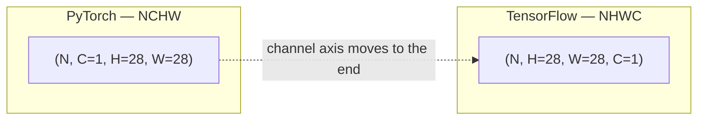

# Building a CNN

*Practical Deep Learning using TensorFlow · Lesson 11 of 14 · [← prev: Hyperparameter Tuning (KerasTuner)](10-hyperparameter-tuning-kerastuner.md) · [next → Transfer Learning](12-transfer-learning.md)*

This lesson keeps the Fashion-MNIST setup from Lessons 07-10 but swaps the flat MLP for a **convolutional** network — `Conv2D`, `MaxPooling2D`, `Flatten` — which requires reshaping the data into 2D images with a channel axis. It mirrors PyTorch [11-building-a-cnn.md](../02_pytorch/11-building-a-cnn.md). The one thing to internalize: **TensorFlow is channels-last (NHWC)** where PyTorch is channels-first (NCHW).

## Why CNNs beat flat MLPs on images

Same argument as the PyTorch lesson. A flattened 784-vector MLP discards all 2D spatial structure. A `Conv2D` kernel slides a small learnable filter across the image, so nearby pixels are processed together and the same filter (weight sharing) detects a pattern — an edge, a texture — anywhere in the image. That means far fewer parameters per layer than a comparable fully-connected layer, plus translation-invariant feature detection.


## The one big difference: NHWC vs NCHW

PyTorch reshapes Fashion-MNIST to `(N, 1, 28, 28)` — channels-first (**NCHW**). TensorFlow expects `(N, 28, 28, 1)` — channels-**last** (**NHWC**). The channel axis moves from position 1 to the last position.



| | PyTorch | TensorFlow |
| --- | --- | --- |
| Data layout | NCHW `(N, C, H, W)` | **NHWC `(N, H, W, C)`** |
| Reshape Fashion-MNIST | `.reshape(-1, 1, 28, 28)` | `.reshape(-1, 28, 28, 1)` |
| Conv layer | `nn.Conv2d(in_ch, out_ch, k)` | `layers.Conv2D(filters, k)` — in-channels inferred |
| Pool | `nn.MaxPool2d(2, 2)` | `layers.MaxPooling2D(2)` |
| Flatten | `nn.Flatten()` | `layers.Flatten()` |

```python
from tensorflow import keras
from tensorflow.keras import layers

(X_train, y_train), (X_test, y_test) = keras.datasets.fashion_mnist.load_data()

# key change vs the MLP lessons: add a trailing channel axis (NHWC), not a leading one (NCHW)
X_train = (X_train.astype('float32') / 255.0).reshape(-1, 28, 28, 1)   # (N, 28, 28, 1)
X_test  = (X_test.astype('float32')  / 255.0).reshape(-1, 28, 28, 1)
```

> **Note:** This is the single most common bug when porting a CNN from PyTorch to TF (or vice versa). If you feed `(N, 1, 28, 28)` to a Keras `Conv2D`, it treats the 1 as height and 28 as channels — no error, just wrong. Reshape to `(N, 28, 28, 1)`.

## The model — two-stage feature/classifier

Same two-stage shape as the PyTorch lesson (feature extraction → classification), and `Conv2D` infers its input channel count so you specify only the number of **filters** (`out_channels` in PyTorch).

```python
model = keras.Sequential([
    keras.Input(shape=(28, 28, 1)),

    # --- feature extraction ---
    layers.Conv2D(32, kernel_size=3, padding='same'),   # 1 -> 32 feature maps; 'same' keeps 28x28
    layers.BatchNormalization(),
    layers.Activation('relu'),
    layers.MaxPooling2D(pool_size=2),                    # 28x28 -> 14x14

    layers.Conv2D(64, kernel_size=3, padding='same'),    # 32 -> 64 feature maps
    layers.BatchNormalization(),
    layers.Activation('relu'),
    layers.MaxPooling2D(pool_size=2),                    # 14x14 -> 7x7

    # --- classification ---
    layers.Flatten(),                                    # (7,7,64) -> 3136
    layers.Dense(128, activation='relu'),
    layers.Dropout(0.4),
    layers.Dense(64, activation='relu'),
    layers.Dropout(0.4),
    layers.Dense(10),                                    # raw logits
])

model.compile(optimizer=keras.optimizers.SGD(0.01),
              loss=keras.losses.SparseCategoricalCrossentropy(from_logits=True),
              metrics=['accuracy'])
model.fit(X_train, y_train, epochs=30, batch_size=32, validation_split=0.2)
```

The training call is identical in shape to every previous lesson — only the architecture and the data's channel axis changed.

## CNN building blocks

- **`layers.Conv2D(filters, kernel_size, padding='same')`** — `filters` is the number of learned feature maps produced (PyTorch's `out_channels`); the input channel count is inferred (PyTorch makes you pass `in_channels`). `padding='same'` pads so output spatial size equals input; `padding='valid'` (the default) shrinks the map by `kernel_size - 1`.
- **`layers.MaxPooling2D(pool_size=2)`** — downsamples each feature map by taking the max over non-overlapping 2×2 windows, halving spatial resolution (stride defaults to `pool_size`).
- **Two-stage architecture** — convolution/pooling extract spatial features while shrinking H/W and growing channel depth (1 → 32 → 64), then `Flatten` collapses to a vector for `Dense` layers to classify.

## Tensor shape bookkeeping

The part that trips people up, tracked in NHWC:

| Stage | Shape (NHWC) | PyTorch equivalent (NCHW) |
| --- | --- | --- |
| Input | `(N, 28, 28, 1)` | `(N, 1, 28, 28)` |
| After conv block 1 + pool | `(N, 14, 14, 32)` | `(N, 32, 14, 14)` |
| After conv block 2 + pool | `(N, 7, 7, 64)` | `(N, 64, 7, 7)` |
| After `Flatten` | `(N, 3136)` | `(N, 3136)` |

The flattened size is `7 · 7 · 64 = 3136` either way — the ordering of the pre-flatten dims differs, but the product (and thus the first `Dense`'s input) is the same. `model.summary()` prints these shapes per layer, so you rarely have to compute `3136` by hand the way you do in PyTorch to size the first `Linear`.

> **Note:** A quiet Keras convenience: because `Dense` infers its input dimension, you don't have to hand-calculate `64*7*7` to wire the `Flatten → Dense` boundary the way PyTorch's `nn.Linear(64*7*7, 128)` demands. Get the input reshape right and Keras figures out the rest.

## Result

Same story as the PyTorch lesson: the CNN clearly beats every MLP variant from Lessons 07-10 (the PyTorch CNN reached ~0.926 test accuracy vs ~0.89 for the best-tuned MLP), by exploiting spatial structure a flat 784-vector throws away. Expect the same jump here, along with a large train/val gap — the CNN's higher capacity still overfits even with BatchNorm and Dropout present, which is part of what motivates transfer learning next.

## Key takeaways

- Switching from MLP to CNN needs one data-pipeline change: reshape flat images to **NHWC `(N, 28, 28, 1)`** — channels-*last* — not PyTorch's channels-first `(N, 1, 28, 28)`. This is the top porting bug between the two frameworks.
- `layers.Conv2D(filters, k, padding='same')` specifies only the number of output feature maps (input channels inferred, unlike `nn.Conv2d`); `layers.MaxPooling2D(2)` halves spatial resolution; `layers.Flatten` bridges to the `Dense` head.
- The two-stage feature-extraction → classification pattern and the `1 → 32 → 64` channel growth match the PyTorch lesson exactly; only the axis order and the layer-naming change.
- Shape bookkeeping mirrors PyTorch with reordered axes: `(N,28,28,1) → (N,14,14,32) → (N,7,7,64) → (N,3136)`; the flattened `3136` is identical, and `Dense`'s input inference means you don't have to compute it to wire the head (PyTorch's `nn.Linear` does).
- Convolution's weight sharing gives far fewer parameters and translation invariance versus a fully-connected layer of comparable reach — the reason the CNN outperforms every earlier MLP on the same data.
- The CNN's higher capacity still overfits (large train/val gap) despite BatchNorm + Dropout, setting up transfer learning in [Lesson 12](12-transfer-learning.md).
