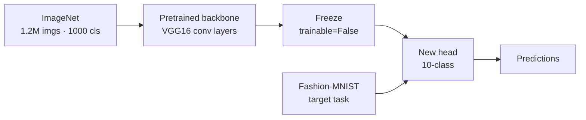
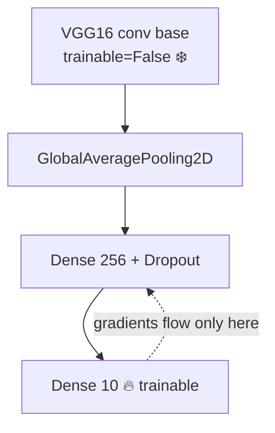

# Transfer Learning

*Practical Deep Learning using TensorFlow · Lesson 12 of 14 · [← prev: Building a CNN](11-building-a-cnn.md) · [next → RNN Text Classification](13-rnn-text-classification.md)*

Instead of training a CNN from scratch, this lesson takes a **pretrained backbone** from `keras.applications` (VGG16, and MobileNetV2 as a lighter alternative), freezes it, attaches a new classification head, and adapts it to Fashion-MNIST — then optionally fine-tunes. It mirrors PyTorch [12-transfer-learning.md](../02_pytorch/12-transfer-learning.md), where the same is done with `torchvision.models.vgg16`.

## What transfer learning is

Transfer learning reuses weights learned on a large source task — here, ImageNet (1.2M images, 1000 classes) — as a starting point for a new, smaller target task (10-class Fashion-MNIST), instead of random initialization.

**Why it works:** the early/middle convolutional layers learn generic visual features (edges, textures, shapes) that transfer across visually-related domains. Only the final task-specific layers need relearning.



**Two workflows** — the same pair as the PyTorch lesson:

| Workflow | What you train | When |
| --- | --- | --- |
| **Feature extraction** | New head only; backbone frozen | Small target dataset; cheap and fast |
| **Fine-tuning** | New head + some/all of the (unfrozen) backbone, tiny LR | Larger/more-different target dataset; more compute, often better |

## `keras.applications` — the `torchvision.models` analog

`keras.applications` is the built-in zoo of pretrained architectures, the direct analog of `torchvision.models`.

| PyTorch | TensorFlow |
| --- | --- |
| `torchvision.models.vgg16(pretrained=True)` | `keras.applications.VGG16(weights='imagenet')` |
| `torchvision.models.mobilenet_v2(...)` | `keras.applications.MobileNetV2(...)` |
| drop the classifier by replacing `.classifier` | `include_top=False` at construction |
| `for p in vgg.features.parameters(): p.requires_grad=False` | `base.trainable = False` (one line) |
| `transforms.Normalize(imagenet_mean, imagenet_std)` | `keras.applications.vgg16.preprocess_input` |

Two things `keras.applications` makes cleaner than the PyTorch flow: `include_top=False` drops the 1000-class ImageNet head at construction (no manual surgery on `.classifier`), and freezing is a single `base.trainable = False` instead of looping over parameters.

## Matching the backbone's input contract

A pretrained model's input contract — channel count, spatial size, and normalization — is fixed by how it was trained. VGG16 expects **224×224×3, ImageNet-normalized**. Fashion-MNIST is 28×28×1, so (exactly as in the PyTorch lesson) you must upsize, fake-RGB, and normalize. `preprocess_input` handles the normalization the way VGG16 expects.

```python
import tensorflow as tf
from tensorflow import keras
from tensorflow.keras import layers

def to_vgg_input(images):
    images = tf.image.grayscale_to_rgb(tf.expand_dims(images, -1))   # (N,28,28) -> (N,28,28,3)
    images = tf.image.resize(images, (224, 224))                     # -> (N,224,224,3)
    return keras.applications.vgg16.preprocess_input(images)         # ImageNet normalization
```

> **Note:** Feeding differently-shaped or differently-scaled data to a pretrained backbone usually *silently degrades* accuracy rather than throwing an error — the same warning the PyTorch lesson gives. `preprocess_input` is per-application (`vgg16.preprocess_input` scales/centers differently from `mobilenet_v2.preprocess_input`); always use the one that matches your backbone.

## Feature extraction — freeze the backbone, train a new head

```python
base = keras.applications.VGG16(
    weights='imagenet',
    include_top=False,               # drop the 1000-class ImageNet head
    input_shape=(224, 224, 3))
base.trainable = False               # FREEZE the whole convolutional backbone

model = keras.Sequential([
    base,
    layers.GlobalAveragePooling2D(),  # pool feature maps to a vector (modern alt. to Flatten)
    layers.Dense(256, activation='relu'),
    layers.Dropout(0.5),
    layers.Dense(10),                 # new 10-class head (raw logits)
])

model.compile(optimizer=keras.optimizers.Adam(1e-4),
              loss=keras.losses.SparseCategoricalCrossentropy(from_logits=True),
              metrics=['accuracy'])
model.fit(train_ds, epochs=10, validation_data=val_ds)   # only the head's weights update
```

Because `base.trainable = False`, the optimizer only ever updates the new head — the frozen backbone acts as a fixed feature extractor. (`GlobalAveragePooling2D` is the common modern replacement for `Flatten` on a conv backbone: it collapses each feature map to its average, giving a compact, fixed-size vector regardless of spatial dims and far fewer head parameters.)



## Fine-tuning — unfreeze and continue with a tiny LR

Once the new head is trained, optionally unfreeze part of the backbone and continue at a much smaller learning rate. The critical rule: **recompile after changing `trainable`**, and use a tiny LR so you don't wreck the pretrained features.

```python
base.trainable = True
for layer in base.layers[:-4]:        # keep all but the last 4 conv layers frozen
    layer.trainable = False

model.compile(optimizer=keras.optimizers.Adam(1e-5),   # 10-100x smaller LR than feature-extraction
              loss=keras.losses.SparseCategoricalCrossentropy(from_logits=True),
              metrics=['accuracy'])
model.fit(train_ds, epochs=5, validation_data=val_ds)  # head + top backbone layers now adapt
```

| Phase | `base.trainable` | Learning rate | What updates |
| --- | --- | --- | --- |
| Feature extraction | `False` | normal (e.g. 1e-4) | head only |
| Fine-tuning | `True` (often partial) | tiny (e.g. 1e-5) | head + unfrozen backbone |

> **Note:** Two rules that bite if ignored. (1) You **must recompile** after toggling `trainable`, or Keras keeps training with the old frozen/unfrozen configuration. (2) Fine-tune with a *much* smaller LR than the feature-extraction phase — the pretrained weights are already good, and a large LR erases them. The PyTorch lesson makes the same "small LR for fine-tuning" point.

## MobileNetV2 — a lighter backbone

VGG16 is large (~528 MB of weights). For anything resource-constrained (edge, mobile, faster iteration), MobileNetV2 is a common drop-in — same API, smaller and faster:

```python
base = keras.applications.MobileNetV2(weights='imagenet', include_top=False,
                                      input_shape=(224, 224, 3))
base.trainable = False
# ... same GlobalAveragePooling2D + Dense head as above ...
# remember: use keras.applications.mobilenet_v2.preprocess_input, NOT vgg16's
```

## Key takeaways

- Transfer learning reuses a pretrained backbone's weights (VGG16 / MobileNetV2 on ImageNet) as the starting point for a new small task, because early/middle conv layers learn generic visual features that transfer; only the head needs relearning.
- `keras.applications` is the `torchvision.models` analog, and it's cleaner in two ways: **`include_top=False`** drops the ImageNet head at construction, and **`base.trainable = False`** freezes the backbone in one line (vs looping over `requires_grad`).
- The backbone's input contract (224×224×3, ImageNet normalization for VGG16) must be matched — grayscale→RGB, resize, and the backbone-specific **`preprocess_input`** — or accuracy silently degrades with no error.
- Feature extraction (frozen backbone + new head, normal LR) is cheap and good for small datasets; **`GlobalAveragePooling2D`** is the modern head bridge (vs `Flatten`), giving a compact vector and far fewer head params.
- Fine-tuning unfreezes some/all of the backbone at a **much smaller LR** — and you **must recompile** after toggling `trainable`, the two rules that most often bite.
- MobileNetV2 is a lighter drop-in backbone with the same API; just switch to its matching `preprocess_input`. Unlike the PyTorch course's notebook (which had a training-loop `break` bug limiting each epoch to one batch), the `compile`/`fit` flow here trains on the full dataset by construction.
