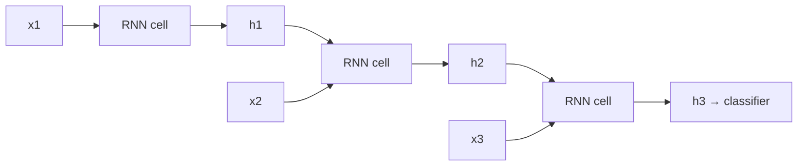
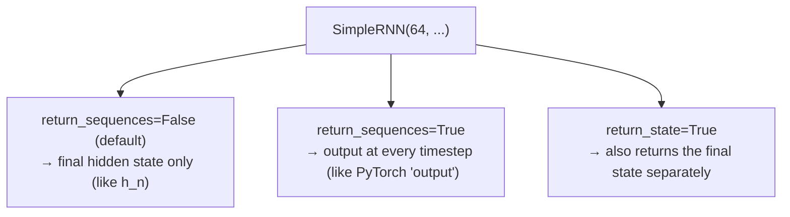

# RNN Text Classification

*Practical Deep Learning using TensorFlow · Lesson 13 of 14 · [← prev: Transfer Learning](12-transfer-learning.md) · [next → LSTM Next-Word Predictor](14-lstm-next-word-predictor.md)*

This is the module's first NLP/sequence lesson. It builds a small text classifier — framed, like the PyTorch course, as a single-word-answer "question answering" task — using `layers.Embedding` + `layers.SimpleRNN`, with `layers.TextVectorization` handling tokenization and vocabulary. It mirrors PyTorch [13-rnn-qa-system.md](../02_pytorch/13-rnn-qa-system.md), where the same is done with `nn.Embedding` + `nn.RNN` and a hand-built vocab.

## What an RNN is

A `Dense`/MLP has no notion of order or variable length. A `SimpleRNN` processes a sequence one token at a time, carrying a **hidden state** forward — at each step `h_t = tanh(W_x·x_t + W_h·h_{t-1} + b)` — so the final hidden state summarizes everything seen so far.



`layers.Embedding` is a learnable `vocab_size × embedding_dim` lookup table mapping a token index to a dense vector — the standard first layer for text, replacing one-hot encoding. It's identical in role to PyTorch's `nn.Embedding`.

## `TextVectorization` — tokenize + build vocab in one layer

The PyTorch lesson hand-writes `tokenize()`, a `vocab` dict, and `text_to_indices()`. Keras folds all of that into a single **`TextVectorization`** layer: it lowercases, strips punctuation, splits on whitespace, builds the vocabulary from data via `.adapt()`, and maps strings to integer index sequences — and it can live *inside* the model so it consumes raw strings directly.

```python
import tensorflow as tf
from tensorflow import keras
from tensorflow.keras import layers

questions = ["what is the largest planet in our solar system",
             "what is the capital of france",
             "who wrote romeo and juliet", ...]     # toy Q&A corpus (parallels the 100-pair CSV)
answers   = ["jupiter", "paris", "shakespeare", ...]  # single-word answers

# input pipeline: strings -> padded integer index sequences
question_vectorizer = layers.TextVectorization(output_mode='int', output_sequence_length=10)
question_vectorizer.adapt(questions)                  # builds the vocab from the data
vocab_size = question_vectorizer.vocabulary_size()

# labels: single-word answers -> integer class ids (StringLookup is the label-side vocab)
answer_lookup = layers.StringLookup(output_mode='int')
answer_lookup.adapt(answers)
num_answers = answer_lookup.vocabulary_size()
y = answer_lookup(answers)                            # integer class targets
```

| PyTorch (hand-rolled) | TensorFlow |
| --- | --- |
| `def tokenize(text): ...` | built into `TextVectorization` (`standardize` + `split`) |
| `vocab = {'<UNK>': 0}; build_vocab(...)` | `vectorizer.adapt(texts)` |
| `text_to_indices(text, vocab)` | calling the layer: `vectorizer(texts)` |
| manual left-padding to `max_len` | `output_sequence_length=` (pads/truncates automatically) |
| `<UNK>` at index 0 | reserved `[UNK]` token, automatic |

> **Note:** As the QA task is framed here, every answer is a single word, so the target is a **class index over the answer vocabulary** (`StringLookup`), not a generated sequence — exactly the PyTorch lesson's "predict one word out of the vocab" framing. Free-form generation is the next lesson's job.

## The model — a minimal RNN classifier

`TextVectorization` goes *inside* the model, so it takes raw strings end to end. `SimpleRNN` returns only its final hidden state by default (`return_sequences=False`), which feeds the classification head.

```python
model = keras.Sequential([
    keras.Input(shape=(1,), dtype=tf.string),         # raw string input
    question_vectorizer,                              # string -> (seq_len,) int indices
    layers.Embedding(input_dim=vocab_size, output_dim=50),   # -> (seq_len, 50)
    layers.SimpleRNN(64),                             # -> (64,) final hidden state
    layers.Dense(num_answers),                        # -> one logit per answer word
])

model.compile(optimizer=keras.optimizers.Adam(1e-3),
              loss=keras.losses.SparseCategoricalCrossentropy(from_logits=True),
              metrics=['accuracy'])
model.fit(tf.constant(questions), y, epochs=20)
```

The loss and label convention are the same as the multi-class ANN in [Lesson 07](07-building-an-ann.md): raw logits in, integer class index target, `from_logits=True`.

## Shape walk-through

Mirrors the PyTorch lesson's debug-print walkthrough, for one question of 6 tokens:

| Stage | Shape | PyTorch equivalent |
| --- | --- | --- |
| Input (raw string) | `(1, 1)` | (tokenized ints) `(1, 6)` |
| After `TextVectorization` | `(1, 10)` (padded to `output_sequence_length`) | `(1, 6)` |
| After `Embedding` | `(1, 10, 50)` | `(1, 6, 50)` |
| After `SimpleRNN(64)` | `(1, 64)` (final hidden state only) | `h_n`: `(1, 64)` |
| After `Dense` | `(1, num_answers)` | `(1, 324)` (one score per vocab word) |

## `return_sequences` / `return_state` — the `(output, h_n)` mirror

PyTorch's `nn.RNN` returns a tuple `(output, h_n)`: `output` stacks the hidden state at *every* timestep, `h_n` is only the last. Keras controls the same distinction with two flags:



| PyTorch | Keras |
| --- | --- |
| `output, h_n = rnn(x)` | `SimpleRNN(units)` → `h_n` only (default) |
| use `output` (all timesteps) | `SimpleRNN(units, return_sequences=True)` |
| use `h_n` (final state) | `SimpleRNN(units)` (default) |
| stacking recurrent layers | lower layers need `return_sequences=True` to feed the next |

> **Note:** To stack recurrent layers, every layer *except the last* needs `return_sequences=True`, because the next recurrent layer expects a sequence, not a single vector. This is the Keras equivalent of threading `output` (not `h_n`) between stacked `nn.RNN`s.

## Inference

```python
def predict(model, question, threshold=0.5):
    logits = model(tf.constant([question]))
    probs = tf.nn.softmax(logits, axis=1)
    conf = tf.reduce_max(probs).numpy()
    idx  = tf.argmax(probs, axis=1)[0].numpy()
    if conf < threshold:
        return "I don't know"                          # abstain when not confident
    return answer_lookup.get_vocabulary()[idx]          # map class id back to the answer word

predict(model, "what is the largest planet in our solar system")   # -> "jupiter"
```

> **Note:** A vanilla `SimpleRNN`'s hidden state struggles to retain information over long sequences, because repeatedly multiplying by the same recurrent weight matrix makes gradients vanish (or explode) across many timesteps. This is exactly the limitation that motivates LSTM's gating in [Lesson 14](14-lstm-next-word-predictor.md) — the same setup as the PyTorch course.

## Key takeaways

- The QA task is framed as single-word **classification**, not generation: since every answer is one word, the model predicts a class index over the answer vocabulary (`StringLookup`), not a token sequence — the same framing as the PyTorch lesson.
- `layers.TextVectorization` collapses the PyTorch lesson's hand-written `tokenize` / `vocab` dict / `text_to_indices` / manual left-padding into one adaptable layer (`.adapt(texts)` builds the vocab; `output_sequence_length` pads), and it can live inside the model to consume raw strings.
- `layers.Embedding` is the exact analog of `nn.Embedding` — a learnable `vocab_size × embedding_dim` lookup, the standard first text layer.
- `layers.SimpleRNN(units)` returns only the final hidden state by default (the `h_n` analog); `return_sequences=True` gives every timestep's output (the `output` analog), and `return_state=True` exposes the final state separately — the Keras spelling of `nn.RNN`'s `(output, h_n)` tuple. Stacked RNNs need `return_sequences=True` on all but the last layer.
- Training uses the same multi-class convention as Lesson 07: raw logits + `SparseCategoricalCrossentropy(from_logits=True)` + integer targets, with Adam at `1e-3`.
- Inference maps the argmax class id back through `answer_lookup.get_vocabulary()`, with a confidence threshold to abstain — mirroring the PyTorch `predict()`. A vanilla RNN's vanishing-gradient limit on long sequences sets up the LSTM in [Lesson 14](14-lstm-next-word-predictor.md).
