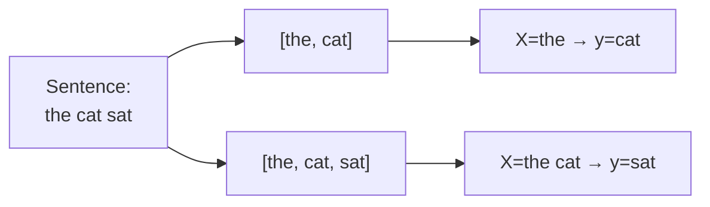
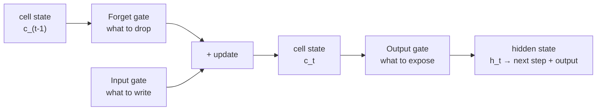
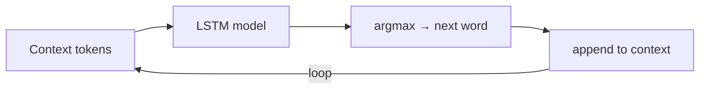

# LSTM Next-Word Predictor

*Practical Deep Learning using TensorFlow · Lesson 14 of 14 · [← prev: RNN Text Classification](13-rnn-text-classification.md) · [next → back to index](README.md)*

The final lesson builds a **next-word predictor** on a block of running text using `layers.LSTM` in place of Lesson 13's `SimpleRNN`. It covers turning a corpus into next-token training data via the every-prefix-of-every-sentence trick, the LSTM architecture and why it beats a plain RNN, training, and **autoregressive** multi-word generation at inference. It mirrors PyTorch [14-lstm-next-word-predictor.md](../02_pytorch/14-lstm-next-word-predictor.md).

## From corpus to next-token training data

A next-word predictor needs a corpus of natural running text (not Q&A pairs). The standard construction — identical to the PyTorch lesson — is: tokenize, then for every sentence emit **every prefix** as a training row, pairing each prefix's last token as the label. For "the cat sat" you get `("the" → "cat")` and `("the cat" → "sat")`.



For this Keras version the classic tooling is `Tokenizer` (builds the word→index vocab) + `pad_sequences(padding='pre')` (**left**-pads to a common length — exactly the PyTorch lesson's left-pad choice):

```python
from tensorflow import keras
import tensorflow as tf

document = """..."""   # a real block of running text (e.g. an FAQ), same idea as the PyTorch corpus

tokenizer = keras.preprocessing.text.Tokenizer()
tokenizer.fit_on_texts([document])
total_words = len(tokenizer.word_index) + 1        # +1 because index 0 is reserved for padding

# every prefix of every line -> a training sequence
input_sequences = []
for line in document.split('\n'):
    ids = tokenizer.texts_to_sequences([line])[0]
    for i in range(1, len(ids)):
        input_sequences.append(ids[:i + 1])         # e.g. [1,2,3] -> [1,2] and [1,2,3]

max_len = max(len(seq) for seq in input_sequences)
padded = keras.preprocessing.sequence.pad_sequences(
    input_sequences, maxlen=max_len, padding='pre')  # LEFT-pad, matching the PyTorch lesson

X = padded[:, :-1]      # context = all but the last token
y = padded[:, -1]       # label   = the last token (the word to predict)
```

| PyTorch (hand-rolled) | TensorFlow |
| --- | --- |
| `word_tokenize` + manual `vocab` dict | `Tokenizer().fit_on_texts(...)` + `.word_index` |
| every-prefix loop building `training_sequence` | same loop over `texts_to_sequences` |
| `[0]*(max_len-len) + seq` (left pad by hand) | `pad_sequences(..., padding='pre')` |
| `X = seq[:, :-1]; y = seq[:, -1]` | identical slicing |

> **Note:** `keras.preprocessing.text.Tokenizer` is the classic next-word-predictor tool and maps most directly to the PyTorch lesson's manual vocab + prefix construction, which is why it's used here. `layers.TextVectorization` (Lesson 13) is the newer general-purpose alternative; for this n-gram-prefix pattern, `Tokenizer` + `pad_sequences(padding='pre')` is the more common, more literal fit.

## The model — LSTM instead of SimpleRNN

Swapping `SimpleRNN` for `LSTM` is a one-word change in Keras. The `Embedding → recurrent → Dense` shape is otherwise identical to Lesson 13.

```python
from tensorflow.keras import layers

model = keras.Sequential([
    keras.Input(shape=(max_len - 1,)),
    layers.Embedding(input_dim=total_words, output_dim=100),   # nn.Embedding(vocab, 100)
    layers.LSTM(150),                                          # nn.LSTM(100, 150) — final hidden state
    layers.Dense(total_words),                                # one logit per vocab word
])

model.compile(optimizer=keras.optimizers.Adam(1e-3),
              loss=keras.losses.SparseCategoricalCrossentropy(from_logits=True),
              metrics=['accuracy'])
model.fit(X, y, epochs=50, batch_size=32)
```

| PyTorch | Keras |
| --- | --- |
| `nn.LSTM(100, 150, batch_first=True)` | `layers.LSTM(150)` |
| returns `output, (h_n, c_n)` | `LSTM(...)` → final `h` (default); `return_state=True` → `[output, h, c]` |
| uses `final_hidden_state.squeeze(0)` | `LSTM(150)` returns that vector directly |
| `nn.CrossEntropyLoss` | `SparseCategoricalCrossentropy(from_logits=True)` |

> **Note:** PyTorch's `nn.LSTM` return has one more tuple level than `nn.RNN` — `(output, (h_n, c_n))` — because the LSTM tracks a **cell state** alongside the hidden state. In Keras that plumbing is hidden: `layers.LSTM(150)` just returns the final hidden vector. To see the cell state, pass `return_state=True`, which yields `[output, final_hidden, final_cell]`.

## Why LSTM beats a vanilla RNN

A `SimpleRNN` struggles to carry information across many timesteps: repeatedly multiplying by the same recurrent weight matrix makes gradients vanish or explode. An `LSTM` adds a **cell state** — a mostly-additive "memory highway" — regulated by three gates:



| Gate | Decides |
| --- | --- |
| **Forget** | What fraction of the previous cell state to discard |
| **Input** | How much new candidate information to write into the cell state |
| **Output** | What part of the updated cell state to expose as the hidden state/output |

Because the cell state is updated mostly by addition (gated, not fully overwritten each step), gradients flow across long spans without vanishing — which is why LSTMs handle long contexts far better than vanilla RNNs. This matters here since the padded prefixes can run to the full `max_len` of context.

## Autoregressive generation

The key conceptual step up from Lesson 13: predict one word, **append it to the input**, and repeat. Feeding the prediction back in is what turns a one-shot classifier into a *generator*.

```python
def generate(seed_text, num_words=10):
    for _ in range(num_words):
        ids = tokenizer.texts_to_sequences([seed_text])[0]
        ids = keras.preprocessing.sequence.pad_sequences(
            [ids], maxlen=max_len - 1, padding='pre')
        logits = model.predict(ids, verbose=0)
        next_idx = int(tf.argmax(logits, axis=1)[0])
        next_word = tokenizer.index_word.get(next_idx, '')
        seed_text += ' ' + next_word          # <-- feed the prediction back in
    return seed_text

generate("the course fee is", num_words=10)
```



This feed-the-prediction-back-in loop is the same fundamental mechanism — at vastly larger scale — behind modern autoregressive language models. Lesson 13 predicted a single answer word from a fixed question; here the model repeatedly re-predicts the next word and appends it, producing a growing generated sentence.

## The throughline lands here

This is the last lesson, and it closes the loop the whole module has been tracing. The training call above — `model.fit(X, y, epochs=50)` — is running the exact same loop from [Lesson 04](04-training-pipeline.md): forward → loss → `tape.gradient` → `apply_gradients`, per batch, no `zero_grad`. Everything between Lesson 04 and here was either ergonomics on that loop (`compile`/`fit`, `tf.data`, callbacks) or a model swap plugged into it (MLP → CNN → pretrained backbone → RNN → LSTM). The mechanism never changed; only the architecture in front of it did.

## Key takeaways

- A next-word predictor trains on real running text turned into next-token pairs via the **every-prefix-of-every-sentence** trick — identical construction to the PyTorch lesson, using `Tokenizer` (vocab) + `pad_sequences(padding='pre')` (left-pad) instead of a hand-built vocab and manual padding.
- Swapping `SimpleRNN` for `layers.LSTM(150)` is a one-word change; the `Embedding → recurrent → Dense` shape is unchanged from Lesson 13.
- Keras hides the LSTM's cell-state plumbing that PyTorch exposes: `nn.LSTM` returns `(output, (h_n, c_n))`, while `layers.LSTM(150)` returns just the final hidden vector — pass `return_state=True` to get `[output, h, c]`.
- The LSTM's **forget / input / output gates** and mostly-additive cell-state updates solve the vanishing-gradient problem that limits vanilla RNNs on long sequences — the reason it handles long context better.
- Inference is **autoregressive**: predict one word, append it to the input, repeat — the mechanism (at massive scale) behind modern generative language models, and the conceptual step up from Lesson 13's single-word classifier.
- This closes the module's throughline: `model.fit` here runs the same forward → loss → `tape.gradient` → `apply_gradients` loop from [Lesson 04](04-training-pipeline.md); every lesson between was ergonomics or an architecture swap on that one unchanging loop. When "does it train?" gives way to "is it any good?", the [evals module](../../AI/16_evals/README.md) is the natural next stop.
