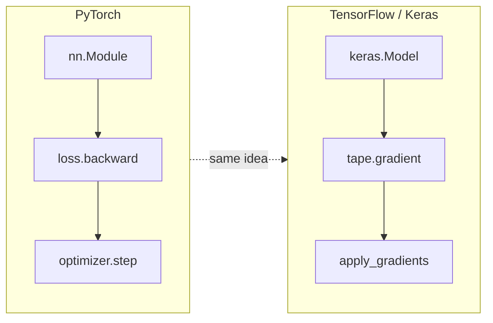
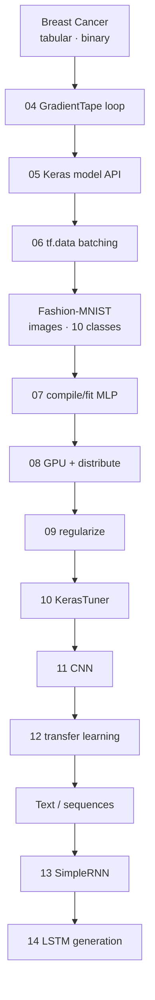

# Practical Deep Learning using TensorFlow — Notes (PyTorch-parallel)

> A **TensorFlow 2.x / Keras mirror** of the [`../02_pytorch/`](../02_pytorch/README.md) module. Every lesson here maps 1:1 to a PyTorch lesson there — same 14-topic progression, same two datasets (Breast Cancer Wisconsin → Fashion-MNIST → text), same running examples — rewritten in idiomatic TensorFlow. Read a topic in whichever framework you know, then jump to the mirror to learn the other.

The point of this module is **translation**: if you already think in `nn.Module` / `torch.optim` / `DataLoader` / `loss.backward()`, these notes show you the Keras / `keras.optimizers` / `tf.data` / `tf.GradientTape` you reach for instead — and *why* the two ecosystems arrange the same ideas differently.

## Document map

| # | Note | Topic | PyTorch counterpart |
| --- | --- | --- | --- |
| 01 | [01-intro-to-tensorflow.md](01-intro-to-tensorflow.md) | What TensorFlow is; TF1 vs TF2; Keras; the ecosystem | [01-intro-to-pytorch.md](../02_pytorch/01-intro-to-pytorch.md) |
| 02 | [02-tensors.md](02-tensors.md) | `tf.constant` / `tf.Variable`, dtypes, shapes, ops, NumPy interop | [02-tensors.md](../02_pytorch/02-tensors.md) |
| 03 | [03-automatic-differentiation.md](03-automatic-differentiation.md) | `tf.GradientTape` — the autograd analog | [03-autograd.md](../02_pytorch/03-autograd.md) |
| 04 | [04-training-pipeline.md](04-training-pipeline.md) | From-scratch training loop (GradientTape) on Breast Cancer | [04-training-pipeline.md](../02_pytorch/04-training-pipeline.md) |
| 05 | [05-keras-model-api.md](05-keras-model-api.md) | Sequential / Functional / subclassing; optimizers + losses | [05-nn-module.md](../02_pytorch/05-nn-module.md) |
| 06 | [06-tf-data-input-pipelines.md](06-tf-data-input-pipelines.md) | `tf.data.Dataset` — the DataLoader analog | [06-dataset-dataloader.md](../02_pytorch/06-dataset-dataloader.md) |
| 07 | [07-building-an-ann.md](07-building-an-ann.md) | Full ANN on Fashion-MNIST with `compile`/`fit` | [07-building-an-ann.md](../02_pytorch/07-building-an-ann.md) |
| 08 | [08-gpu-and-distributed.md](08-gpu-and-distributed.md) | Device placement, mixed precision, `tf.distribute` | [08-training-on-gpu.md](../02_pytorch/08-training-on-gpu.md) |
| 09 | [09-optimizing-the-network.md](09-optimizing-the-network.md) | BatchNorm, Dropout, L2, callbacks | [09-optimizing-the-network.md](../02_pytorch/09-optimizing-the-network.md) |
| 10 | [10-hyperparameter-tuning-kerastuner.md](10-hyperparameter-tuning-kerastuner.md) | KerasTuner — the Optuna analog | [10-hyperparameter-tuning-optuna.md](../02_pytorch/10-hyperparameter-tuning-optuna.md) |
| 11 | [11-building-a-cnn.md](11-building-a-cnn.md) | `Conv2D`/`MaxPooling2D` CNN on Fashion-MNIST (NHWC) | [11-building-a-cnn.md](../02_pytorch/11-building-a-cnn.md) |
| 12 | [12-transfer-learning.md](12-transfer-learning.md) | `keras.applications` VGG16/MobileNetV2, freeze + fine-tune | [12-transfer-learning.md](../02_pytorch/12-transfer-learning.md) |
| 13 | [13-rnn-text-classification.md](13-rnn-text-classification.md) | `Embedding` + `SimpleRNN` + `TextVectorization` | [13-rnn-qa-system.md](../02_pytorch/13-rnn-qa-system.md) |
| 14 | [14-lstm-next-word-predictor.md](14-lstm-next-word-predictor.md) | `Embedding` + `LSTM` autoregressive generation | [14-lstm-next-word-predictor.md](../02_pytorch/14-lstm-next-word-predictor.md) |

## PyTorch ↔ TensorFlow cheat-sheet

The single most useful table in this module. Every row is a thing you already do in PyTorch and the TF2/Keras way to do it.

| Concept | PyTorch | TensorFlow 2.x / Keras |
| --- | --- | --- |
| Immutable tensor | `torch.tensor(...)` | `tf.constant(...)` |
| Trainable tensor | `torch.tensor(..., requires_grad=True)` | `tf.Variable(...)` |
| Model base class | `nn.Module` (override `forward`) | `keras.Model` (override `call`) |
| Layer container | `nn.Sequential` | `keras.Sequential` |
| Fully-connected layer | `nn.Linear(in, out)` | `keras.layers.Dense(out)` (infers `in`) |
| Autodiff | `loss.backward()` + `.grad` | `with tf.GradientTape() as tape:` + `tape.gradient(loss, vars)` |
| Clear gradients | `optimizer.zero_grad()` | **not needed** — the tape computes fresh each pass |
| Optimizer step | `optimizer.step()` | `optimizer.apply_gradients(zip(grads, vars))` |
| Optimizers | `torch.optim.SGD` / `Adam` | `keras.optimizers.SGD` / `Adam` |
| Loss functions | `nn.BCELoss` / `nn.CrossEntropyLoss` | `keras.losses.BinaryCrossentropy` / `SparseCategoricalCrossentropy` |
| Input pipeline | `Dataset` + `DataLoader` | `tf.data.Dataset` (`from_tensor_slices`, `.batch`, `.shuffle`) |
| Turnkey training | *(hand-written loop)* | `model.compile(...)` + `model.fit(...)` |
| Device move | `x.to(device)`, `model.to(device)` | automatic placement; `tf.distribute` for scale-out |
| Regularization L2 | `weight_decay=` on optimizer | `kernel_regularizer=keras.regularizers.l2(...)` |
| Dropout / BatchNorm | `nn.Dropout`, `nn.BatchNorm1d/2d` | `layers.Dropout`, `layers.BatchNormalization` |
| Train vs eval mode | `model.train()` / `model.eval()` | handled by `training=` flag (automatic in `fit`) |
| Conv layer + data layout | `nn.Conv2d`, NCHW `(N,C,H,W)` | `layers.Conv2D`, **NHWC** `(N,H,W,C)` |
| HP tuning | Optuna (`study.optimize`) | KerasTuner (`tuner.search`) |
| Pretrained backbones | `torchvision.models` | `keras.applications` |
| Recurrent layers | `nn.RNN` / `nn.LSTM` | `layers.SimpleRNN` / `layers.LSTM` |

## The throughline

Like the PyTorch playlist, this is one continuous build, not 14 disconnected topics. Two datasets carry almost the entire module:

- **Breast Cancer Wisconsin** (binary classification, tabular) — Lessons 04-06. Same data, three successive rewrites of the training loop: raw `tf.Variable` + `GradientTape` + manual updates (04) → `keras.Sequential` + `keras.optimizers` (05) → mini-batch training via `tf.data.Dataset` (06).
- **Fashion-MNIST** (10-class image classification) — Lessons 07-12. Same data, successive improvements to the same problem: flat MLP with `compile`/`fit` (07) → scaled to the full dataset on GPU (08) → `+ BatchNormalization`, `Dropout`, L2 (09) → tuned by KerasTuner (10) → switched to a `Conv2D` CNN (11) → transfer learning with a frozen pretrained backbone (12).

Lessons 13-14 pivot to text/sequence data and swap the model family: `SimpleRNN` (13) → `LSTM` (14), building up to autoregressive next-word generation.

**One training-loop shape underlies everything.** In its most explicit form (Lesson 04) it is: **forward pass → compute loss → `tape.gradient()` → `optimizer.apply_gradients()`**. That is the same shape as PyTorch's *forward → loss → `backward()` → `step()`* — with one honest simplification: **there is no `zero_grad` step in TensorFlow**, because `tf.GradientTape` records a fresh graph for each forward pass and computes fresh gradients, so nothing accumulates across iterations to clear. From Lesson 05 onward, `model.compile()` + `model.fit()` wrap that exact loop for you (Keras runs a `GradientTape` step internally); everything later is either ergonomics on top of that loop (`tf.data`, callbacks) or model-architecture changes plugged into it (MLP → CNN → pretrained backbone → RNN → LSTM). Lesson 03 (GradientTape) is the mechanism that makes `fit()` possible — it is the connective tissue for the entire rest of the module, exactly as autograd is for the PyTorch course.

## Where TensorFlow diverges from PyTorch (read before you copy code)

- **No `zero_grad`.** The tape is fresh per pass. If you find yourself looking for the `zero_grad` line, there isn't one.
- **Channels-last, not channels-first.** Keras convolutions expect `(N, H, W, C)` (NHWC); PyTorch expects `(N, C, H, W)` (NCHW). Reshape Fashion-MNIST to `(-1, 28, 28, 1)`, not `(-1, 1, 28, 28)`. See [Lesson 11](11-building-a-cnn.md).
- **`Dense` infers its input size.** You give Keras only the *output* width; it wires the input dimension on first call. PyTorch's `nn.Linear` needs both.
- **`from_logits` is a flag, not a layer.** PyTorch's `CrossEntropyLoss` always assumes raw logits. In Keras you choose: leave the last layer linear and pass `from_logits=True`, or add a `softmax` activation and use `from_logits=False`. These notes prefer the former, to match PyTorch's raw-logits convention.
- **Device placement is automatic.** No `.to(device)`. You scale *out* (multi-GPU/TPU) with `tf.distribute`, not by moving individual tensors. See [Lesson 08](08-gpu-and-distributed.md).

## Cross-references

- The mirror module, lesson-for-lesson: [`../02_pytorch/`](../02_pytorch/README.md).
- The foundations course already has a TensorFlow lesson — [`../01_deep-learning-foundations/Lesson_05_TensorFlow/`](../01_deep-learning-foundations/Lesson_05_TensorFlow/) — covering tensors, the Sequential/Functional APIs, and training a DNN. These notes assume that as background and go deeper on the PyTorch-parallel workflow.
- When you graduate from "does it train?" to "is it actually good?", the [`../../AI/16_evals/README.md`](../../AI/16_evals/README.md) module covers evaluation methodology (offline vs online, LLM-as-judge, benchmarking) — the natural next question after accuracy numbers stop being enough.

## Sourcing note

These are **reference notes** that mirror the PyTorch playlist module topic-for-topic, rewritten with idiomatic, correct TensorFlow 2.x / Keras code. They are **not** a transcript of any single video or playlist — where the PyTorch notes quote a specific CampusX video's captured accuracy numbers, the parallels here are framed as *representative* TF results (the datasets, architectures, and training loops are the same, so results land in the same ballpark) rather than as a captured run. The goal is an accurate PyTorch↔TensorFlow map, not a claim to have re-recorded the course in TF.

## Reading order

Follow the numbering — each lesson assumes the previous one's code as a baseline. If you already know Keras basics, 01-03 can be skimmed; 04 onward is where the running examples begin and every later lesson builds on it. If you know PyTorch, keep the [cheat-sheet](#pytorch--tensorflow-cheat-sheet) open and read each lesson beside its `../02_pytorch/` counterpart.
