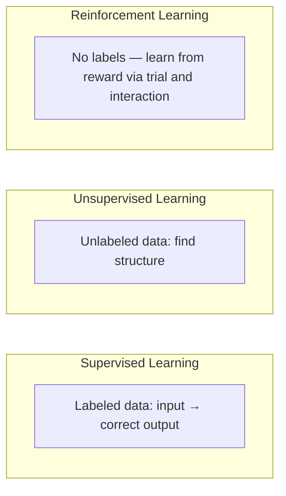
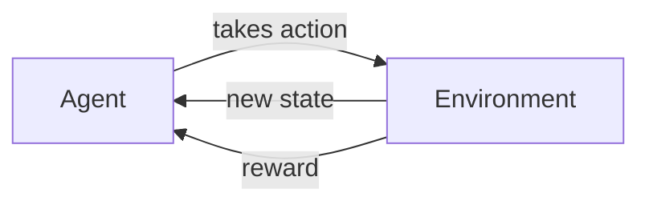

# Lesson 1 — What is Reinforcement Learning?

> **Source:** CampusX · *What is Reinforcement Learning? | Reinforcement Learning Part-1* · 14:49 · [watch](https://www.youtube.com/watch?v=zdIQkjtFX_I&list=PLKnIA16_RmvbMK0_fdp0DZHZKm4Q1slAB&index=1)
> **One-liner:** The zero-to-hero RL series opener — what makes Reinforcement Learning a fundamentally different paradigm from supervised/unsupervised learning, and the vocabulary (agent, environment, state, action, reward) everything else in the series builds on.

---

## 🎯 TL;DR

Reinforcement Learning is learning **by interaction**, not by labeled examples: an **agent** takes **actions** in an **environment**, observes the resulting **state**, and receives a **reward** signal — with no one telling it the "correct" action directly. The series' arc is explicit: start with **classical RL** (this + Part 2–3) before moving into **Deep RL** (Part 4 onward), because the classical ideas remain the backbone of state-of-the-art algorithms.

---

## 1. RL vs. the other ML paradigms

| Paradigm | Learns from | Feedback signal |
|---|---|---|
| Supervised | Labeled input→output pairs | Direct correct answer |
| Unsupervised | Unlabeled data | None — structure discovery |
| **Reinforcement** | **Interaction with an environment** | **Reward** (often delayed, not "the right answer") |

---

## 2. The core loop

| Term | Meaning |
|---|---|
| **Agent** | The learner/decision-maker |
| **Environment** | Everything the agent interacts with and that responds to its actions |
| **State** | The environment's current situation, as observed by the agent |
| **Action** | A choice the agent makes that affects the environment |
| **Reward** | The scalar feedback signal the environment returns after an action |
| **Policy** | The agent's strategy — a mapping from states to actions (formalized in Part 2) |

---

## 3. Why RL is "the way to the future" (the series' framing)

RL is the paradigm behind agents that must make **sequences of decisions** with long-term consequences, not just single predictions — game-playing, robotics, and (as later, more modern context) the reinforcement-learning-from-human-feedback (RLHF) style post-training that shapes today's LLMs. The series' promise: classical RL builds the vocabulary, then Deep RL (Parts 4–6) shows how neural networks scale these ideas to complex, high-dimensional problems.

---

## 4. Key terms

| Term | Meaning |
|------|---------|
| **Agent** | The entity learning to act |
| **Environment** | The world the agent acts within |
| **State / Action / Reward** | The three signals exchanged every step of the RL loop |
| **Classical RL vs. Deep RL** | Classical: tabular methods (Q-tables, SARSA); Deep: neural-network function approximation (DQN and beyond) |

---

## ✍️ Notes / follow-ups
- This lesson is pure vocabulary/motivation — the actual learning *algorithms* start in [Lesson 2](02-how-rl-agents-learn.md).
- Anchor: **RL is optimization over a sequence of decisions, not a single prediction.**
