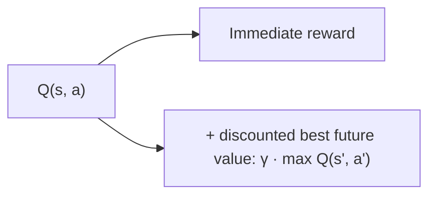
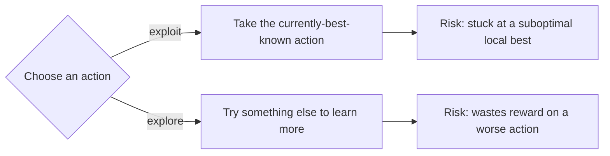

# Lesson 2 — How do RL agents really learn?

> **Source:** CampusX · *How do RL agents really learn? | Reinforcement Learning Part-2* · 25:06 · [watch](https://www.youtube.com/watch?v=DLcBjo5gIxs&list=PLKnIA16_RmvbMK0_fdp0DZHZKm4Q1slAB&index=2)
> **One-liner:** The foundational algorithms — value functions, the Bellman equation, and the explore/exploit trade-off — that classical RL is built on, and that still underpin today's state-of-the-art methods.

---

## 🎯 TL;DR

An agent "learns" by estimating **how good** a state or action is (its **value**), and improving that estimate through repeated interaction using the **Bellman equation**'s recursive structure. Because the agent doesn't know the environment's dynamics upfront, it must balance **exploring** (trying new actions to learn more) against **exploiting** (taking the action currently believed best) — a tension unique to RL among ML paradigms.

---

## 1. Value functions: "how good is this?"

| Concept | Meaning |
|---|---|
| **State-value function `V(s)`** | Expected total future reward starting from state `s`, following a given policy |
| **Action-value function `Q(s,a)`** | Expected total future reward starting from state `s`, taking action `a`, then following the policy |
| **Policy `π`** | The strategy mapping states to actions that the agent is evaluating/improving |

The whole point of learning in RL is producing better and better estimates of `V` or `Q` — because once you know `Q(s,a)` accurately, the optimal action is just "pick the `a` with the highest `Q`."

---

## 2. The Bellman equation — the recursive idea

> **Core idea:** the value of a state/action equals the *immediate reward* plus the *discounted value of whatever comes next*. This recursive relationship is what lets an agent learn from **partial, step-by-step** experience instead of needing to see a full episode's outcome before updating anything.

| Symbol | Meaning |
|---|---|
| `γ` (gamma) | Discount factor — how much future reward is worth relative to immediate reward |
| `s, a` | Current state, current action |
| `s', a'` | Next state, next action |

---

## 3. Exploration vs. exploitation

| Strategy | Idea |
|---|---|
| **Pure exploitation** | Always take the best-known action — risks never discovering a better one |
| **Pure exploration** | Always try new things — never capitalizes on what's already learned |
| **ε-greedy (the standard compromise)** | Take the best-known action most of the time; take a random action with small probability `ε` |

---

## 4. Why these ideas persist into modern algorithms

The lesson's framing: these aren't "outdated basics" — value functions, the Bellman recursion, and explore/exploit are the mathematical skeleton that even today's deep RL and RLHF-style algorithms are built on top of. Learning them here pays off directly once neural networks enter the picture in Part 4.

---

## 5. Key terms

| Term | Meaning |
|------|---------|
| **Value function (`V`, `Q`)** | Estimated expected future reward from a state (or state-action pair) |
| **Bellman equation** | Recursive relationship: value = immediate reward + discounted future value |
| **Discount factor (`γ`)** | Weighting of future reward relative to immediate reward |
| **Exploration / Exploitation** | The trade-off between trying new actions vs. using the current best-known one |
| **ε-greedy** | A simple policy that exploits most of the time, explores with probability `ε` |

---

## ✍️ Notes / follow-ups
- These are the concepts Lesson 3 turns into a **runnable algorithm** (SARSA and Q-Learning) on a real environment.
- Next: [Lesson 3 — Training Your First RL Agent](03-training-your-first-rl-agent.md).
