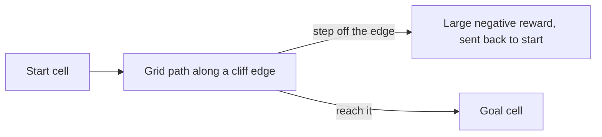
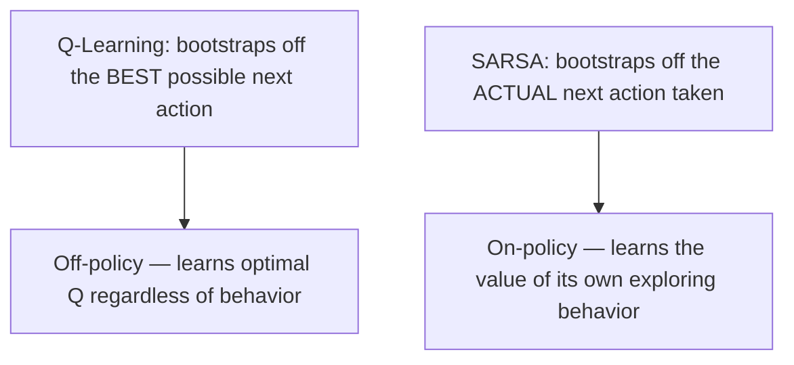

# Lesson 3 — How to Train Our First Reinforcement Learning Agent!

> **Source:** CampusX · *How to train our first Reinforcement Learning agent!* · 41:22 · [watch](https://www.youtube.com/watch?v=tbpBW5Yr44k&list=PLKnIA16_RmvbMK0_fdp0DZHZKm4Q1slAB&index=3)
> **One-liner:** Theory becomes code — implementing **SARSA** and **Q-Learning** on the classic **Cliff Walking** problem using **OpenAI Gym**, then comparing what the two algorithms actually learn differently.

---

## 🎯 TL;DR

Cliff Walking is a grid-world where one wrong step drops the agent off a cliff (large negative reward). Solving it with two closely related tabular algorithms — **Q-Learning** and **SARSA** — exposes a subtle but important difference: Q-Learning learns the value of the *optimal* policy (assuming it always exploits later), while SARSA learns the value of the policy it's *actually following* (including its own exploration mistakes) — leading the two to converge on visibly different paths near the cliff.

---

## 1. OpenAI Gym: why use a library for the environment

| Without a library | With OpenAI Gym |
|---|---|
| Hand-code environment dynamics, rewards, rendering | Standardized environments ready to use |
| Every experiment reinvents environment plumbing | Focus entirely on the *agent*/algorithm |
| Hard to compare results across implementations | Common interface makes results comparable |

**Gym's core interface:** `reset()` → initial state; `step(action)` → `(next_state, reward, done, info)`.

---

## 2. The Cliff Walking problem

| Element | In Cliff Walking |
|---|---|
| **State** | Agent's grid position |
| **Actions** | Up / Down / Left / Right |
| **Reward** | -1 per step (encourages shortest path); large negative for falling off the cliff |
| **Goal** | Reach the goal cell in as few steps as possible without falling |

---

## 3. Q-Learning vs. SARSA — the tabular update rules

| Algorithm | Update target | Learns the value of... |
|---|---|---|
| **Q-Learning** | `r + γ · max_a' Q(s', a')` | The **optimal** policy — assumes best future action regardless of current exploration |
| **SARSA** | `r + γ · Q(s', a')` (using the *actually chosen* next action) | The policy **actually being followed**, exploration included |

---

## 4. What the comparison reveals

Near the cliff edge, an **ε-greedy** exploring agent occasionally takes a random action. Q-Learning, assuming future optimality, is happy to plan a path that hugs the cliff edge tightly (since it assumes it'll always act optimally after this point). SARSA, accounting for its own chance of a random exploratory misstep, tends to learn a **safer path** further from the edge — because it's evaluating the policy that includes those occasional random slips.

| | Q-Learning's learned path | SARSA's learned path |
|---|---|---|
| **Risk near cliff** | Hugs the edge (assumes future optimality) | Keeps more distance (accounts for its own exploration) |
| **Classification** | Off-policy | On-policy |

---

## 5. Key terms

| Term | Meaning |
|------|---------|
| **OpenAI Gym** | A standard library of RL environments with a common `reset`/`step` interface |
| **Cliff Walking** | A classic grid-world benchmark for comparing tabular RL algorithms |
| **On-policy (SARSA)** | Learns the value of the policy actually being executed, including exploration |
| **Off-policy (Q-Learning)** | Learns the value of the optimal policy, independent of the exploration behavior used to collect data |

---

## ✍️ Notes / follow-ups
- Both algorithms here use a **Q-table** — one entry per (state, action) pair. That only works for small, discrete state spaces.
- Next: what happens when the state space is too big for a table → [Lesson 4 — Introducing Neural Networks into RL](04-introducing-neural-networks-into-rl.md).
