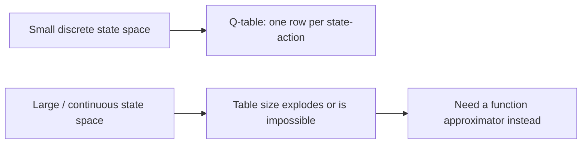
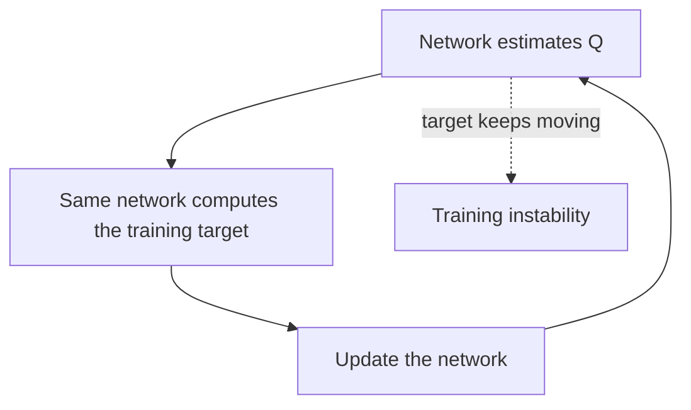

# Lesson 4 — Introducing Neural Networks into RL

> **Source:** CampusX · *Introducing Neural Networks into RL* · 34:03 · [watch](https://www.youtube.com/watch?v=F-HRiwlqPDU&list=PLKnIA16_RmvbMK0_fdp0DZHZKm4Q1slAB&index=4)
> **One-liner:** Why the Q-**table** approach from Lesson 3 breaks down at scale, and the specific challenges that appear the moment you replace it with a neural network **function approximator**.

---

## 🎯 TL;DR

A Q-table needs one row per state (or state-action pair) — fine for a small grid, impossible for anything with a large or continuous state space (e.g. raw pixels, continuous sensor readings). The fix is a **neural network** that *approximates* `Q(s,a)` instead of memorizing it. But this swap isn't free: it introduces real instability problems that classical tabular RL never had to deal with — the central subject of this lesson, resolved concretely by DQN in Lesson 5.

---

## 1. Why tables don't scale

| | Q-table | Neural network approximator |
|---|---|---|
| **Storage** | One value per (state, action) — grows with state count | Fixed-size weights, regardless of state-space size |
| **Generalization** | None — unseen states have no entry | Generalizes across similar states |
| **Scales to images / continuous inputs?** | No | Yes |

---

## 2. The challenges this introduces

| Challenge | Why it happens |
|---|---|
| **Correlated, non-stationary data** | RL experience arrives as a sequence of *correlated* steps, not i.i.d. samples — violates a core assumption behind standard supervised training |
| **Moving target** | The network is used to both **produce** and **evaluate** the Q-value target, so the "label" it's trained toward keeps shifting as the network updates — a feedback loop that can destabilize learning |
| **Sample inefficiency** | Each real interaction is "used once and discarded" in a naive setup, unlike supervised learning's fixed, reusable dataset |

---

## 3. Why supervised-learning intuition doesn't transfer directly

| Supervised learning assumption | Broken in naive Deep RL |
|---|---|
| Training samples are i.i.d. | RL samples are sequential and highly correlated (consecutive frames of the same episode) |
| Labels are fixed | The Q-learning "label" is bootstrapped from the network's own (changing) predictions |
| One pass over a fixed dataset is fine | The agent must keep collecting new data as its policy changes |

This is exactly the gap **DQN** (Lesson 5) closes — with two specific, named fixes: **experience replay** (for the correlation problem) and a **target network** (for the moving-target problem).

---

## 4. Key terms

| Term | Meaning |
|------|---------|
| **Function approximator** | A model (here, a neural network) that estimates `Q(s,a)` instead of storing it exactly |
| **Non-stationary target** | A training target that shifts over time because it depends on the model being trained |
| **i.i.d. assumption** | Independent and identically distributed data — the standard supervised-learning assumption that RL trajectories violate |

---

## ✍️ Notes / follow-ups
- This lesson names the *problems*; Lesson 5 names the *solutions* (experience replay, target networks) inside a full DQN.
- Next: [Lesson 5 — Deep Learning meets Reinforcement Learning (DQN)](05-deep-q-networks.md).
