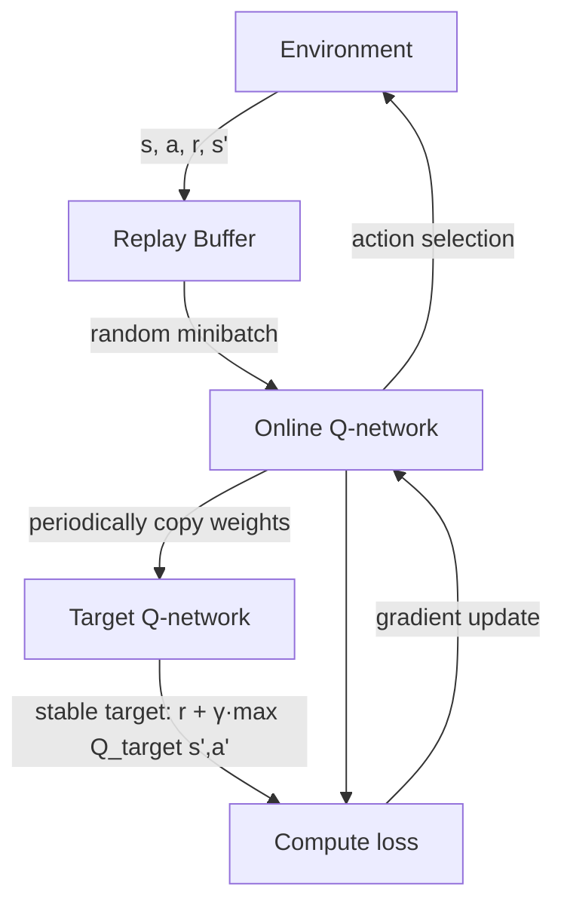
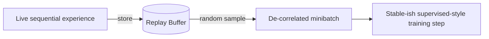
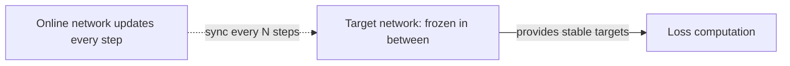

# Lesson 5 — Deep Learning meets Reinforcement Learning (DQN)

> **Source:** CampusX · *Deep Learning meets Reinforcement Learning* · 57:42 · [watch](https://www.youtube.com/watch?v=FkTN6yw1S54&list=PLKnIA16_RmvbMK0_fdp0DZHZKm4Q1slAB&index=5)
> **One-liner:** **Deep Q-Networks (DQN)** — "the algorithm that changed the look of Reinforcement Learning" — and the two mechanisms, **experience replay** and a **target network**, that make training a neural Q-function actually stable.

---

## 🎯 TL;DR

DQN takes the neural-network Q-function from Lesson 4 and fixes its two destabilizing problems directly: **experience replay** breaks the correlation between consecutive training samples by learning from a shuffled buffer of past experience instead of the live stream; a separate, slowly-updated **target network** stops the "moving target" problem by freezing the values used to compute training targets for a while. Together, these turned Deep RL from theoretically appealing into practically trainable.

---

## 1. DQN architecture at a glance

| Component | Role |
|---|---|
| **Online network** | The network actually being trained; used to pick actions |
| **Replay buffer** | Stores past `(s, a, r, s')` transitions; samples random minibatches for training |
| **Target network** | A periodically-synced copy of the online network, used only to compute stable training targets |

---

## 2. Fix #1 — Experience Replay

| Problem it solves | How |
|---|---|
| Consecutive experiences are highly correlated | Store transitions in a buffer, then **sample randomly** — breaking the sequential correlation |
| Each experience used once and discarded | Buffer lets the same transition be **reused** across many training steps, improving sample efficiency |

---

## 3. Fix #2 — Target Network

| Problem it solves | How |
|---|---|
| Training target shifts every step because it's computed by the same network being updated | Compute the target using a **separate, frozen** copy of the network, synced only every N steps |

Without this, the network is chasing a target that moves every time it updates — like trying to hit a bullseye that shifts position every time you throw. Freezing the target for a while gives training something stable to converge toward, at least locally.

---

## 4. Why this was the breakthrough

Before DQN, combining deep learning with RL was known to be theoretically promising but empirically unstable. DQN's contribution wasn't a new learning objective — it kept the same Q-learning idea from Lesson 2 — but a set of **engineering fixes** that made the combination actually converge reliably, which is why it's remembered as the algorithm that made Deep RL practical (famously, Atari-playing agents from raw pixels).

---

## 5. Key terms

| Term | Meaning |
|------|---------|
| **DQN (Deep Q-Network)** | A neural network trained to approximate `Q(s,a)`, stabilized via replay + target network |
| **Experience replay** | Storing past transitions in a buffer and training on random samples from it |
| **Target network** | A periodically-synced, frozen copy of the Q-network used to compute stable training targets |

---

## ✍️ Notes / follow-ups
- Credit noted in the source video: created by Rajtilak Pal (M.Tech in AI, IIT Ropar).
- Getting the *algorithm* right isn't the whole story — Lesson 6 tackles a different, equally critical lever: the **reward function** itself.
- Next: [Lesson 6 — Designing the Best Reward Function](06-designing-the-best-reward-function.md).
