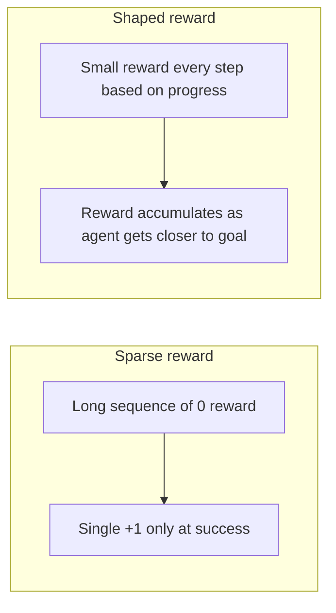

# Lesson 6 — Design the Best Reward Function

> **Source:** CampusX · *Design the Best Reward Function* · 27:58 · [watch](https://www.youtube.com/watch?v=IdJL9rcQrFU&list=PLKnIA16_RmvbMK0_fdp0DZHZKm4Q1slAB&index=6)
> **One-liner:** Solving the **Lunar Lander** problem exposes the real bottleneck in practical RL — not the algorithm, but the **reward function** — comparing **sparse** vs. **shaped** rewards.

---

## 🎯 TL;DR

A correct algorithm (DQN, from Lesson 5) still won't learn well if the **reward signal** gives it nothing useful to climb toward. **Sparse rewards** (e.g., only +1 on success, 0 otherwise) leave the agent with almost no gradient of feedback during long episodes. **Shaped rewards** — intermediate feedback that tracks progress toward the goal — make learning dramatically faster and more reliable, which this lesson demonstrates concretely on Lunar Lander.

---

## 1. Sparse vs. shaped rewards



| | Sparse reward | Shaped reward |
|---|---|---|
| **Feedback frequency** | Rare — often only at episode end | Frequent — every step carries signal |
| **Learning speed** | Slow — agent wanders with little guidance | Faster — clear gradient toward the goal |
| **Design effort** | Low — just define success/failure | Higher — must encode "progress" correctly |
| **Risk** | Agent may never stumble onto success by chance | Reward hacking if shaping is designed poorly (see below) |

---

## 2. Lunar Lander as the testbed

| Element | In Lunar Lander |
|---|---|
| **State** | Lander's position, velocity, angle, angular velocity, leg-contact sensors |
| **Actions** | Fire main engine / left engine / right engine / do nothing |
| **Sparse version** | Reward mainly for landing successfully vs. crashing |
| **Shaped version** | Reward also for reducing distance-to-pad, controlling velocity/angle, using less fuel |

A shaped reward function turns "did you land?" (one bit of information per episode) into "are you doing better right now than a moment ago?" (a continuous signal every step) — which is exactly the kind of dense feedback that value-based methods like DQN exploit well.

---

## 3. The catch: designing shaped rewards well

Poorly designed shaping can backfire — an agent will optimize *exactly* what the reward function measures, not what you intended. If the shaping rewards a proxy for progress that can be gamed (e.g., hovering to farm small positive rewards instead of actually landing), the agent will find that exploit. Good reward design requires the shaping signal to stay **aligned** with the true objective at every point, not just approximately correlated with it.

```mermaid
flowchart LR
    Design[Shaped reward signal] --> Aligned{Truly aligned with the goal?}
    Aligned -->|yes| Good[Faster, correct learning]
    Aligned -->|no| Hack[Agent exploits the proxy — "reward hacking"]
```

---

## 4. Key terms

| Term | Meaning |
|------|---------|
| **Sparse reward** | Feedback given rarely, often only at episode success/failure |
| **Shaped reward** | Dense, intermediate feedback that tracks progress toward the goal |
| **Reward hacking** | An agent maximizing the literal reward signal in a way that diverges from the designer's true intent |
| **Lunar Lander** | A classic continuous-control RL benchmark environment (from OpenAI Gym) |

---

## ✍️ Notes / follow-ups
- 🎉 **Final lesson of the crash course.** Arc recap: what RL is → how agents learn (value functions, Bellman, explore/exploit) → tabular algorithms in practice (Q-Learning vs. SARSA) → why neural networks are needed and what breaks → DQN's fixes (replay + target network) → reward design as the often-overlooked lever.
- Big picture: **the algorithm gets the headlines, but the reward function decides what the agent actually becomes good at.** This is the same lesson underlying RLHF-style post-training of modern LLMs — the reward model's quality bounds what the policy can learn.
