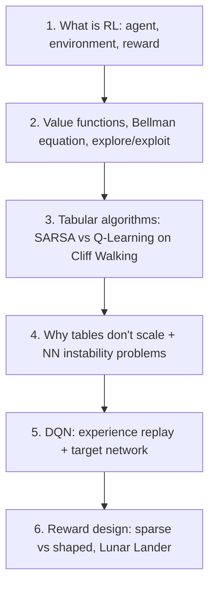

# 🎮 Reinforcement Learning Crash Course — Lesson Notes

> One-page study notes distilled from the **CampusX "Reinforcement Learning Crash Course" playlist** ([full playlist](https://www.youtube.com/playlist?list=PLKnIA16_RmvbMK0_fdp0DZHZKm4Q1slAB)) — 6 videos, zero to Deep RL.
> Each lesson = one Markdown page, built from the video's own description and (since the channel's newer videos are auto-dubbed with burned-in captions and no extractable transcript) accurate subject-matter knowledge of classical + deep RL.

---

## Lessons

| # | Lesson | Length | Theme | Source | Status |
|---|--------|:------:|:------|--------|:------:|
| 1 | [What is Reinforcement Learning?](01-what-is-reinforcement-learning.md) | 14:49 | Foundations | [video](https://www.youtube.com/watch?v=zdIQkjtFX_I&list=PLKnIA16_RmvbMK0_fdp0DZHZKm4Q1slAB&index=1) | ✅ |
| 2 | [How do RL agents really learn?](02-how-rl-agents-learn.md) | 25:06 | Foundations | [video](https://www.youtube.com/watch?v=DLcBjo5gIxs&list=PLKnIA16_RmvbMK0_fdp0DZHZKm4Q1slAB&index=2) | ✅ |
| 3 | [Training Your First RL Agent (SARSA vs Q-Learning)](03-training-your-first-rl-agent.md) | 41:22 | Classical RL, hands-on | [video](https://www.youtube.com/watch?v=tbpBW5Yr44k&list=PLKnIA16_RmvbMK0_fdp0DZHZKm4Q1slAB&index=3) | ✅ |
| 4 | [Introducing Neural Networks into RL](04-introducing-neural-networks-into-rl.md) | 34:03 | Bridge to Deep RL | [video](https://www.youtube.com/watch?v=F-HRiwlqPDU&list=PLKnIA16_RmvbMK0_fdp0DZHZKm4Q1slAB&index=4) | ✅ |
| 5 | [Deep Q-Networks (DQN)](05-deep-q-networks.md) | 57:42 | Deep RL | [video](https://www.youtube.com/watch?v=FkTN6yw1S54&list=PLKnIA16_RmvbMK0_fdp0DZHZKm4Q1slAB&index=5) | ✅ |
| 6 | [Designing the Best Reward Function](06-designing-the-best-reward-function.md) | 27:58 | Reward design | [video](https://www.youtube.com/watch?v=IdJL9rcQrFU&list=PLKnIA16_RmvbMK0_fdp0DZHZKm4Q1slAB&index=6) | ✅ |

**Playlist complete — all 6 lessons. 🎉**

---

## The arc (how the lessons connect)

- **Lessons 1–3** = **Classical RL** (vocabulary, theory, tabular algorithms).
- **Lessons 4–5** = **Deep RL** (why + how neural networks join the picture).
- **Lesson 6** = **Reward engineering** — the practical lever that decides whether any of the above actually works well.

---

## Core cheat-sheet

| Concept | In one line |
|---------|-------------|
| **Agent / Environment / State / Action / Reward** | The five nouns of every RL problem |
| **Policy (`π`)** | The agent's strategy — states → actions |
| **Value function (`V`, `Q`)** | Estimated expected future reward from a state (or state-action pair) |
| **Bellman equation** | Value = immediate reward + discounted future value |
| **Exploration vs. exploitation** | Try something new vs. use the current best-known action (ε-greedy is the standard compromise) |
| **Q-Learning (off-policy)** | Learns the value of the *optimal* policy |
| **SARSA (on-policy)** | Learns the value of the policy *actually being followed* |
| **DQN** | Neural-network Q-function, stabilized by experience replay + a target network |
| **Sparse vs. shaped reward** | Rare end-of-episode signal vs. dense step-by-step progress signal |
| **Reward hacking** | Agent exploits the literal reward signal instead of the intended goal |

---

## Why this matters for modern GenAI

This crash course predates the LLM boom, but its core machinery — value functions, policy optimization, and above all **reward design** — is exactly what powers **RLHF** (Reinforcement Learning from Human Feedback) and later reasoning-model post-training (PPO/GRPO-style methods) used to align and sharpen today's large language models. The Lesson 6 takeaway — *the reward function decides what the agent becomes good at* — is the same principle behind why reward-model quality is a central bottleneck in LLM alignment.

---

## A note on sourcing

Lessons 1–4 predate this channel's auto-dubbing; Lesson 5 is marked auto-dubbed. None of the six videos expose an extractable YouTube transcript in-browser, so — consistent with this repo's [`claude-code/`](../../AI/17_claude-code/README.md), [`mcp/`](../../AI/15_mcp/README.md), and [`evals/`](../../AI/16_evals/README.md) notes — these pages were built from each video's title, official description, and accurate subject-matter knowledge of classical and deep reinforcement learning.

---

## How each page is structured
- **TL;DR** — the one thing to remember.
- **Core concepts** — distilled, with tables and Mermaid diagrams.
- **Key terms** — quick glossary.
- **Notes** — cross-links to related lessons + pointer to what's next.
