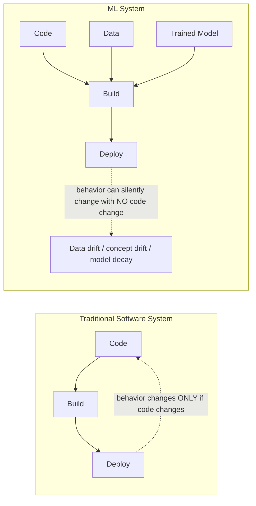
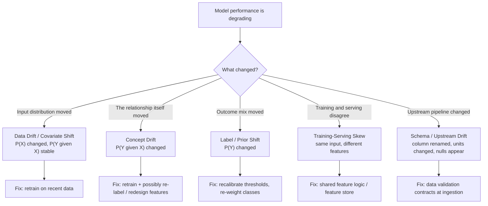
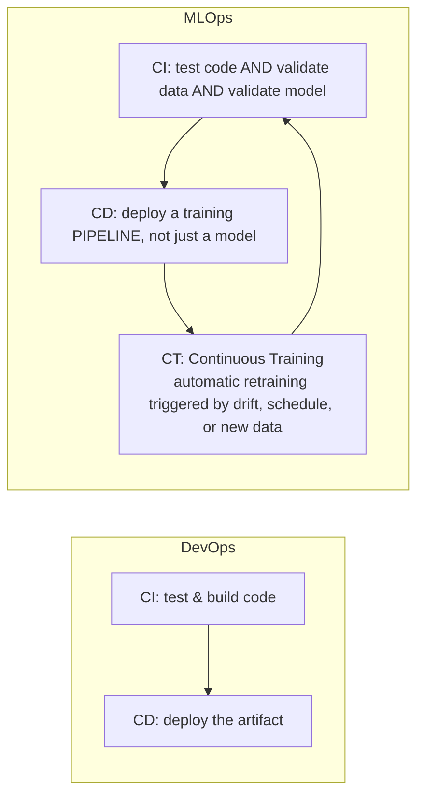

# Lesson 1 — Why Should You Learn MLOps? (Software Systems vs. ML Systems)

> **Source:** CampusX · *Why Should You Learn MLOps in 2024? | Software Systems Vs ML Systems | MLOPs Roadmap* · 38:59 · [watch](https://www.youtube.com/watch?v=H4fZ3HFv684&list=PLKnIA16_RmvaKHYjy5v0dJh8edeaEWb-b&index=1)
> **One-liner:** Why ML systems break traditional software engineering practice — and why MLOps exists specifically to close that gap.

---

## 🎯 TL;DR

A regular software system is just **code**. An ML system is **code + data + model**, and each of those three can independently drift, break, or go stale in production — something classic DevOps was never designed to track. The deepest consequence: **an ML system can fail in production with zero code changes**, purely because the world moved. MLOps applies DevOps discipline (versioning, CI/CD, testing, monitoring) across all three axes simultaneously, and adds a fourth practice DevOps has no concept of — **Continuous Training (CT)**. That's why it's a distinct discipline rather than "DevOps with extra steps."

---

## 1. The fundamental difference: one input vs. three

In traditional software, behavior is **deterministic and specified** — a developer writes rules, and the system executes exactly those rules. In ML, behavior is **inferred and probabilistic** — the rules are *learned* from data, which means the data is effectively part of your source code, and nobody wrote the logic down anywhere a human can read it.

| Dimension | Software system | ML system |
|---|---|---|
| **What determines behavior** | Code only | Code **+** data **+** model weights (hyperparameters too) |
| **How logic is created** | Explicitly written by a developer | **Inferred** from training data |
| **Is logic human-readable?** | Yes — read the source | Often no — weights are opaque (the *interpretability* problem) |
| **Can silently degrade after deploy?** | Rarely — code doesn't change itself | **Yes** — the world shifts underneath a frozen model |
| **What needs versioning** | Code | Code, data, model artifacts, features, hyperparameters, environment |
| **Testing approach** | Unit / integration / e2e tests on logic | + data validation, distribution tests, model-quality gates, behavioral tests |
| **Correctness definition** | Binary — passes or fails a spec | **Statistical** — "95.2% accurate" is a *good* result, not a bug |
| **Determinism** | Same input → same output | Same training data can produce *different* models (random seeds, GPU non-determinism, data ordering) |
| **Primary failure signal** | Exceptions, 5xx errors, latency spikes | Quiet accuracy decay — the system returns 200 OK while being *wrong* |

> **The key asymmetry:** in software, a failure is usually *loud* (crash, stack trace, alert). In ML, the most dangerous failure is *silent* — the model confidently returns plausible-looking predictions that are increasingly wrong, and every traditional monitor stays green.

---

## 2. The many ways an ML system rots — a taxonomy of drift

"Drift" gets used as a single word for several genuinely different failure modes. Distinguishing them matters, because **each one has a different fix**.

| Failure mode | What it means | Concrete example |
|---|---|---|
| **Data drift** (*covariate shift*) | The distribution of **inputs** changes; the underlying input→output relationship doesn't | A loan model trained pre-inflation now sees applicants with much higher nominal salaries |
| **Concept drift** | The **relationship** between input and output changes — the same input should now produce a different answer | "Suspicious transaction" patterns change as fraudsters adapt to your detector |
| **Label / prior shift** | The **base rates** of outcomes change | Fraud rate jumps from 0.1% to 2%; your tuned threshold is now miscalibrated |
| **Training-serving skew** | Features are computed **differently** in training vs. production | Training used a batch SQL average; serving computes it in Python and rounds differently |
| **Schema / upstream drift** | The data *contract* silently breaks | Upstream team renames a column, changes units from km to miles, or starts sending nulls |
| **Model decay / staleness** | Cumulative degradation over time from any of the above | A recommender trained last year no longer knows current products exist |
| **Feedback loops** | The model's own outputs contaminate its future training data | A recommender only shows items it already likes, so future training data only contains those items — self-reinforcing bias |
| **Non-determinism** | Two runs on identical data produce different models | Unseeded shuffling, GPU floating-point non-associativity, distributed reduction order |

### Why traditional monitoring misses all of this
Standard software monitoring watches **the service**: uptime, latency, throughput, error rate, CPU/memory. Every one of those can be perfectly green while your model's accuracy has quietly fallen from 94% to 71%. ML systems need a second, orthogonal monitoring layer watching **the predictions and the inputs**: input distributions, prediction distributions, confidence scores, and (whenever ground truth eventually arrives) live accuracy.

---

## 3. Hidden technical debt — why ML systems get expensive fast

ML systems accumulate a *specific* kind of maintenance burden. These are the classic patterns worth being able to name:

| Debt pattern | What it is | Why it hurts |
|---|---|---|
| **CACE principle** | *Changing Anything Changes Everything* — no ML input is truly independent | Tweak one feature and every learned weight shifts; you can't reason about changes locally |
| **Entanglement** | Features interact in ways that make isolated changes impossible | Removing a "useless" feature can *degrade* accuracy through lost interactions |
| **Pipeline jungles** | Data prep grows into a tangle of scripts, joins, and scrapes accreted over time | Nobody can reproduce the dataset; onboarding takes months |
| **Glue code** | The vast majority of an ML codebase is plumbing around a tiny bit of modeling | The 5% that's `model.fit()` is dwarfed by 95% moving data around |
| **Configuration debt** | Sprawling, untested, undocumented config (hyperparameters, paths, flags, thresholds) | A one-character config typo silently ships a worse model |
| **Undeclared consumers** | Other teams quietly depend on your model's output | You "improve" the model and break three downstream systems you didn't know existed |
| **Correction cascades** | Patching model A with model B, then patching B with C | A brittle stack where a fix at the bottom breaks everything above it |
| **Dead experimental code paths** | Abandoned `if experiment_v3:` branches left in production code | Accumulating risk and unreadability |
| **Data dependencies** | Unstable upstream data sources treated as if they were stable APIs | Upstream changes without warning; you have no contract to enforce |

> **The practical takeaway:** in an ML project, the model is the *small* part. Most of the engineering effort — and nearly all of the long-term cost — lives in data plumbing, versioning, testing, and monitoring. Which is precisely the territory MLOps covers.

---

## 4. What MLOps actually adds over DevOps

DevOps gave software teams **CI** (Continuous Integration) and **CD** (Continuous Delivery/Deployment). MLOps needs both of those *plus* a third loop that DevOps has no equivalent for.

| Practice | In DevOps | In MLOps |
|---|---|---|
| **CI** | Run unit tests, build artifact | + validate data schema/distribution, + validate feature logic, + test the model meets a quality bar |
| **CD** | Ship a binary/container | Ship a **pipeline** capable of retraining itself, not just one frozen model |
| **CT** *(Continuous Training)* | ❌ Doesn't exist | ✅ Automated retraining on drift/schedule/data arrival — the defining MLOps addition |
| **Versioning** | Git for code | Git for code **+** DVC/lakeFS-style versioning for data **+** a model registry for artifacts |
| **Testing** | Deterministic pass/fail | Statistical thresholds, plus comparison against the *currently deployed* model (champion/challenger) |
| **Monitoring** | Service health | Service health **+** data quality **+** prediction distribution **+** live accuracy |
| **Rollback** | Redeploy the previous build | Redeploy previous model **and** possibly the previous feature logic and dataset version |

### MLOps maturity levels (a useful self-assessment ladder)

| Level | Name | What it looks like |
|---|---|---|
| **Level 0** | Manual process | Notebooks, manual training, manual handoff to deploy. Every release is an artisanal event. Retraining is rare and painful. |
| **Level 1** | ML pipeline automation | The *training pipeline* is automated and reproducible; continuous training on new data is possible. Deployment of the pipeline is still manual. |
| **Level 2** | Full CI/CD automation | Pipeline builds, tests, and deploys itself; automated retraining, validation gates, and monitoring-triggered rollbacks. |

Most teams that *say* they "do MLOps" are at Level 0 with a model registry bolted on. Naming the level honestly is the fastest way to identify what to build next.

---

## 5. Who does what — the roles around an ML system

| Role | Primary concern | Typical artifacts |
|---|---|---|
| **Data engineer** | Reliable, clean, timely data | ETL/ELT pipelines, warehouses, data contracts |
| **Data scientist** | Does a model *work* at all? | Experiments, notebooks, feature ideas, metrics |
| **ML engineer** | Making the model production-grade | Training pipelines, serving code, optimization |
| **MLOps / platform engineer** | The system that runs all of the above, repeatably | CI/CD, registries, orchestration, monitoring, infra |
| **SRE / DevOps** | Uptime and operability of the service | Deployment infra, alerting, incident response |

MLOps is the **connective tissue** between these roles. The most common organizational failure is each role optimizing locally — clean data that's the wrong features, a great notebook model that can't be served, solid infra serving a stale model.

---

## 6. Key terms

| Term | Meaning |
|------|---------|
| **MLOps** | DevOps principles (automation, versioning, CI/CD, testing, monitoring) extended to cover **data and models**, not just code — plus Continuous Training. |
| **ML system (code + data + model)** | The three independently-versionable, independently-failing components of any production ML system. |
| **Data drift / covariate shift** | The input distribution `P(X)` changes while the input→output relationship stays stable. |
| **Concept drift** | The relationship `P(Y|X)` itself changes — the correct answer for the same input is now different. |
| **Label / prior shift** | The distribution of outcomes `P(Y)` changes (e.g. base rate of fraud jumps). |
| **Training-serving skew** | The same logical feature is computed differently during training vs. serving, so the model sees inputs it was never trained on. |
| **Model decay / staleness** | Cumulative performance degradation of a deployed model over time. |
| **Feedback loop** | The model's own predictions influence the data it will later be trained on, creating self-reinforcing bias. |
| **CACE principle** | *Changing Anything Changes Everything* — ML inputs are entangled, so no change is local. |
| **Entanglement** | Features interact such that modifying or removing one has unpredictable global effects. |
| **Pipeline jungle** | An accreted tangle of data-prep scripts that nobody can fully reproduce or reason about. |
| **Glue code** | The large volume of plumbing surrounding the small amount of actual modeling code. |
| **Undeclared consumer** | A downstream system silently depending on your model's output, which breaks when you change it. |
| **Correction cascade** | Stacking models/patches to correct earlier models, creating a brittle dependency chain. |
| **Continuous Training (CT)** | Automated retraining triggered by drift, schedule, or new data — the practice that distinguishes MLOps from DevOps. |
| **Champion / challenger** | Comparing a newly-trained candidate model against the currently-deployed one before promoting it. |
| **Reproducibility** | The ability to recreate a specific model exactly, given the same code, data version, config, and environment. |
| **Model registry** | A versioned catalog of trained models with lifecycle stages (staging → production → archived). |
| **Data validation** | Automated checks that incoming data matches an expected schema and distribution before use. |
| **MLOps maturity levels (0/1/2)** | A ladder from fully manual (0) → automated training pipeline (1) → full CI/CD/CT automation (2). |
| **Interpretability** | The degree to which a human can understand *why* a model produced a given output. |
| **Silent failure** | An ML failure where the service is healthy and returns valid-looking predictions that are wrong. |

---

## ✍️ Notes / follow-ups
- This lesson is the **"why it's a real discipline"** argument. The single most important idea to carry forward: *ML systems can fail with no code change*, which is why versioning and monitoring must extend to data and models.
- Second most important: **drift is not one thing.** Being able to distinguish data drift from concept drift from training-serving skew is what turns "the model got worse" into an actionable diagnosis.
- Next: [Lesson 2 — What is MLOps?](02-what-is-mlops.md) defines the end-to-end lifecycle concretely.
