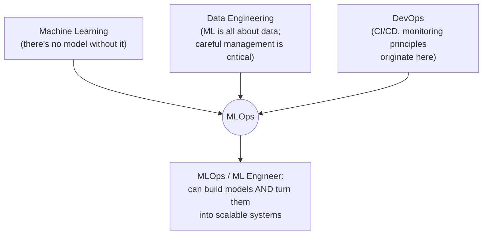

# Lesson 2 — What is MLOps? (End-to-End Explanation with Example)

> **Source:** CampusX · *What is MLOps? | MLOps Explained | End to End Explanation with Example* · 1:00:41 · [watch](https://www.youtube.com/watch?v=6SRifO6dmuE&list=PLKnIA16_RmvaKHYjy5v0dJh8edeaEWb-b&index=2)
> **One-liner:** MLOps explained through a **noodle cloud-kitchen story** — a student's one-dish kitchen scaling to 250 orders/day — then mapped concept-for-concept onto a real ML system (a cricket innings-score predictor), to kill the misconception that MLOps just means "deployment."

---

## 🎯 TL;DR

The lesson opens with a deliberate trap — a true/false question: *"MLOps is the practice of deploying a model into production so anyone can use it."* The answer is **FALSE**, and the instructor notes he held this same misconception himself when he first encountered the term. The entire video exists to dismantle it. Rather than lead with the intimidating formal definition, it tells the story of an engineering student who cooks noodles well, opens a cloud kitchen, and is forced — problem by problem, as orders grow from 2 to 250 a day — to invent inventory management, standardized recipes, automation, a research lab, experiment tracking, and quality monitoring. **Each of those is an MLOps practice in disguise.** The second half maps every one of them onto building a real score-prediction model for a cricket website. The punchline: *being able to cook noodles doesn't mean you can run a noodle business* — and being able to train a model on your laptop doesn't mean you can run a production ML system serving millions of users. MLOps is the discipline that bridges that gap.

---

## 1. The misconception this lesson exists to break

| Statement | Verdict |
|---|---|
| "MLOps is the practice of deployment into production, so anyone can use the ML model." | ❌ **FALSE** |

Deployment is *one component* of MLOps. As the lesson establishes by the end, MLOps also covers data infrastructure, version control, experiment tracking, pipeline automation, CI/CD, monitoring and retraining, provisioning, and governance.

### The formal definition (and why it's unhelpful on its own)

The textbook definition given is roughly: *MLOps is the practice and discipline in machine learning that aims to unify and streamline ML system **development** and ML system **operations**, involving collaboration between data scientists, ML engineers, and IT professionals to automate and optimize the end-to-end lifecycle of an ML application.*

The instructor's own commentary on this is worth keeping: a definition like that **"scares more than it explains."** It's dense with jargon that means nothing to a beginner. Hence the story-first approach — and the promise that the definition becomes obvious once you've heard it.

The one structural clue worth extracting from the definition before moving on: it names **two halves** — ML system *development* (building the model) and ML system *operations* (everything around it). MLOps is the union of both.

---

## 2. The noodle-business story — eight problems, eight practices

An engineering student cooks noodles for his parents' anniversary party. The guests rave; one uncle tells him to forget campus placement and open a shop. He opens a small cloud kitchen listed on Swiggy. What follows is growth, and every growth step breaks something.

```mermaid
flowchart TD
    S0["2 orders/day<br/>Buy ingredients per order"] --> P1{"5–10 orders:<br/>running to the shop 10×/day"}
    P1 --> F1["✅ INVENTORY SYSTEM<br/>shelves + vendor subscriptions"]
    F1 --> P2{"50 orders:<br/>can't cook alone"}
    P2 --> F2["✅ HIRE + PARALLELISE<br/>junior chef, 2nd stove"]
    F2 --> P3{"Taste fluctuates<br/>by who cooked"}
    P3 --> F3["✅ RECIPE BOOK<br/>standardisation + version control"]
    F3 --> P4{"100 orders:<br/>hiring per-50 doesn't scale"}
    P4 --> F4["✅ AUTOMATED MACHINE<br/>pipeline: cook 4 parallel + package"]
    F4 --> P5{"Growth plateaus ~150:<br/>customers bored, 1 item"}
    P5 --> F5["✅ RESEARCH LAB<br/>+ its own separate inventory"]
    F5 --> P6{"Best experiment<br/>can't be reproduced"}
    P6 --> F6["✅ EXPERIMENT TRACKING"]
    F6 --> P7{"Manual steps to<br/>ship a new dish"}
    P7 --> F7["✅ AUTOMATED EXPERIMENT→DEPLOY<br/>machine (CI/CD)"]
    F7 --> P8{"Item ratings<br/>degrade over time"}
    P8 --> F8["✅ MONITORING → RETRAINING LOOP"]
```

### Stage 1 — Inventory management *(→ data management)*
Initially he buys ingredients **per order** — running to the neighbouring shop for vegetables, a noodle packet, and spices every single time. Fine at 1–2 orders; unworkable at 10.

The fix: decide expected daily volume, then build **infrastructure** for it. Dedicated shelves for vegetables, noodles, and spices; standing subscriptions from different vendors (vegetables delivered daily from one, noodles from another, a month's spices from a third). Raw materials now arrive on a schedule, get placed on the right shelf, and are simply retrieved when cooking.

> **The pattern:** stop fetching inputs ad-hoc, per-request. Build a structured, scheduled supply system that consolidates from multiple sources into one organized place.

### Stage 2 — Hiring and parallelism
At 50 orders/day, one person physically cannot cook enough. Hire a junior chef, add a second cooking station: two orders processed **in parallel**, capacity doubled.

### Stage 3 — The recipe book *(→ standardization + version control)*
A subtle failure appears: Swiggy reviews start slipping. Customers report the taste is **inconsistent** — great one day, mediocre the next, good again later. The cause: dishes cooked by the junior chef taste different, because his training was **verbal instructions**, which inevitably had gaps.

The fix: a **written recipe book** — exact quantities in grams, which noodles, precise boil times, which spices and how much. Both chefs cook from the same document, so output is standardized regardless of who's cooking.

And then the crucial second-order benefit. The recipe book becomes a **shared knowledge point** that either chef can improve. If the junior chef discovers a higher water temperature cooks faster with no taste loss, he updates the book — and the head chef's next batch uses that improvement. If the head chef finds broccoli works better than cabbage, he updates it — and the junior chef's next batch reflects it.

> **The pattern:** this is **version control**. Two people work on a shared artifact, changes propagate to everyone, and the output stays consistent.

### Stage 4 — The automated cooking machine *(→ pipeline automation)*
At 100 orders/day, the obvious advice ("hire a third chef") is **explicitly rejected** — and the reasoning is the lesson. Hiring one person per 50 orders means at 150 orders a fourth, at 200 a fifth; eventually the kitchen physically can't hold them and you must rent a bigger one. Costs scale linearly with volume forever.

The fix: an **automated cooking machine** — you program it with a recipe and supply raw materials, and it cooks *and* packages with minimal supervision, running **four dishes in parallel**, handling 200–250/day. One person feeds it and collects output.

> **The pattern:** replace linear human scaling with an **automated pipeline** that takes a standardized specification plus inputs and produces finished output end-to-end.

### Stage 5 — The research lab, with its own inventory
Growth stalls around 150 orders/day for three straight months. Customer feedback explains why: **boredom.** Only one item exists — veg noodles. Nobody orders the same single dish indefinitely. Customers want **variety**: chicken noodles, Manchurian, Schezwan.

So he opens a **research lab** inside the kitchen, whose only purpose is trying new recipes; winners get added to the menu.

An important architectural detail: the lab gets its **own small research inventory**, stocked each morning by transferring from the main inventory — specifically so experimentation doesn't interfere with the production line the junior chef is running all day.

> **The pattern:** experimentation needs its own environment fed from the same source of truth, isolated from production.

### Stage 6 — Experiment tracking (learned the painful way)
He runs **10 experiments** developing chicken noodles — adjusting spice, then vegetable proportion, then other parameters — and evaluates each on several axes: spiciness, nutritional value, texture, appearance. **Experiment #7 wins.**

Then the mistake: he **never carefully recorded the parameters** of each batch. He cannot reproduce #7. The ingredients, and all that time, are wasted, and there's no way to recover the winning recipe.

The fix: **experiment tracking** — for every experiment, record all **inputs** (quantities of each ingredient, equipment used, duration, temperature) *and* all **results** (the evaluation scores). Now experiments are comparable side-by-side, and the winner can be turned into a recipe and reproduced exactly.

> **The pattern:** an experiment you can't reproduce is an experiment you didn't really run. Track inputs *and* outputs, or your best result is unrecoverable.

### Stage 7 — Automating experiment → deployment *(→ CI/CD)*
Shipping a new dish still involves manual steps: hand the recipe to the junior chef, explain it, manually add the item in the Swiggy app. So he buys a second machine automating four stages:

1. **Run** experiments
2. **Evaluate** them against the defined parameters
3. **Integrate** — generate a recipe from the winner and load it into the production cooking machine, then **test** that the production system actually produces good output from it
4. **Deploy** — publish the new item to the Swiggy app so customers can order it

> **The pattern:** the test-before-publish step is exactly **continuous integration**; publishing to customers is **continuous deployment**.

### Stage 8 — Monitoring and the retraining loop
Variety works — orders climb to 250–300. One risk remains: what if an existing item's quality **degrades over time**?

The fix: connect the **admin dashboard** (which tracks each menu item's rating) to the experimentation system. If any item's rating falls below a threshold (~4.2), a notification fires. He then investigates — perhaps a seasonal vegetable now tastes worse — swaps in a replacement, re-experiments, evaluates, integrates, tests, and redeploys the updated recipe.

> **The pattern:** this closes the loop. Monitoring detects degradation, which **triggers re-experimentation and redeployment automatically**, so quality never silently rots. This is the analogue of **retraining**.

### The invisible background work *(→ provisioning + governance)*
Beyond the pipeline, running the business means handling kitchen safety, rent, daily cleaning, vendor accounts and wallet top-ups, and EMIs on the machine loans → **provisioning**. And it means quality-checking goods in and out, because a hygiene failure (the memorable example: a cockroach) could mean consumer court → **governance**.

---

## 3. Mapping the story onto a real ML system

The second half applies all of it to a concrete build: an **innings score predictor** for a cricket information website. Given the live match state — say 30 overs bowled, 200 runs scored, 5 wickets down — predict the final score after 50 overs. It must integrate into the site's existing frontend (which sits on a backend, which sits on a database).

| Noodle business | ML system | What it actually means |
|---|---|---|
| **Inventory management** | **Data management / warehouse** | Don't repeatedly pull CSVs straight from the live production database. Build a **data warehouse** fed by an **ETL pipeline** consolidating from the database, APIs, and streaming sources |
| **Recipe book** | **Version control** | A team of 2–3 people building the model and code together need changes to propagate so everyone works on the current version |
| **Automated cooking machine** | **ML pipeline automation** | Wire data prep → processing → feature extraction → model candidates → evaluation into a pipeline, and deploy the *pipeline* |
| **Tracked experiments** | **Experiment tracking** | Trying Random Forest, XGBoost, neural networks — across data that keeps growing — creates many permutations. Without tracking you won't remember which model won, or which data/model/code produced it |
| **Testing a recipe before publishing** | **CI/CD** | Integrate the model into the website, verify the site still works *and* the model works, then deploy to all users |
| **Menu item rating monitoring** | **Monitoring + drift detection** | Models degrade: concept drift, data drift, model drift |
| **Re-experimenting a degraded dish** | **Retraining loop** | Monitoring triggers retraining, which re-runs experiments → CI/CD → deployment |
| **Rent, EMIs, vendor accounts** | **Provisioning** | Cloud infrastructure and tooling to run all of it |
| **Hygiene and legal checks** | **Governance** | Ensuring model outputs don't harm anyone |

### Why the data warehouse specifically (the strongest argument in the lesson)
Two reasons pulling CSVs from the live database is wrong:
1. **It's bad practice** to repeatedly extract from a running production database.
2. **It doesn't scale.** Today one model needs that data. Tomorrow the site runs 50 models.

And the payoff mirrors the kitchen exactly: because the warehouse is a shared, structured source, it serves **not just your model** but other ML models, analytics services, and dashboards — just as the single inventory supplied both the production kitchen and the research lab.

### The drift example worth remembering
A score predictor trained on **IPL** data, then run on **World Cup** matches, predicts poorly. Other causes named: seasonal changes shifting preferences, or launching a product in a new country where user behaviour differs. The response is to monitor, detect the degradation, and **retrain** — re-entering the whole experiment → CI/CD → deploy loop.

### Governance made concrete
For a score predictor, harmful output is unlikely. But for a conversational model, if it produces racist or demeaning output, that's a genuine ethical and legal exposure. Governance is the practice of ensuring model outputs stay within acceptable bounds.

---

## 4. The punchline — and the honest scope of the job

The lesson lands its central point twice, once in each half:

> Being good at **cooking noodles** does not prove you can **build and run a noodle business**.
>
> Likewise: a data scientist building a model **on their laptop** is no guarantee that the model can become part of software serving **millions of concurrent users** and generating real revenue.

Building an ML model and building an ML **system** are described as two very different things. **MLOps is what converts the model on your laptop into a fully functional, highly scalable production ML system** — one that doesn't break as usage grows.

Returning to the opening true/false: the statement is false because MLOps *also* includes data infrastructure, version control, experiment tracking, CI/CD pipelines, ML pipeline automation, provisioning, governance — and more besides.

---

## 5. The closing frame: MLOps at the intersection of three fields

| Contributing field | What it brings |
|---|---|
| **Machine learning** | The model itself — without one, there's nothing to operationalize |
| **Data engineering** | ML is fundamentally about data, so pipelines, warehousing, and data management matter enormously |
| **DevOps** | The software-to-production discipline — CI/CD pipelines and monitoring come from here |

This intersection is offered as the explanation for two things at once: **why MLOps is hard to learn** (you need all three), and **why MLOps/ML engineers are in such demand** (they can both build a model and convert it into a functional, scalable system).

---

## 6. Key terms

| Term | Meaning |
|------|---------|
| **MLOps** | The union of ML system **development** and ML system **operations** — the discipline that turns a laptop model into a scalable production system. Not merely deployment. |
| **The deployment misconception** | The widespread false belief that MLOps means only "deploy the model to production." |
| **Data management** | Structuring how data is collected, consolidated, and made available — the ML equivalent of inventory management. |
| **Data warehouse** | A central, structured store consolidating data from databases, APIs, and streams, consumable by many models, analytics services, and dashboards. |
| **ETL pipeline** | The Extract–Transform–Load process that formats and loads source data into the warehouse. |
| **Version control** | A shared, versioned artifact (code, or the story's recipe book) where each contributor's changes propagate to everyone and output stays consistent. |
| **Standardization** | Replacing informal/verbal process with an explicit written specification so results don't vary by who executes them. |
| **ML pipeline automation** | Chaining data prep → processing → feature extraction → model training → evaluation into an automated pipeline, deployed as a unit. |
| **Parallel processing** | Handling multiple units of work simultaneously (two stoves; four cooking tops) rather than sequentially. |
| **Experiment tracking** | Recording every experiment's inputs (parameters, data, code, conditions) *and* results, so runs are comparable and the winner is reproducible. |
| **Reproducibility** | The ability to recreate a specific result exactly — the thing lost in the story when experiment #7's parameters went unrecorded. |
| **Experimentation environment** | An isolated setup (the research lab, with its own inventory) fed from the same source of truth but separated from production. |
| **CI (Continuous Integration)** | Integrating a new model into the wider system and verifying that both the system *and* the new model still work correctly. |
| **CD (Continuous Deployment/Delivery)** | Publishing the validated model so all users receive it. |
| **Monitoring** | Tracking live quality signals (the story's per-item ratings; a model's predictions) to detect degradation. |
| **Concept drift / data drift / model drift** | The named forms of degradation that make a deployed model stop performing well over time. |
| **Retraining loop** | Monitoring detecting degradation → triggering re-experimentation → CI/CD → redeployment, in a closed cycle. |
| **Provisioning** | Setting up and maintaining the underlying infrastructure and tooling (cloud resources, accounts, billing) the system runs on. |
| **Governance** | Ensuring model outputs are safe, compliant, and non-harmful — with real legal exposure when they aren't. |
| **ML model vs. ML system** | A model produces predictions on your machine; a system serves millions of concurrent users reliably and generates value. MLOps bridges the two. |

---

## ✍️ Notes / follow-ups
- **The single idea to retain:** MLOps ≠ deployment. Deployment is one box among data management, version control, experiment tracking, pipeline automation, CI/CD, monitoring/retraining, provisioning, and governance.
- **The most memorable teaching device:** every practice in the story was *forced into existence by a concrete failure* — inconsistent taste forced standardization, an unreproducible batch forced experiment tracking, linear hiring costs forced automation. That's a genuinely useful way to remember *why* each practice exists rather than memorizing a list.
- **The plateau lesson is underrated:** growth stalling at 150 orders wasn't a capacity problem at all — it was a *product variety* problem, discovered only by reading customer feedback. The system was working perfectly and still not growing.
- Next: [Lesson 3 — Building an ML Project with MLOps](03-building-an-ml-project-with-mlops.md) turns this map into a hands-on project structure.
