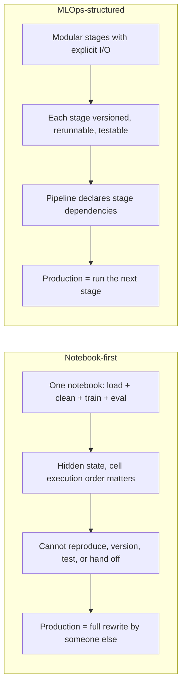
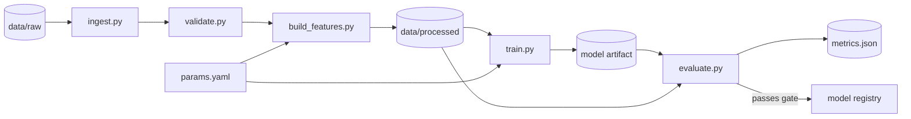

# Lesson 3 — How to Build an ML Project Using MLOps (MLOps for Beginners)

> **Source:** CampusX · *How to build a ML project using MLOps | MLOps for Beginners* · 1:21:11 · [watch](https://www.youtube.com/watch?v=eCjuoqUy8Is&list=PLKnIA16_RmvaKHYjy5v0dJh8edeaEWb-b&index=3)
> **One-liner:** Turning the Lesson 2 lifecycle map into a hands-on build — structuring a real ML project so it's reproducible, trackable, and deployable from day one, instead of retrofitting MLOps onto a messy notebook later.

---

## 🎯 TL;DR

Most beginner ML projects are a single notebook where data loading, feature engineering, training, and evaluation are tangled together with hidden state and no versioning. This lesson shows the alternative: a project split into **discrete, independently-runnable, independently-testable stages** (ingest → validate → features → train → evaluate → register → deploy), wired together by a declared pipeline with explicit inputs and outputs. The payoff isn't tidiness — it's that **deployment stops being a rewrite**. When each stage is already a parameterized, rerunnable unit with versioned inputs and outputs, going to production is "run the next stage," not "port six months of notebook logic into real code."

---

## 1. Notebook-first vs. MLOps-structured



| | Notebook-first | MLOps-structured project |
|---|---|---|
| **Reproducibility** | Low — depends on execution order and hidden in-memory state | High — each stage is an explicit, rerunnable unit with declared inputs |
| **Testability** | Nearly impossible to unit-test | Each stage is a function/module you can test in isolation |
| **Handoff to production** | Requires a rewrite by a different team | Deployment is a natural next stage |
| **Collaboration** | Difficult — one big file, constant merge conflicts | Stages can be owned, reviewed, and changed independently |
| **Caching / incremental runs** | None — rerun everything from scratch | Only re-run stages whose inputs changed |
| **Debugging** | "Restart kernel and run all," hope for the best | Inspect the concrete artifact each stage produced |
| **Lineage** | Untracked | Each artifact traceable to the code+data that made it |

> **Why notebooks fail specifically:** the killer is **hidden state**. A notebook's behavior depends on which cells were run in which order — including cells you've since edited or deleted. That means the notebook in front of you may be literally incapable of producing the result it displays. This is a *reproducibility* failure, and no amount of tidying fixes it.

Notebooks remain excellent for **exploration** — the point isn't to abandon them, it's to treat them as a scratchpad whose conclusions get promoted into structured code, not as the deliverable itself.

---

## 2. A concrete project layout

```text
ml-project/
├── data/
│   ├── raw/                  # immutable landing zone — never edited
│   ├── interim/              # intermediate transforms
│   └── processed/            # model-ready features
├── src/
│   ├── data/
│   │   ├── ingest.py         # Stage 1: pull from source
│   │   └── validate.py       # Stage 2: schema + distribution checks
│   ├── features/
│   │   └── build_features.py # Stage 3: raw → features
│   ├── models/
│   │   ├── train.py          # Stage 4: fit + log experiment
│   │   └── evaluate.py       # Stage 5: score + validation gates
│   └── serve/
│       └── app.py            # Stage 7: serving API
├── params.yaml               # all hyperparameters/config in ONE place
├── dvc.yaml                  # pipeline definition: stages, deps, outputs
├── tests/                    # unit tests per stage
├── Dockerfile                # reproducible environment
├── requirements.txt          # pinned dependencies
└── notebooks/                # exploration only — never the source of truth
```

### The conventions that make this work

| Convention | Why it matters |
|---|---|
| **`data/raw` is immutable** | The original data is never mutated in place; every transform writes somewhere new. Guarantees you can always go back. |
| **Config in one file (`params.yaml`)** | Hyperparameters live in version control, not scattered as magic numbers in code. A config diff explains a metric change. |
| **No hardcoded paths** | Stages take input/output paths as parameters, so they can run locally, in CI, or in the cloud unchanged. |
| **Stages are pure-ish functions** | Read declared inputs → write declared outputs. No reaching into global state. |
| **Notebooks are second-class** | They import from `src/`, never the reverse. Logic lives in `src/`. |
| **Pinned dependencies** | An unpinned library upgrade silently changing model behavior is a real and common failure. |

---

## 3. The pipeline as a DAG

The structural idea underneath all of this: your project is a **DAG** (Directed Acyclic Graph) of stages, each declaring its **dependencies** (inputs) and **outputs**.



Declaring the DAG explicitly buys you three concrete things:

1. **Selective re-execution** — change only feature code, and only feature/train/evaluate re-run. Ingestion is cached.
2. **Guaranteed correctness of order** — you can't accidentally train on features that weren't rebuilt after a change.
3. **A reproducibility contract** — the DAG *is* the documentation of how the model was made.

| Term | Meaning |
|---|---|
| **DAG** | Directed Acyclic Graph — stages with dependencies, no cycles |
| **Stage dependency (`deps`)** | The inputs a stage reads; if any changes, the stage is stale |
| **Stage output (`outs`)** | The artifacts a stage produces, tracked and versioned |
| **Cache invalidation** | Re-running only what's actually stale, based on input hashes |
| **Idempotence** | Running a stage twice with the same inputs produces the same outputs |

---

## 4. Stage-by-stage responsibilities

| Stage | Responsibility | Output artifact | Common mistake |
|---|---|---|---|
| **1. Data ingestion** | Pull raw data from source into a controlled location; nothing more | Raw snapshot in `data/raw` | Cleaning during ingestion — mixes concerns and loses the original |
| **2. Data validation** | Assert schema, types, ranges, null rates, distribution sanity | Validation report; fail the pipeline on breach | Skipping it — bad data then silently trains a bad model |
| **3. Feature engineering** | Deterministic raw → model-ready transform | Processed feature set | Duplicating this logic in the serving path → **training-serving skew** |
| **4. Training** | Fit the model; log params, metrics, artifacts | Model artifact + experiment run | Not logging the data version alongside the run |
| **5. Evaluation** | Score on held-out data; enforce validation gates | `metrics.json`, plots | Comparing only to a fixed threshold, not to the *currently deployed* model |
| **6. Registration** | Push a passing model to the registry with lineage | Versioned registry entry | Manual copying of model files around |
| **7. Deployment prep** | Package the validated model for serving | Container/image | Rebuilding features differently here than in stage 3 |

### The single highest-value discipline: shared feature logic
Stage 3 and stage 7 must compute features **using the same code**. When training features come from a batch SQL job and serving features come from hand-written Python, they will eventually diverge — and the model will silently receive inputs unlike anything it trained on. This is **training-serving skew**, and it's among the most common causes of "great offline, bad in production." A **feature store** is the industrialized solution; a shared imported module is the pragmatic minimum.

---

## 5. Validation gates — the automated "should this ship?" decision

A **validation gate** is a programmatic threshold a model must clear before promotion. Without gates, "is this model good enough?" is a judgement call made under deadline pressure.

| Gate type | Example check |
|---|---|
| **Absolute threshold** | Accuracy ≥ 0.85, AUC ≥ 0.9 |
| **Relative to champion** | New model must beat the deployed model by ≥ 0.5 points |
| **No-regression / segment check** | Must not get worse on *any* important slice (region, device, cohort) |
| **Fairness check** | Performance gap across protected groups stays within tolerance |
| **Behavioral / invariance test** | Known-answer cases still behave correctly; irrelevant perturbations don't flip predictions |
| **Operational** | Model size, memory footprint, and inference latency within budget |

> The **segment check** is the one most often missed: a model can improve *aggregate* accuracy while getting materially worse for a specific user group — an average that hides a regression.

---

## 6. Testing an ML project — what "tests" even means here

ML projects need traditional software tests **plus** categories that don't exist in normal software:

| Test type | What it checks |
|---|---|
| **Unit tests** | A feature transform returns the expected value for a known input |
| **Data tests** | Schema conformance, null rates, ranges, category cardinality |
| **Pipeline / integration tests** | Stages wire together; the DAG runs end-to-end on a small sample |
| **Model quality tests** | Metrics clear the validation gates |
| **Behavioral tests** | *Invariance* (irrelevant changes shouldn't change output), *directional* (a known-directional input change should move the prediction the expected way) |
| **Serving parity test** | The serving path and training path produce identical features for the same raw input — the direct guard against training-serving skew |
| **Regression tests** | Previously-fixed failure cases still behave correctly |

---

## 7. Why beginners should build this way from the start

| Retrofitting MLOps later | Building this way from the start |
|---|---|
| Untangling a monolithic notebook with hidden state | Structure is already stage-separated |
| Guessing which data/config produced which model | Every run is traceable by construction |
| Deployment is a separate, stressful project | Deployment is just "run the next stage" |
| Reproducing a 3-month-old result is archaeology | Check out the commit, run the pipeline |
| Onboarding a teammate takes weeks | The DAG documents the system |

The cost asymmetry is the argument: the structure costs perhaps a day up front, and saves weeks of rewrite plus an indefinite tail of debugging-by-guesswork.

---

## 8. Key terms

| Term | Meaning |
|------|---------|
| **Pipeline stage** | A discrete, independently-runnable step in the ML workflow with declared inputs and outputs. |
| **DAG (Directed Acyclic Graph)** | The dependency graph of pipeline stages — no cycles, so execution order is well-defined. |
| **Stage dependency / output** | The inputs a stage consumes and the artifacts it produces; used to detect staleness. |
| **Cache invalidation** | Re-running only stages whose inputs actually changed, based on content hashing. |
| **Idempotence** | Same inputs → same outputs, no matter how many times a stage runs. |
| **Hidden state** | Notebook in-memory state from previously-run (possibly since-edited) cells — the root cause of notebook irreproducibility. |
| **Immutable raw data** | The convention that original data is never modified in place. |
| **Configuration as code** | Keeping hyperparameters and settings in a version-controlled file rather than inline literals. |
| **Dependency pinning** | Locking exact library versions so the environment is reproducible. |
| **Training-serving skew** | Features computed differently in training vs. serving, causing production inputs the model never saw in training. |
| **Feature store** | A managed system that computes, stores, and serves features consistently to both training and serving. |
| **Validation gate** | An automated threshold a model must pass to be promoted. |
| **Segment / slice check** | Verifying a model didn't regress on any important sub-population, not just on average. |
| **Behavioral test (invariance / directional)** | Testing that irrelevant input changes don't alter predictions, and relevant ones move them in the expected direction. |
| **Serving parity test** | Asserting the training and serving feature paths agree exactly on the same raw input. |
| **Model artifact** | The serialized trained model file that gets versioned and deployed. |
| **Orchestrator** | The tool that executes the DAG with scheduling, retries, and dependency resolution (Airflow, Kubeflow, Dagster, Prefect). |
| **Reproducibility** | The ability to re-run a stage or pipeline and obtain a traceable, consistent result. |

---

## ✍️ Notes / follow-ups
- This lesson builds the pipeline's **shape**. The three highest-leverage habits: **immutable raw data**, **config in one versioned file**, and **shared feature logic between training and serving**.
- The single failure mode to internalize: **training-serving skew** — it explains a large share of "worked offline, broke in production" incidents, and the fix is architectural (shared code / feature store), not a modeling tweak.
- Next: [Lesson 4 — ETL Pipeline in MLOps](04-etl-pipeline-in-mlops.md) zooms into the **data** side specifically — the ETL foundation feeding this pipeline.
