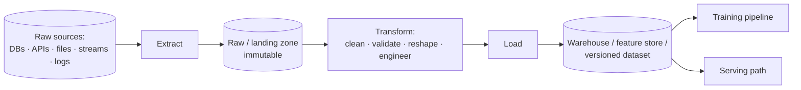
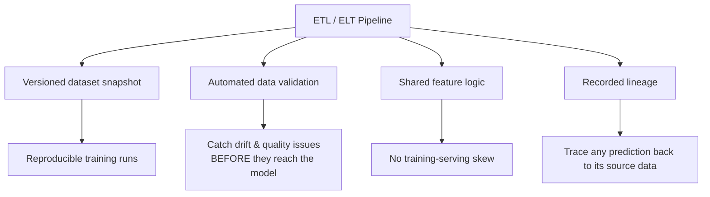
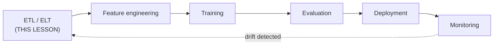

# Lesson 4 — ETL Pipeline in MLOps (Data Management in MLOps)

> **Source:** CampusX · *ETL Pipeline in MLOps | Data Management in MLOps* · 32:46 · [watch](https://www.youtube.com/watch?v=D_-qy1A76EM&list=PLKnIA16_RmvaKHYjy5v0dJh8edeaEWb-b&index=4)
> **One-liner:** The **Extract–Transform–Load** pattern as the data-management backbone of an MLOps pipeline — how raw, messy data reliably becomes model-ready input, versioned and validated at every step.

---

## 🎯 TL;DR

Every ML model is only as good as the data pipeline feeding it. **ETL** — Extract (pull from sources), Transform (clean/reshape/engineer), Load (write to a consumable destination) — is the standard pattern that makes that flow **reliable, repeatable, and auditable**, which is exactly what Lesson 1's "data can independently break the system" problem demands. The MLOps-specific twist: a data-engineering ETL succeeds if it *runs*; an MLOps ETL must additionally produce a **versioned, validated, reproducible** dataset, because that dataset is effectively part of your model's source code.

---

## 1. The three stages

| Stage | Responsibility | Typical operations |
|---|---|---|
| **Extract** | Pull raw data out of source systems, faithfully and without interpretation | Query a database, call an API (with pagination/rate limits), read files from object storage, consume a stream, parse logs |
| **Transform** | Clean and reshape into usable form | Deduplicate, handle missing values, cast types, normalize units, join/enrich, filter invalid rows, aggregate, engineer features, validate |
| **Load** | Persist the result somewhere downstream consumers can rely on | Write to a data warehouse, feature store, or versioned dataset snapshot |

### A crucial convention: extract should not transform
Keep **Extract** faithful — land the raw data as close to its original form as possible, and treat that landing zone as **immutable**. This gives you one enormously valuable property: when you later discover a bug in your transform logic, you can **re-derive everything from the original raw data** instead of discovering the original is gone. Cleaning during extraction destroys that ability.

---

## 2. ETL vs. ELT — and why it matters for ML

| | **ETL** (Extract → Transform → Load) | **ELT** (Extract → Load → Transform) |
|---|---|---|
| **Where transform happens** | In a separate processing layer, *before* loading | Inside the destination warehouse, *after* loading raw |
| **What lands in the destination** | Already-clean, structured data | Raw data first; transforms are views/tables built on top |
| **Best suited to** | Constrained destinations, heavy pre-processing, strict schemas | Powerful cloud warehouses (BigQuery, Snowflake, Redshift) with cheap storage |
| **Reprocessing history** | Harder — raw may not be retained in the warehouse | Easy — raw is already there; just rewrite the transform |
| **ML relevance** | Fine when features are stable | Often better for ML, because **feature definitions change constantly** and you need to recompute history |

> **Why ELT tends to fit ML better:** feature engineering is *iterative*. You will change a feature definition and immediately need it recomputed across all historical data to retrain. If raw history already sits in the warehouse, that's a query rewrite. If it doesn't, it's a re-extraction project.

Also worth knowing: **batch vs. streaming**.

| Mode | Mechanism | ML use case |
|---|---|---|
| **Batch** | Scheduled runs over bounded chunks (hourly/nightly) | Most training pipelines; batch scoring |
| **Micro-batch** | Very frequent small batches | Near-real-time features |
| **Streaming** | Continuous event-by-event processing (Kafka, Flink, Spark Streaming) | Real-time features (transaction velocity for fraud) |

---

## 3. Why ETL matters specifically for MLOps (not just data engineering)

| Generic data-engineering concern | Additional MLOps-specific concern |
|---|---|
| Data arrives clean and on schedule | Data must also be **versioned**, so a model's training set is reproducible |
| The pipeline runs without crashing | Output must be **validated against expected distributions** — catch drift early |
| A one-time or scheduled load | **Repeatable, backfillable** loads that feed ongoing retraining cycles |
| Correct schema | Schema treated as an enforced **contract** with upstream producers |
| Data is queryable by analysts | The *same* transform logic must serve **both training and inference** (no skew) |
| Freshness SLA | Also **point-in-time correctness** — no leakage of future information |

---

## 4. Data validation — the checks that actually earn their keep

Validation is where an MLOps ETL differs most visibly from a plain one. The goal: **fail loudly at ingestion rather than silently at training.**

| Check category | What it asserts | Example failure it catches |
|---|---|---|
| **Schema** | Expected columns exist with expected types | Upstream renames `user_id` → `userId` |
| **Nullability** | Null rate stays within tolerance | A join breaks and 40% of a column becomes null |
| **Range / domain** | Numeric values within plausible bounds | Age of 3,000; negative transaction amount |
| **Categorical cardinality** | Set of categories is expected | A new unseen country code appears |
| **Uniqueness** | Primary keys are unique | Duplicated rows from a double-run inflate training data |
| **Referential integrity** | Foreign keys resolve | Orders referencing deleted customers |
| **Volume / row count** | Row count within expected band | Yesterday's load delivered 2% of normal volume |
| **Freshness** | Data is recent enough | Pipeline silently stopped three days ago |
| **Distribution** | Feature distributions match a training baseline | Mean income shifts 3σ — early drift signal |

### Two ML-specific data hazards that validation must catch

**Data leakage** — information available at training time that will *not* be available at prediction time, or that encodes the answer. Leakage produces spectacular offline metrics and a model that collapses in production.

| Leakage type | Example |
|---|---|
| **Target leakage** | A `claim_paid_amount` feature when predicting whether a claim will be approved |
| **Temporal leakage** | Using an aggregate computed over the *full* time range, including the future, to predict a past event |
| **Train/test contamination** | The same customer appears in both splits, so the model memorizes rather than generalizes |
| **Preprocessing leakage** | Fitting a scaler/imputer on the *whole* dataset before splitting, leaking test statistics into training |

**Point-in-time correctness** — for any historical training row, features must reflect only what was **knowable at that moment**. Getting this wrong is the most common cause of temporal leakage, and it's why feature stores emphasize point-in-time correct joins.

---

## 5. Data versioning — making a dataset a first-class artifact

| Approach | How it works | Trade-off |
|---|---|---|
| **Full snapshots** | Copy the whole dataset per version | Simple, storage-hungry |
| **Content-addressed / hash-based** (DVC-style) | Store content hashes in Git, data in remote storage | Git-like workflow, deduplicated |
| **Table time travel** (Delta Lake, Iceberg, Hudi) | The table format retains history; query "as of" a version/timestamp | Very powerful, requires a lakehouse format |
| **Append-only with effective dates** | Never update in place; every row carries validity dates | Naturally point-in-time correct, more complex queries |

**The reproducibility contract** you're aiming for: given a model version, retrieve the exact dataset version that trained it — and be able to regenerate that dataset from raw. Without it, "why does this model behave this way?" is unanswerable.

---

## 6. Where this fits the full MLOps lifecycle

This lesson is the detailed version of the very first box in [Lesson 2](02-what-is-mlops.md)'s lifecycle diagram — *"data collection & versioning."*

Getting ETL right is the prerequisite for everything downstream. Bad or unvalidated data at this stage propagates silently into bad features, bad training data, and ultimately a model that fails in production **for reasons that look — misleadingly — like a modeling problem.** Teams routinely spend weeks tuning hyperparameters to fix what is actually a broken join upstream.

### Orchestration
ETL stages need scheduling, dependency management, retries, backfills, and alerting — that's **orchestration** (Airflow, Dagster, Prefect, Kubeflow Pipelines). Key concepts worth naming:

| Concept | Meaning |
|---|---|
| **Backfill** | Re-running a pipeline over historical periods (after a bug fix or a new feature definition) |
| **Retry / idempotence** | Safe re-execution — a re-run must not duplicate or corrupt data |
| **SLA / freshness alert** | Notification when data doesn't arrive on time |
| **Data contract** | An explicit, enforced agreement with upstream producers about schema, semantics, and timeliness |
| **Lineage** | The recorded trace of which sources and transforms produced a given dataset |

---

## 7. Key terms

| Term | Meaning |
|------|---------|
| **ETL (Extract, Transform, Load)** | The pattern of pulling raw data, transforming it, then loading the clean result. |
| **ELT (Extract, Load, Transform)** | Load raw into a powerful warehouse first, then transform in place — usually better for ML, since feature definitions change often and history must be recomputable. |
| **Landing zone / raw layer** | The immutable first destination for extracted data, kept in original form so anything downstream can be re-derived. |
| **Medallion architecture (bronze/silver/gold)** | A common layering convention: bronze = raw, silver = cleaned/conformed, gold = business/model-ready aggregates. |
| **Batch / micro-batch / streaming** | Processing bounded scheduled chunks / very frequent small chunks / continuous per-event flow. |
| **Data validation** | Automated assertions that data matches expected schema, ranges, volume, freshness, and distribution before use. |
| **Data contract** | An enforced agreement with upstream producers covering schema, semantics, and delivery guarantees. |
| **Schema drift** | Upstream structural change (renamed/added/removed columns, changed types or units). |
| **Data leakage** | Training-time information unavailable at prediction time, or that encodes the target — produces great offline metrics and production failure. |
| **Target leakage** | A feature that directly or indirectly contains the answer. |
| **Temporal leakage** | Using future information to predict a past event. |
| **Preprocessing leakage** | Fitting transformations (scalers, imputers) before the train/test split, leaking test statistics. |
| **Point-in-time correctness** | Ensuring each historical training row's features reflect only what was knowable at that timestamp. |
| **Feature store** | A managed system that computes, stores, versions, and serves features consistently to training and serving (with point-in-time correct joins). |
| **Data versioning** | Treating a dataset as a versioned artifact so a model's training data is retrievable and reproducible. |
| **Time travel** | Querying a table as of a past version/timestamp (Delta Lake, Iceberg, Hudi). |
| **Backfill** | Re-running the pipeline over historical periods after a fix or a new feature definition. |
| **Idempotence** | Re-running a pipeline step produces the same result without duplication or corruption. |
| **Orchestration** | Scheduling and coordinating pipeline stages with dependencies, retries, and alerting. |
| **Data lineage** | The traceable record of which sources and transforms produced a dataset or prediction. |
| **Freshness SLA** | The agreed maximum acceptable age/delay for data arrival. |
| **Data quality dimensions** | Accuracy, completeness, consistency, timeliness, validity, uniqueness — the standard axes quality is measured on. |

---

## ✍️ Notes / follow-ups
- 🎉 **Final lesson of this playlist.** Arc recap: why ML systems need MLOps (code + data + model, and silent failure) → what MLOps covers end-to-end (the looped lifecycle) → structuring a real project around that lifecycle (staged DAG) → the ETL foundation the data stage actually depends on.
- **Big picture:** *MLOps failures are usually data failures wearing a model costume* — which is why this playlist deliberately ends on data management rather than model tuning.
- **The three data hazards worth memorizing:** **leakage** (great offline, terrible live), **training-serving skew** (features computed two different ways), and **point-in-time incorrectness** (accidentally using the future). All three are invisible to standard accuracy metrics and all three are caught at the data layer, not the model layer.
- Natural continuations in this repo: [`../03_llmops/`](../03_llmops/README.md) for the LLM-native sibling of these practices, and [`../04_cloud-ai-platforms/`](../04_cloud-ai-platforms/README.md) for where this runs in managed cloud form.
